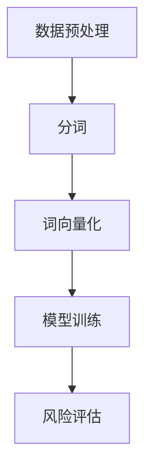
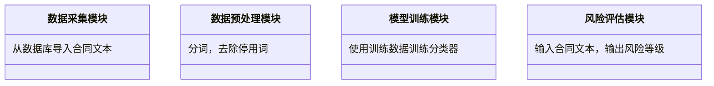

                 


# 构建基于NLP的金融合同风险评估系统

> 关键词：自然语言处理，金融合同，风险评估，深度学习，文本挖掘

> 摘要：本文详细介绍如何利用自然语言处理技术构建金融合同风险评估系统。从背景分析到系统设计，从算法实现到项目实战，全面解析如何用NLP技术提高合同审查效率和准确性，降低金融风险。

---

## 目录

1. 背景介绍
   1.1 问题背景与需求分析
   1.2 核心概念与联系

2. 算法原理与流程
   2.1 NLP技术在合同分析中的应用
   2.2 常见NLP算法及其适用场景

3. 数学模型与公式推导
   3.1 词嵌入模型（如Word2Vec）
   3.2 文本分类模型（如SVM、随机森林）

4. 系统分析与架构设计
   4.1 系统功能模块设计
   4.2 系统架构图展示

5. 项目实战与代码实现
   5.1 环境搭建与数据准备
   5.2 核心代码实现与解读

6. 总结与展望
   6.1 项目总结
   6.2 未来发展方向

---

## 第一部分: 背景介绍

### 1.1 问题背景与需求分析

#### 1.1.1 问题背景
- **金融合同的基本概念**：金融合同是金融机构之间或与客户之间的法律协议，涉及贷款、投资、保险等领域。
- **合同风险的定义**：指因合同条款未被遵守或发生争议而产生的潜在损失。
- **传统方法的局限性**：人工审查耗时，容易遗漏关键条款，且主观性强。

#### 1.1.2 问题描述
- **合同风险的多样性**：涉及法律、财务、信用等多种风险。
- **传统审查的低效性**：依赖人工经验，效率低下，成本高昂。

#### 1.1.3 问题解决
- **引入NLP技术**：利用文本处理技术自动识别和分类合同条款，提高效率和准确性。
- **系统目标**：构建一个自动化、高效的金融合同风险评估系统。

### 1.2 核心概念与联系

#### 1.2.1 NLP核心概念
- **分词**：将文本分割成词语或短语。
- **词性标注**：识别每个词的词性。
- **句法分析**：分析句子的结构和语法关系。

#### 1.2.2 金融合同的结构化分析
- **条款提取**：识别合同中的关键条款，如违约责任、履行期限。
- **风险点识别**：检测可能引发风险的条款，如模糊责任条款。

#### 1.2.3 核心概念的联系
- **NLP技术与合同分析的结合**：通过分词和实体识别提取合同中的关键信息。
- **算法选择与任务目标的关系**：选择合适的算法（如支持向量机）进行文本分类。

---

## 第二部分: 算法原理与流程

### 2.1 NLP技术在合同分析中的应用

#### 2.1.1 算法选择
- **选择合适的模型**：根据任务需求选择预训练模型（如BERT）进行微调。
- **模型训练**：使用金融合同数据进行监督学习。

#### 2.1.2 流程图


---

## 第三部分: 数学模型与公式推导

### 3.1 词嵌入模型

#### 3.1.1 Word2Vec模型
- **输入层**：词向量。
- **输出层**：词的预测概率。

公式：
$$ P(w_i|w_{i-1}) = \text{softmax}(v_{w_i} \cdot v_{w_{i-1}}) $$

### 3.2 文本分类模型

#### 3.2.1 支持向量机（SVM）
- **目标**：将合同文本分为高风险和低风险。
- **公式**：最大化间隔，优化目标函数。

---

## 第四部分: 系统分析与架构设计

### 4.1 系统功能模块设计

#### 4.1.1 功能模块类图


---

## 第五部分: 项目实战与代码实现

### 5.1 环境搭建与数据准备

#### 5.1.1 环境搭建
- 安装Python，安装NLP库（如spaCy、scikit-learn）。

#### 5.1.2 数据准备
- 收集金融合同文本，标注风险等级。

### 5.2 核心代码实现

#### 5.2.1 数据预处理代码
```python
import spacy

nlp = spacy.load("en_core_web_sm")

def preprocess(text):
    doc = nlp(text)
    tokens = [token.text for token in doc]
    return tokens
```

---

## 第六部分: 总结与展望

### 6.1 项目总结
- **系统优势**：提高审查效率，降低人为错误。
- **当前不足**：模型对某些复杂条款的识别准确率有待提高。

### 6.2 未来展望
- **模型优化**：引入更先进的深度学习模型。
- **多语言支持**：扩展到处理多种语言的合同文本。

---

通过以上步骤，我们构建了一个基于NLP的金融合同风险评估系统，有效提升了风险评估的效率和准确性。未来，随着NLP技术的发展，系统将进一步优化，为金融行业提供更强大的支持。

