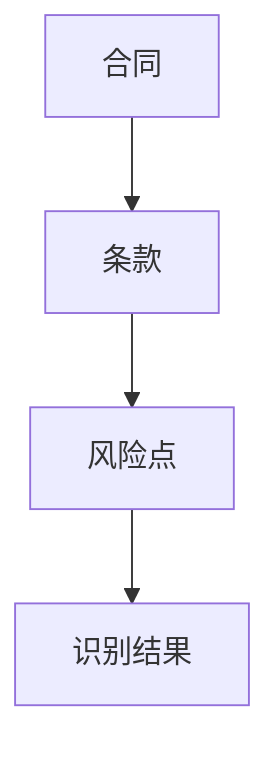
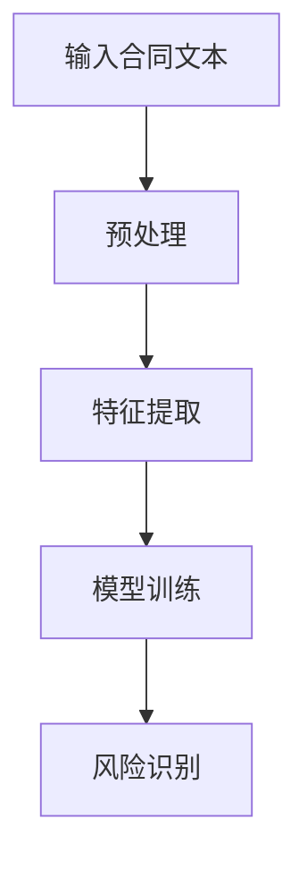
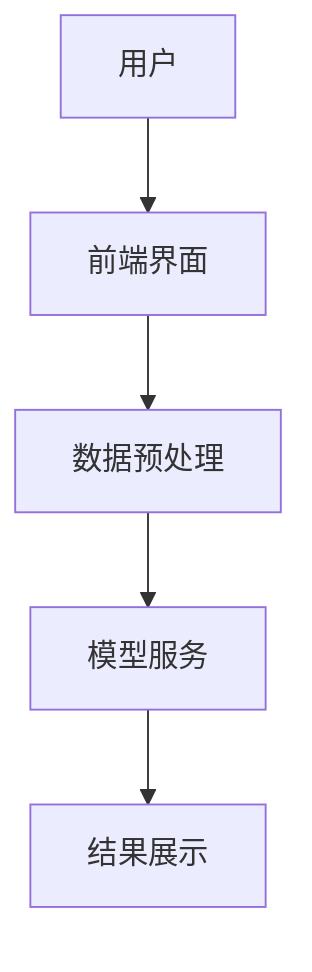
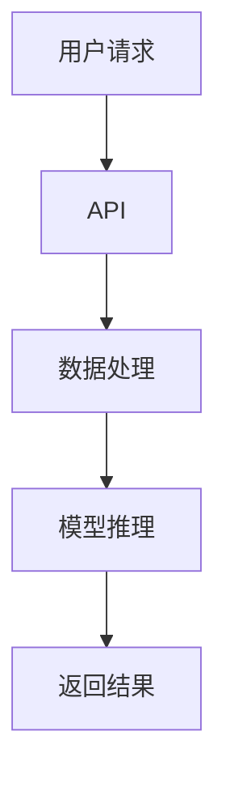
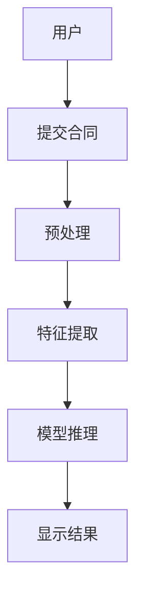

                 


# 构建基于NLP的金融合同风险识别系统

> 关键词：NLP，金融合同，风险识别，自然语言处理，机器学习，文本挖掘

> 摘要：本文详细探讨了如何利用自然语言处理（NLP）技术构建金融合同风险识别系统。从问题背景、核心概念到算法原理、系统架构设计，再到项目实战，系统地分析了构建该系统的全过程。文章结合实际案例，深入讲解了NLP在金融合同分析中的应用，包括文本预处理、特征提取、模型训练等关键步骤，并通过Mermaid图展示了系统的整体架构和交互流程。最后，总结了系统构建的经验与未来研究方向。

---

## 第一部分: 背景介绍

### 第1章: 问题背景与描述

#### 1.1 问题背景
##### 1.1.1 金融合同风险的重要性
在金融行业中，合同是核心业务的法律依据，涉及金额巨大且条款复杂。金融合同中的风险包括违约风险、法律风险、操作风险等，这些风险可能导致重大经济损失。传统的合同审核依赖人工检查，效率低且容易遗漏关键风险点。

##### 1.1.2 当前金融合同处理的痛点
- **人工审核效率低**：合同数量庞大，人工审核耗时长，成本高。
- **风险点易遗漏**：复杂的条款容易被忽视，导致潜在风险未被识别。
- **信息孤岛**：不同部门的合同数据分散，难以统一管理与分析。

##### 1.1.3 NLP技术在金融领域的应用潜力
自然语言处理技术能够自动提取合同中的关键信息，识别潜在风险点，为金融机构提供智能化的解决方案。

#### 1.2 问题描述
##### 1.2.1 金融合同中的风险点分析
合同中的风险点包括但不限于：担保条款、违约责任、履行期限、金额计算等。

##### 1.2.2 传统合同处理方式的局限性
传统合同处理方式依赖人工阅读，容易出错且效率低下。

##### 1.2.3 基于NLP的风险识别的优势
NLP技术能够快速提取合同中的关键信息，自动识别风险点，显著提高效率和准确性。

#### 1.3 问题解决
##### 1.3.1 NLP技术如何帮助识别合同风险
通过文本挖掘、关键词提取、实体识别等技术，NLP能够从合同文本中提取关键信息，识别潜在风险。

##### 1.3.2 系统设计的目标与核心功能
- **目标**：构建一个高效、准确的金融合同风险识别系统。
- **核心功能**：合同文本预处理、关键信息提取、风险点识别、风险评估与报告生成。

##### 1.3.3 边界与外延
系统仅专注于合同文本的分析，不涉及合同的实际执行过程和外部法律环境。

##### 1.3.4 核心要素组成
- **合同文本**：输入的金融合同文本。
- **NLP模型**：用于提取关键信息和识别风险点的模型。
- **风险规则库**：定义合同中的风险点及其权重。

---

## 第二部分: 核心概念与联系

### 第2章: 核心概念与联系

#### 2.1 核心概念原理
##### 2.1.1 NLP的基本原理
NLP通过文本预处理、特征提取、模型训练等步骤，将文本数据转化为可计算的向量表示，用于分类、识别等任务。

##### 2.1.2 金融合同分析的关键技术
- **文本预处理**：去除停用词、分词、句法分析。
- **关键词提取**：使用TF-IDF、LDA等方法提取合同中的关键信息。
- **实体识别**：识别合同中的主体（如公司名称、金额等）。

##### 2.1.3 风险识别的数学模型
基于机器学习的分类模型（如SVM、随机森林）用于判断合同是否存在风险点。

#### 2.2 概念属性特征对比
##### 2.2.1 对比表格
| 对比维度 | 传统方法 | 基于NLP的方法 |
|----------|----------|--------------|
| 效率     | 低       | 高            |
| 准确性   | 易出错    | 较高          |
| 适用性   | 人工依赖  | 自动化        |

##### 2.2.2 ER实体关系图


---

## 第三部分: 算法原理讲解

### 第3章: 算法原理讲解

#### 3.1 算法流程


#### 3.2 代码实现
##### 3.2.1 环境安装
```bash
pip install numpy scikit-learn nltk
```

##### 3.2.2 预处理代码
```python
import nltk
from sklearn.feature_extraction.text import TfidfVectorizer

def preprocess(text):
    # 分词
    tokens = nltk.word_tokenize(text.lower())
    # 去除停用词
    stopwords = set(nltk.corpus.stopwords.words('english'))
    filtered = [token for token in tokens if token not in stopwords]
    return ' '.join(filtered)
```

##### 3.2.3 特征提取与模型训练
```python
vectorizer = TfidfVectorizer()
X = vectorizer.fit_transform(corpus)

model = SVC()
model.fit(X, labels)
```

#### 3.3 数学模型与公式
##### 3.3.1 TF-IDF计算公式
$$ tfidf(t, d) = tf(t, d) \times idf(t) $$
其中，$tf(t, d)$ 表示词 $t$ 在文档 $d$ 中的词频，$idf(t)$ 表示词 $t$ 的逆文档频率。

##### 3.3.2 支持向量机分类
$$ \text{maximize} \quad \frac{1}{2}||w||^2 $$
$$ \text{subject to} \quad y_i(w \cdot x_i + b) \geq 1 - \xi_i $$

---

## 第四部分: 系统分析与架构设计

### 第4章: 系统分析与架构设计

#### 4.1 系统架构


#### 4.2 接口设计


#### 4.3 交互流程


---

## 第五部分: 项目实战

### 第5章: 项目实战

#### 5.1 环境配置
```bash
pip install numpy scikit-learn nltk jieba
```

#### 5.2 系统核心实现
##### 5.2.1 数据预处理
```python
def preprocess(text):
    # 分词
    words = jieba.lcut(text)
    # 去除停用词
    filtered = [word for word in words if word not in stopwords]
    return ' '.join(filtered)
```

##### 5.2.2 模型训练
```python
from sklearn.model import SVC

model = SVC()
model.fit(X_train, y_train)
```

#### 5.3 实际案例分析
##### 5.3.1 案例描述
假设我们有以下合同文本：
```
"本合同自签订之日起生效，有效期为三年。任何一方违约，需支付违约金10%。"
```

##### 5.3.2 处理过程
1. **预处理**：去除停用词，提取关键词。
2. **特征提取**：使用TF-IDF提取关键词向量。
3. **模型推理**：识别合同中的违约条款。

---

## 第六部分: 总结与展望

### 第6章: 总结与展望

#### 6.1 系统总结
本文详细介绍了构建基于NLP的金融合同风险识别系统的全过程，从背景分析到系统设计，再到项目实现，系统地展示了如何利用NLP技术解决实际问题。

#### 6.2 未来研究方向
##### 6.2.1 更复杂的数据分析模型
引入深度学习模型（如BERT、LSTM）以提高识别精度。

##### 6.2.2 多语言支持
扩展系统支持多种语言的合同分析。

##### 6.2.3 外部知识库集成
结合法律知识库，进一步提升风险识别的准确性。

#### 6.3 注意事项
- 数据隐私保护：确保合同数据的安全性。
- 模型可解释性：优化模型以提供可解释的识别结果。
- 系统稳定性：确保系统在高负载下的稳定运行。

#### 6.4 最佳实践 tips
- 数据预处理是关键，需仔细清洗和标注数据。
- 选择合适的模型和特征提取方法，避免过拟合。
- 定期更新模型，以适应新的合同条款和法律法规变化。

---

通过本文的详细讲解，读者可以系统地掌握构建基于NLP的金融合同风险识别系统的知识和技能，为实际应用提供有力的技术支持。

