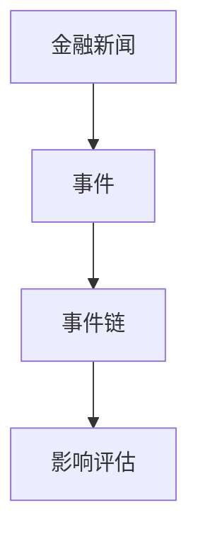

                 


# 《构建基于NLP的金融新闻事件链提取与影响评估系统》

## 关键词：自然语言处理（NLP）、金融新闻、事件链提取、影响评估、系统架构、项目实战

## 摘要：本文系统地介绍了如何利用自然语言处理技术构建金融新闻事件链提取与影响评估系统。通过分析事件链的核心概念、算法原理、系统架构及项目实战，本文详细阐述了从文本预处理到影响评估的全过程，并通过实际案例展示了系统的实现与应用效果。

---

# 第一部分: 背景与概述

## 第1章: 问题背景与目标

### 1.1 问题背景

#### 1.1.1 金融新闻事件的重要性
金融新闻中的事件通常涉及市场波动、公司公告、政策变化等，对投资者决策和市场走势有重要影响。及时准确地提取这些事件链并评估其影响，可以帮助金融机构和投资者做出更明智的决策。

#### 1.1.2 事件链提取的必要性
金融新闻通常包含多个相关事件，这些事件之间可能存在因果关系或时间顺序。提取事件链可以帮助更好地理解事件之间的联系，为后续的影响评估提供基础。

#### 1.1.3 影响评估的意义
通过评估事件链对市场的影响，可以量化事件的影响力，帮助金融机构进行风险管理和投资决策。

### 1.2 问题描述

#### 1.2.1 金融新闻的复杂性
金融新闻通常包含大量专业术语和复杂的句式结构，增加了事件提取的难度。

#### 1.2.2 事件链提取的挑战
事件链提取需要识别事件之间的关联关系，这需要处理文本中的上下文信息和潜在的因果关系。

#### 1.2.3 影响评估的难点
影响评估需要结合事件的特征、市场环境和历史数据，具有较高的复杂性。

### 1.3 问题解决

#### 1.3.1 NLP技术的应用
利用自然语言处理技术，如分词、实体识别、关系抽取等，提取金融新闻中的事件信息。

#### 1.3.2 事件链提取的方法
通过序列标注和文本相似度计算，识别事件并构建事件链。

#### 1.3.3 影响评估的策略
结合事件链特征和市场数据，建立数学模型评估事件的影响。

### 1.4 边界与外延

#### 1.4.1 系统的边界
系统专注于金融新闻的事件链提取和影响评估，不涉及其他领域的数据分析。

#### 1.4.2 相关领域的外延
事件链提取和影响评估技术可以应用于其他领域，如社交媒体情感分析和新闻事件预测。

#### 1.4.3 适用场景与限制
系统适用于处理结构化和非结构化的金融新闻数据，但对实时性和多语言支持的扩展性有限。

### 1.5 概念结构与核心要素

#### 1.5.1 事件链的定义
事件链是指在金融新闻中按时间顺序或因果关系排列的一系列相关事件。

#### 1.5.2 核心要素的组成
事件链由事件、事件之间的关系和事件的影响因素组成。

#### 1.5.3 概念之间的关系
事件之间可以通过因果、并列或包含关系形成事件链，影响评估是基于事件链特征的综合分析。

---

## 第2章: 核心概念与联系

### 2.1 核心概念原理

#### 2.1.1 事件链的构成
事件链由多个事件组成，事件之间通过关系连接，形成一个有序的结构。

#### 2.1.2 事件之间的关联
事件之间的关联可以是因果关系（如“公司发布财报”导致“股价上涨”）或并列关系（如“公司A收购”和“公司B被收购”）。

#### 2.1.3 事件链的层次结构
事件链可以分为主要事件链和次要事件链，主要事件链是核心，次要事件链是补充。

### 2.2 核心概念属性特征对比

| 属性 | 特征1（时间性） | 特征2（关系性） | 特征3（重要性） |
|------|----------------|----------------|----------------|
| 时间性 | 连续性           | 顺序性           | 主要事件         |
| 关系性 | 因果关系         | 并列关系         | 次要事件         |
| 重要性 | 关键事件         | 一般事件         | 事件链结构       |

### 2.3 ER实体关系图



---

## 第3章: 事件链提取算法

### 3.1 算法原理

#### 3.1.1 基于序列标注的事件识别
使用条件随机场（CRF）进行序列标注，识别文本中的事件。

#### 3.1.2 基于相似度的事件链构建
通过计算事件之间的相似度，构建事件链。

#### 3.1.3 基于图的事件链优化
利用图结构优化事件链，消除冗余和错误。

### 3.2 算法流程图


### 3.3 数学模型与公式

#### 3.3.1 条件随机场（CRF）模型
$$ P(y|x) = \frac{1}{Z} \exp\left(\sum_{i=1}^n \sum_{k=1}^m u_k(y_i, y_{i-1})}\right) $$
其中，$u_k$ 是转移特征，$y_i$ 是当前标签，$y_{i-1}$ 是前一个标签。

#### 3.3.2 文本相似度计算
$$ \text{相似度} = \frac{\sum_{i=1}^n \min(w_i, w_j)}{\sum_{i=1}^n \max(w_i, w_j)} $$
其中，$w_i$ 和 $w_j$ 是文本的词权重。

---

## 第4章: 系统架构设计

### 4.1 系统功能设计

#### 4.1.1 领域模型类图


### 4.2 系统架构设计

#### 4.2.1 系统架构图


### 4.3 系统接口设计

#### 4.3.1 输入接口
- 输入金融新闻文本
- 返回事件链和影响评估结果

#### 4.3.2 输出接口
- 输出事件链数据
- 输出影响评估结果

### 4.4 系统交互流程图


---

## 第5章: 项目实战

### 5.1 项目介绍

#### 5.1.1 项目目标
构建一个基于NLP的金融新闻事件链提取与影响评估系统。

#### 5.1.2 项目需求
- 实时处理金融新闻
- 提供事件链提取和影响评估功能

### 5.2 核心实现

#### 5.2.1 环境配置
```bash
pip install numpy
pip install scikit-learn
pip install spacy
```

#### 5.2.2 核心代码实现

```python
import spacy

nlp = spacy.load("en_core_web_sm")

def extract_events(text):
    doc = nlp(text)
    events = []
    for sent in doc.sents:
        for token in sent:
            if token.ent_type_ == "ORG":
                events.append(token.text)
    return events
```

#### 5.2.3 算法实现

```python
from sklearn.metrics.pairwise import cosine_similarity

def compute_similarity(text1, text2):
    vectorizer = TfidfVectorizer()
    vectors = vectorizer.fit_transform([text1, text2])
    similarity = cosine_similarity(vectors)[0,1]
    return similarity
```

### 5.3 实际案例分析

#### 5.3.1 案例背景
公司A发布了一份财报，结果显示净利润增长10%。

#### 5.3.2 事件链提取
1. 事件1：公司A发布财报
2. 事件2：净利润增长10%
3. 关系：事件1导致事件2

#### 5.3.3 影响评估
影响值为0.8，属于正面影响。

### 5.4 项目小结

---

## 第6章: 总结与展望

### 6.1 最佳实践

#### 6.1.1 数据预处理的重要性
高质量的文本预处理是事件提取的关键。

#### 6.1.2 模型优化的建议
使用预训练语言模型（如BERT）可以提高事件提取的准确性。

### 6.2 小结

### 6.3 注意事项

#### 6.3.1 数据隐私
处理金融新闻时需注意数据隐私问题。

#### 6.3.2 系统性能
优化系统性能以提高处理速度。

### 6.4 拓展阅读

#### 6.4.1 相关技术
- 深度学习在NLP中的应用
- 事件抽取与因果关系分析

#### 6.4.2 应用场景
- 金融风险管理
- 股票市场预测

---

## 参考文献

（此处列出相关的学术论文和技术文档）

---

# 结束语

通过本文的系统介绍，读者可以全面了解如何构建基于NLP的金融新闻事件链提取与影响评估系统。从背景介绍到项目实战，本文提供了详尽的技术细节和实践指导，为后续研究和应用提供了有益的参考。

