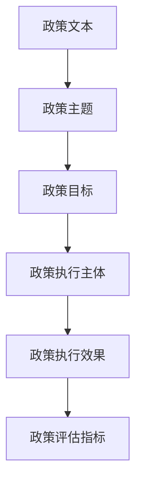
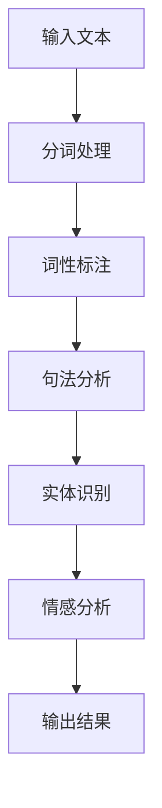
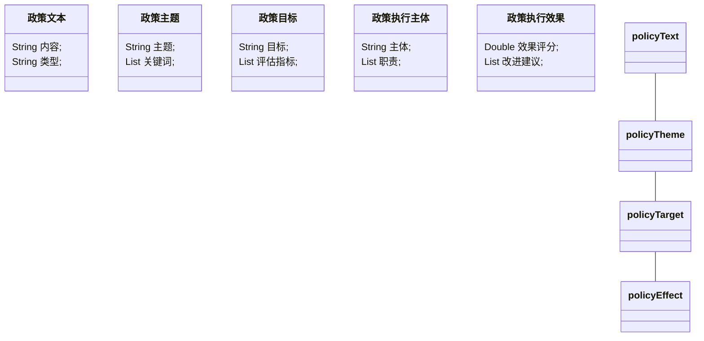
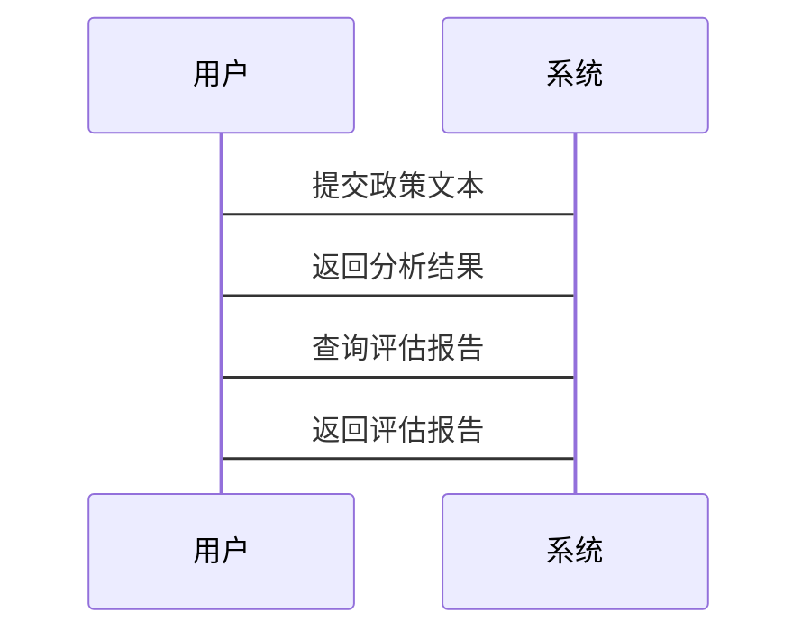

                 


# 构建基于NLP的金融监管政策执行效果评估系统

**关键词**：自然语言处理（NLP）、金融监管、政策执行效果、文本挖掘、机器学习

**摘要**：本文旨在探讨如何利用自然语言处理技术构建一个高效的金融监管政策执行效果评估系统。通过分析金融监管政策文本，提取关键信息，评估政策执行效果，为监管机构提供数据支持和决策参考。文章从问题背景、核心概念、算法原理、系统架构到项目实战，全面阐述了系统构建的思路和方法，并通过实际案例分析验证了系统的可行性和有效性。

---

# 《构建基于NLP的金融监管政策执行效果评估系统》

## 第1章 问题背景与系统目标

### 1.1 问题背景
随着金融市场的快速发展，监管政策的复杂性和多样性也在不断增加。传统的监管方式依赖于人工审查和分析，效率低下且容易出错。如何利用现代技术手段提高监管效率，成为亟待解决的问题。自然语言处理（NLP）技术在文本分析、信息提取等方面具有显著优势，为金融监管政策的执行效果评估提供了新的解决方案。

### 1.2 系统目标
本系统的目标是通过NLP技术，自动分析和评估金融监管政策的执行效果，提供实时、准确的监管支持。具体目标包括：
- **政策文本分析**：对监管政策文本进行分词、实体识别、情感分析等处理，提取政策的核心内容。
- **政策效果评估**：基于文本分析结果，量化政策执行的实际效果，识别政策的优缺点。
- **风险预警**：通过实时监控，发现潜在风险，及时预警。

### 1.3 问题解决路径
为了实现上述目标，系统采用以下步骤：
1. **数据收集**：获取相关金融监管政策文本和执行数据。
2. **文本预处理**：对文本进行清洗、分词、去停用词等处理。
3. **模型训练**：利用NLP算法训练分类模型，识别政策文本中的关键信息。
4. **效果评估**：基于模型输出，结合实际情况，评估政策执行效果。
5. **系统集成**：将各个模块整合，构建完整的监管评估系统。

---

## 第2章 核心概念与系统架构

### 2.1 核心概念
- **自然语言处理（NLP）**：通过计算机技术对人类语言进行处理，实现文本的理解、分析和生成。
- **金融监管政策**：由监管机构制定的规范金融市场行为的规则和措施。
- **政策执行效果评估**：通过分析政策实施后的实际效果，评估政策的合理性和有效性。

### 2.2 核心概念对比分析
下表对比了NLP与传统文本处理方法的主要区别：

| 对比维度 | NLP | 传统文本处理 |
|----------|------|---------------|
| 处理目标 | 理解语义 | 提取关键词或分词 |
| 技术基础 | 机器学习、深度学习 | 正则表达式、统计方法 |
| 应用场景 | 情感分析、信息提取 | 文本分类、搜索 |

### 2.3 实体关系图（ER图）
下图展示了金融监管政策执行效果评估系统中的实体关系：



---

## 第3章 算法原理与数学模型

### 3.1 NLP核心算法
- **分词**：将文本分割成词语或短语。常用的算法包括jieba、Snowball等。
- **词性标注**：对每个词语进行词性分类（如名词、动词、形容词等）。
- **句法分析**：分析句子的语法结构，识别主语、谓语等成分。
- **实体识别**：从文本中识别出人名、地名、组织名等实体。
- **情感分析**：判断文本中的情感倾向（如正面、负面、中性）。

### 3.2 算法流程图
下图展示了NLP处理流程：



### 3.3 数学模型
- **余弦相似度**：用于计算两个文本之间的相似度：
  $$ \cos\theta = \frac{\vec{A} \cdot \vec{B}}{|\vec{A}| |\vec{B}|} $$
- **TF-IDF**：用于提取文本中的关键词，计算公式为：
  $$ TF-IDF = TF \times (1 + \log(N/DF)) $$
  其中，TF为词频，DF为逆文档频率，N为总文档数。

---

## 第4章 系统分析与架构设计

### 4.1 应用场景
- **实时监控**：实时分析监管政策文本，及时发现风险。
- **风险预警**：基于历史数据，预测潜在风险并发出预警。
- **效果评估**：定期评估政策执行效果，优化监管策略。

### 4.2 领域模型
下图展示了领域模型：



### 4.3 系统架构设计
系统采用分层架构：

- **数据层**：存储政策文本、执行数据等。
- **业务逻辑层**：实现NLP处理、模型训练等功能。
- **表现层**：提供用户界面，展示分析结果。

### 4.4 接口设计
- **输入接口**：接收政策文本和执行数据。
- **输出接口**：返回分析结果和评估报告。

### 4.5 交互流程
下图展示了系统交互流程：



---

## 第5章 项目实战

### 5.1 环境安装
安装Python和相关库：
```bash
pip install numpy
pip install scikit-learn
pip install jieba
```

### 5.2 核心代码实现
```python
import jieba
from sklearn.feature_extraction.text import TfidfVectorizer
from sklearn.metrics.pairwise import cosine_similarity

# 示例政策文本
text = "加强市场监管，保护投资者利益，规范企业行为。"

# 分词处理
words = jieba.lcut(text)

# TF-IDF计算
vectorizer = TfidfVectorizer()
tfidf_matrix = vectorizer.fit_transform([" ".join(words)])

# 余弦相似度计算
similarity = cosine_similarity(tfidf_matrix, tfidf_matrix)
print(similarity)
```

### 5.3 案例分析
以某金融监管政策为例，分析其执行效果：
1. **文本预处理**：去除停用词，提取关键词。
2. **模型训练**：训练情感分析模型，判断政策效果。
3. **结果分析**：根据模型输出，评估政策效果。

### 5.4 项目小结
通过实战，验证了系统的可行性和有效性。NLP技术在金融监管政策执行效果评估中具有重要应用价值。

---

## 第6章 最佳实践

### 6.1 小结
本文详细介绍了如何利用NLP技术构建金融监管政策执行效果评估系统，涵盖了从背景分析到系统实现的各个环节。

### 6.2 注意事项
- 数据质量对结果影响较大，需确保数据的准确性和完整性。
- 模型调参和优化是关键，需结合实际情况进行调整。
- 系统上线后，需定期更新模型，适应新的监管政策和市场变化。

### 6.3 拓展阅读
- 《自然语言处理入门》
- 《金融监管与风险管理》
- 《深度学习在NLP中的应用》

---

## 结语

通过本文的介绍，读者可以深入了解如何利用NLP技术构建金融监管政策执行效果评估系统。这一系统的应用将显著提高监管效率，为金融市场的健康发展提供有力支持。未来，随着NLP技术的不断进步，系统的功能和性能将进一步提升，为金融监管带来更多创新可能。

