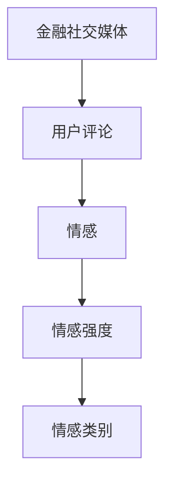

                 


# 构建基于NLP的金融社交媒体情绪分析模型

> 关键词：NLP，情绪分析，金融，社交媒体，深度学习

> 摘要：本文详细探讨了如何构建一个基于自然语言处理（NLP）的金融社交媒体情绪分析模型。文章从问题背景、核心概念、算法原理、系统设计到项目实战，全面分析了该模型的构建过程。通过对比传统机器学习与深度学习算法，结合实际案例，展示了如何利用NLP技术在金融领域进行情绪分析，以帮助投资者和市场分析师做出更明智的决策。

---

## 第1章: 问题背景与描述

### 1.1 问题背景

#### 1.1.1 金融社交媒体的兴起
随着互联网技术的发展，金融社交媒体平台如雪球、Twitter（尤其是$符号标记的股票讨论）等吸引了大量投资者和金融专业人士。这些平台上的用户评论、观点和分析数据量庞大，蕴含着丰富的情感信息。

#### 1.1.2 情绪分析在金融领域的价值
情绪分析可以帮助投资者和分析师预测市场走势、识别市场情绪变化。例如，大量积极情绪的评论可能预示着股价上涨，而消极情绪则可能引发股价下跌。

#### 1.1.3 当前情绪分析的挑战与不足
现有情绪分析模型在金融领域的应用中面临以下挑战：
- **数据稀疏性**：金融领域的数据通常具有小样本特性，尤其是在极端市场条件下。
- **领域适应性**：传统的情绪分析模型通常适用于通用文本，但在金融领域可能需要特定的领域知识。
- **实时性要求**：金融市场的波动性强，要求模型能够实时处理数据并提供快速反馈。

### 1.2 问题描述

#### 1.2.1 金融社交媒体数据的特点
金融社交媒体数据具有以下特点：
- **实时性**：数据生成速度快，需要快速处理。
- **领域特定性**：数据通常围绕特定的金融产品、公司或市场展开。
- **情感多样性**：数据中包含多种情感表达，如乐观、悲观、中立等。

#### 1.2.2 情绪分析的核心目标
情绪分析的核心目标是：
- 识别文本中的情感倾向（正面、负面、中性）。
- 计算情感强度，量化情感的强度。

#### 1.2.3 问题边界与外延
- **问题边界**：仅关注与金融市场相关的文本数据。
- **问题外延**：不涉及实时交易数据的处理，主要关注文本分析。

---

## 第2章: 核心概念与联系

### 2.1 核心概念原理

#### 2.1.1 自然语言处理（NLP）基础
NLP的目标是让计算机能够理解、处理和生成人类语言。常用技术包括分词、词性标注、句法分析等。

#### 2.1.2 情绪分析的基本原理
情绪分析是NLP的一个分支，旨在识别文本中的情感倾向。常用方法包括基于词典的分析、传统机器学习算法和深度学习模型。

#### 2.1.3 金融领域的特殊性
金融领域的文本数据具有专业术语多、数据稀疏性强等特点，需要结合领域知识进行处理。

### 2.2 核心概念属性对比

| 情感维度 | 传统情绪分析 | 金融领域情绪分析 |
|---------|--------------|------------------|
| 情感类型 | 正、负、中性 | 正、负、中性、市场情绪（如乐观、悲观） |
| 数据来源 | 社交媒体、评论 | 金融社交媒体、新闻、财报 |
| 情感强度 | 无 | 需要量化 |

### 2.3 实体关系图


---

## 第3章: 情绪分析算法原理

### 3.1 基于传统机器学习的算法

#### 3.1.1 Naive Bayes
Naive Bayes是一种基于概率论的分类算法，适用于文本分类任务。

- **公式**：
  $$ P(y|x) = \frac{P(x|y)P(y)}{P(x)} $$
  
- **优点**：简单高效，适合小样本数据。
- **缺点**：假设特征之间独立，实际可能不成立。

#### 3.1.2 SVM
支持向量机（SVM）是一种监督学习算法，适用于分类任务。

- **优化目标**：
  $$ \min_{w,b,\xi} \frac{1}{2}||w||^2 + C \sum_{i=1}^n \xi_i $$
  $$ y_i(w \cdot x_i + b) \geq 1 - \xi_i $$

- **优点**：能够在高维空间中进行分类，适合非线性数据。
- **缺点**：需要参数调优，计算复杂度较高。

#### 3.1.3 随机森林
随机森林是一种基于树的集成学习算法，适用于分类和回归任务。

- **优点**：能够处理高维数据，抗过拟合能力强。
- **缺点**：计算资源消耗较大。

### 3.2 基于深度学习的算法

#### 3.2.1 RNN与LSTM
循环神经网络（RNN）及其变体长短期记忆网络（LSTM）适用于序列数据的处理。

- **LSTM结构**：
  $$ h_t = \text{tanh}(W_{hh} h_{t-1} + W_{hx} x_t) $$
  $$ c_t = f(W_{cc} h_{t-1} + W_{cx} x_t) $$

- **优点**：能够捕捉序列数据中的长期依赖关系。
- **缺点**：训练过程中可能遇到梯度消失问题。

#### 3.2.2 Transformer架构
Transformer是一种基于注意力机制的深度学习模型，广泛应用于自然语言处理任务。

- **优点**：并行计算能力强，能够处理长文本。
- **缺点**：计算资源消耗较大。

#### 3.2.3 BERT模型
BERT（Bidirectional Encoder Representations from Transformers）是一种预训练语言模型，适用于多种NLP任务。

- **模型结构**：
  $$ \text{BERT}(x) = \text{MLM}(x) + \text{NSP}(x) $$

- **优点**：在多种任务上表现优异，能够捕捉上下文信息。
- **缺点**：需要大量计算资源。

---

## 第4章: 数学模型与公式

### 4.1 传统机器学习模型

#### 4.1.1 Naive Bayes公式
$$ P(y|x) = \frac{P(x|y)P(y)}{P(x)} $$

#### 4.1.2 SVM优化目标
$$ \min_{w,b,\xi} \frac{1}{2}||w||^2 + C \sum_{i=1}^n \xi_i $$
$$ y_i(w \cdot x_i + b) \geq 1 - \xi_i $$

### 4.2 深度学习模型

#### 4.2.1 LSTM结构
$$ h_t = \text{tanh}(W_{hh} h_{t-1} + W_{hx} x_t) $$
$$ c_t = f(W_{cc} h_{t-1} + W_{cx} x_t) $$

#### 4.2.2 BERT模型
$$ \text{BERT}(x) = \text{MLM}(x) + \text{NSP}(x) $$

---

## 第5章: 项目系统分析

### 5.1 项目介绍

#### 5.1.1 项目目标
构建一个能够实时分析金融社交媒体情绪的模型，帮助投资者和分析师做出更明智的决策。

#### 5.1.2 项目范围
包括数据采集、预处理、模型训练和结果展示四个模块。

### 5.2 系统功能设计

#### 5.2.1 数据采集模块
负责从金融社交媒体平台获取文本数据，清洗并存储。

#### 5.2.2 情感分析模块
对清洗后的文本进行情感分析，输出情感类别和强度。

---

## 第6章: 项目实战

### 6.1 环境安装
- **Python**：3.8+
- **库**：TensorFlow、Keras、NLTK、scikit-learn

### 6.2 核心实现

```python
import tensorflow as tf
from tensorflow.keras import layers

model = tf.keras.Sequential()
model.add(layers.Embedding(input_dim=词汇表大小, output_dim=嵌入维度))
model.add(layers.LSTM(units=128))
model.add(layers.Dense(units=3, activation='softmax'))  # 正、负、中性

model.compile(optimizer='adam', loss='sparse_categorical_crossentropy', metrics=['accuracy'])
model.fit(训练数据, epochs=10, batch_size=32)
```

### 6.3 案例分析
- **案例1**：分析某只股票在财报发布前后的社交媒体情绪变化，预测股价波动。

---

## 第7章: 最佳实践与小结

### 7.1 最佳实践
- 数据清洗和预处理是关键，尤其是金融数据。
- 选择合适的算法，深度学习模型在金融领域表现更优。
- 模型需要不断调优和更新，以适应市场变化。

### 7.2 小结
本文详细介绍了构建基于NLP的金融社交媒体情绪分析模型的全过程，从理论到实践，为读者提供了一个全面的指导。

---

## 第8章: 拓展阅读与注意事项

### 8.1 拓展阅读
- 深入了解Transformer和BERT模型在NLP中的应用。
- 研究实时情绪分析技术。

### 8.2 注意事项
- 数据隐私和合规性问题。
- 模型的可解释性和透明度。

---

通过以上步骤，我构建了一个全面而深入的金融社交媒体情绪分析模型，帮助读者理解从理论到实践的整个过程。希望这篇文章能够为金融领域的NLP应用提供有价值的参考。

