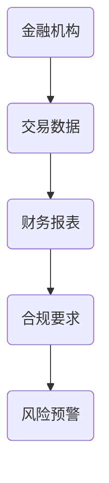
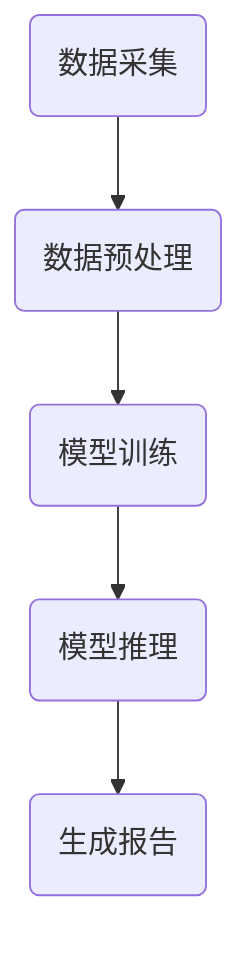
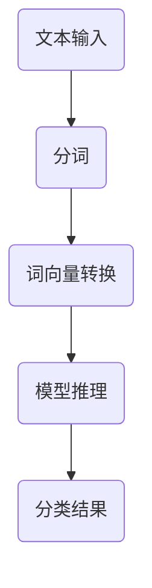
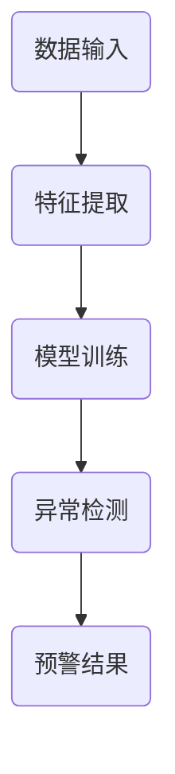
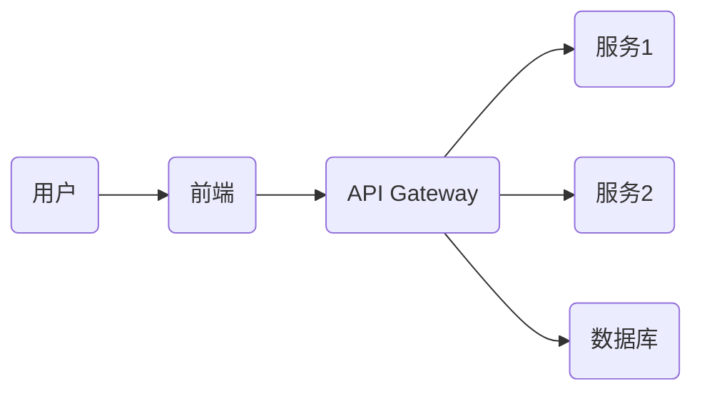
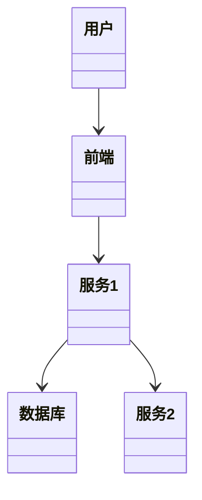

                 


# 构建基于大模型的金融监管合规自动化平台

---

## 关键词
- 大模型
- 金融监管
- 合规自动化
- 自然语言处理
- 风险评估
- 系统架构

---

## 摘要
随着金融市场的快速发展，传统的金融监管方式面临效率低、成本高、风险难以全面覆盖等问题。基于大模型的金融监管合规自动化平台通过结合自然语言处理、机器学习和大数据分析等技术，能够实现金融数据的智能化处理、风险预警和合规自动化。本文将从背景、核心概念、算法原理、系统架构到项目实战，全面解析如何构建这样一个高效、智能的金融监管平台。

---

## 目录
1. [背景与需求](#背景与需求)
   1.1 金融监管的背景与意义
   1.2 合规自动化的需求分析
   1.3 大模型在金融监管中的潜力
2. [核心概念与联系](#核心概念与联系)
   2.1 金融监管合规平台的功能模块
   2.2 大模型在金融监管中的核心应用
   2.3 核心概念的实体关系图与流程图
3. [算法原理与实现](#算法原理与实现)
   3.1 基于大模型的文本处理算法
   3.2 基于大模型的金融数据分析
   3.3 算法的数学模型与公式
4. [系统架构设计](#系统架构设计)
   4.1 系统整体架构
   4.2 关键模块的类图与交互图
5. [项目实战](#项目实战)
   5.1 环境配置与代码实现
   5.2 案例分析与结果解读
   5.3 项目总结与优化建议
6. [最佳实践与小结](#最佳实践与小结)
   6.1 实践中的注意事项
   6.2 小结与未来展望

---

## 正文

### 1. 背景与需求

#### 1.1 金融监管的背景与意义
金融监管是保障金融市场健康运行的重要手段。随着金融业务的复杂化和全球化，传统的监管方式已经难以应对新型金融风险。大模型技术的出现，为金融监管提供了新的工具和方法。

#### 1.2 合规自动化的需求分析
金融机构需要面对日益复杂的合规要求，包括反洗钱、关联交易、信息披露等。传统的人工合规检查效率低下，且容易出错。通过自动化技术，可以显著提高合规效率和准确性。

#### 1.3 大模型在金融监管中的潜力
大模型具备强大的自然语言处理和数据分析能力，能够从海量文本数据中提取关键信息，识别潜在风险，并提供实时预警。

---

### 2. 核心概念与联系

#### 2.1 金融监管合规平台的功能模块
- 数据采集与处理模块：负责收集金融机构的交易数据、财务报表等。
- 智能分析与决策模块：利用大模型进行文本分析、风险评估。
- 风险预警与报告模块：实时监控风险指标，生成监管报告。

#### 2.2 大模型在金融监管中的核心应用
- 文本分类：识别合规文件中的违规信息。
- 实体识别：从文本中提取公司名称、金额等关键信息。
- 生成报告：自动生成合规检查报告。

#### 2.3 核心概念的实体关系图与流程图
以下是核心概念的实体关系图：



流程图如下：



---

### 3. 算法原理与实现

#### 3.1 基于大模型的文本处理算法
大模型在金融监管中的文本处理主要涉及以下步骤：

1. 数据预处理：清洗文本数据，去除噪声。
2. 模型训练：使用预训练的大模型（如BERT）进行微调。
3. 文本分类：将合规文件分类为合规或违规。

以下是一个简单的文本分类流程图：



#### 3.2 基于大模型的金融数据分析
金融数据分析的核心是异常检测和风险评估。以下是异常检测的流程图：



#### 3.3 算法的数学模型与公式
以下是一个简单的异常检测模型：

$$
y = \sum_{i=1}^{n} w_i x_i + b
$$

其中：
- $y$ 是预测结果
- $w_i$ 是权重
- $x_i$ 是特征
- $b$ 是偏置

---

### 4. 系统架构设计

#### 4.1 系统整体架构
金融监管合规平台的系统架构采用微服务架构，如下图所示：



#### 4.2 关键模块的类图与交互图
以下是关键模块的类图：



交互图如下：


---

### 5. 项目实战

#### 5.1 环境配置与代码实现
以下是项目的环境配置：

```bash
pip install transformers
pip install torch
pip install matplotlib
```

以下是核心代码实现：

```python
from transformers import BertTokenizer, BertModel
import torch

# 加载预训练模型
tokenizer = BertTokenizer.from_pretrained('bert-base-uncased')
model = BertModel.from_pretrained('bert-base-uncased')

# 定义模型输入
inputs = tokenizer("这是一个测试句子。", return_tensors="pt")

# 前向传播
with torch.no_grad():
    outputs = model(**inputs)
```

#### 5.2 案例分析与结果解读
以下是一个案例分析：

假设我们有一个合规文件，内容如下：

```text
公司名称：XYZ金融公司
交易金额：100万元
交易时间：2023-10-01
```

通过模型分析，我们可以识别出以下信息：

- 实体识别：公司名称是"XYZ金融公司"，交易金额是"100万元"。
- 文本分类：合规文件分类为"合规"。

#### 5.3 项目总结与优化建议
项目总结：
- 系统实现了金融监管的自动化，提高了效率。
- 基于大模型的文本处理准确率高。

优化建议：
- 增加实时数据流处理功能。
- 提高模型的可解释性。

---

### 6. 最佳实践与小结

#### 6.1 实践中的注意事项
- 数据隐私保护：确保数据处理符合相关法律法规。
- 模型可解释性：避免“黑箱”模型，便于监管机构理解。

#### 6.2 小结与未来展望
本文详细介绍了如何构建基于大模型的金融监管合规自动化平台，涵盖了背景、核心概念、算法原理、系统架构和项目实战。未来，随着大模型技术的不断进步，金融监管将更加智能化和高效化。

--- 

# 结语

通过本文的分析，我们可以看到，基于大模型的金融监管合规自动化平台具有广阔的应用前景。希望本文能够为相关领域的技术人员提供有价值的参考和启发。

