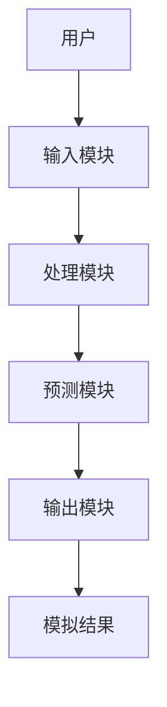

                 


# 《构建基于大模型的金融监管政策影响模拟器》

## 关键词：金融监管、大模型、政策模拟、机器学习、金融影响评估

## 摘要：
本文详细探讨了如何利用大模型技术构建一个金融监管政策影响模拟器。通过分析金融监管的复杂性，结合大模型的自然语言处理和预测能力，提出了一种创新的解决方案。本文从问题背景、核心概念、算法原理、系统架构设计到实际项目实现，进行了全面的分析，并给出了具体的实现步骤和代码示例，为金融监管政策的制定和评估提供了有力的技术支持。

---

# 第1章: 问题背景与描述

## 1.1 问题背景
### 1.1.1 金融监管的重要性
金融监管是维护金融市场稳定、保护投资者利益的重要手段。然而，传统监管工具在面对复杂多变的市场环境时，往往难以准确预测政策的实施效果。大模型技术的引入，为金融监管带来了新的可能性。

### 1.1.2 现有监管工具的局限性
现有监管工具通常基于简单的假设和线性模型，难以捕捉市场的非线性关系和复杂互动。此外，传统工具在处理大量非结构化数据时表现不佳，限制了其应用范围。

### 1.1.3 大模型技术的引入与潜力
大模型（如GPT-3、GPT-4等）具有强大的自然语言处理能力和生成能力，能够处理海量文本数据，发现隐藏的模式和关系。结合金融领域的知识，大模型可以为政策模拟提供更精准的预测和分析。

## 1.2 问题描述
### 1.2.1 金融监管政策的复杂性
金融监管政策往往涉及多个变量，如利率、资本充足率、市场准入等，这些变量之间的相互作用复杂，难以通过简单模型捕捉。

### 1.2.2 监管政策对市场的影响
政策的变化可能对市场参与者的行为产生深远影响，例如影响企业的投资决策、消费者的消费行为等。准确预测这些影响对政策制定至关重要。

### 1.2.3 模拟器的目标与作用
模拟器的目标是根据输入的监管政策，生成可能的市场反应，并评估政策的经济影响。通过模拟器，监管机构可以在实际实施政策前，评估其潜在效果，降低风险。

## 1.3 问题解决
### 1.3.1 基于大模型的模拟器解决方案
利用大模型的自然语言处理和生成能力，模拟器可以将政策文本转化为具体的市场反应，并预测其经济影响。这种解决方案能够捕捉政策的多方面影响，提供更全面的分析。

### 1.3.2 模拟器的核心功能与优势
- **功能**：输入监管政策，生成市场反应和经济影响评估。
- **优势**：能够处理复杂多变量的政策，提供高精度的预测和分析。

### 1.3.3 模拟器的应用场景与价值
- **场景**：政策制定、风险评估、市场预测等。
- **价值**：帮助监管机构优化政策设计，降低政策实施的不确定性风险。

## 1.4 概念结构与核心要素
### 1.4.1 模拟器的构成要素
- **输入模块**：接收监管政策文本。
- **处理模块**：解析政策文本，生成市场反应。
- **预测模块**：基于市场反应，预测经济影响。
- **输出模块**：展示预测结果和评估报告。

### 1.4.2 各要素之间的关系
输入模块将政策文本传递给处理模块，处理模块解析后传递给预测模块，预测模块生成结果并传递给输出模块。

### 1.4.3 模拟器的边界与外延
模拟器的边界是其处理能力和数据范围。外延包括对模型的优化和扩展，以适应更多类型的政策和市场环境。

---

# 第2章: 基于大模型的金融监管政策模拟器的核心概念

## 2.1 大模型在金融监管中的应用
### 2.1.1 大模型的基本原理
大模型通过大量的预训练，掌握了语言的结构和语义信息。在金融监管中，模型可以理解政策文本，并生成相关的市场反应。

### 2.1.2 大模型在金融领域的优势
- **自然语言处理能力**：能够理解复杂的政策文本。
- **生成能力**：可以生成模拟的市场反应和经济影响报告。

### 2.1.3 大模型在监管政策模拟中的作用
- **政策解析**：将复杂的政策文本转化为可计算的参数。
- **市场预测**：模拟政策实施后的市场反应。

## 2.2 金融监管政策模拟的核心概念
### 2.2.1 监管政策的输入与输出
- **输入**：监管政策文本。
- **输出**：市场反应和经济影响评估。

### 2.2.2 模拟器的输入处理
将政策文本转化为模型可以理解的结构化数据。

### 2.2.3 模拟器的输出分析
模型生成的市场反应和经济影响报告。

## 2.3 大模型与金融监管的结合
### 2.3.1 大模型的特征提取能力
模型能够提取政策文本中的关键特征，如政策目标、实施时间等。

### 2.3.2 大模型的预测能力
模型可以基于政策文本预测市场反应，如企业的投资行为、消费者的消费行为等。

### 2.3.3 大模型的可解释性
通过分析模型生成的文本，可以理解政策对市场的影响机制。

---

# 第3章: 大模型在金融监管政策模拟中的核心算法

## 3.1 大模型的基本算法原理
### 3.1.1 大模型的训练目标
模型的目标是最小化预测与真实值的差异，通常使用交叉熵损失函数。

$$ \text{损失函数} = -\sum_{i=1}^{n} y_i \log(p_i) + (1 - y_i) \log(1 - p_i) $$

其中，$y_i$ 是真实标签，$p_i$ 是模型的预测概率。

### 3.1.2 大模型的损失函数
常用的损失函数包括交叉熵损失和均方误差损失。

$$ \text{交叉熵损失} = -\frac{1}{n}\sum_{i=1}^{n} y_i \log(p_i) + (1 - y_i) \log(1 - p_i) $$

$$ \text{均方误差} = \frac{1}{n}\sum_{i=1}^{n} (y_i - p_i)^2 $$

### 3.1.3 大模型的优化算法
常用的优化算法包括随机梯度下降（SGD）和Adam优化器。

$$ \text{Adam优化器} = \alpha \frac{\hat{g}}{\sqrt{\hat{v}} + \epsilon} $$

其中，$\alpha$ 是学习率，$\hat{g}$ 是梯度的估计值，$\hat{v}$ 是二阶矩的估计值，$\epsilon$ 是防止除以零的小量。

## 3.2 金融监管政策模拟的算法选择
### 3.2.1 监管政策模拟的算法需求
- **高效性**：能够快速处理大量数据。
- **准确性**：预测结果准确，误差小。

### 3.2.2 大模型在模拟中的应用
- **特征提取**：提取政策文本中的关键特征。
- **生成预测**：生成市场反应和经济影响。

### 3.2.3 算法的可扩展性与鲁棒性
模型需要能够处理不同类型的政策文本，并对数据噪声具有一定的鲁棒性。

## 3.3 算法实现的流程
### 3.3.1 数据预处理
将政策文本转化为结构化数据，例如提取关键词和实体。

### 3.3.2 模型训练
使用预处理后的数据训练大模型，优化模型参数。

### 3.3.3 模型微调
在特定的金融监管任务上对模型进行微调，提升任务相关性。

### 3.3.4 模型评估
使用验证集评估模型的性能，调整参数以优化结果。

---

# 第4章: 金融监管政策模拟器的系统架构设计

## 4.1 系统功能设计
### 4.1.1 用户界面设计
提供友好的用户界面，用户可以输入政策文本并查看模拟结果。

### 4.1.2 数据输入与处理
将政策文本转化为结构化数据，供模型处理。

### 4.1.3 模型调用与预测
调用大模型进行政策模拟，生成市场反应和经济影响报告。

### 4.1.4 结果展示
将模拟结果以图表或文本形式展示给用户。

## 4.2 系统架构设计
### 4.2.1 系统模块划分
- **输入模块**：接收政策文本。
- **处理模块**：解析政策文本。
- **预测模块**：调用大模型进行模拟。
- **输出模块**：展示模拟结果。

### 4.2.2 系统交互流程
1. 用户输入政策文本。
2. 处理模块解析文本并传递给预测模块。
3. 预测模块生成市场反应和经济影响报告。
4. 输出模块展示结果。

### 4.2.3 系统架构图


## 4.3 接口设计
### 4.3.1 输入接口
接收政策文本，支持多种格式，如文本文件或API调用。

### 4.3.2 输出接口
展示模拟结果，支持图表和文本输出。

---

# 第5章: 项目实战

## 5.1 环境安装
安装必要的库，如TensorFlow、PyTorch、transformers等。

## 5.2 系统核心实现源代码
### 5.2.1 数据预处理代码
```python
import pandas as pd
from transformers import GPT2Tokenizer, GPT2Model

# 加载模型
model = GPT2Model.from_pretrained('gpt2')
tokenizer = GPT2Tokenizer.from_pretrained('gpt2')

# 数据预处理
def preprocess(text):
    inputs = tokenizer.encode(text, return_tensors='np')
    return inputs

# 示例
text = "降低企业税率"
inputs = preprocess(text)
```

### 5.2.2 模型微调代码
```python
import torch
from torch.utils.data import Dataset, DataLoader

# 定义数据集
class PolicyDataset(Dataset):
    def __init__(self, texts, labels):
        self.texts = texts
        self.labels = labels

    def __len__(self):
        return len(self.texts)

    def __getitem__(self, idx):
        text = self.texts[idx]
        label = self.labels[idx]
        return text, label

# 定义训练函数
def train(model, optimizer, criterion, dataloader, epochs=3):
    for epoch in range(epochs):
        for batch in dataloader:
            inputs, labels = batch
            outputs = model(inputs)
            loss = criterion(outputs, labels)
            loss.backward()
            optimizer.step()
            optimizer.zero_grad()

# 示例
dataset = PolicyDataset(texts, labels)
dataloader = DataLoader(dataset, batch_size=32, shuffle=True)
optimizer = torch.optim.Adam(model.parameters(), lr=0.001)
criterion = torch.nn.CrossEntropyLoss()
train(model, optimizer, criterion, dataloader)
```

## 5.3 实际案例分析
以某国降低企业税率的政策为例，模拟器生成市场反应，如企业投资增加、就业率上升等。

---

# 第6章: 最佳实践与总结

## 6.1 最佳实践
- **数据质量**：确保数据的准确性和完整性。
- **模型调优**：根据具体任务调整模型参数。
- **用户反馈**：收集用户反馈，不断优化模拟器。

## 6.2 小结
本文详细介绍了基于大模型的金融监管政策模拟器的构建过程，从问题背景到系统实现，为金融监管提供了新的思路。

## 6.3 注意事项
- 模型的泛化能力有限，需谨慎处理数据偏差。
- 确保数据隐私和合规性。

## 6.4 拓展阅读
- 探索更多大模型在金融监管中的应用，如风险评估、市场预测等。

---

# 结语
构建基于大模型的金融监管政策影响模拟器是一个复杂而有意义的任务。通过本文的分析和实践，我们展示了如何利用大模型技术，为金融监管提供更精准的工具。未来，随着大模型技术的不断发展，模拟器的功能和性能将进一步提升，为金融监管带来更大的价值。

