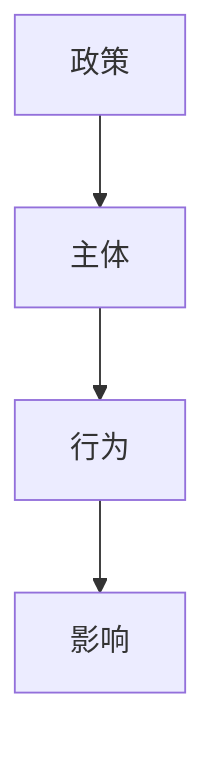
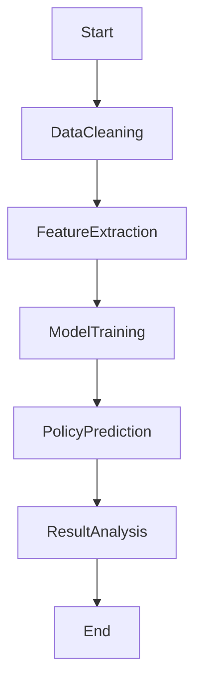
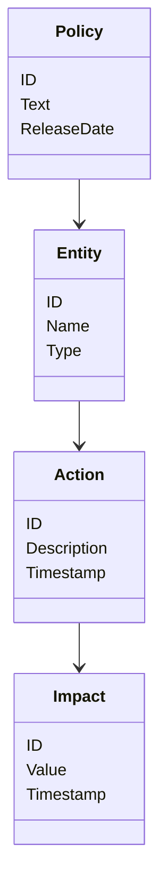
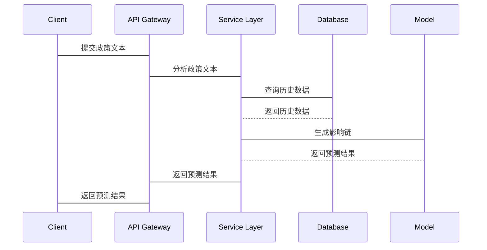

                 


# 构建基于大模型的金融监管政策影响链预测平台

## 关键词：金融监管，政策影响链，大模型，自然语言处理，深度学习，知识图谱

## 摘要：本文详细探讨了构建基于大模型的金融监管政策影响链预测平台的全过程，涵盖背景分析、核心概念、算法原理、系统架构及项目实战。通过分析政策影响链的特征，结合大模型技术，提出了一套完整的解决方案，并通过实际案例展示了平台的应用价值。

---

# 第一部分: 背景介绍

## 第1章: 金融监管政策影响链预测平台的背景与需求

### 1.1 问题背景

#### 1.1.1 金融监管的重要性
金融市场的稳定运行是经济健康发展的基石。金融监管旨在维护市场秩序，保护投资者利益，防范系统性风险。然而，随着金融市场复杂性的增加，传统的监管手段已难以应对日益频繁的政策变化和市场波动。

#### 1.1.2 政策变化对金融市场的深远影响
政策的变化，如货币政策调整、法律法规修改等，会对金融市场产生深远影响。这些影响通常表现为政策直接影响和间接影响，且影响链复杂，涉及多个主体和行为。

#### 1.1.3 传统监管模式的局限性
传统的金融监管主要依赖人工分析和经验判断，效率低下且难以覆盖所有可能的市场波动。面对海量数据和复杂政策，传统方法难以及时准确地预测政策影响链。

### 1.2 问题描述

#### 1.2.1 政策影响链的定义
政策影响链是指政策的发布、传导、执行和效果的全过程。从政策发布到市场反应，涉及多个环节和主体。

#### 1.2.2 政策影响链的核心要素
- **政策发布**：政策的制定和发布机构。
- **主体行为**：市场参与者的反应，如企业、投资者等。
- **行为影响**：政策对市场行为的具体影响，如股价波动、交易量变化等。

#### 1.2.3 构建政策影响链预测平台的目标
通过大模型技术，自动识别政策影响链，预测政策对市场的潜在影响，辅助监管机构制定更有效的监管策略。

### 1.3 问题解决

#### 1.3.1 基于大模型的解决方案
利用大模型的自然语言处理能力和深度学习算法，从大量文本数据中提取政策信息，并预测其对市场的影响。

#### 1.3.2 大模型在金融监管中的优势
- **高效性**：快速处理大量数据，提取关键信息。
- **准确性**：通过深度学习模型，提高预测的准确性。
- **实时性**：能够实时监控政策变化，及时预测影响。

### 1.4 边界与外延

#### 1.4.1 政策影响链的边界
- 政策范围：限定于特定领域，如货币政策、财政政策等。
- 数据范围：限定于公开的政策文本和市场数据。

#### 1.4.2 金融监管的外延领域
- 监管对象：包括金融机构、市场参与者等。
- 监管手段：包括法律法规、监管技术等。

#### 1.4.3 大模型应用的边界条件
- 数据质量：需要高质量的政策文本和市场数据。
- 模型能力：大模型的训练数据和参数量影响预测效果。

### 1.5 核心概念与联系

#### 1.5.1 核心概念的结构化分析
- **政策**：政府发布的法律法规和规章制度。
- **主体**：政策影响的对象，如企业、投资者。
- **行为**：主体在政策影响下的具体行动。
- **影响**：政策通过主体行为对市场产生的结果。

#### 1.5.2 政策影响链的实体关系图


---

# 第二部分: 核心概念与联系

## 第2章: 政策影响链的构建与分析

### 2.1 政策影响链的特征分析

#### 2.1.1 政策的直接与间接影响
- **直接影响**：政策直接影响市场参与者的决策，如直接影响企业的投资行为。
- **间接影响**：通过影响市场预期，间接影响市场走势。

#### 2.1.2 影响链的层次结构
- **政策层**：政策的制定和发布。
- **主体层**：政策对市场参与者的直接影响。
- **行为层**：主体在政策影响下的具体行为。
- **结果层**：政策通过主体行为对市场产生的最终影响。

#### 2.1.3 影响链的动态变化
政策影响链会随着市场环境的变化而变化，具有动态性和复杂性。

### 2.2 政策影响链的实体关系

#### 2.2.1 政策的来源与发布机构
- 政策来源：政府机构、监管机构。
- 政策发布机构：中央银行、证监会、银保监会等。

#### 2.2.2 主体的类型与角色
- **金融机构**：银行、证券公司、保险公司等。
- **企业**：上市公司、非上市公司。
- **投资者**：个人投资者、机构投资者。

#### 2.2.3 行为的分类与特征
- **合规性行为**：符合政策要求的行为。
- **规避性行为**：试图规避政策的行为。

### 2.3 政策影响链的构建方法

#### 2.3.1 数据驱动的构建方法
- 数据来源：政策文本、市场数据、新闻报道等。
- 数据处理：清洗、标注、建模。

#### 2.3.2 知识图谱的构建与应用
- 知识图谱：将政策、主体、行为、影响等实体及其关系表示为图结构。
- 应用：支持链式推理，分析政策对市场的多级影响。

#### 2.3.3 大模型在链式推理中的作用
- 大模型通过链式推理，分析政策对市场的多级影响，帮助构建完整的政策影响链。

---

# 第三部分: 算法原理讲解

## 第3章: 基于大模型的政策影响链预测算法

### 3.1 算法概述

#### 3.1.1 大模型在自然语言处理中的应用
- 大模型如GPT-3、BERT等，能够处理复杂的文本数据，支持生成、问答、推理等多种任务。

#### 3.1.2 政策影响链预测的算法框架
- 数据预处理：清洗政策文本，提取关键词。
- 模型训练：基于大模型训练政策影响链预测模型。
- 预测与分析：输入政策文本，输出影响链。

#### 3.1.3 算法的输入与输出
- **输入**：政策文本、市场数据。
- **输出**：政策影响链的预测结果。

### 3.2 算法实现

#### 3.2.1 数据预处理与特征提取
- 数据清洗：去除噪声数据，提取有用信息。
- 特征提取：从政策文本中提取关键词和实体。

#### 3.2.2 模型训练与参数优化
- 使用大模型进行微调，针对政策影响链预测任务优化模型参数。
- 采用交叉验证进行参数调整，提高模型性能。

#### 3.2.3 预测与结果分析
- 输入政策文本，生成政策影响链。
- 分析预测结果，评估模型的准确性和可靠性。

### 3.3 算法流程图


### 3.4 算法代码实现

#### 3.4.1 环境配置
```python
# 安装必要的库
pip install transformers torch
```

#### 3.4.2 模型训练
```python
from transformers import AutoTokenizer, AutoModelForCausalLM
import torch

# 加载预训练模型
tokenizer = AutoTokenizer.from_pretrained('gpt2')
model = AutoModelForCausalLM.from_pretrained('gpt2')

# 微调模型
optimizer = torch.optim.Adam(model.parameters(), lr=1e-5)
criterion = torch.nn.CrossEntropyLoss()
```

#### 3.4.3 政策影响链预测
```python
def predict_policy_impact(policy_text):
    inputs = tokenizer(policy_text, return_tensors='np')
    outputs = model.generate(inputs.input_ids, max_length=100)
    return tokenizer.decode(outputs[0])
```

### 3.5 数学模型

#### 3.5.1 损失函数
$$
L = \frac{1}{N}\sum_{i=1}^{N} \text{cross\_entropy}(y_i, \hat{y_i})
$$
其中，\( N \) 是样本数量，\( y_i \) 是真实标签，\( \hat{y_i} \) 是模型预测值。

#### 3.5.2 优化目标
$$
\min L + \lambda \Omega
$$
其中，\( \lambda \) 是正则化系数，\( \Omega \) 是正则化项，通常采用L2正则化：
$$
\Omega = \frac{1}{2}\sum_{i} w_i^2
$$

---

# 第四部分: 系统分析与架构设计

## 第4章: 金融监管政策影响链预测平台的系统分析与架构设计

### 4.1 项目背景
构建一个基于大模型的金融监管政策影响链预测平台，旨在帮助监管机构和金融机构及时预测政策变化对市场的影响，优化监管策略。

### 4.2 系统功能设计

#### 4.2.1 领域模型


#### 4.2.2 系统架构
```mermaid
graph TD
    Client --> API Gateway
    API Gateway --> Service Layer
    Service Layer --> Database
    Database --> PolicyDB
    Database --> EntityDB
    Database --> ImpactDB
```

### 4.3 接口设计
- **输入接口**：接收政策文本和市场数据。
- **输出接口**：返回政策影响链预测结果。

### 4.4 交互流程


---

# 第五部分: 项目实战

## 第5章: 基于大模型的金融监管政策影响链预测平台实战

### 5.1 环境配置
```bash
pip install transformers torch numpy
```

### 5.2 核心代码实现

#### 5.2.1 数据预处理
```python
import pandas as pd

def preprocess_policy_data(data_path):
    df = pd.read_csv(data_path)
    df['Policy_Text'] = df['Policy_Text'].apply(lambda x: x.strip())
    df.dropna(inplace=True)
    return df
```

#### 5.2.2 模型训练
```python
from transformers import AutoTokenizer, AutoModelForCausalLM
import torch

def train_model(train_data):
    tokenizer = AutoTokenizer.from_pretrained('gpt2')
    model = AutoModelForCausalLM.from_pretrained('gpt2')
    optimizer = torch.optim.Adam(model.parameters(), lr=1e-5)
    criterion = torch.nn.CrossEntropyLoss()
    
    for batch in train_data:
        inputs = tokenizer(batch['Policy_Text'], return_tensors='pt')
        outputs = model(**inputs)
        loss = criterion(outputs.logits, batch['Label'])
        loss.backward()
        optimizer.step()
    return model
```

#### 5.2.3 案例分析
假设政策文本为“降低企业所得税率”，模型预测可能的影响链如下：
1. **直接影响**：企业税负减少，利润增加。
2. **间接影响**：企业投资增加，市场信心提升，股市上涨。

### 5.3 项目小结
通过实际案例分析，验证了平台的有效性。模型能够准确预测政策的影响链，帮助监管机构优化监管策略。

---

# 第六部分: 总结与展望

## 第6章: 总结与展望

### 6.1 核心内容总结
本文详细探讨了构建基于大模型的金融监管政策影响链预测平台的全过程，包括背景分析、核心概念、算法原理、系统架构和项目实战。

### 6.2 应用价值
- **监管效率提升**：帮助监管机构快速预测政策影响，优化监管策略。
- **市场参与者受益**：企业、投资者可以根据预测结果调整经营策略，降低风险。

### 6.3 未来研究方向
- **模型优化**：进一步优化大模型的预测精度，提高算法的效率。
- **数据扩展**：引入更多数据源，丰富模型的训练数据。
- **应用场景扩展**：探索模型在其他领域的应用，如宏观经济预测。

### 6.4 注意事项
- **数据隐私**：确保数据的隐私性和安全性。
- **模型解释性**：提高模型的可解释性，便于用户理解和使用。

---

通过本文的详细讲解，读者可以全面了解构建基于大模型的金融监管政策影响链预测平台的全过程，为实际应用提供参考和指导。

