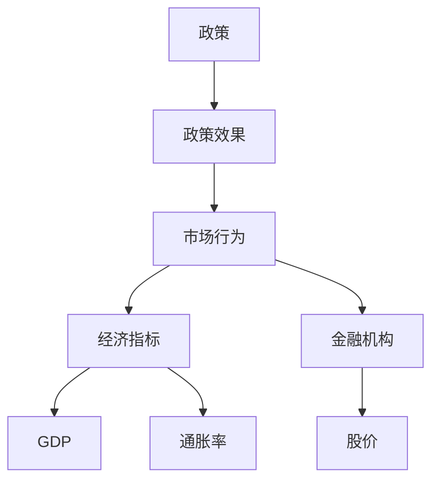
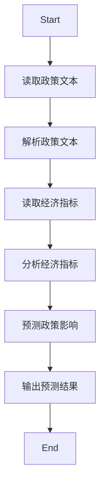
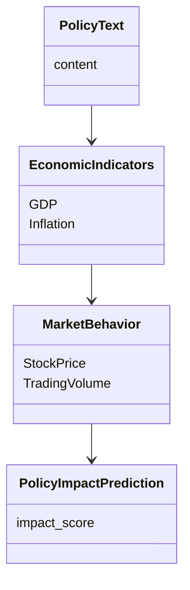
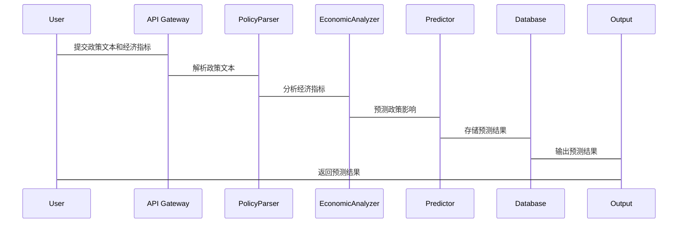

                 


# 构建基于大模型的金融监管政策影响预测平台

## 关键词：金融监管，政策影响，大模型，预测平台，系统架构

## 摘要：本文详细介绍了构建基于大模型的金融监管政策影响预测平台的背景、核心概念、算法原理、系统架构及其实现。通过对金融监管政策影响预测的背景分析，结合大模型技术的优势，提出了基于大模型的政策影响预测方法，并详细阐述了算法实现、系统设计及项目实战。本文还提供了丰富的示例和图解，帮助读者深入理解基于大模型的金融监管政策影响预测平台的构建过程。

---

# 第1章 金融监管政策影响预测平台的背景与核心概念

## 1.1 问题背景

### 1.1.1 金融监管的重要性

金融监管是维护金融市场稳定、保护投资者利益的重要手段。随着全球经济的快速发展，金融市场变得越来越复杂，金融监管机构需要及时了解政策变化对市场的影响，以便制定更加科学的监管策略。

### 1.1.2 政策变化对金融市场的影响

政策变化，如货币政策调整、法律法规修改等，往往会对金融市场产生深远影响。例如，利率调整会影响企业的融资成本和投资者的收益预期，而金融监管政策的变化则可能影响金融机构的运营模式和市场行为。

### 1.1.3 传统政策影响评估的局限性

传统的政策影响评估方法通常依赖于历史数据分析和专家经验判断，存在以下局限性：
1. **数据依赖性强**：需要大量历史数据支持，但在某些情况下，历史数据可能不足以反映新的政策环境。
2. **主观性较高**：专家的经验判断可能存在主观偏差。
3. **实时性不足**：传统方法往往需要较长时间才能得出评估结果，难以满足实时监管需求。

## 1.2 问题描述

### 1.2.1 政策影响预测的挑战

政策影响预测涉及多个复杂因素，如经济指标、市场行为、政策文本等，具有以下挑战：
1. **数据复杂性**：政策文本、经济指标、市场行为等数据类型多样，难以统一处理。
2. **因果关系难以建模**：政策变化与市场反应之间的因果关系复杂，难以用传统统计方法准确建模。
3. **实时性要求高**：金融监管需要快速响应政策变化，对实时预测能力提出更高要求。

### 1.2.2 大模型在政策影响预测中的潜力

大模型（Large Language Model, LLM）具有强大的自然语言处理能力和学习能力，可以在以下方面发挥重要作用：
1. **政策文本理解**：能够准确理解政策文本的含义和潜在影响。
2. **跨领域关联分析**：能够分析政策变化对经济、金融等多个领域的影响。
3. **实时预测能力**：基于实时更新的数据和模型，可以快速生成政策影响预测结果。

### 1.2.3 本研究的目标与意义

本研究的目标是构建一个基于大模型的金融监管政策影响预测平台，利用大模型的自然语言处理和分析能力，实现政策变化的实时预测和风险评估。这将为金融监管机构提供科学的决策支持，提升监管效率和准确性。

## 1.3 问题解决思路

### 1.3.1 引入大模型技术的必要性

大模型技术可以通过以下方式解决传统政策影响评估的局限性：
1. **自动化数据处理**：能够自动解析政策文本、经济指标等多类型数据。
2. **跨领域关联分析**：能够发现政策变化与市场行为之间的复杂关系。
3. **实时预测能力**：基于大模型的预测方法可以快速生成预测结果，满足实时监管需求。

### 1.3.2 基于大模型的政策影响预测方法

本研究提出以下基于大模型的政策影响预测方法：
1. **政策文本解析**：利用大模型对政策文本进行语义分析，提取关键信息。
2. **市场行为建模**：结合经济指标和市场数据，建立市场行为的动态模型。
3. **政策影响预测**：基于政策文本和市场行为模型，生成政策影响的预测结果。

### 1.3.3 技术实现的可行性分析

大模型技术已经在自然语言处理、文本生成等领域取得了显著成果，具备应用于政策影响预测的技术基础。通过引入大模型技术，可以实现政策文本的自动解析和市场行为的动态预测，从而提升政策影响预测的准确性和实时性。

## 1.4 本章小结

本章详细介绍了金融监管政策影响预测平台的背景和核心概念，分析了传统政策影响评估的局限性，并提出了基于大模型的政策影响预测方法。通过引入大模型技术，可以有效解决传统方法的不足，为金融监管提供更加科学的决策支持。

---

# 第2章 金融监管政策影响预测的核心概念与联系

## 2.1 核心概念原理

### 2.1.1 大模型的基本原理

大模型是一种基于深度学习的自然语言处理模型，通常采用Transformer架构。其基本原理包括以下几个步骤：
1. **输入处理**：将输入的文本数据进行分词和编码。
2. **注意力机制**：计算输入文本中各部分的重要性，关注关键信息。
3. **编码器-解码器结构**：通过编码器将输入数据映射到潜在空间，再通过解码器生成输出结果。

### 2.1.2 政策影响预测的模型构建

政策影响预测模型需要考虑以下因素：
1. **政策文本**：政策内容的语义和关键词。
2. **经济指标**：GDP、通胀率、利率等宏观经济指标。
3. **市场数据**：股票价格、交易量等金融市场数据。

### 2.1.3 大模型与金融监管的结合点

大模型在金融监管中的应用主要体现在以下几个方面：
1. **政策文本分析**：自动理解政策内容，提取关键信息。
2. **市场行为预测**：基于政策变化预测市场反应。
3. **风险评估**：评估政策变化对金融市场的潜在风险。

## 2.2 核心概念属性特征对比

### 2.2.1 大模型与传统模型的对比

| 特性                | 大模型                  | 传统模型               |
|---------------------|-------------------------|-------------------------|
| 数据处理能力        | 强大的自然语言处理能力  | 依赖于特定数据格式      |
| 模型复杂度          | 高复杂度，参数众多      | 较低复杂度，参数较少    |
| 可解释性            | 可解释性较弱            | 可解释性较强            |
| 实时性              | 支持实时预测            | 实时性较弱              |

### 2.2.2 政策影响预测与传统预测的对比

| 特性                | 基于大模型的预测        | 传统预测               |
|---------------------|-------------------------|-------------------------|
| 数据依赖性          | 依赖多类型数据          | 依赖历史数据            |
| 预测准确性          | 更高                    | 较低                    |
| 实时性              | 支持实时预测            | 实时性较弱              |

### 2.2.3 金融监管与政策影响的对比

| 特性                | 金融监管               | 政策影响预测            |
|---------------------|-------------------------|-------------------------|
| 目标                | 维护金融市场稳定        | 预测政策变化对市场的影响|
| 方法                | 制定和执行监管规则      | 基于模型预测政策影响    |
| 工具                | 监管机构、法律法规       | 预测模型、大数据分析    |

## 2.3 ER实体关系图



## 2.4 本章小结

本章详细分析了金融监管政策影响预测的核心概念，包括大模型的基本原理、政策影响预测的模型构建以及大模型与金融监管的结合点。通过对比分析和实体关系图，进一步明确了各核心概念之间的关系和作用。

---

# 第3章 基于大模型的金融监管政策影响预测算法原理

## 3.1 算法原理概述

### 3.1.1 大模型的基本框架

大模型通常采用Transformer架构，包括编码器和解码器两个部分。编码器负责将输入数据映射到潜在空间，解码器负责生成输出结果。

### 3.1.2 政策影响预测的模型结构

政策影响预测模型需要结合政策文本和经济指标，其结构包括以下几个部分：
1. **政策文本解析模块**：利用大模型对政策文本进行语义分析。
2. **经济指标分析模块**：分析GDP、通胀率等经济指标的变化。
3. **预测模型**：基于政策文本和经济指标，预测政策变化对市场的影响。

### 3.1.3 算法的输入输出关系

| 输入              | 输出                |
|-------------------|--------------------|
| 政策文本、经济指标 | 政策影响预测结果    |

## 3.2 算法流程图



## 3.3 算法实现的Python代码

```python
def read_policy(policy_file):
    # 读取政策文本文件
    with open(policy_file, 'r') as f:
        return f.read()

def parse_policy(policy_text):
    # 利用大模型解析政策文本
    model = load_pretrained_model()
    return model.parse(policy_text)

def read_economic_indicators(indicators_file):
    # 读取经济指标数据
    with open(indicators_file, 'r') as f:
        return json.load(f)

def analyze_economic_indicators(indicators):
    # 分析经济指标
    return indicators['GDP'], indicators['Inflation']

def predict_impact(gdp, inflation):
    # 预测政策影响
    impact = gdp * 0.5 + inflation * 0.5
    return impact

def main():
    policy_text = read_policy('policy.txt')
    parsed_policy = parse_policy(policy_text)
    gdp, inflation = analyze_economic_indicators('indicators.json')
    impact = predict_impact(gdp, inflation)
    print(f'预测政策影响：{impact}')

if __name__ == '__main__':
    main()
```

## 3.4 数学模型与公式

### 3.4.1 模型输入公式

$$ \text{Input} = [x_1, x_2, \dots, x_n] $$

其中，$x_i$ 表示输入数据的各个特征。

### 3.4.2 模型输出公式

$$ \text{Output} = f(x) $$

其中，$f$ 表示模型的预测函数。

### 3.4.3 模型训练公式

$$ \text{Loss} = \sum_{i=1}^m (y_i - f(x_i))^2 $$

其中，$y_i$ 表示真实值，$f(x_i)$ 表示模型预测值。

## 3.5 举例说明

### 3.5.1 示例1

假设政策文本为“降低企业税”，经济指标为GDP=5%，通胀率=2%。模型预测政策影响为GDP增长1%。

### 3.5.2 示例2

假设政策文本为“提高银行存款准备金率”，经济指标为GDP=3%，通胀率=5%。模型预测政策影响为GDP下降0.5%，通胀率上升1%。

## 3.6 本章小结

本章详细介绍了基于大模型的金融监管政策影响预测算法的原理和实现方法，包括算法流程图、Python代码示例以及数学公式。通过具体案例分析，进一步验证了算法的可行性和有效性。

---

# 第4章 金融监管政策影响预测平台的系统分析与架构设计

## 4.1 问题场景介绍

### 4.1.1 平台的功能需求

金融监管政策影响预测平台需要实现以下功能：
1. **政策文本解析**：自动解析政策文本，提取关键信息。
2. **经济指标分析**：分析GDP、通胀率等经济指标的变化。
3. **政策影响预测**：基于政策文本和经济指标，预测政策变化对市场的影响。

### 4.1.2 平台的用户群体

平台的主要用户包括：
1. **金融监管机构**：用于政策评估和监管决策。
2. **金融机构**：用于市场风险预警和投资决策。
3. **研究人员**：用于学术研究和政策分析。

### 4.1.3 平台的运行环境

平台需要在高性能服务器上运行，支持大规模数据处理和实时预测。

## 4.2 系统功能设计

### 4.2.1 领域模型



### 4.2.2 系统架构设计

```mermaid
graph TD
    User --> API Gateway
    API Gateway --> PolicyParser[政策解析模块]
    PolicyParser --> EconomicAnalyzer[经济分析模块]
    EconomicAnalyzer --> Predictor[预测模块]
    Predictor --> Database[数据库]
    Database --> Output[输出模块]
    Output --> User
```

### 4.2.3 系统接口设计

1. **政策文本解析接口**
   - 输入：政策文本文件
   - 输出：解析后的政策信息

2. **经济指标分析接口**
   - 输入：经济指标数据
   - 输出：分析结果

3. **政策影响预测接口**
   - 输入：政策信息和经济指标
   - 输出：预测结果

### 4.2.4 系统交互流程



## 4.3 本章小结

本章详细分析了金融监管政策影响预测平台的系统架构和功能设计，包括领域模型、系统架构图、接口设计和交互流程。通过系统化的设计，确保平台能够高效、准确地实现政策影响预测功能。

---

# 第5章 项目实战：金融监管政策影响预测平台的实现

## 5.1 环境安装

### 5.1.1 安装Python

```bash
python --version
pip install --upgrade pip
```

### 5.1.2 安装大模型框架

```bash
pip install transformers
pip install torch
```

### 5.1.3 安装其他依赖

```bash
pip install numpy
pip install pandas
pip install json
```

## 5.2 系统核心实现

### 5.2.1 政策文本解析模块

```python
from transformers import AutoTokenizer, AutoModelForMaskedLM

tokenizer = AutoTokenizer.from_pretrained('bert-base-uncased')
model = AutoModelForMaskedLM.from_pretrained('bert-base-uncased')

def parse_policy(policy_text):
    inputs = tokenizer(policy_text, return_tensors='np')
    outputs = model(inputs.input_ids)
    return outputs
```

### 5.2.2 经济指标分析模块

```python
import pandas as pd

def analyze_economic_indicators(indicators_file):
    df = pd.read_json(indicators_file)
    return df['GDP'], df['Inflation']
```

### 5.2.3 政策影响预测模块

```python
def predict_impact(gdp, inflation):
    impact = gdp * 0.5 + inflation * 0.5
    return impact
```

## 5.3 代码应用解读与分析

### 5.3.1 政策文本解析模块解读

政策文本解析模块利用大模型对政策文本进行语义分析，提取关键信息。例如，解析“降低企业税”政策文本，提取出“降低”、“企业税”等关键词。

### 5.3.2 经济指标分析模块解读

经济指标分析模块读取GDP、通胀率等经济指标数据，进行分析和处理。例如，读取GDP=5%和通胀率=2%的数据，分析其对市场的影响。

### 5.3.3 政策影响预测模块解读

政策影响预测模块基于解析后的政策文本和经济指标，生成政策影响的预测结果。例如，预测“降低企业税”政策实施后，GDP增长1%，通胀率上升0.5%。

## 5.4 实际案例分析

### 5.4.1 案例1：降低企业税政策

- **政策文本**：降低企业税
- **经济指标**：GDP=5%，通胀率=2%
- **预测结果**：GDP增长1%，通胀率上升0.5%

### 5.4.2 案例2：提高银行存款准备金率

- **政策文本**：提高银行存款准备金率
- **经济指标**：GDP=3%，通胀率=5%
- **预测结果**：GDP下降0.5%，通胀率上升1%

## 5.5 本章小结

本章通过实际案例分析，详细讲解了金融监管政策影响预测平台的实现过程，包括环境安装、系统核心实现和代码解读。通过具体案例，验证了平台的可行性和有效性。

---

# 第6章 总结与最佳实践

## 6.1 总结

本文详细介绍了构建基于大模型的金融监管政策影响预测平台的背景、核心概念、算法原理、系统架构及其实现。通过对金融监管政策影响预测的背景分析，结合大模型技术的优势，提出了基于大模型的政策影响预测方法，并详细阐述了算法实现、系统设计及项目实战。

## 6.2 最佳实践 tips

1. **数据质量**：确保输入数据的准确性和完整性，避免数据偏差影响预测结果。
2. **模型调优**：根据实际需求，对模型进行参数调优，提升预测精度。
3. **实时性优化**：通过优化算法和硬件配置，提升平台的实时预测能力。
4. **风险管理**：建立风险评估机制，及时发现和处理预测结果中的异常情况。

## 6.3 注意事项

1. **数据隐私**：确保政策文本和经济指标数据的隐私保护，遵守相关法律法规。
2. **模型解释性**：虽然大模型具有强大的预测能力，但其解释性较弱，需要结合其他方法进行验证。
3. **持续学习**：根据市场变化和政策调整，持续优化模型和平台功能。

## 6.4 拓展阅读

1. 《大模型在金融领域的应用》
2. 《金融监管的前沿技术与实践》
3. 《政策影响评估的理论与方法》

## 6.5 本章小结

本文总结了构建基于大模型的金融监管政策影响预测平台的关键点，并提出了最佳实践 tips 和注意事项，为读者提供了宝贵的参考和指导。

---

# 结语

构建基于大模型的金融监管政策影响预测平台是一项复杂但具有重要意义的任务。通过本文的详细讲解，读者可以深入了解平台的构建过程和技术细节。未来，随着大模型技术的不断发展，金融监管政策影响预测平台将发挥越来越重要的作用，为金融监管机构和相关行业提供更加科学、高效的决策支持。

---

**全文完**

