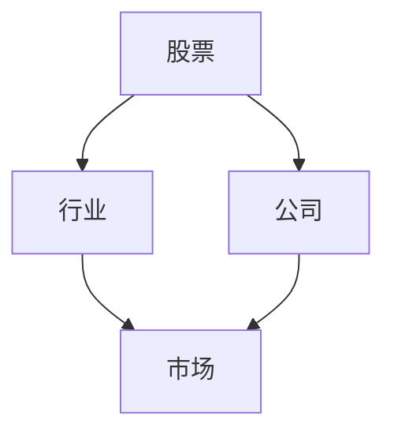
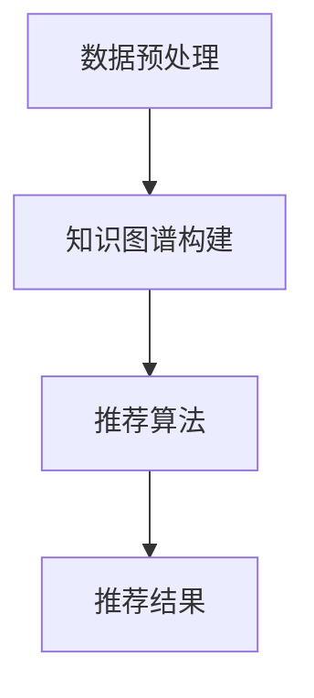

                 


# 构建基于知识图谱的金融产品关联推荐引擎

> 关键词：知识图谱、金融推荐系统、关联推荐、实体关系、图嵌入

> 摘要：本文详细介绍了如何基于知识图谱构建金融产品关联推荐引擎，从知识图谱的基本概念到推荐系统的实现，涵盖数据处理、算法原理、系统架构设计等关键环节，最后通过实际案例展示如何将理论应用于实践。

---

# 第一部分：知识图谱与金融推荐系统概述

## 第1章：知识图谱的基本概念与应用场景

### 1.1 知识图谱的定义与核心要素

知识图谱是一种以图结构形式表示知识的语义网络，由实体（Entity）和关系（Relation）组成。实体是现实世界中的具体事物或概念，关系描述实体之间的关联。

$$
\text{知识图谱} = \{ (e_1, r, e_2) | e_1, e_2 \in 实体, r \in 关系 \}
$$

知识图谱的核心要素包括：
1. **实体**：如“金融产品”、“用户”、“市场”等。
2. **关系**：如“属于”、“影响”、“关联”等。
3. **属性**：如“产品类型”、“风险等级”等。

### 1.2 金融推荐系统的需求与挑战

金融产品种类繁多，用户需求多样化，传统推荐系统难以满足精准推荐的需求。知识图谱通过语义关联，能够更好地捕捉产品间的隐含关系，解决以下问题：
- **数据稀疏性**：用户数据有限时，知识图谱可以补充产品间的语义信息。
- **关联性推理**：通过实体关系推理，发现潜在的产品关联。
- **可解释性**：推荐结果可以通过知识图谱中的路径解释。

### 1.3 知识图谱在金融推荐中的优势

- **语义表达能力**：知识图谱能够捕捉产品之间的语义关联，如“股票A与行业B相关”。
- **关联推理能力**：通过图结构推理，发现隐藏的产品关联，如“产品X与产品Y通过中间产品Z关联”。
- **可解释性**：推荐结果可以通过图中的路径直观解释，提升用户体验。

---

## 第2章：知识图谱构建与金融产品关联分析

### 2.1 知识图谱构建的基本流程

知识图谱构建流程包括数据采集、预处理、实体识别与关系抽取、知识融合、存储与管理。

#### 2.1.1 数据采集与预处理

数据来源包括：
- **结构化数据**：如金融产品的属性数据。
- **非结构化数据**：如新闻、评论等文本数据。

数据预处理步骤：
1. 数据清洗：去除重复、噪声数据。
2. 数据抽取：从文本中提取实体和关系。
3. 数据标准化：统一数据格式。

#### 2.1.2 实体识别与关系抽取

- **实体识别**：使用NLP技术从文本中提取实体，如“股票”、“基金”等。
- **关系抽取**：识别实体之间的关系，如“股票属于某个行业”。
- **实体关系图**：通过Mermaid绘制实体关系图。



### 2.2 基于知识图谱的金融产品关联分析

#### 2.2.1 实体关系建模

- **实体类型**：定义金融领域的实体类型，如“产品”、“市场”、“用户”等。
- **关系类型**：定义实体之间的关系类型，如“属于”、“影响”、“关联”等。

#### 2.2.2 产品关联推理

- **路径推理**：通过图结构推理产品之间的关联路径，如“股票→行业→基金”。
- **相似度计算**：基于知识图谱嵌入计算产品之间的相似度。

---

## 第3章：知识图谱嵌入与推荐算法

### 3.1 知识图谱嵌入的基本原理

知识图谱嵌入是将图中的实体和关系映射到低维向量空间的技术，常用算法包括：
- **TransE**：通过边的转移学习嵌入。
- **TransH**：考虑边的权重和方向。
- **Node2Vec**：通过随机游走生成节点表示。

#### 3.1.1 TransE算法

$$
\text{TransE}(e_i, r, e_j) = ||e_i + r - e_j||^2
$$

其中，$e_i$、$e_j$是实体嵌入，$r$是关系嵌入。

### 3.2 基于知识图谱的推荐算法

#### 3.2.1 基于相似度的推荐

计算目标产品与其他产品的相似度，推荐相似度高的产品：

$$
\text{相似度} = \frac{\sum_{r} w_r \cdot s(e_i, r, e_j)}{\sum_{r} w_r}
$$

其中，$w_r$是关系$r$的权重，$s$是相似度计算函数。

---

## 第4章：系统架构与设计

### 4.1 系统架构设计

系统分为数据预处理、知识图谱构建、推荐算法实现三个主要模块。

#### 4.1.1 系统功能设计

- **数据预处理模块**：处理原始数据，提取实体和关系。
- **知识图谱构建模块**：构建实体关系图。
- **推荐算法模块**：基于知识图谱进行推荐。

#### 4.1.2 系统架构图



---

## 第5章：项目实战与实现

### 5.1 环境安装

安装必要的工具：
- Python 3.8+
- TensorFlow 2.5+
- Neo4j 4.0+

### 5.2 核心代码实现

#### 5.2.1 知识图谱嵌入实现

```python
import tensorflow as tf

def trans_e_loss(e_i, r, e_j):
    return tf.reduce_mean(tf.square(e_i + r - e_j))

# 示例：训练嵌入
e_i = tf.Variable(tf.random.truncated_normal([1, 50], dtype=tf.float32))
r = tf.Variable(tf.random.truncated_normal([1, 50], dtype=tf.float32))
e_j = tf.Variable(tf.random.truncated_normal([1, 50], dtype=tf.float32))

loss = trans_e_loss(e_i, r, e_j)
optimizer = tf.keras.optimizers.Adam(learning_rate=0.01)
optimizer.minimize(loss, var_list=[e_i, r, e_j])
```

### 5.3 实际案例分析

通过一个简单的金融产品推荐案例，展示如何基于知识图谱进行推荐。

#### 5.3.1 数据预处理与模型训练

```python
# 示例：训练知识图谱嵌入
import tensorflow as tf

def train_kg_embed(train_data, embed_dim=50, epochs=100):
    e_i = tf.Variable(tf.random.truncated_normal([len(train_data), embed_dim], dtype=tf.float32))
    r = tf.Variable(tf.random.truncated_normal([len(train_data), embed_dim], dtype=tf.float32))
    
    for epoch in range(epochs):
        for batch in train_data:
            loss = trans_e_loss(e_i[batch], r[batch], e_j[batch])
            optimizer.minimize(loss, var_list=[e_i, r])
```

---

## 第6章：最佳实践与总结

### 6.1 最佳实践

- **数据预处理**：确保数据清洗和标准化。
- **模型调优**：通过交叉验证选择最优参数。
- **系统部署**：使用云平台部署推荐引擎。

### 6.2 项目小结

通过本项目，我们掌握了基于知识图谱的金融产品推荐系统的设计与实现方法，从数据处理到模型训练，再到系统部署，全面了解了构建推荐引擎的各个环节。

---

## 参考文献与扩展阅读

1. [1] 吴恩达，《机器学习实战》
2. [2] 《知识图谱入门与实践》
3. [3] TensorFlow官方文档
4. [4] Neo4j官方文档

通过本文的深入讲解，读者可以掌握基于知识图谱的金融产品推荐系统的核心技术，并能够实际应用这些方法解决复杂的金融推荐问题。

