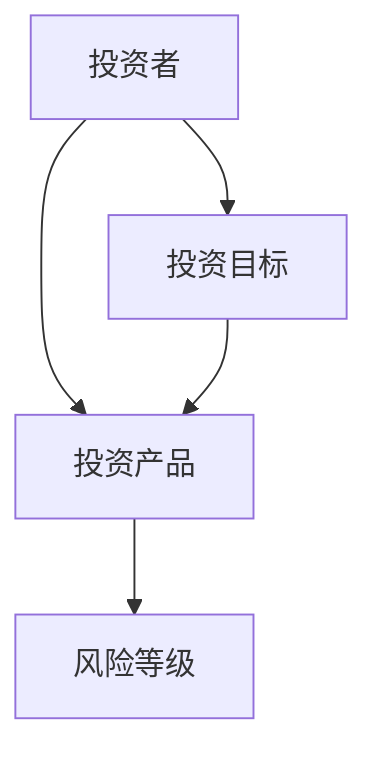
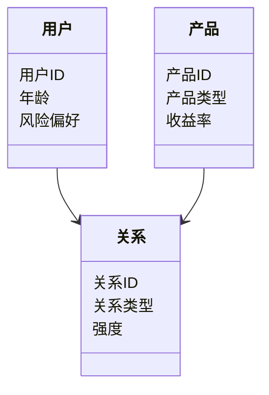
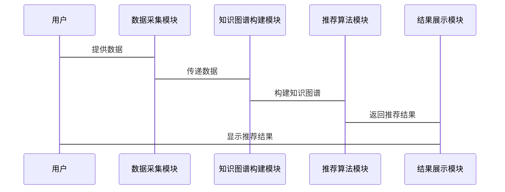

                 


# 构建基于知识图谱的金融产品推荐引擎

## 关键词：知识图谱，金融产品推荐，推荐系统，协同过滤，矩阵分解

## 摘要：本文详细探讨了如何利用知识图谱构建高效的金融产品推荐引擎。从背景介绍、核心概念到算法实现，再到系统架构设计和项目实战，全面解析了基于知识图谱的推荐系统。通过具体的数学模型和算法流程，展示了如何在金融领域应用知识图谱技术，提升推荐的准确性和智能化水平。

---

## 第1章：背景与基础

### 1.1 知识图谱的基本概念

#### 1.1.1 知识图谱的定义
知识图谱是一种将结构化数据和非结构化数据结合的语义网络，通过实体和关系的形式，构建一个可计算的知识库。实体是指现实世界中的具体事物或概念，如“投资者”、“投资产品”等；关系则是实体之间的关联，如“投资于”、“属于”。

#### 1.1.2 知识图谱的构建过程
构建知识图谱通常包括数据采集、实体识别、关系抽取和图谱构建等步骤。金融领域的知识图谱构建需要处理大量的金融数据，包括股票、基金、债券等产品的信息，以及市场趋势、经济指标等。

#### 1.1.3 知识图谱在金融领域的应用
在金融领域，知识图谱可以用于风险评估、投资建议和产品推荐。例如，通过分析投资者的历史交易行为，构建投资者的知识图谱，帮助推荐适合其风险偏好的金融产品。

### 1.2 推荐系统的概述

#### 1.2.1 推荐系统的定义
推荐系统是一种基于用户行为和偏好，提供个性化产品或服务的技术。在金融领域，推荐系统用于向投资者推荐适合其风险承受能力和投资目标的金融产品。

#### 1.2.2 推荐系统的分类
推荐系统主要分为基于协同过滤、基于内容的推荐、基于知识图谱的推荐等类型。协同过滤基于用户的相似性进行推荐，内容推荐基于产品的属性特征，而知识图谱推荐则利用知识图谱中的语义信息，提供更精准的推荐。

#### 1.2.3 金融产品推荐的特殊性
金融产品推荐需要考虑投资者的财务状况、风险偏好和投资目标，同时需要实时更新市场数据，确保推荐的准确性。

---

## 第2章：知识图谱的核心概念与属性

### 2.1 实体与关系的定义

#### 2.1.1 实体的定义与分类
在金融领域，实体可以是投资者、基金、股票、债券等。每个实体都有自己的属性，如投资者的年龄、风险偏好，基金的收益率、管理费用等。

#### 2.1.2 关系的定义与分类
关系描述实体之间的关联，如“投资者投资于某个基金”、“基金属于某个行业”。关系通常有方向性和权重，用于表示实体之间的关联强度。

### 2.2 知识图谱的属性特征对比

#### 2.2.1 实体属性对比表格

| 实体类型   | 属性                   | 示例值                   |
|------------|------------------------|--------------------------|
| 投资者     | 年龄                   | 30                      |
|            | 风险偏好              | 保守                   |
| 基金       | 基金类型              | 股票型                 |
|            | 管理费用              | 1.5%                   |

#### 2.2.2 关系属性对比表格

| 关系类型   | 属性                   | 示例值                   |
|------------|------------------------|--------------------------|
| 投资于     | 关系强度              | 0.85                   |
|            | 时间                  | 2023-01-01             |

#### 2.3 实体关系图的Mermaid流程图



---

## 第3章：构建知识图谱的算法

### 3.1 实体识别与提取

#### 3.1.1 基于规则的实体识别
使用预定义的规则从文本中提取实体。例如，从新闻中提取公司名称，可以使用公司名称的典型结构进行匹配。

#### 3.1.2 基于机器学习的实体识别
使用训练好的模型，如CRF（条件随机场）或BERT，进行实体识别。这些模型能够从上下文中学习到实体的特征，提高识别的准确性。

### 3.2 关系抽取

#### 3.2.1 基于规则的关系抽取
通过预定义的关系模板，识别文本中的关系。例如，识别“公司A收购公司B”这样的关系。

#### 3.2.2 基于深度学习的关系抽取
使用神经网络模型，如LSTM或Transformer，从上下文中学习关系的特征，进行关系抽取。

---

## 第4章：推荐算法原理

### 4.1 协同过滤算法

#### 4.1.1 基于用户的协同过滤
计算用户之间的相似度，推荐相似用户的喜欢的产品。例如，使用余弦相似度计算用户之间的相似度。

#### 4.1.2 基于物品的协同过滤
计算产品之间的相似度，推荐与用户喜欢的产品相似的产品。例如，计算基金的相似度，推荐相似的基金。

### 4.2 基于知识图谱的推荐算法

#### 4.2.1 知识图谱中的路径分析
通过分析知识图谱中的路径，找到与目标节点相关的节点。例如，从投资者出发，通过“投资目标”关系找到相关的金融产品。

#### 4.2.2 基于图的推荐算法
使用图的遍历算法，如BFS或DFS，从目标节点出发，遍历知识图谱，找到相关的节点。例如，从投资者出发，遍历其投资目标，找到相关的基金。

---

## 第5章：数学模型与公式

### 5.1 矩阵分解模型

#### 5.1.1 矩阵分解的数学模型
矩阵分解是一种常用的推荐算法，通过分解用户-产品矩阵，得到用户和产品的隐含特征。

公式：
$$ X = U \times V^T $$

其中，X是用户-产品矩阵，U是用户隐含特征矩阵，V是产品隐含特征矩阵。

#### 5.1.2 矩阵分解的优化目标
目标是最小化预测值和实际值的平方差，使用梯度下降或交替最小化方法进行优化。

公式：
$$ \min_{U, V} \sum_{i,j} (X_{ij} - (U_i \times V_j^T))^2 $$

---

## 第6章：系统架构设计

### 6.1 问题场景介绍
金融产品推荐系统需要处理大量的金融数据，包括用户行为数据、市场数据和产品数据。系统需要实时更新数据，确保推荐的准确性。

### 6.2 系统功能设计

#### 6.2.1 领域模型类图



#### 6.2.2 系统架构设计

```mermaid
container 金融产品推荐系统 {
    component 数据采集模块 {
        数据源：用户行为数据、产品数据
    }
    component 知识图谱构建模块 {
        实体识别、关系抽取
    }
    component 推荐算法模块 {
        协同过滤、知识图谱推荐
    }
    component 结果展示模块 {
        用户界面、推荐结果
    }
}
```

### 6.3 系统交互设计



---

## 第7章：项目实战

### 7.1 环境安装

#### 7.1.1 安装必要的库
安装Python、numpy、pandas、networkx、scikit-learn等库。

#### 7.1.2 数据集准备
准备金融产品数据和用户行为数据，如用户ID、产品ID、用户偏好等。

### 7.2 核心实现

#### 7.2.1 数据预处理
将数据清洗、归一化，处理缺失值和异常值。

#### 7.2.2 知识图谱构建
使用网络x库构建知识图谱，展示实体和关系。

#### 7.2.3 推荐算法实现
实现协同过滤和知识图谱推荐算法，比较两种算法的推荐效果。

### 7.3 项目总结

通过实际案例分析，比较不同算法的推荐效果，总结知识图谱推荐的优势和不足，提出改进方向。

---

## 第8章：最佳实践

### 8.1 小结
知识图谱和推荐系统的结合，能够提高金融产品推荐的准确性和智能化水平。

### 8.2 注意事项
- 数据质量对推荐效果影响重大，需要确保数据的准确性和完整性。
- 知识图谱的构建需要领域知识，需要与业务专家合作。
- 系统的实时性和可扩展性是需要考虑的重要因素。

### 8.3 拓展阅读
推荐阅读相关领域的书籍和论文，如《集体智慧编程》和《图谱知识表示与推理》。

---

以上是构建基于知识图谱的金融产品推荐引擎的详细目录和内容概述，每个章节都深入探讨了相关的核心概念和实现细节，帮助读者全面理解和应用这一技术。

