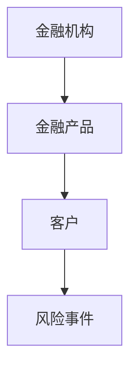

                 


# 《构建基于知识图谱的金融风险关联网络动态预警系统》

> **关键词**：知识图谱，金融风险，关联网络，动态预警，系统构建，算法设计

> **摘要**：本文详细探讨了如何利用知识图谱构建金融风险关联网络动态预警系统。通过分析金融风险的复杂性和关联性，提出了一种基于知识图谱的解决方案，结合风险传播模型和动态预警算法，构建了完整的系统架构。文章从问题背景、核心概念、算法原理到系统实现，层层递进，为金融风险预警提供了一种高效、智能的解决方案。

---

## 正文

### 第一部分: 背景介绍

#### 第1章: 问题背景与需求分析

##### 1.1 问题背景
- **1.1.1 金融风险的复杂性与关联性**  
  金融市场的复杂性使得风险具有高度的关联性，单个风险事件可能引发连锁反应。传统的基于单一数据源的预警系统难以捕捉这种复杂性。

- **1.1.2 知识图谱在金融领域的应用潜力**  
  知识图谱能够将分散的金融数据关联起来，构建一个全局化的金融知识网络，为风险预警提供支持。

- **1.1.3 当前金融风险预警系统的局限性**  
  当前系统多基于统计分析，难以处理非结构化数据，且缺乏对风险关联性的动态分析能力。

##### 1.2 问题描述
- **1.2.1 金融风险关联网络的核心问题**  
  如何构建一个能够反映金融市场中各主体之间关联性的网络模型。

- **1.2.2 动态预警系统的必要性**  
  需要一个能够实时更新和动态调整的预警系统，以应对金融市场中不断变化的风险因素。

- **1.2.3 知识图谱在风险预警中的作用**  
  知识图谱可以整合多源异构数据，帮助发现隐藏的风险关联关系。

##### 1.3 问题解决思路
- **1.3.1 知识图谱构建的基本思路**  
  通过数据清洗、实体识别和关系抽取，构建金融领域的知识图谱。

- **1.3.2 风险关联网络的构建方法**  
  基于知识图谱，利用图论算法构建风险关联网络。

- **1.3.3 动态预警系统的实现路径**  
  结合风险传播模型和动态图算法，实现风险的实时预警。

##### 1.4 边界与外延
- **1.4.1 系统的边界定义**  
  限定在金融领域，不涉及其他行业的风险预警。

- **1.4.2 系统的外延与扩展性**  
  知识图谱可以扩展到更多金融场景，如 fraud detection 和 credit risk assessment。

- **1.4.3 相关领域的关联性分析**  
  金融风险与经济指标、政策变化等因素密切相关。

##### 1.5 核心要素与概念结构
- **1.5.1 核心概念的组成**  
  实体（Entity）、关系（Relation）、属性（Attribute）是知识图谱的核心要素。

- **1.5.2 概念之间的关系**  
  实体之间通过关系连接，形成复杂的关联网络。

- **1.5.3 概念结构的可视化**  
  使用Mermaid图展示核心概念之间的关系。

---

### 第2章: 核心概念与联系

#### 2.1 知识图谱的基本原理
- **2.1.1 知识图谱的定义与特点**  
  知识图谱是一种以图结构表示知识的语义网络，具有语义丰富、表达能力强的特点。

- **2.1.2 知识图谱的构建流程**  
  包括数据收集、数据清洗、实体识别、关系抽取和图谱存储。

- **2.1.3 知识图谱的存储与表示**  
  使用图数据库（如Neo4j）存储，采用RDF或JSON-LD格式表示。

#### 2.2 风险关联网络的构建
- **2.2.1 风险关联网络的定义**  
  描述金融市场中各主体之间风险传播关系的网络结构。

- **2.2.2 风险关联网络的构建方法**  
  基于知识图谱的实体关系，利用图论算法构建关联网络。

- **2.2.3 风险关联网络的属性特征对比**  
  通过表格对比不同关联网络的特征，如权重、方向性等。

#### 2.3 动态预警系统的工作原理
- **2.3.1 动态预警系统的定义**  
  一种能够实时更新和动态调整的预警系统。

- **2.3.2 动态预警系统的组成部分**  
  包括数据采集模块、知识图谱构建模块、风险传播模型和预警模块。

- **2.3.3 动态预警系统的运行机制**  
  基于实时数据更新，持续优化风险关联网络，实现动态预警。

#### 2.4 核心概念的ER实体关系图


---

### 第3章: 算法原理讲解

#### 3.1 知识图谱构建算法
- **3.1.1 知识图谱构建的流程**  
  数据预处理 → 实体识别 → 关系抽取 → 图谱存储。

- **3.1.2 基于规则的实体识别算法**  
  使用正则表达式或本体规则进行实体识别。

- **3.1.3 基于深度学习的关系抽取算法**  
  使用BERT或Transformer模型进行关系抽取。

#### 3.2 风险传播模型
- **3.2.1 风险传播模型的定义**  
  描述风险在关联网络中的传播过程。

- **3.2.2 风险传播模型的数学公式**  
  $$ R_i = \alpha \cdot \sum_{j} w_{ij} R_j + \beta \cdot S_i $$

- **3.2.3 风险传播模型的实现步骤**  
  初始化风险值 → 迭代计算 → 输出结果。

#### 3.3 动态预警算法
- **3.3.1 动态预警算法的定义**  
  基于实时数据更新的风险预警算法。

- **3.3.2 动态预警算法的数学模型**  
  $$ W_{t} = \theta \cdot W_{t-1} + (1-\theta) \cdot \Delta W $$

- **3.3.3 动态预警算法的实现流程**  
  数据采集 → 更新关联网络 → 计算风险值 → 发出预警信号。

---

### 第4章: 系统分析与架构设计

#### 4.1 问题场景介绍
- **4.1.1 金融市场的复杂性**  
  需要实时监控和预警金融风险。

- **4.1.2 系统的目标与功能**  
  构建一个智能、动态的金融风险预警系统。

#### 4.2 系统功能设计
- **4.2.1 领域模型设计**  
  使用Mermaid类图展示系统功能模块。

#### 4.3 系统架构设计
- **4.3.1 架构图展示**  
  使用Mermaid图展示系统架构。

#### 4.4 系统接口设计
- **4.4.1 接口定义**  
  API接口的设计与实现。

#### 4.5 系统交互流程
- **4.5.1 交互流程图**  
  使用Mermaid序列图展示系统交互流程。

---

### 第5章: 项目实战

#### 5.1 环境安装
- **5.1.1 系统环境要求**  
  操作系统、Python版本、依赖库安装。

#### 5.2 核心代码实现
- **5.2.1 知识图谱构建代码**  
  ```python
  def build_kg():
      # 数据处理和图谱构建代码
  ```

- **5.2.2 风险传播模型代码**  
  ```python
  def risk_propagation():
      # 风险传播算法实现
  ```

- **5.2.3 动态预警算法代码**  
  ```python
  def dynamic预警():
      # 动态预警算法实现
  ```

#### 5.3 代码解读与分析
- **5.3.1 代码功能分析**  
  每个模块的功能和实现细节。

#### 5.4 案例分析
- **5.4.1 实际案例分析**  
  通过具体案例展示系统的应用效果。

#### 5.5 项目小结
- **5.5.1 项目总结**  
  成功构建了一个基于知识图谱的金融风险关联网络动态预警系统。

---

### 第六章: 总结与展望

#### 6.1 最佳实践
- **6.1.1 关键技术总结**  
  知识图谱构建、风险传播模型、动态预警算法。

#### 6.2 小结
- **6.2.1 系统构建的意义**  
  提供了一种高效、智能的金融风险预警解决方案。

#### 6.3 注意事项
- **6.3.1 实际应用中的注意事项**  
  数据隐私、模型鲁棒性、系统可扩展性。

#### 6.4 拓展阅读
- **6.4.1 相关领域研究**  
  知识图谱、图神经网络、金融风险分析。

---

**本文通过系统地分析和设计，构建了一个基于知识图谱的金融风险关联网络动态预警系统，为金融行业的风险预警提供了新的思路和解决方案。**

