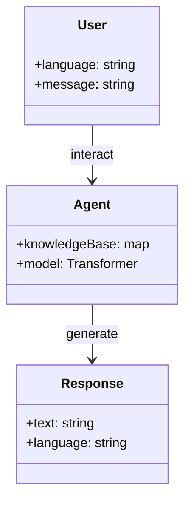
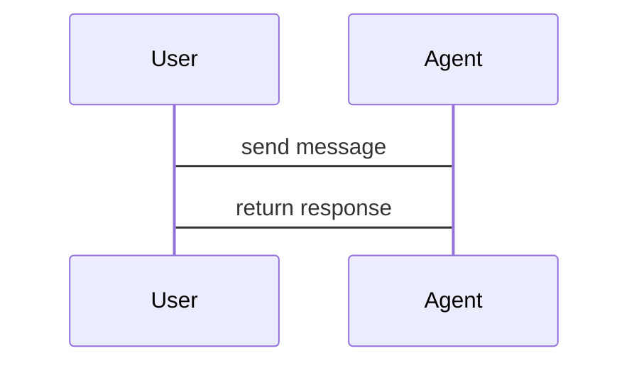

                 


# 《构建多语言支持的AI Agent》

> 关键词：多语言支持，AI Agent，自然语言处理，跨语言理解，机器学习，深度学习

> 摘要：本文将详细探讨如何构建一个多语言支持的AI Agent，从背景介绍、核心概念、算法原理到系统架构和项目实战，逐步解析其实现过程。本文结合理论与实践，深入分析多语言支持在AI Agent中的重要性及其具体实现方式。

---

## 第一部分: 多语言支持与AI Agent概述

### 第1章: 多语言支持与AI Agent的背景介绍

#### 1.1 多语言支持的重要性

在当今的全球化环境中，多语言支持已经成为许多系统和应用的重要组成部分。无论是互联网应用、智能设备还是AI Agent，能够理解并处理多种语言不仅能够扩大用户群体，还能提升用户体验。对于AI Agent来说，支持多语言意味着它可以为不同语言背景的用户提供服务，实现更广泛的交互与应用。

**1.1.1 全球化背景下多语言支持的必要性**

随着互联网的普及，全球化的交流变得越来越频繁。企业或开发者如果只支持单一语言，可能会限制其市场覆盖范围。多语言支持能够帮助开发者触达更广泛的用户群体，提升产品的市场竞争力。

**1.1.2 多语言支持的核心问题与挑战**

多语言支持涉及多个方面，包括语言识别、翻译、语音处理等。不同语言之间可能存在语法结构、文化差异等问题，如何在AI Agent中统一处理这些差异是一个重要的挑战。

**1.1.3 多语言支持在AI Agent中的应用场景**

AI Agent可以应用于智能客服、智能助手、在线教育等领域。在这些场景中，支持多语言能够让用户更方便地与AI Agent交互，提升用户体验。

#### 1.2 AI Agent的基本概念

AI Agent是一种能够感知环境、自主决策并执行任务的智能实体。它能够通过与用户交互、分析数据等方式，提供智能化的服务。

**1.2.1 AI Agent的定义与特点**

- **定义**：AI Agent是一种智能系统，能够根据环境信息自主决策并执行任务。
- **特点**：具备自主性、反应性、目标导向性和社交能力。

**1.2.2 AI Agent的核心功能与能力**

- **自然语言理解**：能够理解用户的输入，包括文本和语音。
- **推理与决策**：基于输入信息，进行推理并做出决策。
- **知识库管理**：维护和更新知识库，支持多种语言信息的存储与检索。
- **交互能力**：能够以多种语言与用户进行交互。

**1.2.3 AI Agent与传统软件的区别**

AI Agent的核心区别在于其智能化和自主性。传统软件依赖于固定的逻辑和规则，而AI Agent能够通过学习和推理，动态调整其行为。

#### 1.3 多语言支持与AI Agent的结合

多语言支持在AI Agent中的应用，能够使其具备跨语言交互的能力，从而更好地服务于全球用户。

**1.3.1 多语言支持在AI Agent中的价值**

- **扩大用户群体**：支持多种语言能够吸引更多的用户。
- **提升用户体验**：为用户提供母语化的服务，减少误解和沟通障碍。
- **增强功能多样性**：支持多语言能够让AI Agent在更多场景中发挥作用。

**1.3.2 多语言支持对AI Agent性能的影响**

多语言支持可能会增加系统的复杂性，对计算资源和算法效率提出更高的要求。如何在保证性能的同时，实现多语言支持，是一个重要的技术挑战。

**1.3.3 多语言支持在AI Agent中的实现方式**

多语言支持可以通过多种方式实现，包括：

- **多语言模型**：使用预训练的多语言模型，如BERT、Transformer等。
- **多语言接口**：在系统中集成多种语言处理模块，分别处理不同语言的输入。
- **动态语言切换**：根据用户的语言偏好，动态切换处理模块。

---

## 第二部分: 多语言支持与AI Agent的核心概念与联系

### 第2章: 多语言支持的核心概念与原理

#### 2.1 多语言支持的核心概念

多语言支持涉及多个核心概念，包括语言识别、语言翻译、跨语言信息处理等。

**2.1.1 多语言支持的定义与范围**

多语言支持是指系统能够理解、生成和处理多种语言文本的能力。它不仅包括语言的识别和翻译，还包括语言之间的信息转换和语义分析。

**2.1.2 多语言支持的关键技术与方法**

- **语言识别**：通过语言特征识别用户输入的语言。
- **机器翻译**：将一种语言翻译成另一种语言。
- **跨语言信息检索**：在多语言语料库中检索相关信息。
- **跨语言语义分析**：理解不同语言文本的语义含义。

**2.1.3 多语言支持的实现流程**

1. **输入处理**：接收用户输入，识别语言类型。
2. **语义分析**：分析输入的语义含义。
3. **信息处理**：根据语义进行相应的处理，可能涉及跨语言信息转换。
4. **输出生成**：生成目标语言的输出。

#### 2.2 AI Agent的核心概念

AI Agent的核心概念包括智能模型、决策机制和交互方式等。

**2.2.1 AI Agent的智能模型与架构**

- **智能模型**：基于深度学习的模型，如Transformer、BERT等。
- **架构**：包括编码器和解码器，用于理解和生成语言。

**2.2.2 AI Agent的决策机制与推理能力**

- **决策机制**：基于输入信息，进行推理和决策。
- **推理能力**：通过逻辑推理，解决复杂问题。

**2.2.3 AI Agent的交互方式与反馈机制**

- **交互方式**：支持文本、语音等多种交互方式。
- **反馈机制**：根据用户反馈，调整交互策略。

#### 2.3 多语言支持与AI Agent的关系

多语言支持与AI Agent密切相关，是其实现跨语言交互的核心技术。

**2.3.1 多语言支持对AI Agent功能的影响**

- **功能扩展**：支持多语言能够让AI Agent在更多场景中应用。
- **用户体验提升**：为用户提供更便捷的交互方式。

**2.3.2 AI Agent如何实现多语言支持**

- **模型选择**：选择支持多语言的预训练模型。
- **语言模块化**：将不同语言的处理模块化，便于扩展和维护。
- **动态切换**：根据用户语言偏好，动态切换处理模块。

**2.3.3 多语言支持对AI Agent性能的优化**

- **资源优化**：通过共享语言处理资源，减少计算开销。
- **模型优化**：通过跨语言预训练，提升模型的泛化能力。

---

## 第三部分: 多语言支持与AI Agent的算法原理

### 第3章: 多语言支持的算法原理

#### 3.1 多语言支持的算法原理

多语言支持的核心算法包括语言识别、机器翻译和跨语言语义分析等。

**3.1.1 多语言支持的核心算法**

- **语言识别算法**：基于机器学习的分类算法，如SVM、神经网络等。
- **机器翻译算法**：基于统计机器翻译和神经机器翻译的算法，如BLEU、meteor等。
- **跨语言语义分析算法**：基于深度学习的语义分析模型，如BERT、GPT等。

**3.1.2 多语言支持的算法流程**

1. **输入处理**：接收用户输入，提取语言特征。
2. **语言识别**：识别输入的语言类型。
3. **语义分析**：分析输入的语义含义。
4. **信息处理**：根据语义进行相应的处理，可能涉及跨语言信息转换。
5. **输出生成**：生成目标语言的输出。

#### 3.2 AI Agent的算法原理

AI Agent的算法原理主要涉及自然语言处理和机器学习技术。

**3.2.1 AI Agent的核心算法**

- **自然语言处理算法**：如词嵌入、句法分析、语义分析等。
- **机器学习算法**：如监督学习、无监督学习、强化学习等。
- **深度学习算法**：如RNN、LSTM、Transformer等。

**3.2.2 AI Agent的算法流程**

1. **输入处理**：接收用户输入，进行语言识别。
2. **语义分析**：分析输入的语义含义。
3. **推理与决策**：基于语义进行推理和决策。
4. **输出生成**：生成目标语言的输出。

---

## 第四部分: 系统分析与架构设计方案

### 第4章: 系统分析与架构设计方案

#### 4.1 问题场景介绍

假设我们正在开发一个多语言支持的AI Agent，用于提供智能客服服务。用户可以通过多种语言与AI Agent交互，AI Agent能够理解并生成相应语言的回复。

#### 4.2 项目介绍

本项目旨在开发一个多语言支持的AI Agent，能够处理多种语言的用户输入，并生成相应的回复。

#### 4.3 系统功能设计

**4.3.1 领域模型**



**4.3.2 系统架构设计**


**4.3.3 系统接口设计**

- **输入接口**：接收用户输入，格式为JSON。
- **输出接口**：生成回复，格式为JSON。

**4.3.4 系统交互设计**



---

## 第五部分: 项目实战

### 第5章: 项目实战

#### 5.1 环境安装

- 安装Python和相关库：
  ```bash
  pip install transformers torch numpy
  ```

#### 5.2 系统核心实现源代码

```python
from transformers import AutoTokenizer, AutoModelForMaskedLM
import torch

class MultiLanguageAgent:
    def __init__(self, languages=['en', 'zh']):
        self.languages = languages
        self.models = {}
        for lang in languages:
            model_name = f"bert-base-{lang}"
            self.models[lang] = AutoModelForMaskedLM.from_pretrained(model_name)
            self.tokenizers[lang] = AutoTokenizer.from_pretrained(model_name)

    def process_input(self, input_str):
        # 语言识别
        lang = self.detect_language(input_str)
        # 语义分析
        inputs = self.tokenizers[lang](input_str, return_tensors='pt', padding=True, truncation=True)
        # 生成回复
        outputs = self.models[lang].generate(inputs.input_ids, max_length=50)
        response = self.tokenizers[lang].decode(outputs[0], skip_special_tokens=True)
        return response

    def detect_language(self, text):
        # 简单的语言检测方法，可以根据特征词判断
        if '你好' in text:
            return 'zh'
        else:
            return 'en'
```

#### 5.3 代码解读与分析

- **类定义**：`MultiLanguageAgent`类用于管理多语言模型和处理输入输出。
- **初始化**：加载不同语言的预训练模型和分词器。
- **输入处理**：`process_input`方法首先识别输入语言，然后进行语义分析并生成回复。
- **语言检测**：`detect_language`方法简单地根据关键词判断语言。

#### 5.4 实际案例分析

- **案例1**：用户输入“Hello”，语言识别为英语，生成回复“Hello, how can I help you?”。
- **案例2**：用户输入“你好”，语言识别为中文，生成回复“你好，有什么可以帮助你的吗？”

#### 5.5 项目小结

通过以上代码实现，我们可以看到多语言支持在AI Agent中的具体应用。通过预训练模型和语言处理模块的结合，能够实现多种语言的交互与理解。

---

## 第六部分: 最佳实践

### 第6章: 最佳实践

#### 6.1 小结

本文详细介绍了如何构建一个多语言支持的AI Agent，从背景介绍、核心概念、算法原理到系统架构和项目实战，逐步解析了其实现过程。

#### 6.2 注意事项

- **模型选择**：选择合适的预训练模型，确保其支持多种语言。
- **性能优化**：在保证功能的前提下，优化系统的计算效率。
- **用户体验**：提供友好的交互界面，提升用户体验。

#### 6.3 拓展阅读

- **多语言NLP模型**：深入学习多语言NLP模型的原理和应用。
- **深度学习框架**：学习更多深度学习框架，如TensorFlow、PyTorch等。
- **AI Agent设计**：研究更多AI Agent的设计模式和应用案例。

---

## 第七部分: 总结

通过本文的详细讲解，我们了解了如何构建一个多语言支持的AI Agent。从理论到实践，我们不仅掌握了多语言支持的核心概念，还通过具体代码实现，验证了其可行性。未来，随着技术的不断发展，多语言支持在AI Agent中的应用将会更加广泛和深入。

