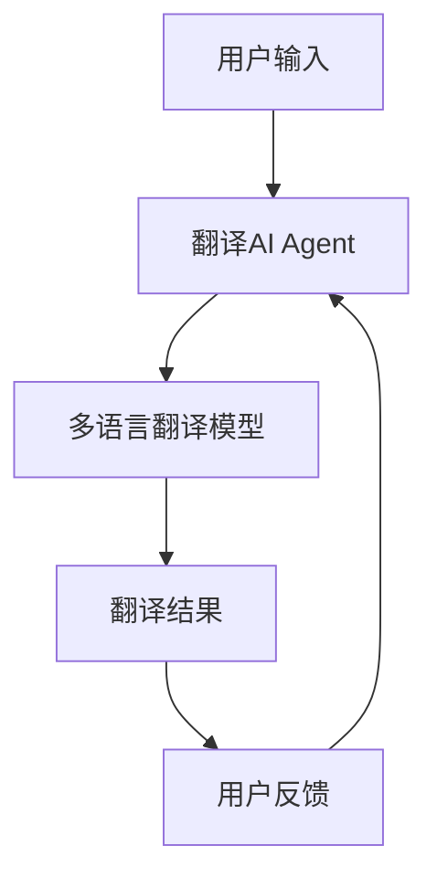
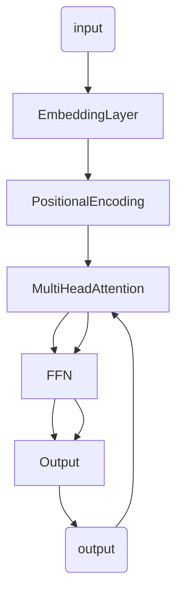
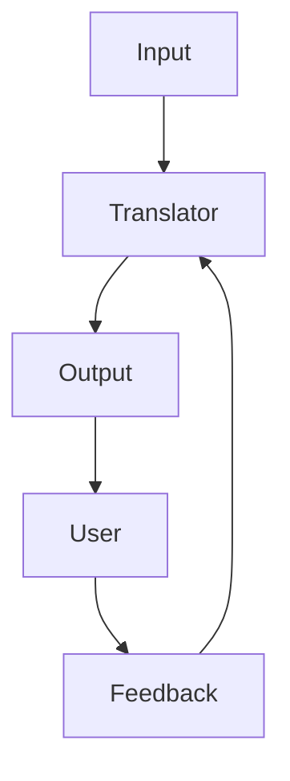
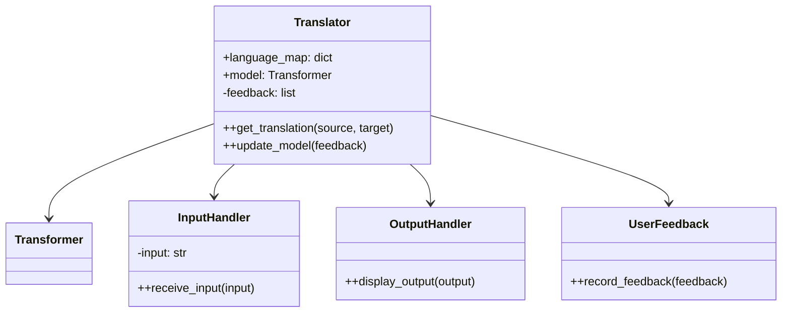
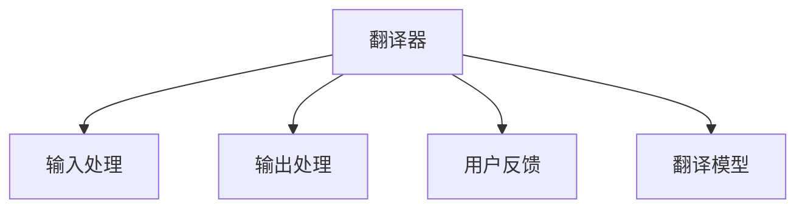
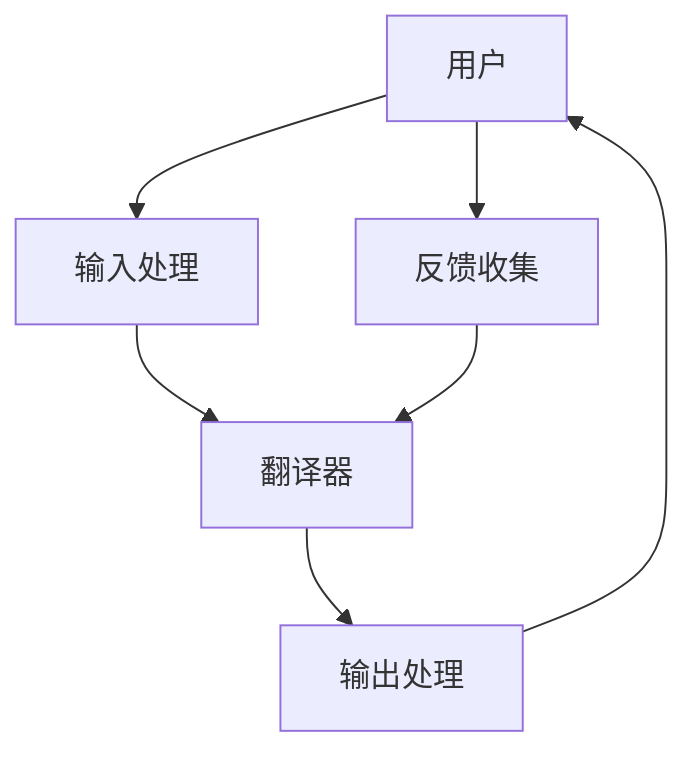

                 


# 构建多语言翻译AI Agent

> 关键词：多语言翻译、AI Agent、自然语言处理、深度学习、机器翻译

> 摘要：本文详细探讨了构建一个多语言翻译AI Agent的技术细节，从背景介绍、核心概念、算法原理、系统架构到项目实战，再到最佳实践，全面解析了实现一个高效、准确的多语言翻译AI Agent所需的各个环节和关键点。

---

# 第一部分: 多语言翻译AI Agent的背景与核心概念

## 第1章: 多语言翻译技术的发展与挑战

### 1.1 多语言翻译的背景与现状

#### 1.1.1 多语言翻译的需求背景
随着全球化进程的加速，跨语言交流的需求日益增长。在商业、教育、旅游等领域，多语言翻译技术成为不可或缺的工具。传统的翻译工具往往局限于单语言对单语言的翻译，无法满足复杂场景下的多语言交互需求。

#### 1.1.2 当前多语言翻译技术的发展现状
近年来，基于深度学习的神经机器翻译（NMT）技术取得了显著进展。主流的多语言翻译系统如Google Translate、Microsoft Translator等，已经能够支持数十种语言的翻译，并且通过不断优化模型结构和引入大规模数据，翻译质量不断提升。

#### 1.1.3 多语言翻译面临的挑战与痛点
尽管技术进步显著，但多语言翻译仍面临诸多挑战：  
1. **数据稀疏性**：某些语言的训练数据不足，导致翻译效果不稳定。  
2. **跨语言理解困难**：不同语言的语法结构和文化差异使得直接翻译难以准确传达原意。  
3. **实时性要求**：在实时对话或交互场景中，翻译系统需要快速响应，这对计算资源和算法效率提出了更高要求。

---

### 1.2 AI Agent的基本概念与特点

#### 1.2.1 AI Agent的定义与核心特征
AI Agent（人工智能代理）是指能够感知环境、理解用户需求并采取行动以实现目标的智能系统。AI Agent具有以下核心特征：  
1. **自主性**：能够在没有外部干预的情况下运行。  
2. **反应性**：能够实时感知环境并做出响应。  
3. **目标导向性**：具备明确的目标，并采取行动以实现目标。  
4. **学习能力**：能够通过经验改进自身性能。

#### 1.2.2 多语言翻译AI Agent的特殊性
多语言翻译AI Agent是一种专门用于跨语言交互的智能代理。它不仅需要理解多种语言，还需要在不同语言之间建立语义桥梁，确保翻译的准确性和流畅性。

#### 1.2.3 多语言翻译AI Agent的应用场景
1. **实时对话翻译**：在跨国会议、视频通话等场景中提供实时翻译服务。  
2. **多语言内容生成**：帮助用户快速生成多种语言的文本内容。  
3. **跨语言信息检索**：在多语言环境下，帮助用户查找所需信息。  

---

## 第2章: 多语言翻译AI Agent的核心概念与联系

### 2.1 多语言翻译技术的核心原理

#### 2.1.1 翻译的基本原理
翻译的本质是将源语言的文本转换为目标语言的文本，同时保持原文的语义和意图。传统翻译方法依赖于语言学规则和词典，而现代翻译技术则更多依赖于统计模型和深度学习模型。

#### 2.1.2 多语言翻译的关键技术
多语言翻译的关键技术包括：  
1. **跨语言对齐**：在不同语言之间建立语义对齐关系。  
2. **联合训练**：通过多语言数据联合训练模型，提升跨语言理解能力。  
3. **零样本翻译**：在没有特定语言对训练数据的情况下，利用通用语言模型进行翻译。

#### 2.1.3 AI Agent在翻译中的作用
AI Agent在多语言翻译中扮演着“中间人”的角色，它负责接收用户输入、调用翻译模型、处理结果并反馈给用户。其核心作用包括：  
1. **接口整合**：将多种翻译技术整合到一个统一的接口中。  
2. **语境理解**：通过上下文分析用户意图，选择最合适的翻译策略。  
3. **实时交互**：在动态场景中快速响应用户需求。

---

### 2.2 多语言翻译AI Agent的核心要素

#### 2.2.1 自然语言处理技术
自然语言处理（NLP）是多语言翻译的基础。AI Agent需要具备分词、句法分析、语义理解等NLP能力，才能准确理解用户的输入。

#### 2.2.2 翻译模型的构建与训练
多语言翻译模型需要同时处理多种语言，常用的技术包括：  
1. **多任务学习**：在统一模型中同时训练多种语言的翻译任务。  
2. **语言无关模型**：通过共享跨语言特征，减少对语言特化的依赖。  

#### 2.2.3 AI Agent的交互机制
AI Agent需要通过自然的对话方式与用户交互。其交互机制包括：  
1. **用户意图识别**：通过上下文理解用户的翻译需求。  
2. **多轮对话支持**：在复杂场景中，能够保持对话的连贯性。  
3. **反馈机制**：根据用户的反馈调整翻译策略。  

---

### 2.3 核心概念对比与联系

#### 2.3.1 传统机器翻译与AI Agent的区别
| **对比维度** | **传统机器翻译** | **AI Agent** |
|--------------|------------------|--------------|
| 核心任务      | 纯粹翻译          | 翻译+交互     |
| 实时性        | 较低             | 高            |
| 智能性        | 依赖规则         | 学习驱动      |

#### 2.3.2 基于规则的翻译与深度学习翻译的对比
| **对比维度** | **基于规则** | **基于深度学习** |
|--------------|---------------|-----------------|
| 翻译质量      | 稳定但受限     | 更灵活，可优化   |
| 训练数据      | 需大量语言学知识| 需大量真实数据   |
| 适应性        | 较差           | 较强            |

#### 2.3.3 多语言翻译AI Agent的系统架构


---

## 第3章: 多语言翻译AI Agent的算法原理

### 3.1 翻译模型的算法原理

#### 3.1.1 神经机器翻译的原理
神经机器翻译（NMT）基于编码器-解码器架构，通过深度学习模型直接将源语言映射为目标语言。其核心思想是将翻译问题转化为序列到序列的预测问题。

#### 3.1.2 Transformer模型的结构与特点
Transformer模型由编码器和解码器组成，通过自注意力机制捕捉文本中的长距离依赖关系。其特点包括：  
1. **全局上下文感知**：能够理解整个文本的语义。  
2. **并行计算**：适合大规模数据训练。  
3. **可扩展性**：适用于多种语言的翻译任务。  

#### 3.1.3 编码器-解码器架构的实现细节


---

### 3.2 基于深度学习的翻译算法

#### 3.2.1 Transformer模型的数学公式
编码器的自注意力机制公式如下：
$$
\text{Attention}(Q, K, V) = \text{softmax}\left(\frac{QK^T}{\sqrt{d_k}}\right)V
$$

解码器的自注意力机制公式如下：
$$
\text{Attention}(Q, K, V) = \text{softmax}\left(\frac{QK^T}{\sqrt{d_k}}\right)V
$$

其中，$Q$、$K$、$V$分别为查询、键、值向量，$d_k$为键的维度。

---

#### 3.2.2 注意力机制的实现原理
注意力机制通过计算输入序列中每个词对当前词的重要性，从而生成加权后的表示。其计算过程包括：  
1. **计算键、查询和值向量**：通过全连接层生成$Q$、$K$、$V$。  
2. **计算相似度分数**：通过$QK^T$计算相似度，并进行归一化。  
3. **加权求和**：根据相似度分数对$V$进行加权求和，得到最终的注意力表示。  

---

#### 3.2.3 多语言翻译的模型扩展方法
多语言翻译可以通过以下方式扩展：  
1. **共享参数**：在编码器和解码器中共享跨语言特征。  
2. **语言嵌入**：为每种语言添加语言嵌入向量。  
3. **联合训练**：在多语言数据上进行联合训练，提升模型的跨语言理解能力。  

---

### 3.3 翻译算法的优化与改进

#### 3.3.1 增量式训练方法
增量式训练允许模型在新数据上逐步更新，避免了重新训练整个模型的高计算成本。

#### 3.3.2 多任务学习的优化策略
通过多任务学习，模型可以在翻译的同时学习其他任务（如语言识别、语义理解），从而提升整体性能。

#### 3.3.3 模型压缩与轻量化技术
通过剪枝、知识蒸馏等技术，可以将大型模型压缩为更小的模型，提升运行效率。

---

## 第4章: 多语言翻译AI Agent的系统架构设计

### 4.1 系统架构的整体设计

#### 4.1.1 系统功能模块划分
系统主要模块包括：  
1. **输入模块**：接收用户输入。  
2. **翻译模块**：调用翻译模型进行翻译。  
3. **输出模块**：将翻译结果反馈给用户。  
4. **反馈模块**：根据用户反馈优化翻译策略。  

#### 4.1.2 模块之间的交互关系


#### 4.1.3 系统的可扩展性设计
系统设计需预留接口，便于新增语言支持或优化算法。

---

### 4.2 系统功能设计

#### 4.2.1 多语言支持模块
多语言支持模块负责识别用户输入的语言，并选择合适的翻译模型。

#### 4.2.2 翻译核心算法模块
翻译核心算法模块基于Transformer模型，支持多种语言的翻译任务。

#### 4.2.3 用户交互界面
用户交互界面负责接收用户输入、显示翻译结果，并收集用户反馈。

---

### 4.3 系统架构的详细设计

#### 4.3.1 领域模型（类图）


---

### 4.4 系统架构图



---

### 4.5 系统接口设计

#### 4.5.1 翻译接口
```python
def translate(source_text, target_language):
    # 调用翻译模型进行翻译
    return translated_text
```

#### 4.5.2 反馈接口
```python
def record_feedback(feedback):
    # 记录用户反馈
    pass
```

---

### 4.6 系统交互流程图



---

## 第5章: 项目实战

### 5.1 环境安装与配置

#### 5.1.1 安装Python环境
```bash
python --version
pip install --upgrade pip
```

#### 5.1.2 安装依赖库
```bash
pip install transformers
pip install pymermaid
```

---

### 5.2 核心代码实现

#### 5.2.1 加载预训练模型
```python
from transformers import AutoTokenizer, AutoModelForSeq2Seq

tokenizer = AutoTokenizer.from_pretrained("facebook/m2m-large-50")
model = AutoModelForSeq2Seq.from_pretrained("facebook/m2m-large-50")
```

#### 5.2.2 翻译函数实现
```python
def translate(text, target_language):
    inputs = tokenizer(text, return_tensors="np")
    outputs = model.generate(inputs.input_ids, max_length=50, num_beams=5, forced_bos_token_id=tokenizer.get_lang_id(target_language))
    return tokenizer.decode(outputs[0], skip_special_tokens=True)
```

---

### 5.3 代码解读与分析

#### 5.3.1 翻译函数解读
1. **加载预训练模型**：使用Facebook开源的M2M模型，支持多种语言的翻译。  
2. **文本编码**：将输入文本编码为模型可接受的格式。  
3. **模型推理**：调用模型生成目标语言的文本。  
4. **结果解码**：将模型输出解码为可读的文本。  

---

### 5.4 案例分析与详细讲解

#### 5.4.1 简单翻译案例
```python
input_text = "Hello, how are you?"
target_language = "es"  # Spanish
result = translate(input_text, target_language)
print(result)  # "Hola, ¿cómo estás?"
```

#### 5.4.2 复杂场景案例
```python
input_text = "The quick brown fox jumps over the lazy dog."
target_language = "fr"  # French
result = translate(input_text, target_language)
print(result)  # "Le renard brun rapide saute sur le chien paresseux."
```

---

## 第6章: 最佳实践、小结与拓展阅读

### 6.1 最佳实践

#### 6.1.1 数据预处理
- 确保输入文本的格式一致。  
- 处理特殊字符和语料库中的噪声。  

#### 6.1.2 模型优化
- 使用更大的训练数据集。  
- 调整超参数（如学习率、批量大小）以优化模型性能。  

#### 6.1.3 系统性能优化
- 优化代码结构，减少计算开销。  
- 使用分布式计算加速训练过程。  

---

### 6.2 小结

构建一个多语言翻译AI Agent是一个复杂但极具挑战性的任务。从算法原理到系统架构，每一步都需要精心设计和优化。通过整合自然语言处理技术、深度学习算法和高效的系统架构，我们可以构建出一个高效、准确的多语言翻译系统。

---

### 6.3 注意事项

- **数据隐私**：处理用户输入时，需注意数据隐私和安全。  
- **模型鲁棒性**：确保模型在面对异常输入时能够稳定运行。  
- **性能优化**：在实时场景中，需特别关注系统的响应速度和资源消耗。  

---

### 6.4 拓展阅读

1. **论文推荐**：  
   - "Attention Is All You Need"（Vaswani et al., 2017）  
   - "Massively Multilingual Neural Networks for Zero-Shot Cross-Lingual Language Modeling"（Lample & Conneau, 2019）  

2. **工具与库**：  
   - Hugging Face Transformers库：https://huggingface.co/transformers/  
   - PyTorch：https://pytorch.org/  

---

# 第七章: 总结与展望

多语言翻译AI Agent的构建不仅仅是技术的实现，更是一个不断优化和创新的过程。通过深入理解翻译技术的核心原理，合理设计系统架构，并结合实际应用场景进行优化，我们可以逐步构建出更加智能、高效的多语言翻译系统。未来，随着AI技术的不断发展，多语言翻译AI Agent将在更多领域发挥重要作用，为人类的跨语言交流提供更加便捷的服务。

