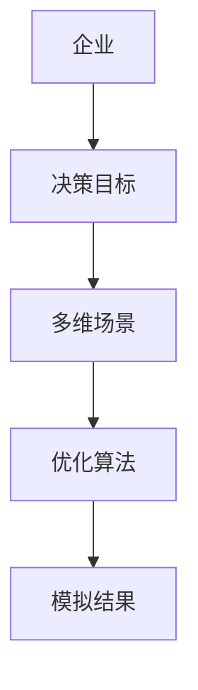
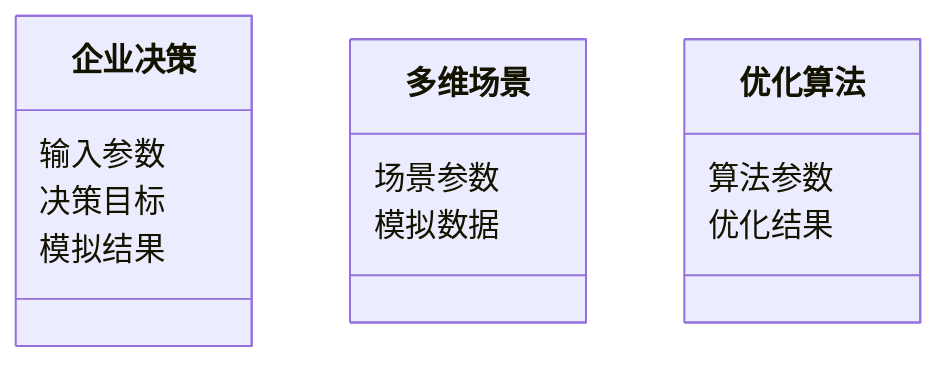
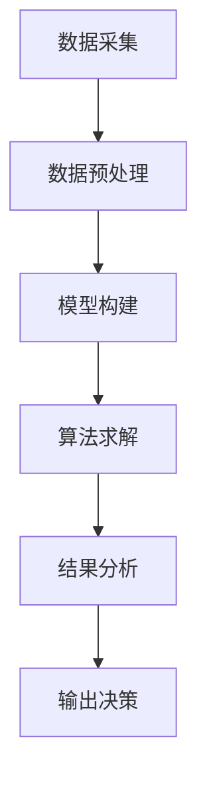

                 


# 构建智能企业决策支持系统：多维场景模拟与优化

---

## 关键词：
智能企业决策支持系统、多维场景模拟、优化算法、企业决策、系统架构

---

## 摘要：
本文详细探讨了构建智能企业决策支持系统的多维场景模拟与优化方法。通过分析传统企业决策的局限性，提出基于智能化技术的解决方案，并重点介绍了多维场景模拟的数学模型、优化算法的实现原理以及系统架构设计。结合实际案例，展示了如何利用遗传算法等优化技术实现企业决策的多维度模拟与优化，最终为企业提供高效、可靠的决策支持。

---

# 第一部分：背景介绍与核心概念

## 第1章：智能企业决策支持系统背景与概念

### 1.1 问题背景
#### 1.1.1 传统企业决策的局限性
传统的企业决策过程往往依赖于经验判断和人工分析，这种方式效率低、误差大，难以应对复杂的多维决策场景。例如，在供应链管理中，企业需要考虑供应商、生产成本、市场需求等多个因素，而传统方法难以同时优化这些变量。

#### 1.1.2 智能化决策的必要性
随着人工智能和大数据技术的快速发展，企业需要更加智能化的决策支持系统来应对复杂多变的市场环境。通过智能化技术，企业可以快速分析海量数据，模拟不同场景，并找到最优解决方案。

#### 1.1.3 多维场景模拟与优化的核心价值
多维场景模拟与优化能够帮助企业在多个维度上进行决策模拟，例如时间、空间、成本、收益等，从而找到最优的决策方案。这种方法不仅提高了决策效率，还能显著降低决策风险。

### 1.2 问题描述
#### 1.2.1 企业决策支持系统的定义
企业决策支持系统（DSS）是一种利用技术手段辅助企业决策的系统，它能够通过数据处理、模型构建和结果分析，为企业提供决策支持。

#### 1.2.2 多维场景模拟的需求
在企业决策中，往往需要考虑多个维度的因素，例如市场变化、政策调整、资源分配等。多维场景模拟能够帮助企业分析不同场景下的决策结果，从而制定更加科学的决策。

#### 1.2.3 优化算法在决策支持中的作用
优化算法是多维场景模拟的核心技术，它能够通过数学建模和算法求解，找到最优的决策方案。例如，遗传算法、线性规划等优化方法在企业决策中得到了广泛应用。

### 1.3 问题解决
#### 1.3.1 智能化决策支持的实现路径
智能化决策支持系统的核心实现路径包括数据采集、模型构建、算法优化和结果分析。通过这些步骤，企业可以实现多维场景模拟与优化。

#### 1.3.2 多维场景模拟的技术选型
在技术选型方面，需要考虑系统的可扩展性、计算效率和准确性。例如，可以采用遗传算法进行全局优化，或者采用线性规划方法进行局部优化。

#### 1.3.3 优化算法的应用场景
优化算法在企业决策中的应用场景非常广泛，例如供应链优化、资源分配、生产调度等。不同的场景需要选择不同的优化算法，以达到最佳效果。

### 1.4 系统边界与外延
#### 1.4.1 系统的输入输出边界
企业决策支持系统的输入包括历史数据、市场信息、资源数据等，输出则是优化后的决策方案和模拟结果。

#### 1.4.2 系统的适用范围与限制
系统适用于需要多维决策的企业场景，例如制造业、金融行业等。但需要注意的是，系统的优化效果依赖于数据质量和模型准确性，因此需要结合具体场景进行调整。

#### 1.4.3 系统与其他模块的交互关系
企业决策支持系统通常与其他模块（如ERP系统、CRM系统）进行数据交互，从而实现数据共享和业务协同。

### 1.5 核心概念与组成
#### 1.5.1 多维场景模拟的定义
多维场景模拟是指在多个维度上构建场景，并模拟不同场景下的决策结果。例如，在供应链管理中，可以模拟不同供应商、不同生产成本下的市场表现。

#### 1.5.2 优化算法的核心要素
优化算法的核心要素包括目标函数、约束条件、决策变量和优化目标。例如，在供应链优化中，目标函数可能是最小化成本，约束条件可能是交货时间。

#### 1.5.3 系统架构的主要组成部分
系统架构通常包括数据采集模块、模型构建模块、算法求解模块和结果分析模块。这些模块协同工作，实现多维场景模拟与优化。

---

## 第2章：多维场景模拟的数学模型

### 2.1 核心概念原理
#### 2.1.1 场景模拟的基本原理
场景模拟的基本原理是通过构建数学模型，模拟不同场景下的决策结果。例如，通过构建供应链模型，模拟不同供应商下的成本变化。

#### 2.1.2 多维空间的构建方法
多维空间的构建方法包括维度分解、变量量化和场景组合。例如，可以将市场、成本、资源等变量分解为多个维度，并构建组合场景。

#### 2.1.3 模拟结果的评估指标
模拟结果的评估指标包括准确性、效率和可解释性。例如，可以通过模拟结果与实际数据的对比，评估模型的准确性。

### 2.2 核心概念属性特征对比
#### 2.2.1 不同维度的特征分析
不同维度的特征包括变量类型、变量范围和变量影响程度。例如，市场变量可能影响较大，而成本变量可能影响较小。

#### 2.2.2 各维度之间的关系
各维度之间的关系可能是线性或非线性的。例如，市场变量和成本变量之间可能存在非线性关系。

#### 2.2.3 特征对模拟结果的影响
特征对模拟结果的影响程度可以通过敏感性分析来评估。例如，可以通过改变市场变量，观察模拟结果的变化，评估其影响程度。

### 2.3 ER实体关系图


---

## 第3章：优化算法原理与实现

### 3.1 优化算法的核心原理
#### 3.1.1 线性规划与非线性规划的区别
线性规划适用于目标函数和约束条件均为线性的情况，而非线性规划适用于非线性情况。例如，供应链优化可以采用线性规划方法。

#### 3.1.2 常见优化算法的优缺点
常见优化算法包括遗传算法、粒子群优化算法和模拟退火算法。遗传算法具有全局搜索能力强的优点，但计算效率较低；粒子群优化算法计算效率高，但容易陷入局部最优。

#### 3.1.3 遗传算法的基本流程
遗传算法的基本流程包括初始化种群、计算适应度、选择与交叉、变异与迭代。例如，可以通过适应度函数评估种群的优劣，并通过交叉和变异操作生成新的种群。

### 3.2 优化算法的数学模型
#### 3.2.1 线性规划模型
$$ \text{最大化或最小化} \quad c^T x $$
$$ \text{约束} \quad A x \leq b $$
$$ \quad x \geq 0 $$

#### 3.2.2 遗传算法的适应度函数
$$ \text{适应度} = \sum_{i=1}^{n} w_i x_i $$

### 3.3 优化算法的实现步骤
#### 3.3.1 初始化种群
通过随机生成初始种群，种群的大小可以根据问题规模进行调整。

#### 3.3.2 计算适应度
根据适应度函数，计算每个个体的适应度值。

#### 3.3.3 选择与交叉
根据适应度值进行选择，选择适应度较高的个体进行交叉操作，生成新的个体。

#### 3.3.4 变异与迭代
对新个体进行变异操作，增加种群的多样性，并重复迭代过程，直到满足终止条件。

---

## 第4章：系统分析与架构设计

### 4.1 问题场景介绍
#### 4.1.1 企业决策支持的典型场景
企业决策支持的典型场景包括供应链优化、生产调度、资源分配等。

#### 4.1.2 多维场景模拟的应用案例
例如，某制造企业可以通过多维场景模拟，分析不同供应商、不同生产成本下的市场表现。

#### 4.1.3 优化算法的实际需求
在实际应用中，需要根据具体场景选择合适的优化算法，例如供应链优化可以采用线性规划方法。

### 4.2 系统功能设计
#### 4.2.1 领域模型设计


### 4.3 系统架构设计


### 4.4 系统接口设计
系统接口设计需要考虑数据输入、模型调用和结果输出。例如，可以通过API接口与企业现有的信息系统进行数据交互。

### 4.5 系统交互设计
系统交互设计可以通过序列图展示，例如用户输入决策参数，系统调用优化算法，返回优化结果。

---

## 第5章：项目实战与案例分析

### 5.1 环境安装与配置
需要安装Python、numpy、pulp等依赖库，并配置开发环境。

### 5.2 系统核心实现源代码
以下是一个简单的遗传算法实现示例：
```python
import random

def fitness(x):
    return sum(x)

def crossover(parent1, parent2):
    return [parent1[0], parent2[1]], [parent2[0], parent1[1]]

def mutate(individual):
    if random.random() < 0.1:
        individual[0] = 1 - individual[0]
    if random.random() < 0.1:
        individual[1] = 1 - individual[1]
    return individual

def main():
    population = [[0,0], [0,1], [1,0], [1,1]]
    for _ in range(10):
        fitness_values = [fitness(individual) for individual in population]
        selected = [individual for individual in population if fitness(individual) > 1]
        if not selected:
            break
        population = [mutate(crossover(selected[0], selected[1])[0]), mutate(crossover(selected[0], selected[1])[1])]
    print(population)

if __name__ == "__main__":
    main()
```

### 5.3 代码应用解读与分析
上述代码实现了简单的遗传算法，通过适应度函数、交叉和变异操作，逐步优化种群。可以将其应用于企业决策支持系统中的多维场景模拟。

### 5.4 实际案例分析
以供应链优化为例，通过遗传算法优化供应商选择和生产成本，找到最优的供应链方案。

### 5.5 项目小结
项目实战展示了如何将优化算法应用于企业决策支持系统，帮助企业实现多维场景模拟与优化。

---

## 第6章：总结与展望

### 6.1 最佳实践 tips
- 根据具体场景选择合适的优化算法。
- 确保数据质量和模型准确性。
- 定期更新和优化系统。

### 6.2 小结
本文详细介绍了构建智能企业决策支持系统的多维场景模拟与优化方法，展示了如何通过优化算法实现企业决策的智能化。

### 6.3 注意事项
- 优化算法的选择需要结合具体场景。
- 数据质量和模型准确性是系统优化的关键。
- 系统的可扩展性和可维护性也需要重点关注。

### 6.4 拓展阅读
推荐阅读《优化算法与应用》、《企业决策支持系统设计与实现》等相关书籍，深入理解优化算法和企业决策支持系统的实现细节。

---

通过以上内容，我们可以看到，构建智能企业决策支持系统的多维场景模拟与优化是一个复杂但极具价值的过程。通过合理选择优化算法和系统架构设计，企业可以显著提升决策效率和准确性，从而在激烈的市场竞争中占据优势。

