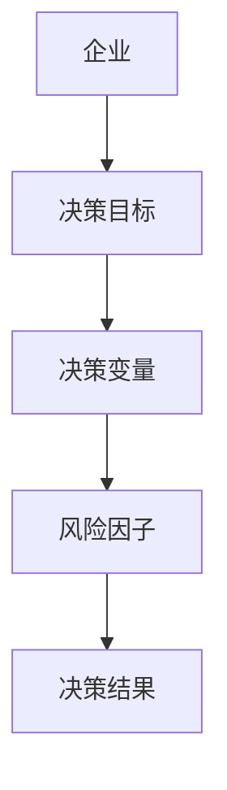
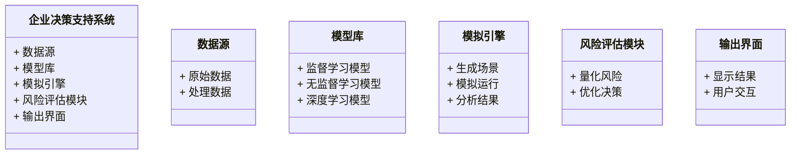
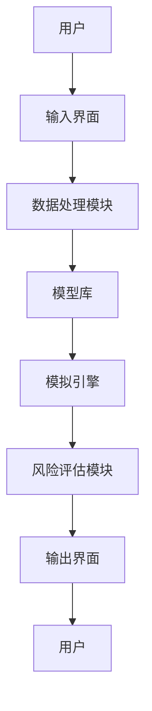
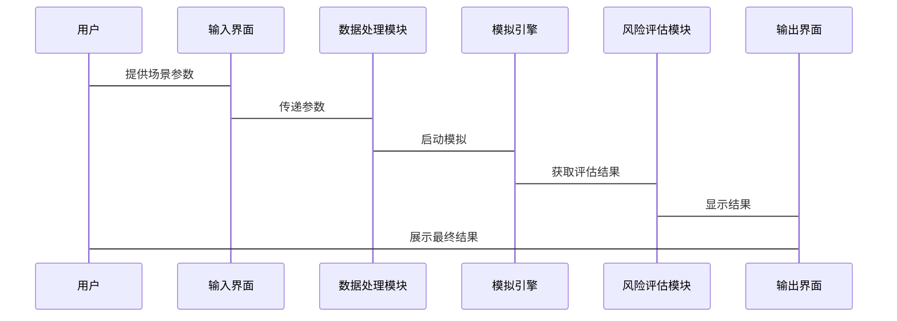

                 


# 构建智能企业决策支持系统：多维场景模拟与风险量化

> 关键词：智能企业决策支持系统、多维场景模拟、风险量化、人工智能、决策优化、系统架构

> 摘要：本文详细探讨了构建智能企业决策支持系统的多维场景模拟与风险量化方法。通过分析企业决策的挑战，提出了一种结合人工智能和大数据分析的解决方案，实现了多维场景的模拟与风险量化。本文涵盖了从核心概念到算法实现，再到系统架构的详细内容，为企业构建智能化决策支持系统提供了理论和实践指导。

---

## 第一部分：智能企业决策支持系统概述

### 第1章：企业决策支持系统背景与概念

#### 1.1 问题背景
- 传统企业决策的挑战：企业面临复杂多变的市场环境，决策的不确定性和风险性增加。
- 智能化决策的必要性：通过智能化技术提高决策的准确性和效率。
- 多维场景模拟与风险量化的核心价值：通过模拟不同场景，量化风险，为企业提供科学的决策依据。

#### 1.2 问题描述
- 企业决策支持系统的定义：利用技术手段辅助企业进行决策的系统。
- 多维场景模拟的实现方式：通过建模和算法模拟不同场景下的决策结果。
- 风险量化的目标与意义：量化决策中的风险因素，降低决策的不确定性。

#### 1.3 问题解决
- 智能化决策支持系统的构建思路：整合数据、构建模型、模拟场景、量化风险。
- 多维场景模拟的实现方式：利用大数据和机器学习技术进行场景模拟。
- 风险量化的方法论：通过概率模型和统计分析量化风险。

#### 1.4 边界与外延
- 系统边界划分：明确系统的输入、输出和交互界面。
- 相关领域的外延：与数据分析、人工智能、系统架构等领域的关联。
- 系统与外部环境的交互：系统如何与企业内外部数据源交互。

#### 1.5 核心要素组成
- 数据源的整合：整合结构化和非结构化数据。
- 模型构建与优化：构建多维场景模拟模型并不断优化。
- 决策结果的输出与反馈：输出决策建议并根据反馈调整模型。

### 第2章：核心概念与联系

#### 2.1 核心概念原理
- 多维场景模拟的原理：通过建模和算法模拟不同场景下的决策结果。
- 风险量化的方法：利用概率模型和统计分析量化风险。
- 智能化决策支持系统的架构：数据采集、模型构建、模拟运行、风险评估、结果输出。

#### 2.2 核心概念对比
- 多维场景模拟与传统场景模拟的对比：传统模拟方法单一，智能化模拟多维度。
- 风险量化与传统风险评估的对比：传统评估定性，智能化评估定量。
- 智能化决策支持系统与其他决策支持系统的对比：智能化系统引入AI和大数据技术。

#### 2.3 ER实体关系图


## 第二部分：算法原理讲解

### 第3章：算法原理概述

#### 3.1 多维场景模拟的核心算法
- 基于机器学习的场景模拟：利用监督学习和无监督学习技术。
- 基于概率的场景模拟：通过概率分布建模。
- 基于规则的场景模拟：结合专家知识和业务规则。

#### 3.2 风险量化的主要算法
- 贝叶斯网络：用于风险因子的关联分析。
- 决策树：用于风险分类和预测。
- 回归分析：用于风险影响因素的量化。

#### 3.3 智能化决策支持系统的算法框架
- 数据预处理：清洗、转换、特征提取。
- 模型训练：训练机器学习模型。
- 模拟运行：生成多维场景并模拟决策结果。
- 风险评估：量化风险并优化决策。

### 第4章：算法实现流程

#### 4.1 数据预处理
- 数据清洗：处理缺失值、异常值。
- 数据转换：标准化、归一化。
- 特征提取：选择关键特征。

#### 4.2 模型训练
- 监督学习：随机森林、支持向量机。
- 无监督学习：聚类分析。
- 深度学习：神经网络。

#### 4.3 模拟运行
- 多维场景生成：随机生成不同场景参数。
- 模拟决策过程：运行模型生成决策结果。
- 模拟结果分析：分析模拟结果的分布和趋势。

### 第5章：算法代码实现

#### 5.1 数据预处理
```python
import pandas as pd
import numpy as np

# 加载数据
data = pd.read_csv('decision_data.csv')

# 删除缺失值
data.dropna(inplace=True)

# 标准化处理
from sklearn.preprocessing import StandardScaler
scaler = StandardScaler()
scaled_data = scaler.fit_transform(data)
```

#### 5.2 模型训练
```python
from sklearn.ensemble import RandomForestClassifier

# 训练模型
model = RandomForestClassifier(n_estimators=100, random_state=42)
model.fit(scaled_data, target)
```

#### 5.3 模拟运行
```python
# 生成多维场景
import itertools

# 定义场景参数
parameters = {'a': [1,2,3], 'b': [4,5,6], 'c': [7,8,9]}
for scenario in itertools.product(*parameters.values()):
    # 运行模型
    result = model.predict(scenario)
    # 输出结果
    print(f"Scenario {scenario}: Result {result}")
```

## 第三部分：系统分析与架构设计方案

### 第6章：系统分析与架构设计

#### 6.1 问题场景介绍
- 企业决策支持系统的需求分析：明确用户需求和目标。
- 项目介绍：系统的目标、范围和主要功能。
- 系统功能设计：数据采集、模型构建、模拟运行、风险评估。

#### 6.2 领域模型设计


#### 6.3 系统架构设计


#### 6.4 系统接口设计
- 输入接口：接收用户输入的场景参数。
- 输出接口：显示模拟结果和风险评估。
- 数据接口：与企业数据源对接。

#### 6.5 系统交互设计


## 第四部分：项目实战

### 第7章：项目实战

#### 7.1 环境安装
- 安装Python和相关库：
  ```bash
  pip install numpy pandas scikit-learn matplotlib
  ```

#### 7.2 核心实现代码
```python
import numpy as np
import pandas as pd
from sklearn.ensemble import RandomForestRegressor
from sklearn.metrics import mean_squared_error

# 加载数据
data = pd.read_csv('decision_data.csv')

# 特征选择
features = data.drop('target', axis=1)
target = data['target']

# 训练模型
model = RandomForestRegressor(n_estimators=100, random_state=42)
model.fit(features, target)

# 模拟运行
def simulate_scenario(params):
    predictions = model.predict(params)
    return predictions

# 分析案例
test_params = features.iloc[0].values.reshape(1, -1)
predicted_value = simulate_scenario(test_params)
print(f"预测值：{predicted_value}")
```

#### 7.3 案例分析
- 案例背景：假设某企业需要优化生产计划。
- 数据来源：生产数据、市场数据、成本数据。
- 模拟结果：不同生产计划下的利润预测。
- 结果分析：找到最优生产计划，降低风险。

## 第五部分：最佳实践

### 第8章：最佳实践

#### 8.1 小结
- 系统设计的核心是数据和模型的结合。
- 多维场景模拟和风险量化是系统的核心功能。
- 系统的可扩展性和灵活性是长期使用的保障。

#### 8.2 注意事项
- 数据质量对系统性能影响重大，需重视数据清洗和处理。
- 模型选择需结合业务需求和数据特征。
- 系统的维护和更新需持续关注模型性能和数据变化。

#### 8.3 拓展阅读
- 推荐书籍：《机器学习实战》、《数据挖掘导论》。
- 推荐博客：某某技术博客，提供相关技术分享。

---

# 结语
通过本文的详细讲解，读者可以系统地了解如何构建智能企业决策支持系统，掌握多维场景模拟和风险量化的核心技术。希望本文能为企业在智能化决策支持系统建设中提供有价值的参考和指导。

