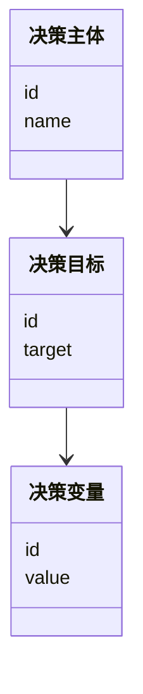

                 


# 构建智能企业决策模拟系统：多维度情景分析与风险评估

## 关键词：智能决策系统、情景分析、风险评估、企业决策、算法原理、系统架构、技术实现

## 摘要：  
本文深入探讨了构建智能企业决策模拟系统的核心方法，重点介绍了多维度情景分析与风险评估的技术实现。文章从问题背景出发，详细分析了系统的核心概念、算法原理、系统架构，并通过实际案例展示了系统的实现与应用。旨在为企业决策者和技术开发者提供一套科学的决策支持工具，帮助他们在复杂多变的商业环境中做出更明智的决策。

---

# 第一部分: 智能企业决策模拟系统概述

## 第1章: 问题背景与目标

### 1.1 问题背景介绍

#### 1.1.1 企业决策面临的挑战
企业在复杂多变的商业环境中，常常面临诸多不确定性，如市场需求波动、政策变化、竞争加剧等。传统的决策方式依赖经验判断，难以应对日益复杂的问题。企业需要一种系统化的方法，能够量化分析多种可能的情景，并评估每种情景下的风险，从而做出最优决策。

#### 1.1.2 情景分析与风险评估的重要性
情景分析帮助企业理解不同决策可能带来的结果，而风险评估则量化了这些结果的不确定性。两者结合，能够为决策者提供全面的视角，帮助其在复杂环境中制定最优策略。

#### 1.1.3 智能决策模拟系统的必要性
传统的情景分析和风险评估依赖人工计算和判断，效率低下且容易出错。通过引入人工智能和大数据技术，构建智能决策模拟系统，可以自动化、高效地进行情景分析和风险评估，为企业提供实时、准确的决策支持。

### 1.2 问题描述与解决思路

#### 1.2.1 企业决策中的不确定性
企业在决策过程中面临诸多不确定性，例如市场需求的变化、原材料价格的波动、政策法规的调整等。这些不确定性可能导致决策失败，带来巨大的经济损失。

#### 1.2.2 多维度情景分析的需求
企业需要在多个维度上进行情景分析，例如时间维度（短期、中期、长期）、空间维度（不同地区市场）、策略维度（不同竞争策略）等。多维度的情景分析能够帮助企业全面理解不同决策可能带来的影响。

#### 1.2.3 风险评估的核心作用
风险评估是情景分析的重要组成部分，它通过量化每种情景下的风险程度，帮助企业识别高风险决策，并制定相应的风险应对策略。

### 1.3 系统边界与外延

#### 1.3.1 系统的输入与输出
- **输入**：市场数据、企业战略目标、决策变量等。
- **输出**：决策建议、风险评估结果、最优决策方案等。

#### 1.3.2 系统的功能边界
系统专注于提供决策模拟和风险评估功能，不直接参与实际的决策执行，但可以为决策者提供实时反馈和调整建议。

#### 1.3.3 系统的可扩展性与灵活性
系统设计时考虑了扩展性，可以根据企业需求添加新的分析模块或调整分析维度。

---

## 第2章: 核心概念与联系

### 2.1 多维度情景分析

#### 2.1.1 情景分析的定义与特点
情景分析是一种通过构建不同情景来预测未来结果的方法。它具有多维度性、模拟性和可变性的特点，能够帮助企业理解不同决策在不同环境下的表现。

#### 2.1.2 多维度分析的维度划分
- **时间维度**：短期、中期、长期。
- **空间维度**：不同地区、不同市场。
- **策略维度**：不同竞争策略、不同产品策略。

#### 2.1.3 情景分析的数学模型
情景分析可以通过蒙特卡洛模拟、决策树分析等方法实现，具体选择哪种方法取决于问题的复杂性和数据的可用性。

### 2.2 风险评估与决策优化

#### 2.2.1 风险评估的定义与方法
风险评估是通过量化分析，评估每种情景下可能带来的风险。常用方法包括概率-影响矩阵、VaR（Value at Risk）等。

#### 2.2.2 决策优化的核心原理
决策优化是通过数学优化方法，找到最优决策方案。常用方法包括线性规划、非线性规划、遗传算法等。

#### 2.2.3 风险与决策的相互作用
风险是决策的一部分，决策优化需要在风险可控的前提下找到最优方案。同时，风险评估的结果也会影响决策优化的方向和策略。

### 2.3 实体关系与架构设计

#### 2.3.1 实体关系图（ER图）展示


#### 2.3.2 核心概念属性特征对比表
| 概念       | 定义                         | 属性1 | 属性2 | 属性3 |
|------------|------------------------------|-------|-------|-------|
| 情景分析   | 分析不同决策可能带来的结果 | 多维度性 | 模拟性 | 可变性 |
| 风险评估   | 评估决策可能带来的风险     | 定量性 | 定性性 | 综合性 |

---

## 第3章: 算法原理与实现

### 3.1 多维度情景分析算法

#### 3.1.1 算法概述
多维度情景分析算法通过构建不同情景，模拟每种情景下的决策结果。常用算法包括蒙特卡洛模拟和决策树分析。

#### 3.1.2 算法步骤


#### 3.1.3 代码实现
以下是Python实现的情景分析算法示例：
```python
import numpy as np

def generate_scenarios(n_scenarios, variables):
    scenarios = []
    for _ in range(n_scenarios):
        scenario = {}
        for var in variables:
            scenario[var] = np.random.uniform(0, 1)
        scenarios.append(scenario)
    return scenarios

# 示例调用
n_scenarios = 1000
variables = ['demand', 'price', 'cost']
scenarios = generate_scenarios(n_scenarios, variables)
print(scenarios)
```

### 3.2 风险评估算法

#### 3.2.1 算法概述
风险评估算法通过量化每种情景下的风险，帮助决策者制定风险应对策略。常用算法包括VaR、CVaR等。

#### 3.2.2 风险评估公式
$$VaR_{\alpha} = \text{损失超过某个阈值的概率}$$

#### 3.2.3 代码实现
以下是Python实现的风险评估算法示例：
```python
import numpy as np
import pandas as pd

def calculate VaR(data, alpha=0.05):
    sorted_values = np.sort(data)
    VaR = sorted_values[int(alpha * len(sorted_values))]
    return VaR

# 示例调用
data = np.random.normal(0, 1, 1000)
alpha = 0.05
VaR = calculate_VaR(data, alpha)
print(f"VaR at {alpha} is {VaR}")
```

---

## 第4章: 系统分析与架构设计

### 4.1 问题场景介绍
企业需要在多个维度上进行情景分析，例如市场进入决策、产品定价策略等。系统需要能够处理大量数据，并提供实时的决策支持。

### 4.2 系统功能设计

#### 4.2.1 领域模型设计


#### 4.2.2 系统架构设计


### 4.3 系统接口设计
系统通过API接口与企业现有系统集成，提供实时的情景分析和风险评估服务。

---

## 第5章: 项目实战

### 5.1 环境安装与配置
- **工具**：Python、Jupyter Notebook
- **库**：numpy、pandas、matplotlib、scikit-learn

### 5.2 核心功能实现

#### 5.2.1 数据预处理
```python
import pandas as pd
import numpy as np

data = pd.read_csv('input.csv')
data_cleaned = data.dropna()
```

#### 5.2.2 情景生成
```python
def generate_scenarios(n, variables):
    scenarios = []
    for _ in range(n):
        scenario = {var: np.random.uniform(0, 1) for var in variables}
        scenarios.append(scenario)
    return scenarios

variables = ['demand', 'price', 'cost']
scenarios = generate_scenarios(1000, variables)
```

#### 5.2.3 风险评估
```python
def calculate VaR(data, alpha=0.05):
    sorted_values = np.sort(data)
    VaR = sorted_values[int(alpha * len(sorted_values))]
    return VaR

data = [scenario['profit'] for scenario in scenarios]
VaR = calculate_VaR(data)
print(f"VaR at {alpha} is {VaR}")
```

### 5.3 案例分析与解读
以某公司的市场进入决策为例，系统生成不同市场情景，并评估每种情景下的风险。最终，系统给出最优的市场进入策略，帮助企业降低风险，提高决策成功率。

---

## 第6章: 最佳实践与总结

### 6.1 小结
本文详细介绍了构建智能企业决策模拟系统的核心方法，包括多维度情景分析和风险评估的算法实现、系统架构设计等。通过实际案例，展示了系统的应用价值和实现过程。

### 6.2 注意事项
- 数据质量是系统性能的关键，需确保数据的准确性和完整性。
- 算法选择需根据具体问题，避免盲目使用复杂模型。
- 系统需定期更新，以适应市场变化。

### 6.3 拓展阅读
- 《决策分析与优化》
- 《风险管理精要》
- 《Python机器学习实战》

通过本文的指导，读者可以掌握构建智能企业决策模拟系统的方法，为企业决策提供科学的支持。

