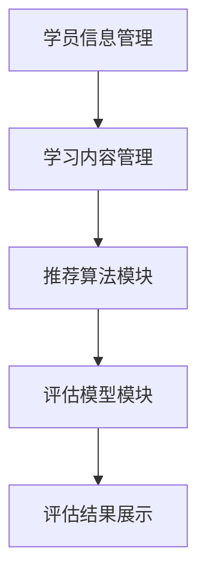
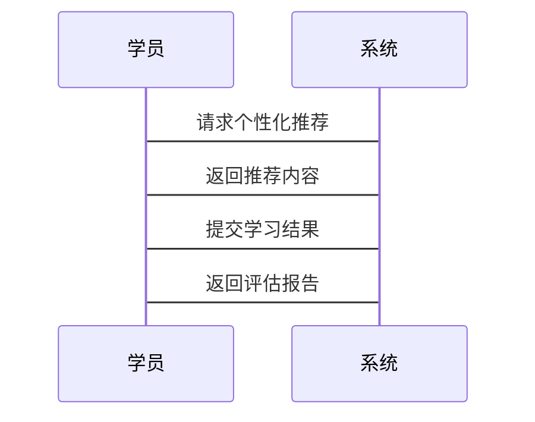

                 


# 构建智能企业合规培训系统：个性化学习内容与评估

---

## 关键词：
- 智能企业合规培训
- 个性化学习
- 人工智能算法
- 系统架构设计
- 企业培训评估

---

## 摘要：
随着企业合规培训需求的不断增长，构建一个智能、高效的合规培训系统变得尤为重要。本文详细探讨了如何利用人工智能技术，构建一个基于个性化学习内容与评估的企业合规培训系统。通过分析系统的核心概念、算法原理、系统架构设计以及项目实战，本文为读者提供了一个全面的技术实现方案。

---

## 第一部分: 智能企业合规培训系统背景与核心概念

### 第1章: 企业合规培训的背景与挑战

#### 1.1 企业合规培训的背景
企业合规培训是指企业为员工提供法律法规、行业标准、企业内部规章制度等方面的培训，以确保员工在工作中遵守相关规范。随着全球化和数字化的深入，企业合规培训的需求日益增长。

- **合规培训的重要性**  
  合规培训是企业合规管理的重要组成部分，能够有效降低法律风险、提升员工职业素养，同时增强企业的竞争力。

- **企业合规培训的现状**  
  当前，企业合规培训主要依赖传统的面授或在线学习方式，存在以下问题：  
  - 培训内容缺乏个性化，难以满足不同员工的学习需求。  
  - 培训效果难以量化，缺乏科学的评估机制。  
  - 培训成本高，难以实现大规模覆盖。

- **智能化合规培训的必要性**  
  通过引入人工智能技术，可以实现个性化学习内容推荐和动态评估，从而提升培训效果、降低培训成本，并提高员工的学习体验。

---

#### 1.2 个性化学习的需求
个性化学习是指根据员工的个人特点、学习目标和学习进度，定制专属的学习内容和学习路径。在企业合规培训中，个性化学习的需求主要体现在以下几个方面：

- **个性化学习的定义**  
  个性化学习是一种基于学习者个体差异的教学模式，旨在通过定制化的学习计划和内容，满足不同学习者的需求。

- **个性化学习在企业培训中的应用**  
  - 根据员工的岗位职责推荐相关法规内容。  
  - 根据员工的学习进度动态调整学习内容。  
  - 根据员工的学习偏好推荐学习形式（如视频、文档、案例分析等）。

- **个性化学习的需求驱动**  
  - 提高员工的学习效率。  
  - 增强员工的学习兴趣和参与度。  
  - 降低培训成本，实现资源的高效利用。

---

#### 1.3 本章小结
本章介绍了企业合规培训的背景、现状及智能化合规培训的必要性。同时，详细阐述了个性化学习的需求及其在企业培训中的重要性，为后续系统的构建奠定了理论基础。

---

### 第2章: 智能企业合规培训系统的核心概念

#### 2.1 智能企业合规培训系统的定义
智能企业合规培训系统是一种基于人工智能技术的在线学习平台，能够根据员工的学习需求、学习行为和学习效果，动态推荐个性化的学习内容，并提供智能化的评估服务。

- **系统的定义**  
  系统通过收集和分析员工的学习数据，利用推荐算法和评估模型，为员工提供个性化的学习内容和评估报告。

- **系统的核心功能**  
  - 学员信息管理：包括学员的基本信息、学习记录、学习偏好等。  
  - 学习内容管理：包括法规知识库、课程资源、学习任务等。  
  - 推荐算法：基于学员特征和学习数据，推荐个性化学习内容。  
  - 评估系统：根据学员的学习行为和学习效果，生成评估报告。

- **系统的目标**  
  提供个性化的学习体验，提升员工的学习效果，降低企业的培训成本。

---

#### 2.2 个性化学习与评估的实现机制
个性化学习与评估的实现机制是系统的核心，主要包括以下内容：

- **个性化学习的实现原理**  
  系统通过收集学员的学习数据（如学习时间、学习进度、考试成绩等），利用推荐算法生成个性化学习内容。

- **个性化评估的实现方法**  
  系统通过分析学员的学习行为和学习效果，生成动态评估报告，并提供改进建议。

- **个性化学习与评估的关联性**  
  评估结果可以为学习内容的推荐提供反馈，从而优化学习路径。

---

#### 2.3 系统的核心要素
智能企业合规培训系统的核心要素包括以下几部分：

- **数据驱动**  
  系统依赖于大量的学习数据，包括学员的基本信息、学习记录、考试成绩等。

- **人工智能技术**  
  系统利用机器学习、自然语言处理等人工智能技术，实现学习内容的个性化推荐和评估。

- **个性化算法**  
  系统采用协同过滤、深度学习等推荐算法，为学员推荐个性化学习内容。

- **评估模型**  
  系统利用评估模型对学员的学习效果进行量化评估，并生成评估报告。

---

#### 2.4 本章小结
本章详细阐述了智能企业合规培训系统的核心概念，包括系统的定义、功能、实现机制和核心要素。这些内容为后续的算法设计和系统实现奠定了基础。

---

## 第二部分: 智能企业合规培训系统的算法原理

### 第3章: 个性化学习推荐算法

#### 3.1 推荐算法概述
推荐算法是个性化学习的核心技术，主要包括以下几种类型：

- **协同过滤算法**  
  基于用户的行为相似性，推荐与之相似的用户喜欢的内容。

- **基于内容的推荐算法**  
  基于学习内容的特征，推荐与当前内容相似的学习内容。

- **基于深度学习的推荐算法**  
  利用神经网络模型，学习用户和内容的隐含特征，推荐个性化内容。

---

#### 3.2 个性化学习推荐算法的实现
个性化学习推荐算法的实现主要包括以下几个步骤：

1. **数据预处理**  
   - 清洗数据：去除无效数据，处理缺失值。  
   - 特征提取：从学员数据中提取有用的特征，如年龄、性别、岗位等。

2. **用户特征提取**  
   - 利用聚类算法，将用户分成不同的群体。  
   - 通过协同过滤算法，计算用户之间的相似度。

3. **内容特征提取**  
   - 利用自然语言处理技术，提取学习内容的关键词和主题。  
   - 通过嵌入模型（如Word2Vec），生成内容的向量表示。

4. **推荐结果生成**  
   - 根据用户特征和内容特征，生成个性化推荐内容。

---

#### 3.3 算法实现的数学模型
以下是协同过滤算法的数学公式：

$$ \text{相似度计算公式：} \text{sim}(u, v) = \frac{\sum_{i=1}^{n} r_{u,i} \cdot r_{v,i}}{\sqrt{\sum_{i=1}^{n} r_{u,i}^2} \cdot \sqrt{\sum_{i=1}^{n} r_{v,i}^2}} $$

其中，\( r_{u,i} \) 表示用户 \( u \) 对内容 \( i \) 的评分，\( n \) 表示内容的总数。

---

### 第4章: 个性化评估模型

#### 4.1 评估模型概述
个性化评估模型是基于学员的学习行为和学习效果，生成评估报告的关键技术。

- **评估模型的分类**  
  - 基于规则的评估模型：根据预设的规则，评估学员的学习效果。  
  - 基于机器学习的评估模型：利用机器学习算法，预测学员的学习效果。

---

#### 4.2 评估模型的实现
个性化评估模型的实现主要包括以下几个步骤：

1. **数据收集**  
   - 收集学员的学习数据，包括学习时间、学习进度、考试成绩等。

2. **特征提取**  
   - 提取学习数据的特征，如学习时间的分布、学习任务的完成率等。

3. **模型训练**  
   - 利用监督学习算法（如随机森林、神经网络等），训练评估模型。

4. **评估结果生成**  
   - 根据模型预测结果，生成个性化评估报告。

---

#### 4.3 评估模型的数学公式
以下是基于线性回归的评估模型公式：

$$ \text{预测分数} = \beta_0 + \beta_1 \cdot \text{学习时间} + \beta_2 \cdot \text{学习任务完成率} $$

其中，\( \beta_0 \) 是截距项，\( \beta_1 \) 和 \( \beta_2 \) 是回归系数。

---

## 第三部分: 智能企业合规培训系统的架构设计

### 第5章: 系统架构设计

#### 5.1 系统功能设计
智能企业合规培训系统的功能设计包括以下几个模块：

- **学员信息管理模块**  
  - 学员注册与登录。  
  - 学员信息管理（如年龄、性别、岗位等）。

- **学习内容管理模块**  
  - 法规知识库管理。  
  - 课程资源管理。

- **推荐算法模块**  
  - 用户特征提取。  
  - 内容特征提取。  
  - 个性化推荐。

- **评估模型模块**  
  - 学习数据收集。  
  - 评估结果生成。

---

#### 5.2 系统架构图
以下是系统架构的Mermaid图：



---

#### 5.3 系统接口设计
系统接口设计主要包括以下内容：

- **学员信息接口**  
  - API 接口：`GET /学员信息/{id}`  
  - 功能：获取学员的基本信息。

- **学习内容接口**  
  - API 接口：`GET /学习内容/{id}`  
  - 功能：获取学习内容的详细信息。

---

### 第6章: 系统交互设计

#### 6.1 系统交互流程
以下是系统交互的Mermaid序列图：



---

## 第四部分: 项目实战

### 第7章: 项目实战

#### 7.1 环境安装
以下是项目实战所需的环境安装步骤：

1. **安装Python**  
   - 下载并安装Python 3.x版本。

2. **安装依赖库**  
   - 使用以下命令安装所需的依赖库：  
     `pip install numpy pandas scikit-learn`

---

#### 7.2 系统核心实现

##### 7.2.1 推荐算法实现
以下是协同过滤算法的Python代码示例：

```python
import numpy as np
from sklearn.metrics.pairwise import cosine_similarity

# 示例数据
user_items = np.array([[4, 3, 0], [2, 5, 0], [1, 0, 4]])

# 计算相似度
similarity_matrix = cosine_similarity(user_items)

print(similarity_matrix)
```

##### 7.2.2 评估模型实现
以下是基于线性回归的评估模型代码示例：

```python
from sklearn.linear_model import LinearRegression

# 示例数据
X = np.array([[1, 2], [3, 4], [5, 6]])
y = np.array([7, 8, 9])

# 训练模型
model = LinearRegression().fit(X, y)

# 预测结果
print(model.predict([[2, 3]]))
```

---

#### 7.3 代码应用解读
通过上述代码示例，我们可以看到推荐算法和评估模型的具体实现方式。推荐算法利用了协同过滤算法，基于用户的行为相似性推荐个性化内容；评估模型利用了线性回归算法，预测学员的学习效果。

---

## 第五部分: 总结与展望

### 第8章: 总结与展望

#### 8.1 最佳实践 Tips
- 在实际项目中，建议结合企业的具体需求，灵活调整系统的功能模块。  
- 推荐算法和评估模型的性能需要通过实验不断优化。

#### 8.2 小结
本文详细探讨了智能企业合规培训系统的构建过程，包括系统的背景、核心概念、算法原理、系统架构设计以及项目实战。通过本文的讲解，读者可以掌握构建智能企业合规培训系统的核心技术。

#### 8.3 注意事项
- 系统的实现需要结合企业的实际需求，避免过于复杂的算法设计。  
- 数据安全是系统设计中的重要考虑因素，需确保学员数据的隐私保护。

#### 8.4 拓展阅读
- 《推荐系统实战：基于Python的机器学习算法与应用》  
- 《深度学习在企业培训中的应用》

---

## 结语
通过本文的讲解，我们详细探讨了智能企业合规培训系统的构建过程，为读者提供了一个全面的技术实现方案。未来，随着人工智能技术的不断发展，智能企业合规培训系统将更加智能化、个性化，为企业培训带来更大的价值。

