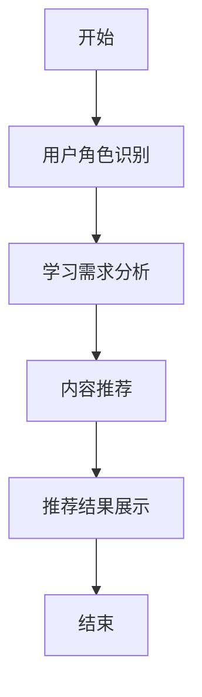

                 


# 构建智能企业合规培训系统：基于角色的个性化学习内容生成

> 关键词：企业合规培训，基于角色，个性化学习，RBAC模型，人工智能算法

> 摘要：本文详细探讨了如何构建一个基于角色的智能企业合规培训系统，通过个性化学习内容生成算法，实现高效、精准的培训管理。文章从背景介绍、核心概念、算法原理、系统架构设计到项目实战，全面解析了系统构建的每个环节，并提供了具体的实现方法和案例分析。

---

## 目录

1. 第一部分: 背景介绍与核心概念  
   1.1 问题背景与挑战  
   1.2 问题描述与目标  
   1.3 基于角色的个性化学习内容生成  

2. 第二部分: 核心概念与联系  
   2.1 基于角色的访问控制（RBAC）模型  
   2.2 个性化学习内容生成的数学模型  
   2.3 系统架构与功能模块  

3. 第三部分: 算法原理与实现  
   3.1 基于角色的个性化学习生成算法  
   3.2 算法流程与实现步骤  
   3.3 系统架构设计与实现  

4. 第四部分: 项目实战与案例分析  
   4.1 项目背景与需求分析  
   4.2 系统设计与实现  
   4.3 系统测试与优化  

5. 第五部分: 最佳实践与总结  
   5.1 项目总结与经验分享  
   5.2 未来发展方向与建议  
   5.3 关键点与注意事项  

---

## 第一部分: 背景介绍与核心概念

### 1.1 问题背景与挑战

#### 1.1.1 传统企业合规培训的痛点
企业合规培训是确保员工遵守公司政策、法律法规以及行业标准的重要手段。然而，传统的企业合规培训存在以下痛点：
- **内容单一化**：培训内容通常千篇一律，无法满足不同岗位员工的个性化需求。
- **效率低下**：由于缺乏智能化手段，培训效果难以评估，员工参与度低。
- **管理复杂**：手动分配培训内容和评估过程耗时耗力，难以规模化管理。

#### 1.1.2 个性化学习的必要性
个性化学习能够根据员工的角色、职责和技能水平，提供针对性的学习内容，从而提高培训效率和效果。例如，销售部门的员工需要了解客户管理政策，而财务部门的员工则需要掌握财务合规知识。

#### 1.1.3 基于角色的访问控制在培训中的应用
基于角色的访问控制（RBAC）模型在企业合规培训中的应用，可以帮助企业高效管理培训内容的访问权限。通过RBAC模型，系统可以为不同角色的员工分配相应的培训内容，确保员工仅能访问与其职责相关的学习材料。

---

### 1.2 问题描述与目标

#### 1.2.1 企业合规培训的多样性需求
企业中的不同岗位需要不同的合规培训内容。例如，管理层需要了解公司治理和风险管理，而普通员工则需要掌握日常操作规范。

#### 1.2.2 基于角色的个性化学习目标
构建一个基于角色的个性化学习内容生成系统，能够根据员工的角色、技能水平和学习需求，自动生成相应的培训内容。这不仅可以提高培训效率，还能确保培训内容的针对性和有效性。

#### 1.2.3 系统构建的核心问题
系统的核心问题在于如何根据员工的角色信息，动态生成个性化的学习内容。这需要结合RBAC模型和个性化推荐算法，确保内容生成的准确性和高效性。

---

### 1.3 基于角色的个性化学习内容生成

#### 1.3.1 核心概念与原理
基于角色的个性化学习内容生成系统结合了RBAC模型和机器学习算法，通过分析员工的角色信息、历史学习行为和当前学习需求，生成个性化的学习内容。

#### 1.3.2 系统核心要素
系统的核心要素包括：
- **用户角色识别**：通过员工的岗位信息确定其角色。
- **学习需求分析**：根据员工的技能水平和学习目标，分析其需要学习的内容。
- **内容推荐算法**：基于角色信息和学习需求，推荐适合的学习内容。

---

## 第二部分: 核心概念与联系

### 2.1 基于角色的访问控制（RBAC）模型

#### 2.1.1 RBAC模型的核心要素
RBAC模型由以下四个核心要素组成：
1. **用户**：系统中的最终用户。
2. **角色**：用户在系统中承担的角色，决定其权限。
3. **权限**：用户或角色可以执行的操作。
4. **职责分离（Separation of Duty）**：确保不同角色之间的职责分离，避免权限滥用。

#### 2.1.2 RBAC模型与个性化学习的结合
通过RBAC模型，系统可以为不同角色的员工分配相应的学习内容。例如，财务部门的员工可以访问与财务合规相关的学习材料，而人力资源部门的员工则可以访问与员工管理相关的培训内容。

#### 2.1.3 RBAC模型的优缺点
- **优点**：角色管理灵活，适合大规模用户群体。
- **缺点**：角色定义和权限分配较为复杂，需要定期维护。

---

### 2.2 个性化学习内容生成的数学模型

#### 2.2.1 基于角色的学习内容生成模型
学习内容生成模型可以通过以下步骤实现：
1. **角色信息提取**：提取员工的角色信息。
2. **学习需求分析**：分析员工的学习需求。
3. **内容推荐**：基于角色信息和学习需求，推荐适合的学习内容。

#### 2.2.2 内容推荐算法
内容推荐算法可以采用协同过滤算法或基于内容的推荐算法。以下是基于内容的推荐算法的简单实现：

```python
def content_based_recommendation(user_role, content_features):
    # 计算用户角色与内容特征的相似性
    similarity = cosine_similarity(user_role_features, content_features)
    # 根据相似性排序，返回推荐内容
    recommendations = sorted(zip(similarity, content_features), reverse=True)
    return recommendations
```

---

### 2.3 系统架构与功能模块

#### 2.3.1 系统整体架构
系统整体架构可以分为以下几个模块：
1. **用户管理模块**：负责用户信息的录入、维护和管理。
2. **角色管理模块**：负责角色的定义、分配和管理。
3. **学习内容管理模块**：负责学习内容的录入、分类和管理。
4. **个性化推荐模块**：根据用户角色和学习需求，推荐个性化学习内容。

#### 2.3.2 功能模块划分
- **用户管理模块**：包括用户注册、登录、信息维护等功能。
- **角色管理模块**：包括角色定义、角色分配、权限管理等功能。
- **学习内容管理模块**：包括内容录入、分类、标签管理等功能。
- **个性化推荐模块**：包括学习需求分析、内容推荐、推荐结果展示等功能。

---

## 第三部分: 算法原理与实现

### 3.1 基于角色的个性化学习生成算法

#### 3.1.1 算法概述
基于角色的个性化学习生成算法通过分析用户角色和学习需求，生成个性化的学习内容。以下是算法的总体流程：



#### 3.1.2 算法流程与实现步骤
1. **用户角色识别**：通过员工的岗位信息确定其角色。
2. **学习需求分析**：分析员工的学习需求，包括技能水平、学习目标等。
3. **内容推荐**：基于角色信息和学习需求，推荐适合的学习内容。
4. **推荐结果展示**：将推荐结果展示给用户，供其选择和学习。

---

### 3.2 算法流程与实现步骤

#### 3.2.1 算法流程图
以下是基于角色的个性化学习生成算法的流程图：


#### 3.2.2 算法实现步骤
1. **用户角色识别**：
   - 通过员工的岗位信息确定其角色。
   - 例如，销售部门的员工角色为“销售”，财务部门的员工角色为“财务”。

2. **学习需求分析**：
   - 分析员工的学习需求，包括技能水平、学习目标等。
   - 例如，技能水平低的员工需要重点学习基础知识。

3. **内容推荐**：
   - 基于角色信息和学习需求，推荐适合的学习内容。
   - 例如，销售部门的员工推荐销售技巧和客户管理相关的培训内容。

4. **推荐结果展示**：
   - 将推荐结果展示给用户，供其选择和学习。

---

## 第四部分: 项目实战与案例分析

### 4.1 项目背景与需求分析

#### 4.1.1 项目背景
本文将通过一个具体的项目案例，展示如何构建基于角色的个性化学习内容生成系统。项目背景如下：
- **项目名称**：智能企业合规培训系统
- **项目目标**：通过基于角色的个性化学习内容生成，提高企业合规培训的效率和效果。
- **项目范围**：涵盖企业中不同岗位的合规培训内容生成。

#### 4.1.2 需求分析
通过需求分析，确定系统的功能需求和非功能需求：
- **功能需求**：
  - 用户角色识别
  - 学习需求分析
  - 内容推荐
  - 推荐结果展示
- **非功能需求**：
  - 系统稳定性
  - 响应速度

---

### 4.2 系统设计与实现

#### 4.2.1 系统设计
系统设计包括以下几个部分：
1. **用户管理模块**：负责用户信息的录入、维护和管理。
2. **角色管理模块**：负责角色的定义、分配和管理。
3. **学习内容管理模块**：负责学习内容的录入、分类和管理。
4. **个性化推荐模块**：根据用户角色和学习需求，推荐个性化学习内容。

#### 4.2.2 系统实现
以下是系统实现的代码示例：

```python
def user_role_recognition(user_info):
    # 根据用户信息确定角色
    role = user_info['position']
    return role

def content_recommendation(role, content_features):
    # 根据角色和内容特征推荐学习内容
    similarity = cosine_similarity(role_features, content_features)
    recommendations = sorted(zip(similarity, content_features), reverse=True)
    return recommendations[:5]
```

---

### 4.3 系统测试与优化

#### 4.3.1 系统测试
系统测试包括以下内容：
- **功能测试**：测试系统各功能模块的正常运行。
- **性能测试**：测试系统在高并发情况下的响应速度和稳定性。
- **用户体验测试**：测试用户对系统的满意度和使用体验。

#### 4.3.2 系统优化
根据测试结果，对系统进行优化，包括：
- **算法优化**：优化内容推荐算法，提高推荐准确率。
- **系统性能优化**：优化系统架构，提高系统响应速度。

---

## 第五部分: 最佳实践与总结

### 5.1 项目总结与经验分享

#### 5.1.1 项目总结
通过本次项目，我们成功构建了一个基于角色的个性化学习内容生成系统，实现了高效、精准的培训管理。系统通过RBAC模型和个性化推荐算法，为不同角色的员工提供了针对性的学习内容，显著提高了培训效率和效果。

#### 5.1.2 经验分享
- **需求分析的重要性**：在项目初期，需要充分进行需求分析，明确系统的功能需求和非功能需求。
- **系统架构设计的合理性**：系统架构设计需要合理，确保系统的可扩展性和可维护性。
- **算法优化的必要性**：算法优化是提高系统性能和推荐准确率的关键。

---

### 5.2 未来发展方向与建议

#### 5.2.1 未来发展方向
- **智能化升级**：引入人工智能技术，进一步提高系统的智能化水平。
- **多维度推荐**：结合用户的多维度信息，提供更加精准的内容推荐。
- **跨平台支持**：实现系统在多平台上的支持，方便用户随时随地学习。

#### 5.2.2 项目建议
- **加强系统安全性**：确保系统数据的安全性和用户信息的隐私保护。
- **优化用户体验**：进一步优化用户界面和交互流程，提升用户体验。

---

### 5.3 关键点与注意事项

#### 5.3.1 关键点
- **RBAC模型的应用**：RBAC模型是系统的核心，确保用户权限的合理分配。
- **个性化推荐算法**：个性化推荐算法是提高系统推荐准确率的关键。

#### 5.3.2 注意事项
- **系统维护**：定期维护系统，确保系统的稳定性和安全性。
- **用户培训**：对系统用户进行培训，确保用户能够正确使用系统。

---

## 结语

通过本文的详细讲解，我们了解了如何构建一个基于角色的智能企业合规培训系统。从背景介绍、核心概念、算法原理到项目实战，我们全面解析了系统构建的每个环节，并提供了具体的实现方法和案例分析。未来，随着人工智能技术的不断发展，基于角色的个性化学习内容生成系统将为企业合规培训带来更多的可能性和挑战。我们期待通过不断的优化和创新，为企业的合规培训提供更加高效、精准的解决方案。

