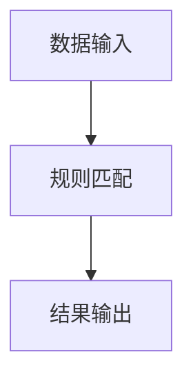
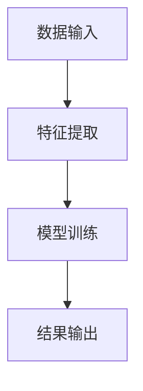
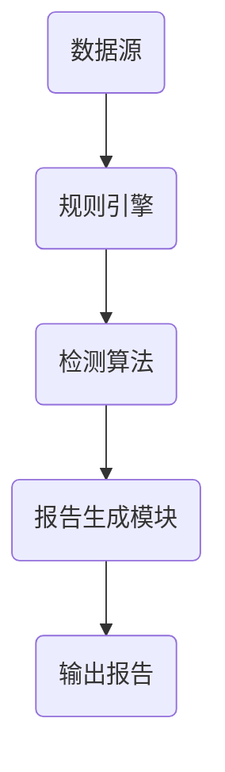
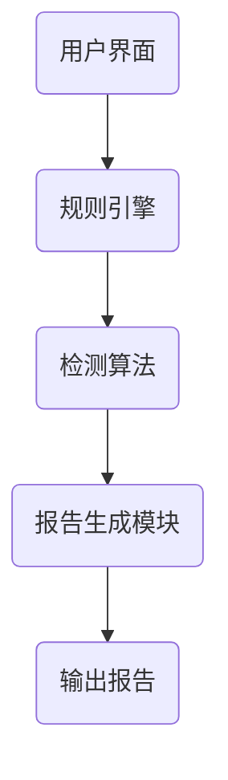
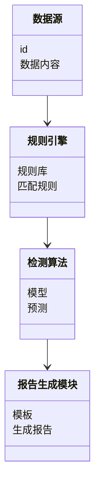
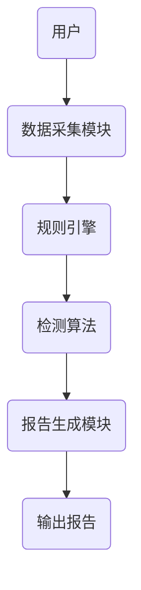
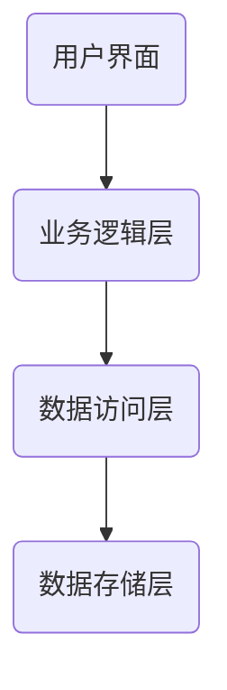

                 


# 构建智能企业合规监控系统：实时违规检测与自动报告生成

## 关键词：企业合规监控、实时违规检测、自动报告生成、系统架构、算法实现

## 摘要：  
随着企业数字化转型的加速，合规监控成为保障企业合法运营的核心环节。本文深入探讨了智能企业合规监控系统的构建，重点分析了实时违规检测与自动报告生成的关键技术与实现方法。通过系统架构设计、算法实现、项目实战等多维度的详细讲解，为读者提供了从理论到实践的全面指导。

---

# 第1章 企业合规监控系统的背景与问题分析

## 1.1 企业合规监控的定义与重要性

企业合规监控是指通过技术手段对企业内外部行为进行实时监督，确保其符合相关法律法规和企业内部政策。随着数字化时代的到来，企业面临的数据量激增、业务复杂度上升，合规监控的重要性日益凸显。合规监控不仅是企业合规运营的基础，也是规避法律风险、提升企业信誉的关键。

### 1.1.1 合规监控的定义  
合规监控是通过技术手段对企业行为进行实时监督，确保其符合相关法律法规和企业内部政策。  

### 1.1.2 企业合规监控的重要性  
企业合规监控的重要性体现在以下几点：  
1. **规避法律风险**：合规监控能够及时发现并纠正违规行为，避免企业因违法行为而遭受法律处罚。  
2. **提升企业信誉**：合规经营是企业赢得客户和合作伙伴信任的重要基础。  
3. **优化内部管理**：通过实时监控，企业可以发现管理中的漏洞，优化运营流程。  

### 1.1.3 合规监控的边界与外延  
合规监控的边界是指企业合规监控的范围和限制，通常包括企业内部行为、外部合作行为等。其外延则涉及更多领域，如数据安全、隐私保护等。  

## 1.2 企业合规监控的核心问题

企业合规监控的核心问题主要集中在以下方面：  
1. **实时违规检测的挑战**：如何在海量数据中快速识别违规行为。  
2. **自动报告生成的需求**：如何高效生成符合要求的合规报告。  
3. **系统设计的复杂性**：如何设计一个高效、稳定的合规监控系统。  

## 1.3 企业合规监控的核心要素

企业合规监控的核心要素包括：  
1. **数据源**：合规监控需要从多个数据源获取数据，如日志文件、交易记录等。  
2. **规则引擎**：用于定义和执行合规规则，判断是否存在违规行为。  
3. **检测算法**：基于规则或机器学习的算法，用于识别违规行为。  
4. **报告生成模块**：根据检测结果生成合规报告。  

---

# 第2章 合规监控系统的核心概念与联系

## 2.1 数据源与数据预处理

### 2.1.1 数据源的分类与特征对比

数据源可以分为以下几类：  
1. **内部数据源**：如企业内部的日志文件、交易记录等。  
2. **外部数据源**：如合作伙伴提供的数据、公开数据等。  

特征对比表：  

| 特征 | 内部数据源 | 外部数据源 |
|------|------------|------------|
| 数据类型 | 结构化数据为主 | 结构化与非结构化数据混合 |
| 数据量 | 大数据量 | 中小数据量 |
| 数据敏感性 | 高 | 中 |

### 2.1.2 数据预处理的必要性与方法

数据预处理是合规监控系统的重要环节，主要包括：  
1. **数据清洗**：去除无效数据或错误数据。  
2. **数据转换**：将数据转换为适合算法处理的形式。  
3. **数据增强**：通过数据增强技术提升数据质量。  

---

## 2.2 规则引擎与检测算法

### 2.2.1 规则引擎的工作原理

规则引擎是一种用于定义和执行规则的系统，其工作原理如下：  
1. **规则定义**：用户定义合规规则，如“单笔交易金额超过100万元即为异常”。  
2. **规则匹配**：系统根据规则匹配输入数据，判断是否存在违规行为。  
3. **结果输出**：输出匹配结果，如“存在违规行为”或“正常”。  

### 2.2.2 基于规则的检测算法

基于规则的检测算法是一种简单且高效的算法，适用于规则明确的场景。其流程如下：  



### 2.2.3 基于机器学习的检测算法

基于机器学习的检测算法适用于复杂场景，能够自动学习数据中的模式，发现潜在的违规行为。其流程如下：  



---

## 2.3 报告生成模块

### 2.3.1 报告生成的流程

报告生成的流程包括：  
1. **数据收集**：收集违规行为的相关信息。  
2. **报告模板选择**：根据违规类型选择合适的报告模板。  
3. **报告生成**：填充模板，生成报告。  
4. **报告输出**：输出报告，如PDF格式或邮件通知。  

### 2.3.2 报告格式与内容设计

报告格式应简洁明了，内容应包含以下信息：  
1. **违规事件描述**：如时间、地点、涉及人员等。  
2. **违规行为分析**：如违反的具体规则、影响等。  
3. **整改建议**：如如何避免类似事件再次发生。  

---

## 2.4 核心概念的ER实体关系图

以下是一个简单的ER实体关系图：  



---

## 2.5 本章小结

本章详细介绍了合规监控系统的核心概念，包括数据源、规则引擎、检测算法和报告生成模块，并通过ER实体关系图展示了各核心概念之间的关系。

---

# 第3章 实时违规检测算法实现

## 3.1 基于规则的检测算法

### 3.1.1 算法原理

基于规则的检测算法是一种简单且高效的算法，适用于规则明确的场景。其数学模型如下：  

$$
\text{判断是否违规} = \begin{cases}
\text{是} & \text{if } x \text{满足规则} \\
\text{否} & \text{否则}
\end{cases}
$$

### 3.1.2 算法实现

以下是基于规则的检测算法的Python实现示例：  

```python
def rule_based_detection(data, rules):
    for rule in rules:
        if rule.check(data):
            return "违规"
    return "正常"
```

## 3.2 基于机器学习的检测算法

### 3.2.1 算法原理

基于机器学习的检测算法适用于复杂场景，能够自动学习数据中的模式，发现潜在的违规行为。其数学模型如下：  

$$
y = f(x) + \epsilon
$$

其中，$y$ 是目标变量，$x$ 是输入特征，$\epsilon$ 是误差项。

### 3.2.2 算法实现

以下是基于机器学习的检测算法的Python实现示例：  

```python
from sklearn import tree

def ml_based_detection(X, model):
    return model.predict(X)
```

---

## 3.3 算法对比与优化

### 3.3.1 算法对比

以下是对基于规则和基于机器学习的检测算法的对比：  

| 特性 | 基于规则 | 基于机器学习 |
|------|----------|--------------|
| 适用场景 | 规则明确 | 规则复杂 |
| 算法复杂度 | 低 | 高 |
| 可解释性 | 高 | 低 |

### 3.3.2 算法优化

优化建议：  
1. **特征选择**：选择与违规行为相关的特征。  
2. **模型调优**：通过交叉验证优化模型参数。  
3. ** ensemble方法**：使用集成学习提升模型性能。  

---

## 3.4 本章小结

本章详细介绍了实时违规检测算法的实现，包括基于规则和基于机器学习的检测算法，并通过对比分析，提出了算法优化的建议。

---

# 第4章 合规监控系统的系统架构设计

## 4.1 系统架构概述

合规监控系统的系统架构设计如下：  



---

## 4.2 系统功能设计

### 4.2.1 领域模型设计

以下是领域模型的Mermaid类图：  



### 4.2.2 系统接口设计

以下是系统接口设计的Mermaid序列图：  



---

## 4.3 系统架构优化

### 4.3.1 分层架构设计

以下是分层架构设计的Mermaid图：  



### 4.3.2 高可用性设计

高可用性设计的关键点包括：  
1. **负载均衡**：通过负载均衡技术分担请求压力。  
2. **容灾备份**：建立数据备份和恢复机制。  
3. **集群部署**：通过集群部署提升系统的可用性。  

---

## 4.4 本章小结

本章详细介绍了合规监控系统的系统架构设计，包括系统功能设计、系统架构优化等，并通过Mermaid图展示了系统的整体架构和模块交互。

---

# 第5章 合规监控系统的项目实战

## 5.1 项目背景与目标

### 5.1.1 项目背景

本项目旨在构建一个智能企业合规监控系统，实现实时违规检测与自动报告生成。  

### 5.1.2 项目目标

项目目标包括：  
1. 实现实时违规检测功能。  
2. 实现自动报告生成功能。  
3. 提供用户友好的操作界面。  

---

## 5.2 项目环境搭建

### 5.2.1 环境要求

项目环境要求如下：  
- 操作系统：Linux/Windows/MacOS  
- 开发工具：PyCharm/VS Code  
- 依赖库：Python 3.8+，scikit-learn，pandas  

---

## 5.3 系统核心实现

### 5.3.1 数据采集模块

以下是数据采集模块的实现示例：  

```python
import logging

def data_collection():
    try:
        # 数据采集逻辑
        pass
    except Exception as e:
        logging.error(f"数据采集失败：{e}")
```

### 5.3.2 规则引擎实现

以下是规则引擎的实现示例：  

```python
class RuleEngine:
    def __init__(self, rules):
        self.rules = rules

    def check(self, data):
        for rule in self.rules:
            if rule.match(data):
                return True
        return False
```

### 5.3.3 检测算法实现

以下是检测算法的实现示例：  

```python
from sklearn import tree

class MLAlgorithm:
    def __init__(self, model):
        self.model = model

    def predict(self, X):
        return self.model.predict(X)
```

### 5.3.4 报告生成模块实现

以下是报告生成模块的实现示例：  

```python
class ReportGenerator:
    def generate_report(self, results):
        # 生成报告逻辑
        pass
```

---

## 5.4 项目案例分析

### 5.4.1 案例背景

假设某企业需要监控员工的网络行为，发现是否存在违规访问外部网站的行为。  

### 5.4.2 案例分析

以下是具体的案例分析步骤：  
1. **数据采集**：采集员工的网络访问日志。  
2. **规则定义**：定义合规规则，如“禁止访问非工作相关网站”。  
3. **违规检测**：通过规则引擎或机器学习算法检测违规行为。  
4. **报告生成**：生成违规行为报告，包括违规员工、违规时间等信息。  

---

## 5.5 项目总结

本项目通过实际案例分析，展示了合规监控系统的实现过程，包括数据采集、规则引擎、检测算法和报告生成等模块。  

---

# 第6章 合规监控系统的最佳实践与总结

## 6.1 最佳实践

### 6.1.1 系统设计注意事项

系统设计注意事项包括：  
1. **数据隐私保护**：确保数据的安全性和隐私性。  
2. **系统可扩展性**：设计一个可扩展的系统架构。  
3. **算法可解释性**：选择具有高可解释性的算法。  

### 6.1.2 系统性能优化

系统性能优化的关键点包括：  
1. **数据预处理**：通过数据预处理提升算法效率。  
2. **算法优化**：通过参数调优提升模型性能。  
3. **系统架构优化**：通过分层架构提升系统的稳定性和可维护性。  

---

## 6.2 项目总结

本项目通过构建智能企业合规监控系统，实现了实时违规检测与自动报告生成功能。通过系统的实际应用，验证了系统的有效性和可行性。

---

## 6.3 未来趋势

未来，合规监控系统将朝着以下几个方向发展：  
1. **智能化**：通过人工智能技术提升系统的智能化水平。  
2. **实时性**：通过实时数据分析技术提升系统的实时性。  
3. **可扩展性**：通过模块化设计提升系统的可扩展性。  

---

## 6.4 本章小结

本章总结了合规监控系统的最佳实践，并对未来的发展趋势进行了展望。

---

# 附录

## 附录A: 项目代码示例

以下是项目代码示例：  

```python
import logging
from sklearn import tree

def data_collection():
    try:
        # 数据采集逻辑
        pass
    except Exception as e:
        logging.error(f"数据采集失败：{e}")

class RuleEngine:
    def __init__(self, rules):
        self.rules = rules

    def check(self, data):
        for rule in self.rules:
            if rule.match(data):
                return True
        return False

class MLAlgorithm:
    def __init__(self, model):
        self.model = model

    def predict(self, X):
        return self.model.predict(X)

class ReportGenerator:
    def generate_report(self, results):
        # 生成报告逻辑
        pass
```

---

## 附录B: 参考文献

1. 《机器学习实战》  
2. 《数据挖掘导论》  
3. 《系统架构设计》  

---

通过以上步骤，我们可以系统地构建一个智能企业合规监控系统，实现实时违规检测与自动报告生成功能。

