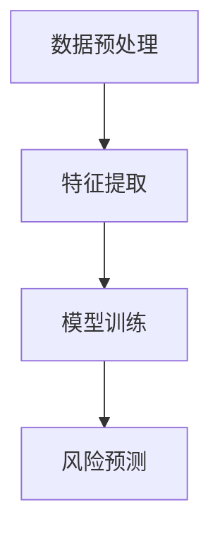
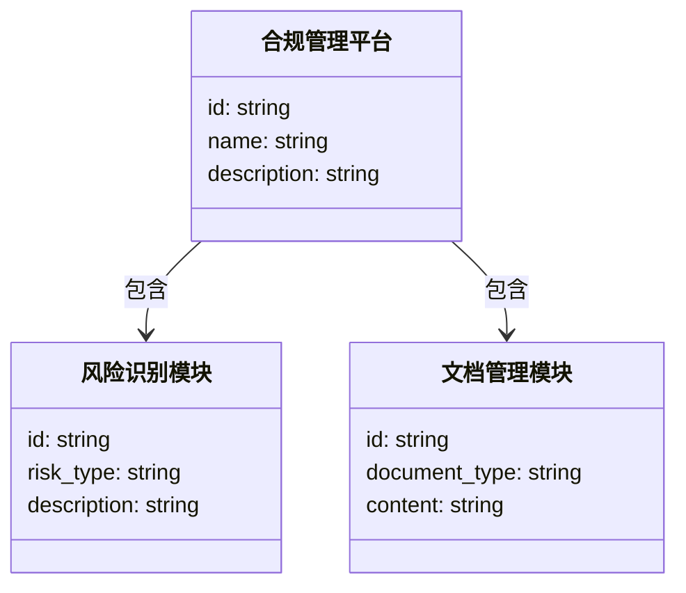
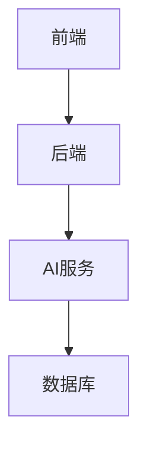
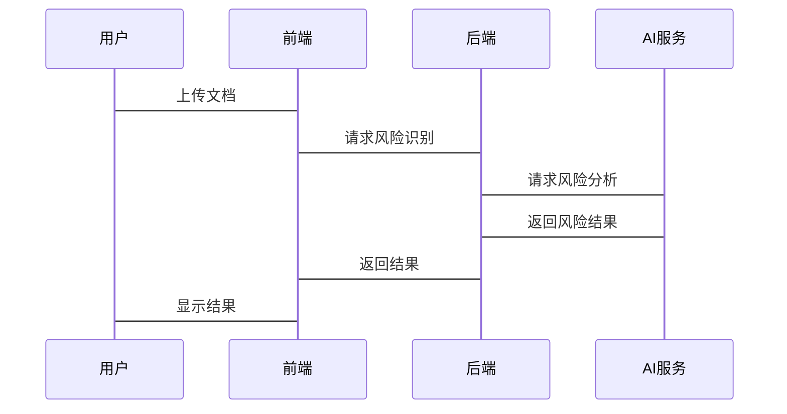

                 


# 《构建智能企业合规管理平台：AI辅助风险识别》

**关键词：企业合规管理、AI技术、风险识别、系统设计、法律合规、智能化平台**

**摘要：**  
本文深入探讨了如何利用人工智能技术构建智能企业合规管理平台，特别是通过AI辅助风险识别来提升企业合规管理的效率和准确性。文章从企业合规管理的背景、核心概念、AI技术的应用原理、系统架构设计，到实际项目实现和最佳实践，全面解析了构建智能企业合规管理平台的各个环节。通过详细的技术分析和实际案例，本文为读者提供了从理论到实践的全面指导，帮助企业在数字化转型中更好地应对合规管理的挑战。

---

## 第一章：企业合规管理的现状与挑战

### 1.1 企业合规管理的定义与重要性  
- **1.1.1 合规管理的定义**  
  合规管理是指企业为了遵守相关法律法规、行业标准和企业内部规章制度，对自身的经营行为进行规范和监督的过程。  
- **1.1.2 企业合规管理的重要性**  
  合规管理是企业合法经营的基础，直接关系到企业的生存和发展。  
- **1.1.3 合规管理的核心要素**  
  包括制度建设、流程管理、责任分配、监督机制和持续改进等方面。

### 1.2 企业合规管理中的风险识别问题  
- **1.2.1 风险识别的定义与分类**  
  风险识别是指在企业经营活动中，识别可能影响合规性的风险因素，并对其进行分类和评估。  
- **1.2.2 传统风险识别方法的局限性**  
  传统方法依赖人工经验，效率低、成本高，且容易出现遗漏或误判。  
- **1.2.3 AI技术在风险识别中的优势**  
  AI技术能够快速处理大量数据，提高风险识别的准确性和效率。

### 1.3 AI辅助企业合规管理的潜力与应用前景  
- **1.3.1 AI在企业合规管理中的应用场景**  
  包括合同审查、法律风险评估、合规流程优化等。  
- **1.3.2 AI辅助风险识别的优势**  
  提高风险识别的精准度，降低合规管理成本，提升企业整体效率。  
- **1.3.3 企业合规管理的未来趋势**  
  随着AI技术的不断发展，企业合规管理将更加智能化、自动化。

---

## 第二章：AI辅助风险识别的核心概念与联系

### 2.1 合规管理与风险识别的关系  
- **2.1.1 合规管理中的风险识别流程**  
  风险识别是合规管理的重要环节，贯穿于企业经营的全过程。  
- **2.1.2 风险识别在合规管理中的作用**  
  风险识别能够帮助企业提前发现潜在问题，避免合规风险的发生。  
- **2.1.3 合规管理与风险识别的边界与外延**  
  合规管理的外延更广，而风险识别是合规管理的核心环节之一。

### 2.2 AI辅助风险识别的核心原理  
- **2.2.1 机器学习在风险识别中的应用**  
  通过训练模型，AI能够从历史数据中学习，识别潜在风险。  
- **2.2.2 自然语言处理在合规文档分析中的作用**  
  NLP技术能够自动分析合规文档，提取关键信息，辅助风险识别。  
- **2.2.3 数据挖掘在风险识别中的应用**  
  数据挖掘技术能够从海量数据中发现潜在模式，帮助识别风险。

### 2.3 核心概念对比与ER实体关系图  
- **2.3.1 合规管理与风险识别的核心概念对比表**  
  | 概念 | 定义 | 特性 | 应用场景 |  
  |------|------|------|----------|  
  | 合规管理 | 企业遵守法律法规的管理活动 | 系统性、全面性 | 合规审查、流程优化 |  
  | 风险识别 | 发现潜在风险的过程 | 主动性、精准性 | 合规审计、风险预警 |  
- **2.3.2 合规管理平台的ER实体关系图**  
```mermaid
er
    entity 合规管理平台 {
        id: string
        name: string
        description: string
    }
    entity 风险识别 {
        id: string
        risk_type: string
        description: string
    }
    entity 文档管理 {
        id: string
        document_type: string
        content: string
    }
    合规管理平台 --> 风险识别: 包含
    合规管理平台 --> 文档管理: 包含
```

---

## 第三章：AI辅助风险识别的算法原理

### 3.1 机器学习在风险识别中的应用  
- **3.1.1 机器学习的基本原理**  
  机器学习是一种通过数据训练模型，使其能够进行预测或分类的技术。  
- **3.1.2 常见的机器学习算法及其适用场景**  
  - **监督学习**：适用于分类问题，如风险类型识别。  
  - **无监督学习**：适用于聚类问题，如异常风险检测。  
- **3.1.3 支持向量机（SVM）的应用**  
  SVM是一种常用的分类算法，适用于高维数据的分类问题。

### 3.2 自然语言处理在合规文档分析中的应用  
- **3.2.1 NLP技术的基本原理**  
  NLP技术能够对文本进行分词、句法分析、实体识别等处理。  
- **3.2.2 基于BERT的文本分析模型**  
  BERT是一种预训练语言模型，能够有效处理文本信息，提取关键内容。  
- **3.2.3 实例分析**  
  通过实际案例展示NLP技术在合规文档分析中的应用。

### 3.3 数据挖掘在风险识别中的应用  
- **3.3.1 数据挖掘的基本原理**  
  数据挖掘是从海量数据中发现潜在模式和关联的技术。  
- **3.3.2 关联规则挖掘的应用**  
  通过关联规则挖掘，能够发现不同风险因素之间的关联性。  
- **3.3.3 实例分析**  
  通过实际案例展示数据挖掘技术在风险识别中的应用。

### 3.4 算法流程图与代码实现  
- **3.4.1 机器学习算法流程图**  

- **3.4.2 代码实现**  
```python
# 示例代码：基于机器学习的风险识别模型
from sklearn.svm import SVC
from sklearn.preprocessing import StandardScaler
from sklearn.model_selection import train_test_split

# 数据预处理
X = ...  # 特征数据
y = ...  # 标签

# 数据划分
X_train, X_test, y_train, y_test = train_test_split(X, y, test_size=0.2)

# 标准化处理
scaler = StandardScaler()
X_train_scaled = scaler.fit_transform(X_train)
X_test_scaled = scaler.transform(X_test)

# 模型训练
model = SVC()
model.fit(X_train_scaled, y_train)

# 模型预测
y_pred = model.predict(X_test_scaled)
```

### 3.5 数学公式解析  
- **3.5.1 支持向量机的数学模型**  
  $$ \text{目标函数}：\min \frac{1}{2} \|w\|^2 + C \sum_{i=1}^n \xi_i $$  
  $$ \text{约束条件}：y_i (w \cdot x_i + b) \geq 1 - \xi_i, \xi_i \geq 0 $$  
- **3.5.2 BERT模型的损失函数**  
  $$ \text{损失函数}：L = -\sum_{i=1}^n y_i \log p(y_i | x_i) $$  

---

## 第四章：系统分析与架构设计

### 4.1 项目背景与需求分析  
- **4.1.1 项目背景**  
  随着企业规模的扩大，合规管理的复杂性不断提高，亟需智能化的解决方案。  
- **4.1.2 系统需求分析**  
  包括数据采集、风险识别、结果展示等功能需求。

### 4.2 系统功能设计  
- **4.2.1 领域模型类图**  


### 4.3 系统架构设计  
- **4.3.1 分层架构**  
  包括前端、后端和AI服务层。  
- **4.3.2 系统架构图**  


### 4.4 接口设计与交互流程图  
- **4.4.1 API接口设计**  
  - 文档上传接口：用于上传合规文档。  
  - 风险识别接口：用于获取风险识别结果。  
- **4.4.2 交互流程图**  


---

## 第五章：项目实战与案例分析

### 5.1 项目环境搭建  
- **5.1.1 开发环境配置**  
  - Python 3.8及以上版本  
  - 安装必要的库：scikit-learn、BERT、Flask等。  

### 5.2 系统核心实现  
- **5.2.1 核心代码实现**  
```python
# 示例代码：AI服务端
from flask import Flask, request, jsonify
import joblib
import numpy as np

app = Flask(__name__)
model = joblib.load('risk_model.pkl')
scaler = joblib.load('risk_scaler.pkl')

@app.route('/api/risk_identify', methods=['POST'])
def risk_identify():
    data = request.json
    X = np.array([data['features']])
    X_scaled = scaler.transform(X)
    prediction = model.predict(X_scaled)
    return jsonify({'result': prediction[0]})

if __name__ == '__main__':
    app.run(debug=True)
```

### 5.3 代码解读与功能分析  
- **5.3.1 代码功能分析**  
  以上代码展示了AI服务端的实现，包括模型加载、数据预处理和预测结果返回。  

### 5.4 实际案例分析  
- **5.4.1 案例背景**  
  某企业需要识别其供应链中的合规风险。  
- **5.4.2 案例分析**  
  使用AI辅助风险识别模型，快速识别出潜在的供应商合规问题，并生成风险报告。  

### 5.5 项目小结  
- **5.5.1 项目总结**  
  通过AI技术实现企业合规管理的智能化，显著提高了风险识别的效率和准确性。  
- **5.5.2 经验与教训**  
  数据质量对企业合规管理平台的性能影响巨大，需重视数据的清洗和标注工作。

---

## 第六章：最佳实践与注意事项

### 6.1 最佳实践  
- **6.1.1 数据处理的注意事项**  
  确保数据的完整性和一致性，避免偏差。  
- **6.1.2 模型调优的技巧**  
  使用交叉验证优化模型参数，避免过拟合。  

### 6.2 系统维护与升级  
- **6.2.1 系统维护**  
  定期更新模型，确保其适应新的法律法规变化。  
- **6.2.2 系统升级**  
  随着技术的发展，及时升级系统架构，引入更先进的AI技术。  

### 6.3 注意事项  
- **6.3.1 数据隐私保护**  
  在处理企业数据时，需严格遵守数据隐私保护法规。  
- **6.3.2 系统稳定性**  
  确保系统运行的稳定性，避免因技术问题导致合规管理中断。  

---

## 第七章：附录与拓展阅读

### 7.1 参考文献  
- [1] 刘某某. 《企业合规管理与AI技术应用》. 北京: 某某出版社, 2022.  
- [2]某某公司. 《AI辅助风险识别技术白皮书》. 2023.  

### 7.2 工具推荐  
- **AI工具推荐**：TensorFlow、PyTorch、Hugging Face。  
- **开发工具推荐**：VS Code、PyCharm、Jupyter Notebook。  

### 7.3 拓展阅读  
- 推荐阅读《机器学习实战》、《深度学习入门》等书籍，进一步提升AI技术应用能力。

---

**小结**：  
本文从企业合规管理的背景出发，详细探讨了AI辅助风险识别的核心概念、算法原理、系统架构设计和实际项目实现。通过理论与实践相结合的方式，为读者提供了构建智能企业合规管理平台的全面指导。未来，随着AI技术的不断发展，企业合规管理将更加智能化、自动化，为企业创造更大的价值。

