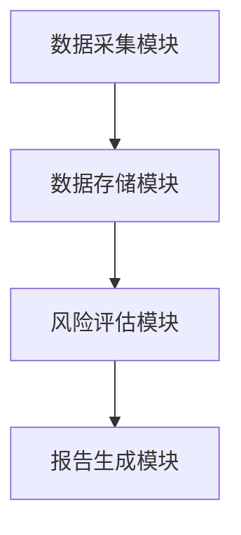
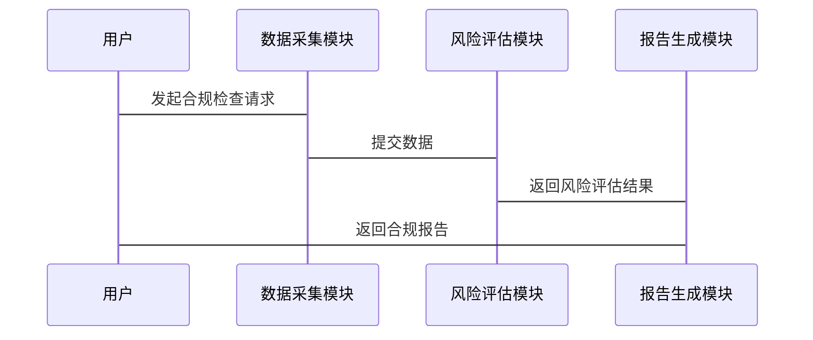

                 


# 构建智能企业合规管理平台：自动化监控与报告

> 关键词：企业合规管理，智能平台，自动化监控，风险评估，数据安全

> 摘要：本文深入探讨了构建智能企业合规管理平台的必要性、核心技术和实现方法。通过分析企业合规管理的关键要素，结合人工智能、大数据和区块链等技术，详细阐述了如何利用自动化监控和报告功能提升企业合规管理的效率和准确性。文章还提供了系统的架构设计、算法实现和项目实战，为读者提供全面的技术指导。

---

# 第一部分：企业合规管理平台的背景与概述

## 第1章：企业合规管理的背景与重要性

### 1.1 企业合规管理的定义与核心概念

#### 1.1.1 合规管理的定义
企业合规管理是指企业在经营过程中，遵循相关法律法规、行业标准以及企业内部规章制度的管理活动。其核心目标是确保企业的各项业务活动合法、合规，降低法律风险，提升企业的信誉和可持续发展能力。

#### 1.1.2 企业合规管理的核心要素
企业合规管理涉及多个方面，主要包括：
- **数据安全与隐私保护**：确保企业数据的机密性、完整性和可用性，防止数据泄露和滥用。
- **合同管理**：对合同的起草、审批、履行和归档进行合规性评估，确保合同内容符合法律法规。
- **风险评估**：识别潜在的法律风险，并制定相应的应对策略。
- **反腐败与合规文化**：建立合规文化，防止腐败行为，确保企业内部操作的透明性和公正性。

#### 1.1.3 合规管理的边界与外延
合规管理不仅涉及企业内部的管理活动，还包括与外部相关方（如客户、供应商、监管机构等）的互动。其外延包括但不限于数据隐私、知识产权、劳动法、反垄断法等多个领域。

### 1.2 智能企业合规管理平台的必要性

#### 1.2.1 传统合规管理的局限性
传统的合规管理方式主要依赖人工操作，效率低下且容易出错。例如，手动审查合同、手动记录合规记录等方法不仅耗时，还可能遗漏重要信息。此外，传统方法难以实时监控企业动态，无法及时应对风险。

#### 1.2.2 智能化合规管理的优势
引入人工智能、大数据等技术后，企业合规管理可以实现自动化、智能化。例如：
- **自动化监控**：实时跟踪企业的各项业务活动，自动识别潜在风险。
- **智能报告生成**：根据监控结果自动生成合规报告，减少人工干预。
- **预测性分析**：通过历史数据和机器学习模型，预测未来的合规风险，提前制定应对策略。

#### 1.2.3 企业合规管理的未来趋势
随着技术的不断发展，企业合规管理将更加依赖智能化工具。未来的合规管理平台将具备更强的自我学习和适应能力，能够根据企业的实际需求动态调整监控策略。

---

## 第2章：企业合规管理的核心要素

### 2.1 数据安全与隐私保护

#### 2.1.1 数据安全的重要性
数据是企业的核心资产，数据的安全性直接关系到企业的生存和发展。合规管理要求企业采取有效的技术措施，防止数据泄露和未经授权的访问。

#### 2.1.2 隐私保护的合规要求
随着《通用数据保护条例》（GDPR）等法律法规的实施，企业必须严格遵守数据隐私保护规定，确保个人数据的合法使用。

#### 2.1.3 数据分类与分级管理
企业需要根据数据的重要性进行分类和分级管理。例如，将数据分为“机密”、“秘密”、“公开”等类别，并制定相应的访问控制策略。

### 2.2 合同管理与合规性评估

#### 2.2.1 合同合规性评估的关键点
合同合规性评估需要关注合同内容是否符合相关法律法规，特别是涉及条款的合法性、公平性等问题。

#### 2.2.2 合同自动化审查的技术实现
通过自然语言处理（NLP）技术，可以自动识别合同中的关键条款，评估其合规性。例如，检查合同中的违约责任条款是否符合法律规定。

#### 2.2.3 合同管理系统的功能模块
一个完整的合同管理系统应包括合同起草、审批、履行监控和归档管理等功能模块，确保合同全生命周期的合规性。

### 2.3 风险评估与合规监控

#### 2.3.1 风险评估的基本方法
企业可以通过风险评估矩阵（如概率-影响矩阵）对潜在风险进行量化分析，确定风险的优先级。

#### 2.3.2 合规监控的关键步骤
合规监控包括数据采集、风险识别、评估和报告生成等步骤。通过自动化监控，可以实时发现潜在风险，并及时采取应对措施。

#### 2.3.3 合规监控的实施工具
常用的合规监控工具包括日志分析工具、流程监控工具等，这些工具可以帮助企业实现业务流程的可视化监控。

---

## 第3章：智能企业合规管理平台的技术基础

### 3.1 人工智能在合规管理中的应用
人工智能技术（如机器学习、自然语言处理）可以用于自动识别合规风险、分类文档等任务。

### 3.2 大数据技术在合规管理中的应用
大数据技术可以帮助企业收集和分析海量数据，发现潜在的合规风险。

### 3.3 区块链技术在合规管理中的应用
区块链技术可以用于构建可信的合规记录，确保数据的不可篡改性和透明性。

---

## 第4章：合规风险识别与评估的算法原理

### 4.1 算法原理概述
合规风险识别与评估的算法通常包括数据预处理、特征提取、模型训练和预测等步骤。

#### 4.1.1 数据预处理
数据预处理包括数据清洗、特征提取等步骤，确保输入数据的质量和适用性。

#### 4.1.2 特征提取
特征提取是将原始数据转换为适合模型输入的特征向量。

#### 4.1.3 模型训练
使用机器学习算法（如随机森林、支持向量机等）对数据进行训练，建立风险评估模型。

#### 4.1.4 预测与评估
通过模型对新的数据进行预测，并评估预测结果的准确性。

### 4.2 算法实现

#### 4.2.1 使用Python实现风险评估模型
以下是一个简单的Python代码示例：

```python
import pandas as pd
from sklearn.model_selection import train_test_split
from sklearn.ensemble import RandomForestClassifier
from sklearn.metrics import accuracy_score

# 加载数据
data = pd.read_csv('compliance_risk.csv')

# 分割数据
X = data.drop('label', axis=1)
y = data['label']

X_train, X_test, y_train, y_test = train_test_split(X, y, test_size=0.2, random_state=42)

# 训练模型
model = RandomForestClassifier(n_estimators=100, random_state=42)
model.fit(X_train, y_train)

# 预测与评估
y_pred = model.predict(X_test)
print(f'Accuracy: {accuracy_score(y_test, y_pred)}')
```

#### 4.2.2 风险评分模型
风险评分模型可以通过以下公式计算：

$$ \text{风险评分} = \sum_{i=1}^{n} w_i \cdot f_i $$

其中，\(w_i\) 是特征 \(f_i\) 的权重，\(f_i\) 是特征的值。

---

## 第5章：系统架构设计与实现

### 5.1 系统功能设计
系统功能设计包括数据采集模块、风险评估模块、报告生成模块等。

#### 5.1.1 数据采集模块
数据采集模块负责从企业系统中采集相关数据，如日志数据、交易记录等。

#### 5.1.2 风险评估模块
风险评估模块使用机器学习模型对采集的数据进行分析，识别潜在风险。

#### 5.1.3 报告生成模块
报告生成模块根据分析结果自动生成合规报告，供企业决策参考。

### 5.2 系统架构设计

#### 5.2.1 系统架构图
以下是系统架构的Mermaid图：



#### 5.2.2 接口设计
系统需要定义清晰的API接口，确保各模块之间的数据交互高效可靠。

### 5.3 系统交互流程

#### 5.3.1 合规检查请求的处理流程
以下是系统交互的Mermaid序列图：



---

## 第6章：项目实战

### 6.1 环境安装与配置
需要安装Python、Jupyter Notebook、scikit-learn等工具。

### 6.2 核心功能实现

#### 6.2.1 数据采集模块
使用Flask框架开发一个简单的API，用于接收数据。

```python
from flask import Flask, request, jsonify

app = Flask(__name__)

@app.route('/api/data', methods=['POST'])
def receive_data():
    data = request.json
    # 处理数据
    return jsonify({'status': 'success', 'message': '数据接收成功'})

if __name__ == '__main__':
    app.run(debug=True)
```

#### 6.2.2 风险评估模块
使用Scikit-learn库训练随机森林模型。

#### 6.2.3 报告生成模块
根据风险评估结果生成HTML格式的报告。

---

## 第7章：最佳实践与总结

### 7.1 小结
本文详细介绍了构建智能企业合规管理平台的必要性、技术基础和实现方法。通过自动化监控和报告功能，企业可以显著提高合规管理的效率和准确性。

### 7.2 注意事项
在实际应用中，企业需要根据自身的业务特点和合规要求，调整系统的功能模块和算法模型。

### 7.3 未来展望
随着技术的不断进步，企业合规管理将更加智能化和自动化。未来的合规管理平台将具备更强的自我学习和适应能力，能够更好地应对复杂的合规挑战。

---

## 附录

### 附录A：相关法律法规列表
1. 《通用数据保护条例》（GDPR）
2. 《反腐败法》
3. 《网络安全法》

### 附录B：推荐的工具与资源
1. 数据分析工具：Python、R
2. 机器学习库：Scikit-learn、TensorFlow
3. 参考书籍：《机器学习实战》、《数据驱动的合规管理》

--- 

通过以上内容，读者可以系统地了解构建智能企业合规管理平台的全过程，并能够根据实际需求进行相应的开发和优化。

