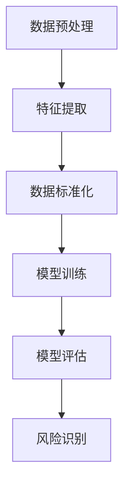
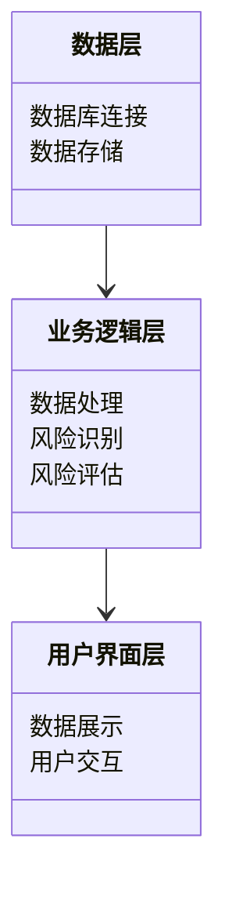
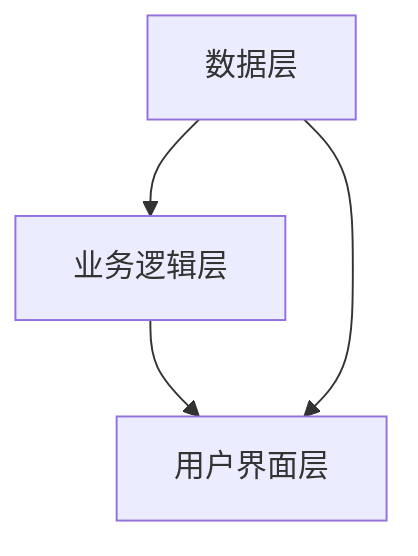

                 


# 构建智能企业合规管理系统：AI辅助风险识别与控制

## 关键词：企业合规管理，AI辅助，风险识别，风险控制，机器学习

## 摘要：  
随着企业规模的不断扩大和全球化进程的加速，合规管理已成为企业运营中的核心问题。传统的合规管理方式效率低下，难以应对日益复杂的监管要求和风险。通过引入人工智能技术，企业可以实现风险的智能化识别与控制，从而构建高效、智能的合规管理系统。本文将详细探讨如何利用AI技术构建智能企业合规管理系统，包括系统架构设计、算法原理、项目实战等内容，为企业合规管理的智能化转型提供参考。

---

## 第一章：企业合规管理的背景与挑战

### 1.1 合规管理的定义与重要性

合规管理是指企业遵循相关法律法规、行业标准和内部政策，确保企业行为合法、合规的过程。合规管理是企业风险管理的重要组成部分，直接关系到企业的声誉、财务稳定性和可持续发展。

#### 1.1.1 合规管理的定义
合规管理是指企业在经营活动中，遵循相关法律法规、行业标准和内部政策，确保企业行为合法、合规的过程。合规管理不仅是企业合法经营的基础，也是企业风险管理的重要组成部分。

#### 1.1.2 合规管理在企业中的作用
合规管理在企业中具有以下重要作用：
- **避免法律风险**：通过合规管理，企业可以避免因违反法律法规而导致的法律纠纷和罚款。
- **提升企业声誉**：合规经营能够提升企业的社会形象和声誉，增强客户和合作伙伴的信任。
- **降低经营成本**：合规管理可以减少因违规行为导致的额外成本，如罚款、诉讼费用等。

#### 1.1.3 合规管理的挑战与痛点
尽管合规管理的重要性不言而喻，但在实际操作中，企业面临以下挑战：
- **数据分散**：企业的数据分布在不同的部门和系统中，难以统一管理和分析。
- **法规复杂**：法律法规繁多且不断更新，企业难以及时掌握和应用。
- **人工效率低**：传统的合规管理依赖人工审查，效率低下且容易出错。

### 1.2 AI在企业合规管理中的应用

随着人工智能技术的快速发展，AI在企业合规管理中的应用越来越广泛。AI技术可以帮助企业实现风险的智能化识别与控制，提升合规管理的效率和准确性。

#### 1.2.1 AI技术在合规管理中的优势
- **高效性**：AI可以快速处理大量数据，帮助企业快速识别潜在风险。
- **准确性**：AI可以通过机器学习算法，从历史数据中学习，提高风险识别的准确性。
- **实时性**：AI可以实时监控企业的经营行为，及时发现和应对潜在风险。

#### 1.2.2 AI在风险识别与控制中的作用
- **风险识别**：AI可以通过分析企业的历史数据和实时数据，识别潜在的合规风险。
- **风险评估**：AI可以对识别出的风险进行评估，确定其严重性和影响范围。
- **风险控制**：AI可以为企业提供风险控制的建议，帮助企业在风险发生前采取措施。

#### 1.2.3 企业合规管理的智能化转型
企业合规管理的智能化转型是未来的趋势。通过引入AI技术，企业可以构建智能合规管理系统，实现合规管理的自动化、智能化和高效化。

---

## 第二章：智能企业合规管理系统的构建目标

### 2.1 系统构建的目标

智能企业合规管理系统的构建目标是通过AI技术，实现企业合规管理的智能化、自动化和高效化。

#### 2.1.1 提升合规管理效率
- 通过AI技术，企业可以快速处理大量数据，减少人工审查的时间和成本。
- AI可以通过自动化流程，提高合规管理的效率。

#### 2.1.2 实现风险的智能化识别与控制
- AI可以通过机器学习算法，从历史数据中学习，提高风险识别的准确性。
- AI可以实时监控企业的经营行为，及时发现和应对潜在风险。

#### 2.1.3 降低企业合规成本
- 通过自动化和智能化的合规管理，企业可以减少人工审查的时间和成本。
- AI可以通过预测分析，帮助企业提前规避潜在风险，降低合规成本。

### 2.2 系统构建的核心要素

构建智能企业合规管理系统需要考虑以下几个核心要素：

#### 2.2.1 数据采集与处理
- 数据来源：企业的经营数据、法律法规数据、行业标准数据等。
- 数据预处理：数据清洗、数据转换、数据整合等。
- 数据存储：数据仓库、数据库等。

#### 2.2.2 AI算法的选择与实现
- 算法选择：根据具体需求选择合适的机器学习算法，如支持向量机（SVM）、随机森林（Random Forest）、神经网络等。
- 算法实现：通过Python等编程语言实现算法，并进行模型训练和优化。

#### 2.2.3 系统架构设计
- 系统功能设计：包括数据采集、风险识别、风险评估、风险控制等功能模块。
- 系统架构设计：采用分层架构，包括数据层、业务逻辑层、用户界面层等。

---

## 第三章：AI辅助风险识别与控制的核心概念

### 3.1 风险识别的基本原理

风险识别是企业合规管理中的重要环节，AI技术可以通过数据驱动的方式，实现风险的智能化识别。

#### 3.1.1 风险识别的定义与方法
- 风险识别的定义：通过分析企业的经营数据，识别潜在的合规风险。
- 风险识别的方法：基于规则的识别、基于机器学习的识别、基于自然语言处理的识别等。

#### 3.1.2 数据驱动的AI风险识别模型
- 数据驱动的AI风险识别模型是基于机器学习算法，通过分析企业的历史数据，学习潜在的风险特征，从而实现风险的智能化识别。

#### 3.1.3 风险识别的关键特征
- 数据特征：企业的经营数据，如财务数据、业务数据、法律数据等。
- 风险特征：风险的类型、风险的严重性、风险的影响范围等。

### 3.2 风险控制的实现机制

风险控制是企业合规管理中的另一个重要环节，AI技术可以通过预测分析和智能决策，实现风险的智能化控制。

#### 3.2.1 风险评估与优先级排序
- 风险评估：通过分析风险的特征，评估风险的严重性和影响范围。
- 风险优先级排序：根据风险的评估结果，确定风险的优先级，优先处理高优先级的风险。

#### 3.2.2 AI在风险控制中的应用
- 预测分析：通过机器学习算法，预测潜在风险的发生概率和影响范围。
- 智能决策：根据预测结果，提供风险控制的建议和策略。

---

## 第四章：AI辅助风险识别的算法原理

### 4.1 算法选择与实现

#### 4.1.1 算法选择
- 支持向量机（SVM）：适用于分类问题，常用于风险分类。
- 随机森林（Random Forest）：适用于分类和回归问题，常用于风险评估。
- 神经网络：适用于复杂非线性问题，常用于风险预测。

#### 4.1.2 算法实现
- 数据预处理：数据清洗、特征提取、数据标准化等。
- 模型训练：使用训练数据训练模型，调整模型参数。
- 模型评估：通过测试数据评估模型的准确率、召回率等性能指标。

### 4.2 算法流程图



### 4.3 算法实现代码

```python
from sklearn.svm import SVC
from sklearn.ensemble import RandomForestClassifier
from sklearn.neural_network import MLPClassifier
from sklearn.model_selection import train_test_split
from sklearn.metrics import accuracy_score

# 数据加载与预处理
data = load_data()  # 假设数据已加载
X = data.drop('label', axis=1)
y = data['label']

# 数据分割
X_train, X_test, y_train, y_test = train_test_split(X, y, test_size=0.2)

# 模型训练
model_svm = SVC().fit(X_train, y_train)
model_rf = RandomForestClassifier().fit(X_train, y_train)
model_nn = MLPClassifier().fit(X_train, y_train)

# 模型评估
y_pred_svm = model_svm.predict(X_test)
y_pred_rf = model_rf.predict(X_test)
y_pred_nn = model_nn.predict(X_test)

print(f"SVM准确率：{accuracy_score(y_test, y_pred_svm)}")
print(f"Random Forest准确率：{accuracy_score(y_test, y_pred_rf)}")
print(f"神经网络准确率：{accuracy_score(y_test, y_pred_nn)}")
```

---

## 第五章：数学模型与公式推导

### 5.1 风险评分模型

风险评分模型用于评估企业的风险程度，可以通过以下公式进行计算：

$$
\text{风险评分} = \sum_{i=1}^{n} w_i \cdot x_i
$$

其中，$w_i$ 是特征 $x_i$ 的权重，$x_i$ 是特征的取值。

### 5.2 风险概率模型

风险概率模型用于预测某项风险发生的概率，可以使用逻辑回归模型进行建模：

$$
P(y=1|x) = \frac{e^{\beta x}}{1 + e^{\beta x}}
$$

其中，$\beta$ 是模型的系数，$x$ 是输入特征。

---

## 第六章：系统架构设计

### 6.1 系统功能设计

#### 6.1.1 领域模型类图



#### 6.1.2 系统架构图



---

## 第七章：项目实战

### 7.1 环境安装与配置

- 安装Python和相关库：
  ```bash
  pip install numpy pandas scikit-learn matplotlib
  ```

### 7.2 核心代码实现

```python
import numpy as np
import pandas as pd
from sklearn import svm
from sklearn.ensemble import RandomForestClassifier
from sklearn.metrics import accuracy_score

# 数据加载
data = pd.read_csv('compliance_data.csv')
X = data.drop('label', axis=1)
y = data['label']

# 数据分割
X_train, X_test, y_train, y_test = train_test_split(X, y, test_size=0.2)

# 模型训练
model = RandomForestClassifier().fit(X_train, y_train)

# 模型预测
y_pred = model.predict(X_test)

# 模型评估
print(f"准确率：{accuracy_score(y_test, y_pred)}")
```

### 7.3 实际案例分析

通过实际案例分析，验证系统的有效性。例如，分析某企业的财务数据，识别潜在的财务风险，并提供风险控制建议。

---

## 第八章：总结与展望

### 8.1 最佳实践

- 数据是AI模型的核心，确保数据的准确性和完整性。
- 选择合适的算法，根据具体问题选择最优的模型。
- 定期更新模型，适应新的数据和法规变化。

### 8.2 小结

通过AI技术，企业可以实现合规管理的智能化、自动化和高效化，降低合规成本，提升企业竞争力。

### 8.3 注意事项

- 数据隐私和安全问题需要高度重视。
- 模型的可解释性需要考虑，确保模型的透明性和合规性。
- 定期监控和优化模型，确保模型的准确性和稳定性。

### 8.4 拓展阅读

- 《机器学习实战》
- 《Python机器学习》
- 《企业合规管理指南》

---

通过以上步骤，我们可以构建一个高效、智能的企业合规管理系统，利用AI技术实现风险的智能化识别与控制，为企业合规管理提供有力支持。

