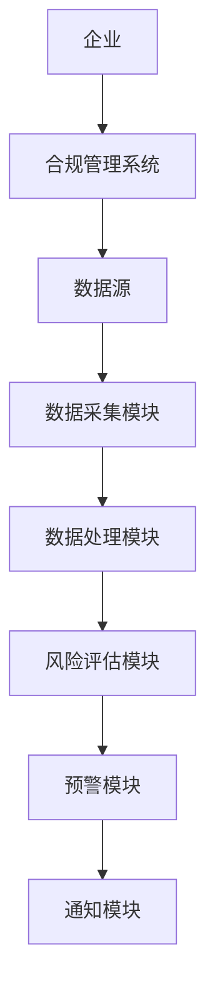
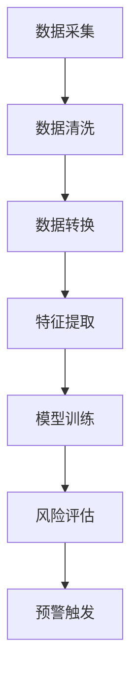
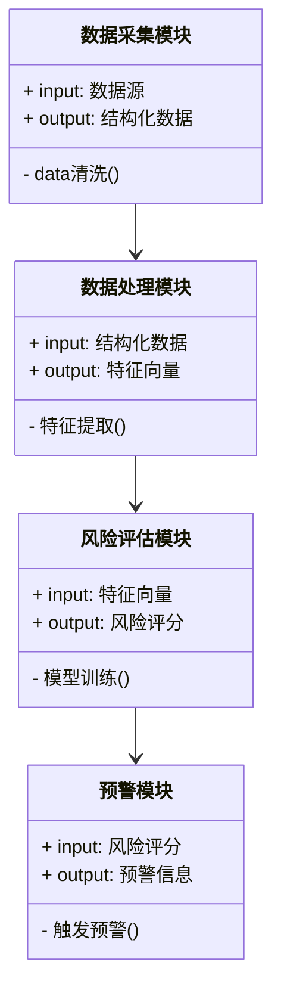
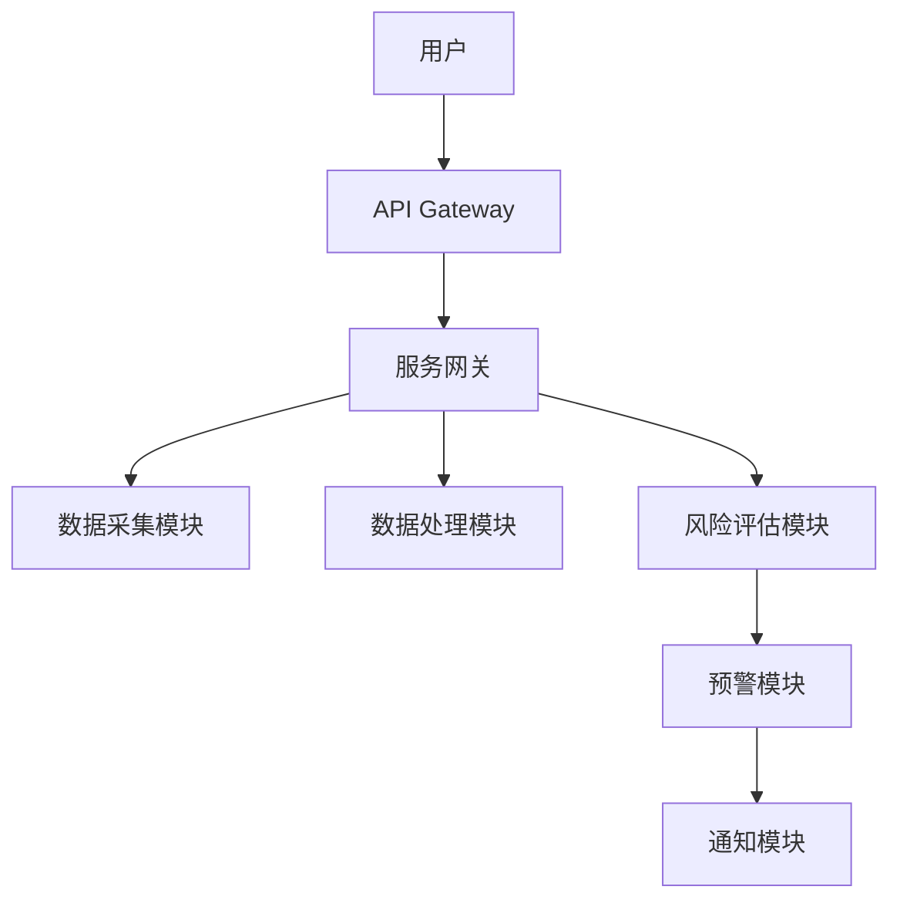

                 


# 构建智能企业合规管理系统：实时监控与预警机制设计

---

## 关键词：  
企业合规管理、实时监控、预警机制、人工智能、大数据、系统架构  

---

## 摘要：  
本文详细探讨了智能企业合规管理系统的构建过程，重点分析了其实时监控与预警机制的设计与实现。文章从合规管理的背景出发，结合企业实际需求，系统性地介绍了合规管理的核心概念、算法原理、系统架构设计以及项目实战。通过案例分析和代码实现，深入讲解了如何利用人工智能和大数据技术构建高效的合规管理系统，帮助企业实现合规风险的实时预警与智能管理。

---

# 第一部分: 智能企业合规管理系统的背景与核心概念

## 第1章: 合规管理的背景与问题背景

### 1.1 合规管理的背景  
#### 1.1.1 合规管理的定义与重要性  
合规管理是指企业在经营过程中，遵循相关法律法规、行业标准以及企业内部政策的管理活动。随着数字化转型的推进，企业合规管理的复杂性显著增加，尤其是在数据隐私、反腐败、反洗钱等领域，合规管理已成为企业风险管理的核心环节。  

#### 1.1.2 智能化合规管理的必要性  
传统的合规管理依赖人工检查和事后处理，效率低、覆盖面有限。随着企业规模的扩大和业务的复杂化，仅靠人工难以满足实时监控的需求。通过引入人工智能和大数据技术，智能化合规管理能够实现数据的实时采集、分析和预警，显著提升合规管理的效率和准确性。  

#### 1.1.3 企业合规管理的现状与挑战  
当前，许多企业仍采用传统的合规管理方式，存在以下问题：  
1. 数据分散，难以实时采集和分析。  
2. 缺乏智能化工具，合规风险发现滞后。  
3. 高昂的人力成本和低效的工作方式。  
4. 合规标准的多样性和复杂性对企业技术能力提出更高要求。  

---

### 1.2 问题背景  

#### 1.2.1 企业合规管理的核心问题  
企业合规管理的核心问题在于如何快速、准确地识别和处理合规风险。具体包括：  
- 数据采集与处理的困难。  
- 实时监控技术的缺失。  
- 预警机制的不完善。  

#### 1.2.2 实时监控与预警机制的必要性  
实时监控能够帮助企业及时发现潜在的合规风险，而预警机制则能够快速通知相关部门采取措施，避免风险扩大。通过实时监控与预警机制的结合，企业能够将合规管理从被动的事后处理转化为主动的风险预防。  

#### 1.2.3 合规管理中的常见问题与痛点  
- 数据来源多样，难以统一采集和处理。  
- 缺乏智能化工具，难以实现数据的深度分析。  
- 预警阈值设置不合理，导致误报或漏报。  
- 合规标准的动态变化对企业系统提出持续优化要求。  

---

## 第2章: 问题描述与解决思路  

### 2.1 合规管理中的问题描述  

#### 2.1.1 数据采集与处理的难点  
- 数据来源分散，格式多样，难以统一处理。  
- 数据量大，实时采集和处理对系统性能要求高。  
- 数据隐私保护与合规要求的冲突。  

#### 2.1.2 实时监控的技术挑战  
- 高频数据流的实时处理能力不足。  
- 监控算法的准确性与效率之间的平衡问题。  
- 系统的可扩展性和灵活性不足。  

#### 2.1.3 预警机制的设计与实现  
- 预警阈值的动态调整困难。  
- 预警信息的分类与优先级处理。  
- 预警通知的及时性和有效性。  

---

### 2.2 解决思路与技术选型  

#### 2.2.1 数据驱动的合规管理思路  
通过实时采集企业内外部数据，利用大数据技术进行深度分析，识别潜在的合规风险。  

#### 2.2.2 人工智能与大数据技术的应用  
- 利用机器学习算法进行风险预测与分类。  
- 通过自然语言处理技术分析文本数据。  
- 借助流处理技术实现数据的实时分析与预警。  

#### 2.2.3 系统架构与技术选型  
- 采用微服务架构，确保系统的可扩展性和灵活性。  
- 使用分布式存储技术，支持海量数据的高效处理。  
- 选择实时流处理框架（如Apache Kafka、Flink）进行数据处理。  

---

## 第3章: 系统边界与核心要素  

### 3.1 系统边界与范围  

#### 3.1.1 系统功能边界  
- 数据采集与处理：包括企业内部数据（如交易记录、员工行为数据）和外部数据（如法律法规更新）。  
- 实时监控：对数据进行实时分析，识别潜在风险。  
- 预警与通知：根据风险程度触发预警，并通过邮件、短信等方式通知相关人员。  

#### 3.1.2 系统适用的场景与范围  
- 金融行业：反洗钱、交易监控。  
- 制造业：供应链合规、安全生产。  
- 零售业：数据隐私保护、反欺诈。  

#### 3.1.3 系统与外部系统的交互  
- 与企业ERP系统、CRM系统对接，获取业务数据。  
- 与法律法规数据库对接，获取最新的合规标准。  
- 与企业内部通知系统对接，发送预警信息。  

---

### 3.2 核心概念与核心要素  

#### 3.2.1 合规数据的核心要素  
- 交易数据：包括金额、时间、参与方等。  
- 行为数据：包括员工操作记录、访问日志等。  
- 文本数据：包括合同、政策文件等。  

#### 3.2.2 实时监控的核心机制  
- 数据流处理：对实时数据流进行过滤、聚合和分析。  
- 风险评估：基于机器学习模型对数据进行风险评分。  
- 预警触发：当风险评分超过阈值时，触发预警。  

#### 3.2.3 预警机制的核心要素  
- 预警规则：基于合规标准设置的触发条件。  
- 预警分类：根据风险类型和严重程度进行分类。  
- 预警通知：通过多种渠道（如邮件、短信）通知相关人员。  

---

# 第二部分: 合规管理系统的核心概念与联系  

## 第4章: 核心概念与原理  

### 4.1 合规管理的核心概念  

#### 4.1.1 数据采集与处理  
- 数据源：企业内部系统、外部数据库、日志文件等。  
- 数据清洗：去除无效数据，处理缺失值和异常值。  
- 数据转换：将数据转换为适合分析的格式（如结构化数据）。  

#### 4.1.2 实时监控与分析  
- 数据流处理：使用流处理技术对实时数据进行处理。  
- 风险评估：基于机器学习模型对数据进行实时分析，识别潜在风险。  

#### 4.1.3 预警机制与反馈  
- 预警触发：当风险评分超过阈值时，触发预警。  
- 预警通知：通过多种渠道通知相关人员。  
- 反馈机制：根据反馈结果优化预警规则和模型。  

---

### 4.2 核心概念的联系  

#### 4.2.1 核心概念的属性对比  

| 核心概念 | 属性 | 描述 |
|----------|------|------|
| 数据采集 | 实时性 | 是否支持实时数据采集 |
| 数据分析 | 准确性 | 数据分析结果的准确性 |
| 预警机制 | 可配置性 | 是否支持自定义预警规则 |

---

## 第5章: 合规管理系统中的实体关系  

### 5.1 实体关系图  



---

## 第6章: 合规管理系统的算法原理  

### 6.1 数据处理流程  



---

### 6.2 算法实现  

#### 6.2.1 机器学习模型  

- 分类模型：用于识别合规风险类型。  
- 回归模型：用于预测风险的严重程度。  

#### 6.2.2 数据处理代码  

```python
import pandas as pd
from sklearn.preprocessing import StandardScaler
from sklearn.model_selection import train_test_split
from sklearn.linear_model import LogisticRegression

# 数据加载
data = pd.read_csv('compliance_data.csv')

# 数据预处理
X = data.drop('label', axis=1)
y = data['label']

# 数据标准化
scaler = StandardScaler()
X_scaled = scaler.fit_transform(X)

# 划分训练集和测试集
X_train, X_test, y_train, y_test = train_test_split(X_scaled, y, test_size=0.2)

# 模型训练
model = LogisticRegression()
model.fit(X_train, y_train)
```

---

### 6.3 数学模型  

- 逻辑回归模型：  
  $$ P(y=1|x) = \frac{e^{\beta x}}{1 + e^{\beta x}} $$  
- 线性回归模型：  
  $$ y = \beta_0 + \beta_1 x + \epsilon $$  

---

## 第7章: 系统分析与架构设计  

### 7.1 系统功能设计  

#### 7.1.1 领域模型  



---

### 7.2 系统架构设计  

#### 7.2.1 系统架构  



---

## 第8章: 项目实战  

### 8.1 环境安装  

#### 8.1.1 安装依赖  

```bash
pip install pandas scikit-learn kafka-python pyflink
```

---

### 8.2 核心代码实现  

#### 8.2.1 数据采集模块  

```python
from kafka import KafkaConsumer

# 消费者配置
consumer = KafkaConsumer('compliance_data', bootstrap_servers='localhost:9092')

for message in consumer:
    print(f"收到数据: {message.value}")
```

---

#### 8.2.2 数据处理模块  

```python
import pandas as pd

# 数据加载
data = pd.read_csv('compliance_data.csv')

# 数据清洗
data.dropna(inplace=True)

# 数据转换
data['timestamp'] = pd.to_datetime(data['timestamp'])
```

---

#### 8.2.3 模型训练模块  

```python
from sklearn.ensemble import RandomForestClassifier

# 模型训练
model = RandomForestClassifier()
model.fit(X_train, y_train)
```

---

### 8.3 实际案例分析  

#### 8.3.1 案例背景  
某金融机构需要实时监控交易数据，防止洗钱行为。  

#### 8.3.2 数据分析与处理  
- 数据源：交易记录、客户信息、日志文件。  
- 数据清洗：去除缺失值和异常值。  
- 数据转换：将时间戳转换为标准格式。  

#### 8.3.3 模型训练与评估  
- 使用随机森林模型进行交易风险分类。  
- 评估模型准确率、召回率等指标。  

---

## 第9章: 最佳实践与总结  

### 9.1 最佳实践  

#### 9.1.1 数据隐私保护  
- 数据脱敏处理。  
- 权限控制，确保只有授权人员可以访问敏感数据。  

#### 9.1.2 系统性能优化  
- 使用分布式架构，提升数据处理能力。  
- 优化算法模型，降低计算复杂度。  

---

### 9.2 项目小结  

通过本文的详细讲解，我们了解了智能企业合规管理系统的构建过程，包括实时监控与预警机制的设计与实现。通过案例分析和代码实现，我们掌握了如何利用人工智能和大数据技术提升企业合规管理的效率和准确性。  

---

### 9.3 注意事项  

- 确保系统具备灵活性，能够适应合规标准的动态变化。  
- 定期更新模型，提升风险识别的准确性。  
- 加强数据隐私保护，确保系统合规性。  

---

### 9.4 拓展阅读  

- 《大数据技术与合规管理》  
- 《人工智能在金融领域的应用》  
- 《企业风险管理与内部控制》  

---

# 结语  

构建智能企业合规管理系统是一项复杂的系统工程，需要结合企业实际需求，充分利用人工智能和大数据技术，设计高效的实时监控与预警机制。通过本文的系统性讲解，相信读者能够更好地理解和实现智能企业合规管理系统的构建。

