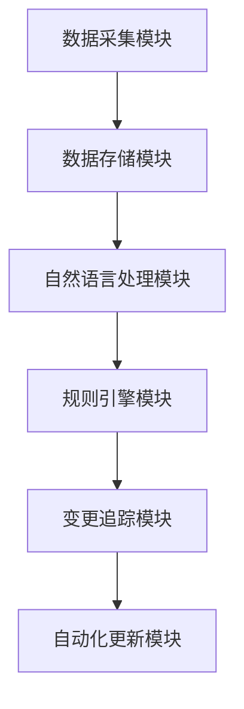

                 


# 构建智能企业合规管理系统：法规变更追踪与自动化更新

## 关键词：智能合规管理、法规变更、自然语言处理、规则引擎、自动化更新

## 摘要

在数字化转型的驱动下，企业合规管理正面临着前所未有的挑战。法规的频繁变化要求企业能够高效地追踪和更新相关合规要求，以避免法律风险和运营中断。传统的手动合规管理方式效率低下，容易出错，且难以应对动态变化的法规环境。因此，构建一个基于人工智能和自动化技术的智能企业合规管理系统变得尤为重要。

本文详细探讨了如何利用自然语言处理（NLP）技术和规则引擎来实现法规变更的自动追踪和更新。通过分析法规文本，提取关键信息，并结合企业现有的合规规则，系统能够智能识别法规变化，并自动生成更新建议。本文还介绍了系统的整体架构，包括数据采集、规则引擎、变更追踪和自动化更新模块，并通过实际案例展示了系统的实现过程和应用效果。

---

# 第一部分：企业合规管理的背景与挑战

## 第1章：企业合规管理的背景与挑战

### 1.1 合规管理的基本概念

#### 1.1.1 合规管理的定义与范围
合规管理是指确保企业行为符合相关法律法规、行业标准以及企业内部政策的过程。它涵盖了企业的所有业务活动，包括数据隐私、反腐败、环境保护等多个方面。

#### 1.1.2 企业合规管理的重要性
合规管理是企业合法运营的基础，直接关系到企业的法律责任、声誉风险和经营成本。合规管理的有效性直接影响企业的可持续发展能力。

#### 1.1.3 合规管理的边界与外延
合规管理不仅包括对内部员工的培训和监督，还涉及与外部合作伙伴、客户以及监管机构的互动。其外延涉及企业战略制定、风险管理、文化塑造等多个方面。

### 1.2 传统合规管理的痛点与不足

#### 1.2.1 人工管理的低效性
传统的合规管理依赖于人工检查和手动更新，效率低下且容易出错。随着法规的复杂化和多样化，人工管理难以满足企业的实际需求。

#### 1.2.2 法规更新的滞后性
法规变更频繁，但人工更新往往滞后，导致企业难以及时响应新的合规要求。这种滞后性可能引发法律风险和财务损失。

#### 1.2.3 信息孤岛与数据分散
企业内部各部门的信息系统往往分散，缺乏统一的平台来整合和管理合规数据。这种信息孤岛现象增加了合规管理的复杂性和成本。

### 1.3 智能化合规管理的必要性

#### 1.3.1 技术驱动合规管理的变革
人工智能和大数据技术的快速发展为合规管理的智能化提供了技术支持。通过自动化工具，企业可以更高效地处理海量法规信息。

#### 1.3.2 企业数字化转型的需求
数字化转型要求企业采用更加灵活和高效的管理方式。智能合规管理是企业数字化转型的重要组成部分，能够提升企业的竞争力和抗风险能力。

#### 1.3.3 法规变更追踪的自动化趋势
随着全球化进程的加速，法规变更的频率和复杂性不断增加。自动化追踪和更新能力成为企业合规管理的核心需求。

---

## 第2章：智能企业合规管理系统的概念

### 2.1 智能合规管理的核心概念

#### 2.1.1 系统的基本定义
智能企业合规管理系统是一种基于人工智能和自动化技术的系统，能够实时追踪法规变更，并自动生成合规更新建议。它能够帮助企业在复杂多变的法规环境中保持合规状态。

#### 2.1.2 核心要素与组成结构
智能合规管理系统的核心要素包括数据采集模块、自然语言处理模块、规则引擎模块、变更追踪模块和自动化更新模块。这些模块协同工作，实现法规信息的采集、解析、匹配和更新。

#### 2.1.3 系统的功能特征
- **自动化采集**：自动从法规数据库中获取最新法规信息。
- **智能解析**：使用NLP技术提取法规中的关键条款和变化部分。
- **规则匹配**：将法规变化与企业内部规则进行匹配，生成更新建议。
- **变更追踪**：记录法规变更的历史，提供变更影响分析。
- **自动化更新**：自动生成更新文档，并推送至相关系统和人员。

### 2.2 系统的架构与功能模块

#### 2.2.1 数据采集模块
数据采集模块负责从法规数据库（如政府官网、行业标准机构网站）中获取最新法规信息，并将其存储在系统中。采集过程可以通过爬虫技术实现。

#### 2.2.2 自然语言处理模块
NLP模块负责对采集到的法规文本进行解析，提取关键信息如条款、责任主体、生效日期等。常用的技术包括分词、实体识别和句法分析。

#### 2.2.3 规则引擎模块
规则引擎模块将提取的法规信息与企业的内部合规规则进行匹配，生成合规更新建议。规则引擎可以基于Rete算法实现高效的规则匹配。

#### 2.2.4 变更追踪模块
变更追踪模块记录法规变更的历史信息，分析变更对企业的影响，并生成变更影响报告。这有助于企业在变更发生时快速响应。

#### 2.2.5 自动化更新模块
自动化更新模块根据变更影响报告，自动生成更新文档，并将其推送至企业的相关系统和人员。这可以显著减少人工干预，提高更新效率。

### 2.3 系统的适用场景与优势

#### 2.3.1 适用的主要场景
- **跨国企业**：需要应对不同国家和地区的法规要求。
- **金融行业**：法规变更频繁，合规要求严格。
- **医疗行业**：涉及个人隐私和数据保护的法规复杂。
- **制造业**：需要遵守环保和安全生产法规。

#### 2.3.2 系统的主要优势
- **高效性**：自动化采集和解析法规信息，显著提高合规管理效率。
- **准确性**：基于NLP和规则引擎的智能分析，减少人为错误。
- **实时性**：实时追踪法规变更，确保企业始终合规。
- **可扩展性**：支持不同行业和地区的法规要求。

---

## 第3章：法规变更追踪的核心技术

### 3.1 自然语言处理在法规文本中的应用

#### 3.1.1 文本抽取与信息提取
NLP技术可以用于从法规文本中提取关键信息，如条款名称、责任主体、生效日期等。例如，使用spaCy库进行分词和实体识别。

#### 3.1.2 规则匹配与模式识别
通过预定义的规则和模式，可以识别法规文本中的特定模式，如“禁止”、“必须”等关键词。这有助于快速定位法规变化部分。

#### 3.1.3 变化检测与差异分析
使用文本相似度算法（如余弦相似度）比较旧法规和新法规，识别变化部分。变化检测可以帮助企业快速了解法规变更的影响。

### 3.2 基于规则的自动化更新机制

#### 3.2.1 规则引擎的设计原理
规则引擎通过预定义的规则库，将法规变化与企业内部规则进行匹配。匹配成功后，系统自动生成更新建议。

#### 3.2.2 规则匹配的实现方法
规则匹配可以基于Rete算法实现，该算法通过构建规则网络来高效匹配规则。例如，使用Drools框架实现规则引擎。

#### 3.2.3 更新流程的优化策略
为了提高更新效率，可以将规则引擎与自动化工作流引擎结合，实现从法规变更检测到更新实施的自动化流程。

### 3.3 变化检测算法的原理与实现

#### 3.3.1 基于相似度的文本匹配
文本相似度算法可以用于检测法规文本的变化。例如，使用TF-IDF和余弦相似度计算旧法规和新法规的相似度。

#### 3.3.2 基于机器学习的文本分类
机器学习模型可以用于分类法规文本的变化类型，如新增条款、修改条款、删除条款等。常用算法包括支持向量机（SVM）和随机森林。

#### 3.3.3 变化检测的实现步骤
1. 从法规数据库中获取旧法规和新法规。
2. 使用NLP技术提取文本特征。
3. 计算旧法规和新法规的相似度。
4. 根据相似度判断法规变化类型。

---

## 第4章：智能企业合规管理系统的实现

### 4.1 系统架构设计

#### 4.1.1 系统功能模块
系统主要包括数据采集模块、NLP模块、规则引擎模块、变更追踪模块和自动化更新模块。

#### 4.1.2 系统架构图
使用Mermaid图展示系统架构：


#### 4.1.3 系统交互流程
系统交互流程如下：
1. 数据采集模块从法规数据库中获取新法规。
2. NLP模块解析法规文本，提取关键信息。
3. 规则引擎模块匹配法规变化与企业规则。
4. 变更追踪模块记录变更历史，并生成变更影响报告。
5. 自动化更新模块根据变更报告生成更新文档，并推送至相关系统。

### 4.2 系统实现细节

#### 4.2.1 数据采集实现
使用Python的requests库和BeautifulSoup库实现法规信息的爬取：
```python
import requests
from bs4 import BeautifulSoup

url = "https://example.com/regulations"
response = requests.get(url)
soup = BeautifulSoup(response.text, 'html.parser')
regulations = soup.find_all('div', class_='regulation')
```

#### 4.2.2 NLP模块实现
使用spaCy库进行实体识别：
```python
import spacy

nlp = spacy.load("en_core_web_sm")
doc = nlp("This is a test sentence.")
for token in doc:
    print(token.text, token.pos_, token.dep_)
```

#### 4.2.3 规则引擎实现
使用Drools框架实现规则引擎：
```java
public class Rule {
    public static boolean matches(String text) {
        return text.contains("mandatory") || text.contains("prohibited");
    }
}
```

### 4.3 变更检测实现

#### 4.3.1 文本相似度计算
使用余弦相似度计算法规文本的相似度：
```python
from sklearn.feature_extraction.text import TfidfVectorizer
from sklearn.metrics.pairwise import cosine_similarity

vectorizer = TfidfVectorizer()
tfidf_matrix = vectorizer.fit_transform(documents)
similarity = cosine_similarity(tfidf_matrix)
```

#### 4.3.2 变化类型分类
使用随机森林算法分类法规变化类型：
```python
from sklearn.ensemble import RandomForestClassifier

model = RandomForestClassifier(n_estimators=100, random_state=42)
model.fit(X_train, y_train)
predictions = model.predict(X_test)
```

---

## 第5章：项目实战与应用案例

### 5.1 项目实战

#### 5.1.1 项目背景
某跨国企业需要应对不同国家和地区的数据隐私法规，如GDPR和CCPA。由于法规变更频繁，企业希望实现自动化的合规管理。

#### 5.1.2 项目目标
构建一个智能合规管理系统，实时追踪数据隐私法规的变更，并自动生成更新建议。

#### 5.1.3 实现步骤
1. 数据采集模块从欧盟和美国的法规数据库中获取最新法规。
2. NLP模块解析法规文本，提取关键条款和变化部分。
3. 规则引擎模块匹配法规变化与企业内部政策。
4. 变更追踪模块记录变更历史，并生成变更影响报告。
5. 自动化更新模块根据变更报告生成更新文档，并推送至企业的法律部门和IT部门。

### 5.2 应用案例

#### 5.2.1 案例背景
某金融机构需要应对不断变化的反洗钱法规。传统的人工合规管理效率低下，容易出错。

#### 5.2.2 系统应用
智能合规管理系统帮助该机构实现了法规变更的自动追踪和更新。系统每天自动获取最新法规，并通过NLP技术解析法规文本，识别变化部分。规则引擎将法规变化与内部政策进行匹配，并生成更新建议。变更追踪模块记录变更历史，并生成变更影响报告。自动化更新模块根据变更报告生成更新文档，并推送至相关系统和人员。

#### 5.2.3 应用效果
系统显著提高了合规管理的效率和准确性。机构能够及时响应法规变更，降低了法律风险和运营成本。

---

## 第6章：最佳实践与总结

### 6.1 最佳实践

#### 6.1.1 系统设计
- 确保系统的模块化设计，便于扩展和维护。
- 使用高效的数据存储和检索技术，提高系统性能。

#### 6.1.2 技术选型
- 选择合适的NLP库和规则引擎框架，确保系统的稳定性和可扩展性。
- 定期更新系统依赖库，保持技术的先进性。

#### 6.1.3 人员培训
- 对企业的合规管理人员进行系统的培训，确保他们能够熟练使用智能合规管理系统。
- 定期组织合规管理的内部研讨会，分享最佳实践和行业趋势。

### 6.2 总结

智能企业合规管理系统通过自动化追踪和更新法规变更，显著提高了企业的合规管理效率和准确性。系统的核心技术包括自然语言处理、规则引擎和变化检测算法。通过模块化设计和高效的系统架构，企业能够快速应对法规变更，降低法律风险。

### 6.3 未来展望

未来，智能合规管理系统将更加智能化和自动化。随着机器学习和深度学习技术的进步，系统将能够更准确地识别法规变化，并提供更加个性化的合规建议。同时，区块链技术的应用将提高系统的安全性和透明度，进一步增强企业的合规能力。

---

通过本文的详细讲解，读者可以全面了解智能企业合规管理系统的构建过程和技术实现。无论是从理论还是实践角度，本文都提供了丰富的知识和实用的指导，帮助企业应对日益复杂的合规管理挑战。

