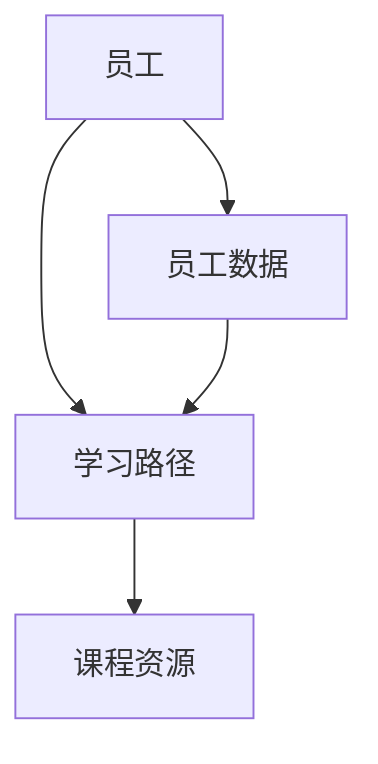
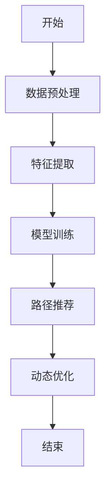
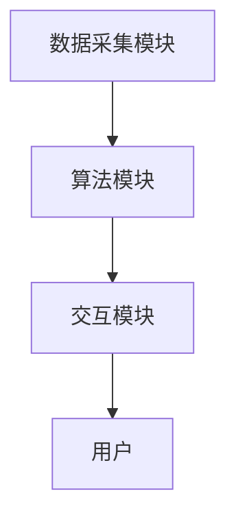
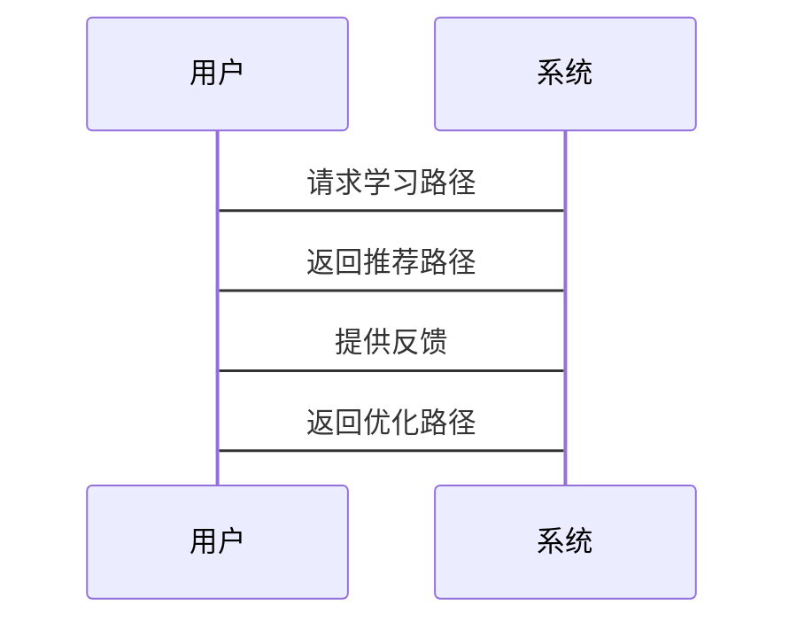

                 


# 构建智能企业培训系统：AI个性化学习路径

## 关键词：AI, 个性化学习, 企业培训, 学习路径, 智能系统, 机器学习, 深度学习

## 摘要：  
随着企业对员工培训需求的日益增长，传统的培训方式已难以满足个性化和高效性的要求。基于AI的智能企业培训系统通过分析员工的学习行为和需求，构建个性化的学习路径，为员工提供定制化的学习体验。本文将从背景、核心概念、算法原理、系统架构、项目实战到最佳实践，全面解析如何利用AI技术构建智能企业培训系统，帮助企业实现高效、个性化的员工培训。

---

## 第一章：智能企业培训系统的背景与问题分析

### 1.1 企业培训系统的现状与挑战

#### 1.1.1 传统企业培训的痛点
- **缺乏个性化**：传统培训通常采用统一的课程安排，忽视了员工的个性化需求。
- **效率低下**：难以精准匹配员工的学习需求和能力水平。
- **数据孤岛**：员工的学习数据分散，难以形成闭环反馈。
- **成本高昂**：传统培训方式需要大量人工干预，成本较高。

#### 1.1.2 AI技术在企业培训中的应用潜力
- AI可以通过数据分析和机器学习，为员工提供个性化的学习建议。
- AI可以实时监测员工的学习进度，优化学习路径。
- AI可以帮助企业快速识别员工的技能缺口，制定针对性的培训计划。

#### 1.1.3 个性化学习路径的重要性
- 提高员工学习的效率和效果。
- 增强员工的学习体验和满意度。
- 为企业培养更具竞争力的人才。

### 1.2 问题背景与问题描述

#### 1.2.1 传统培训系统的问题总结
- **个性化不足**：传统培训系统难以满足不同员工的学习需求。
- **数据利用低效**：缺乏对员工学习数据的深度分析和利用。
- **反馈机制缺失**：无法实时反馈学习效果，难以优化学习路径。

#### 1.2.2 AI个性化学习路径的核心问题
- 如何利用AI技术分析员工的学习行为和需求。
- 如何构建个性化的学习路径模型。
- 如何实现学习路径的动态优化和实时反馈。

#### 1.2.3 问题解决的目标与边界
- **目标**：构建一个基于AI的智能企业培训系统，实现个性化学习路径的动态优化。
- **边界**：系统主要关注学习路径的构建和优化，不涉及具体课程内容的设计。

### 1.3 核心要素与概念结构

#### 1.3.1 系统的核心要素分析
- **员工数据**：包括员工的基本信息、学习记录、技能水平等。
- **课程资源**：包括各种培训课程、学习材料等。
- **学习路径**：根据员工需求和能力推荐的学习路径。
- **AI算法**：用于分析数据、推荐课程和优化路径。

#### 1.3.2 概念结构与关系图


#### 1.3.3 核心要素的属性对比表

| 核心要素 | 属性       | 描述                           |
|----------|------------|--------------------------------|
| 员工数据 | 数据类型   | 包括文本、数值、时间等         |
| 学习路径 | 路径长度   | 包括多个课程或任务的组合       |
| 课程资源 | 课程类型   | 包括在线课程、线下培训等       |
| AI算法   | 算法类型   | 包括监督学习、无监督学习等     |

---

## 第二章：AI个性化学习路径的核心概念与联系

### 2.1 核心概念原理

#### 2.1.1 AI在个性化学习中的应用原理
- **数据驱动**：通过收集和分析员工的学习数据，识别学习需求和技能缺口。
- **算法推荐**：利用机器学习算法，推荐适合员工的学习路径。
- **动态优化**：根据员工的学习反馈，实时优化学习路径。

#### 2.1.2 个性化学习路径的构建逻辑
1. **数据收集**：收集员工的基本信息、学习记录和技能水平。
2. **需求分析**：分析员工的学习需求和能力水平。
3. **路径推荐**：基于分析结果，推荐个性化的学习路径。
4. **路径优化**：根据学习反馈，动态优化学习路径。

#### 2.1.3 系统的核心算法与模型
- **监督学习**：用于分类员工的技能水平和学习需求。
- **无监督学习**：用于发现数据中的潜在模式。
- **强化学习**：用于动态优化学习路径。

### 2.2 核心概念的属性对比

#### 2.2.1 不同学习路径算法的对比分析

| 算法类型   | 优缺点分析       | 适用场景             |
|------------|------------------|----------------------|
| 监督学习     | 需要大量标注数据，结果准确 | 确定性需求场景       |
| 无监督学习   | 无需标注数据，发现潜在模式 | 探索性需求场景       |
| 强化学习     | 适合动态优化，结果可能不稳定 | 动态调整场景         |

#### 2.2.2 系统功能模块的属性特征
- **数据模块**：负责数据的采集、存储和处理。
- **算法模块**：负责学习路径的推荐和优化。
- **交互模块**：负责与用户进行实时互动。

#### 2.2.3 系统性能指标的对比
- **响应时间**：系统对用户请求的响应速度。
- **准确率**：学习路径推荐的准确程度。
- **满意度**：员工对学习路径的满意度。

### 2.3 ER实体关系图

```mermaid
erDiagram
    actor 学员 {
        <属性> 学员ID
        <属性> 学员姓名
        <属性> 学员技能水平
    }
    actor 培训课程 {
        <属性> 课程ID
        <属性> 课程名称
        <属性> 课程难度
    }
    actor 学习路径 {
        <属性> 路径ID
        <属性> 路径名称
        <属性> 路径目标
    }
    学员 --> 学习路径 : 选择路径
    培训课程 --> 学习路径 : 组合课程
```

---

## 第三章：AI个性化学习路径算法原理与实现

### 3.1 算法原理概述

#### 3.1.1 基于机器学习的路径推荐
- **数据预处理**：清洗和特征提取。
- **模型训练**：使用监督学习模型（如随机森林）进行训练。
- **路径推荐**：基于模型预测结果推荐学习路径。

#### 3.1.2 基于深度学习的路径优化
- **模型选择**：使用深度学习模型（如神经网络）进行路径优化。
- **动态调整**：根据学习反馈实时调整路径。

#### 3.1.3 算法的核心思想与流程
1. **数据收集**：收集员工的学习数据。
2. **特征提取**：提取关键特征（如技能水平、学习时间）。
3. **模型训练**：训练推荐模型。
4. **路径推荐**：推荐学习路径。
5. **动态优化**：根据反馈优化路径。

### 3.2 算法实现流程图



### 3.3 算法的数学模型和公式

#### 3.3.1 监督学习模型
- **损失函数**：交叉熵损失函数
  $$ \text{损失} = -\sum_{i=1}^{n} y_i \log(p_i) + (1-y_i)\log(1-p_i) $$
- **优化方法**：使用梯度下降优化模型参数。

#### 3.3.2 无监督学习模型
- **聚类算法**：K-means算法
  $$ \text{目标} = \sum_{i=1}^{n} \sum_{j=1}^{k} w_{ij}d_{ij} $$
  其中，\( w_{ij} \) 是样本 \( i \) 属于簇 \( j \) 的权重，\( d_{ij} \) 是距离。

---

## 第四章：系统分析与架构设计方案

### 4.1 问题场景介绍

#### 4.1.1 问题场景描述
- 企业需要为员工提供个性化的学习路径，帮助员工提升技能。
- 员工的学习需求多样，需要系统能够实时调整学习路径。

#### 4.1.2 问题目标
- 实现个性化学习路径的动态优化。
- 提高员工的学习效率和满意度。

### 4.2 项目介绍

#### 4.2.1 项目背景
- 企业希望通过AI技术提升员工培训效果。
- 提供个性化的学习体验。

#### 4.2.2 项目概述
- 开发一个智能企业培训系统，实现个性化学习路径的构建和优化。

### 4.3 系统功能设计

#### 4.3.1 系统功能模块
- **数据采集模块**：负责收集员工的学习数据。
- **算法模块**：负责学习路径的推荐和优化。
- **交互模块**：负责与用户进行实时互动。

#### 4.3.2 系统功能流程
1. **数据采集**：收集员工的学习数据。
2. **算法处理**：分析数据并推荐学习路径。
3. **用户反馈**：根据反馈优化路径。

### 4.4 系统架构设计

#### 4.4.1 系统架构图



#### 4.4.2 系统接口设计
- **API接口**：提供RESTful API，供其他系统调用。

#### 4.4.3 系统交互图



---

## 第五章：项目实战

### 5.1 环境安装

#### 5.1.1 环境要求
- **操作系统**：Windows 10 或更高版本，或macOS 10.15 或更高版本。
- **Python版本**：Python 3.6 或更高版本。
- **依赖库**：安装 `scikit-learn`、`pandas`、`numpy` 等。

#### 5.1.2 安装步骤
1. 安装Python。
2. 安装依赖库：
   ```bash
   pip install scikit-learn pandas numpy
   ```

### 5.2 核心代码实现

#### 5.2.1 数据预处理代码

```python
import pandas as pd
import numpy as np

# 数据加载
data = pd.read_csv('employee_data.csv')

# 数据清洗
data.dropna(inplace=True)

# 特征提取
features = data[['skill_level', 'learning_time']]
```

#### 5.2.2 算法实现代码

```python
from sklearn.ensemble import RandomForestClassifier

# 模型训练
model = RandomForestClassifier()
model.fit(features, labels)

# 路径推荐
def recommend_path(model, new_features):
    prediction = model.predict(new_features)
    return prediction
```

#### 5.2.3 代码解读与分析
- **数据预处理**：加载数据并进行清洗，提取关键特征。
- **模型训练**：使用随机森林模型进行训练，生成推荐路径。

### 5.3 案例分析

#### 5.3.1 案例背景
- 某企业员工技能水平不一，需要个性化的学习路径。

#### 5.3.2 实施步骤
1. 收集员工数据。
2. 数据预处理。
3. 模型训练。
4. 路径推荐。
5. 动态优化。

#### 5.3.3 实施效果
- 提高员工学习效率。
- 增强员工满意度。

### 5.4 项目小结
通过实际案例分析，验证了系统的设计和实现的可行性。

---

## 第六章：最佳实践与注意事项

### 6.1 小结

#### 6.1.1 核心内容总结
- 系统的核心要素包括员工数据、课程资源、学习路径和AI算法。
- 算法推荐和动态优化是实现个性化学习路径的关键。

#### 6.1.2 系统设计的关键点
- 数据驱动的设计理念。
- 算法模型的动态优化。

### 6.2 注意事项

#### 6.2.1 数据隐私与安全
- 确保员工数据的隐私和安全。

#### 6.2.2 系统性能优化
- 提高系统的响应速度和推荐准确率。

#### 6.2.3 用户体验优化
- 提供友好的用户界面和实时反馈。

### 6.3 拓展阅读

#### 6.3.1 相关技术领域
- 推荐系统：基于协同过滤的推荐算法。
- 自然语言处理：用于学习内容的自动分类。

#### 6.3.2 热门工具与库
- Python机器学习库：`scikit-learn`、`xgboost`。
- 数据可视化工具：`Matplotlib`、`Seaborn`。

---

## 结语

通过本文的详细讲解，读者可以全面了解如何利用AI技术构建智能企业培训系统，实现个性化的学习路径。希望本文的内容能够为企业的培训系统建设提供有益的参考和指导。

--- 

**Note:** 以上内容为文章的详细目录和部分内容，完整文章可根据此大纲逐步展开撰写。

