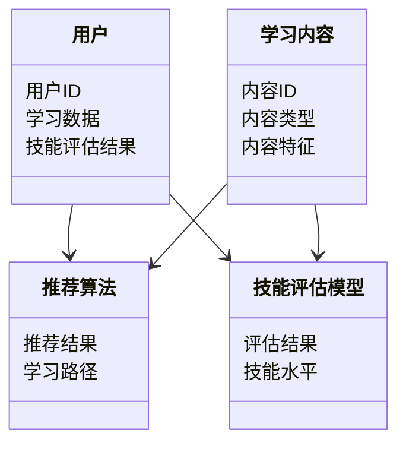
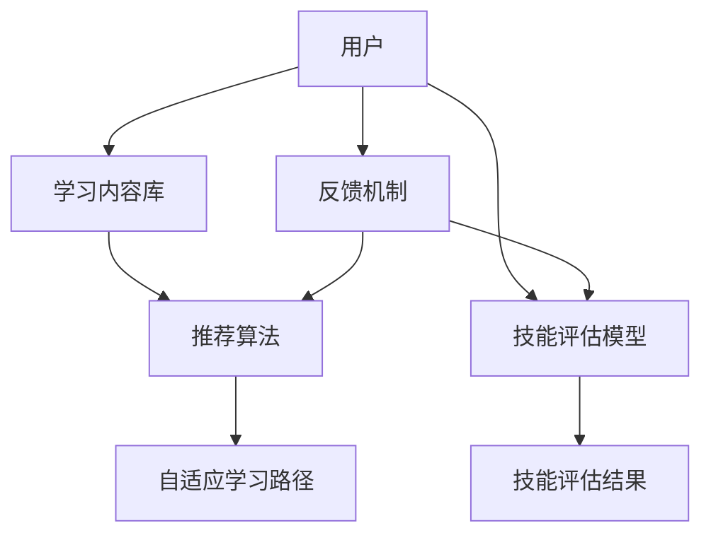

                 


# 构建智能企业培训系统：自适应学习路径与技能评估

## 关键词
- 智能企业培训系统
- 自适应学习路径
- 技能评估
- 机器学习
- 算法推荐

## 摘要
随着企业对员工培训需求的不断增加，传统的企业培训模式逐渐暴露出效率低下、效果难以量化的缺陷。如何利用人工智能技术构建智能企业培训系统，实现自适应学习路径和精准的技能评估，成为当前企业培训领域的热点问题。本文将从背景介绍、核心概念、算法原理、系统架构设计、项目实战等多个方面展开，详细阐述如何构建智能企业培训系统，并通过实际案例分析，展示其在提升员工学习效果和企业竞争力中的重要作用。

---

# 第1章 背景介绍

## 1.1 问题背景
### 1.1.1 传统企业培训的痛点
企业培训是提升员工技能、增强企业竞争力的重要手段，但传统的企业培训模式存在以下问题：
- **培训效果难以量化**：传统培训难以通过数据量化员工的学习效果，导致培训投入与产出难以衡量。
- **学习路径固定**：传统培训通常采用固定的课程安排，无法根据员工的实际情况动态调整学习内容。
- **技能评估不精准**：传统的技能评估方式往往依赖主观判断，缺乏客观性和科学性。

### 1.1.2 问题解决方向
通过引入人工智能技术，构建智能企业培训系统，实现以下目标：
- 根据员工的学习情况动态调整学习路径。
- 利用机器学习算法精准评估员工技能水平。
- 提供个性化的学习建议，提升员工学习效率。

## 1.2 问题描述
智能企业培训系统的核心任务是构建一个能够自适应调整学习路径的系统，同时能够对员工的技能进行精准评估。系统需要具备以下功能：
- 根据员工的学习进度和知识掌握情况，动态调整学习内容和顺序。
- 利用机器学习算法分析员工的技能水平，生成个性化的技能评估报告。
- 提供基于学习数据的反馈机制，帮助员工优化学习策略。

## 1.3 边界与外延
- **边界**：智能企业培训系统仅关注员工的学习路径和技能评估，不涉及企业的其他业务系统。
- **外延**：系统可以通过与其他系统的集成，扩展功能，例如与企业的人力资源管理系统（HRM）集成，提供更全面的员工发展解决方案。

---

# 第2章 核心概念与原理

## 2.1 自适应学习路径
### 2.1.1 自适应学习路径的定义
自适应学习路径是指根据员工的学习情况和技能水平，动态调整学习内容和学习顺序的过程。系统通过分析员工的学习数据，推荐最适合的学习路径，以最大化学习效果。

### 2.1.2 自适应学习路径的核心要素
- **学习数据**：包括员工的学习进度、测试成绩、学习时间等。
- **推荐算法**：基于学习数据，利用机器学习算法推荐学习内容。
- **反馈机制**：根据员工的学习反馈，进一步优化学习路径。

## 2.2 技能评估
### 2.2.1 技能评估的定义
技能评估是指通过多种方式对员工的技能水平进行量化评估的过程。评估结果可以为员工提供个性化的学习建议，也可以为企业的培训策略提供数据支持。

### 2.2.2 技能评估的关键指标
- **知识掌握程度**：通过测试成绩衡量员工对知识的掌握程度。
- **学习速度**：通过学习时间数据衡量员工的学习速度。
- **学习效果**：通过综合指标衡量员工的学习效果。

---

# 第3章 算法原理与实现

## 3.1 推荐算法
### 3.1.1 推荐算法的分类
推荐算法主要分为以下几类：
1. **基于协同过滤的推荐算法**：通过分析用户的行为数据，找到相似的用户群体，推荐相似的学习内容。
2. **基于内容的推荐算法**：通过分析学习内容的特征，推荐与当前学习内容相似的内容。
3. **基于深度学习的推荐算法**：利用深度学习模型，从海量数据中提取特征，推荐学习内容。

### 3.1.2 推荐算法的实现步骤
1. **数据预处理**：对学习数据进行清洗和特征提取。
2. **模型训练**：利用训练数据训练推荐模型。
3. **模型预测**：根据输入数据，预测推荐结果。
4. **结果优化**：通过反馈机制优化推荐结果。

## 3.2 技能评估模型
### 3.2.1 技能评估模型的数学公式
技能评估模型可以通过以下公式表示：
$$
\text{技能水平} = \alpha \times \text{知识掌握程度} + \beta \times \text{学习速度} + \gamma \times \text{学习效果}
$$
其中，$\alpha$、$\beta$、$\gamma$是权重系数，可以根据实际需求进行调整。

---

# 第4章 系统架构设计

## 4.1 领域模型类图


## 4.2 系统架构图


---

# 第5章 项目实战

## 5.1 环境安装
### 5.1.1 安装Python环境
```bash
# 安装Python和pip
sudo apt-get update
sudo apt-get install python3 python3-pip
```

### 5.1.2 安装依赖库
```bash
pip install numpy pandas scikit-learn matplotlib
```

## 5.2 核心代码实现
### 5.2.1 推荐算法实现
```python
import numpy as np
from sklearn.metrics.pairwise import cosine_similarity

def collaborative_filtering(user_data, item_data):
    # 转换数据为矩阵形式
    user_item_matrix = np.dot(user_data, item_data.T)
    # 计算相似度
    similarity_matrix = cosine_similarity(user_item_matrix)
    return similarity_matrix
```

### 5.2.2 技能评估模型实现
```python
import numpy as np

def skill_assessment_model(user_data):
    # 计算技能水平
    skill_level = np.dot(user_data, np.array([0.5, 0.3, 0.2]))
    return skill_level
```

## 5.3 实际案例分析
通过实际案例分析，展示如何利用推荐算法和技能评估模型优化企业培训过程。例如，假设某员工的学习数据如下：
```
学习内容：数据分析、编程、项目管理
学习时间：10小时、15小时、8小时
测试成绩：80分、75分、85分
```
系统可以根据这些数据，动态调整员工的学习路径，并生成个性化的技能评估报告。

---

# 第6章 总结与展望

## 6.1 本章总结
本文详细介绍了如何构建智能企业培训系统，重点讨论了自适应学习路径和技能评估的核心概念、算法原理和系统架构设计。通过实际案例分析，展示了系统在提升员工学习效果和企业竞争力中的重要作用。

## 6.2 未来展望
未来，随着人工智能技术的不断发展，智能企业培训系统将更加智能化和个性化。推荐算法和技能评估模型将更加精准，学习路径将更加动态化，为企业培训提供更高效、更科学的解决方案。

---

通过以上步骤，我们可以清晰地看到智能企业培训系统的构建过程。从背景分析到核心概念，再到算法实现和系统设计，最终通过项目实战和案例分析，验证系统的可行性和有效性。

