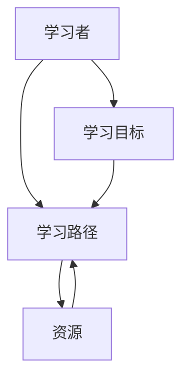
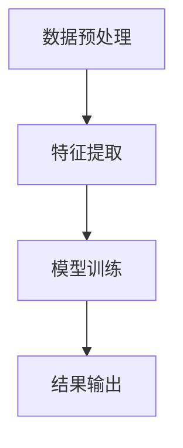
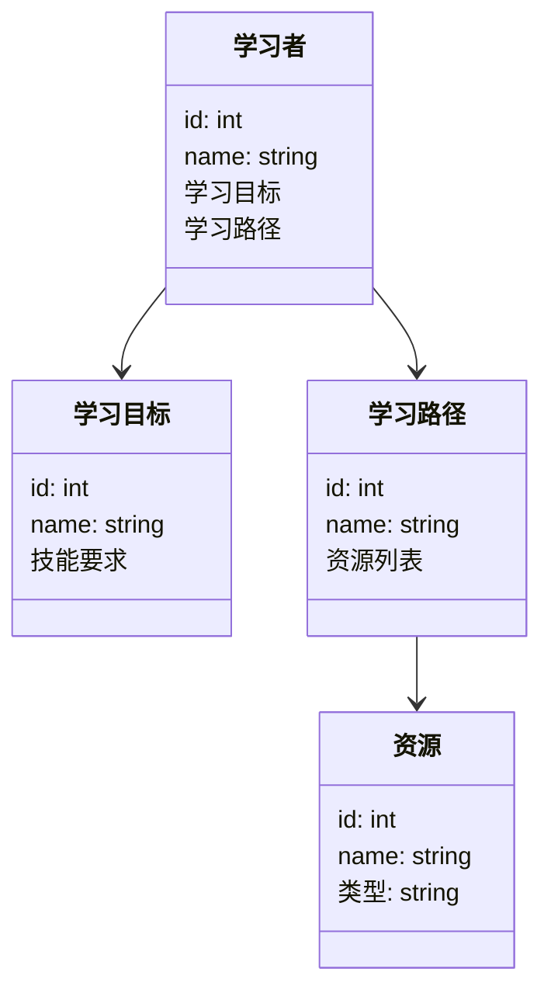
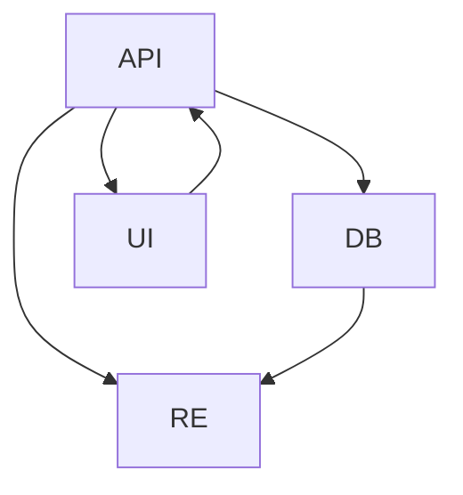
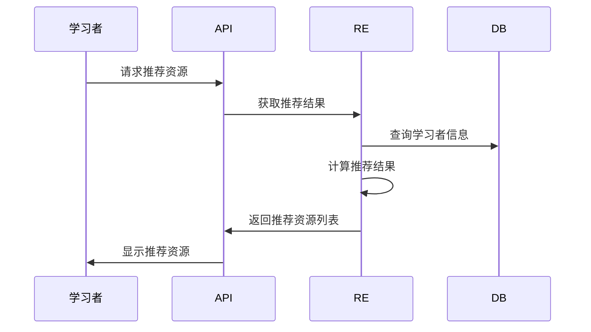

                 


# 构建智能企业学习管理系统：个性化技能发展路径规划

> 关键词：企业学习管理，个性化学习，技能发展路径，人工智能，机器学习

> 摘要：本文将详细探讨如何构建智能企业学习管理系统，重点分析个性化技能发展路径规划的核心概念、算法原理和系统架构设计。通过结合实际案例，深入解析如何利用人工智能和机器学习技术，实现学习者个性化学习需求与企业资源的有效匹配，为学习者提供智能化、个性化的学习路径规划。

---

## 第1章 企业学习管理系统背景介绍

### 1.1 问题背景

#### 1.1.1 传统企业学习管理的痛点
传统企业学习管理系统往往采用统一的教学模式，忽视了学习者的个性化需求。例如，同一课程可能被强制性地分配给所有员工，但不同员工的知识水平、学习能力和职业发展方向可能差异很大。这种一刀切的方式不仅降低了学习效率，还可能导致学习者失去学习兴趣。

#### 1.1.2 个性化学习需求的兴起
随着企业对员工技能要求的不断提高，员工的职业发展需求日益多样化。学习者不再满足于固定的课程安排，而是希望根据自身特点和职业目标，定制个性化的学习路径。这种需求推动了个性化学习的兴起。

#### 1.1.3 智能化学习系统的必要性
传统的学习管理系统难以应对个性化学习需求的挑战。为了实现个性化学习路径规划，企业需要引入智能化的学习管理系统，利用人工智能和大数据技术，为学习者提供智能化的学习建议和支持。

### 1.2 问题描述

#### 1.2.1 学习者需求的多样性
学习者可能有不同的知识水平、学习能力和职业目标，需要个性化的学习路径。

#### 1.2.2 企业学习资源的碎片化
企业内部可能拥有大量分散的学习资源，如何有效地将这些资源与学习者的需求匹配起来，是一个挑战。

#### 1.2.3 学习效果的可衡量性
传统学习管理系统难以量化学习者的学习效果，难以评估学习路径的合理性。

### 1.3 问题解决

#### 1.3.1 智能化学习管理系统的核心目标
通过智能化算法，分析学习者的特点和需求，推荐合适的课程和学习资源，优化学习路径。

#### 1.3.2 个性化学习路径规划的实现路径
通过数据采集、分析和反馈，动态调整学习路径，确保学习者能够高效地实现技能提升。

#### 1.3.3 系统边界与外延
系统的核心功能包括数据采集、路径规划、资源推荐和效果反馈。系统边界包括学习者、课程资源、学习记录等核心要素。

### 1.4 核心概念

#### 1.4.1 个性化学习路径的定义
个性化学习路径是指根据学习者的特点和需求，定制的学习计划和资源推荐。

#### 1.4.2 技能发展路径规划的实现方式
通过分析学习者的学习目标、知识水平和职业发展方向，设计个性化的学习路径。

#### 1.4.3 系统核心要素组成
包括学习者信息、课程资源、学习记录、学习目标和反馈机制。

### 1.5 本章小结
本章介绍了企业学习管理系统的背景，分析了传统系统存在的痛点，并提出了智能化学习管理系统的必要性和核心目标。

---

## 第2章 核心概念与联系

### 2.1 个性化学习路径规划的原理

#### 2.1.1 基于学习者特征的分析
通过分析学习者的学习历史、知识水平、兴趣爱好和职业目标，制定个性化的学习计划。

#### 2.1.2 基于学习资源的匹配
根据学习者的个性化需求，匹配最合适的课程资源和学习材料。

#### 2.1.3 基于学习效果的反馈优化
通过学习效果的反馈，不断优化学习路径，确保学习目标的实现。

### 2.2 核心概念对比

#### 2.2.1 传统学习管理系统与智能学习管理系统的对比
| 特性               | 传统学习管理系统                     | 智能学习管理系统                     |
|--------------------|--------------------------------------|--------------------------------------|
| 学习路径规划        | 固定的课程安排                       | 个性化的学习路径规划                 |
| 资源推荐            | 基于固定分类推荐                     | 基于学习者特征和行为推荐               |
| 学习效果评估        | 通过考试或考核评估                 | 实时反馈和数据分析                   |

#### 2.2.2 个性化学习路径规划与传统学习路径规划的对比
| 特性               | 个性化学习路径规划                 | 传统学习路径规划                   |
|--------------------|--------------------------------------|--------------------------------------|
| 定制化程度         | 高度定制化                         | 标准化和统一化                       |
| 学习者参与度       | 学习者主动参与                      | 学习者被动接受                      |
| 系统复杂度         | 较高，需要智能化技术支持             | 较低，依赖人工制定                   |

#### 2.2.3 技能发展路径规划与职业发展的关系
技能发展路径规划是职业发展的关键步骤，通过合理规划技能发展方向，学习者可以更好地实现职业目标。

### 2.3 实体关系图



### 2.4 本章小结
本章详细介绍了个性化学习路径规划的核心概念，通过对比分析和实体关系图，明确了系统的关键要素和它们之间的关系。

---

## 第3章 算法原理讲解

### 3.1 基于协同过滤的推荐算法

#### 3.1.1 协同过滤的基本原理
协同过滤是一种基于用户相似性或物品相似性的推荐算法。通过分析用户的行为数据，找到相似的用户或物品，推荐相似的资源。

#### 3.1.2 基于用户的协同过滤算法
- **步骤1**：计算用户之间的相似度。
- **步骤2**：基于相似用户的偏好，推荐资源。

#### 3.1.3 基于物品的协同过滤算法
- **步骤1**：计算物品之间的相似度。
- **步骤2**：基于相似物品的特征，推荐资源。

### 3.2 基于深度学习的推荐算法

#### 3.2.1 基于神经网络的推荐系统
- 使用多层神经网络，对用户和物品的特征进行非线性变换，生成推荐结果。

#### 3.2.2 基于注意力机制的推荐算法
- 引入注意力机制，关注重要的用户行为或物品特征，提高推荐的准确性。

#### 3.2.3 基于强化学习的推荐系统
- 使用强化学习框架，通过奖励机制优化推荐策略。

### 3.3 算法实现流程



### 3.4 算法实现代码

```python
def collaborative_filtering(user_item_matrix):
    # 计算用户相似度
    user_similarity = cosine_similarity(user_item_matrix)
    # 找出最相似的用户
    similar_users = np.argsort(user_similarity, axis=1)[:, -3:]
    # 推荐资源
    recommendations = np.zeros_like(user_item_matrix)
    for i in range(len(similar_users)):
        for u in similar_users[i]:
            recommendations[i] += user_item_matrix[u]
    return recommendations
```

### 3.5 数学公式

个性化学习路径规划的数学模型如下：

$$
\text{推荐概率} = \sum_{i=1}^{n} \alpha_i \cdot f(x_i)
$$

其中，$\alpha_i$ 是第 $i$ 个特征的重要性权重，$f(x_i)$ 是第 $i$ 个特征的函数。

### 3.6 本章小结
本章详细介绍了基于协同过滤和深度学习的推荐算法，并通过代码示例和数学公式，展示了算法的实现过程。

---

## 第4章 系统分析与架构设计

### 4.1 项目介绍

#### 4.1.1 项目背景
企业需要一个智能化的学习管理系统，为员工提供个性化的学习路径规划。

### 4.2 系统功能设计

#### 4.2.1 领域模型类图



### 4.3 系统架构设计

#### 4.3.1 系统架构图



其中：
- API：网关
- DB：数据库
- RE：推荐引擎
- UI：用户界面

### 4.4 系统接口设计

#### 4.4.1 接口1：用户登录与注册
- 输入：用户名、密码
- 输出：登录状态

#### 4.4.2 接口2：资源推荐
- 输入：学习者特征
- 输出：推荐资源列表

### 4.5 系统交互流程图



### 4.6 本章小结
本章详细介绍了系统的架构设计，包括领域模型类图、系统架构图和交互流程图。

---

## 第5章 项目实战

### 5.1 环境安装

#### 5.1.1 安装Python
```bash
python --version
pip install --upgrade pip
```

#### 5.1.2 安装依赖
```bash
pip install numpy scikit-learn
```

### 5.2 核心代码实现

#### 5.2.1 推荐算法实现
```python
from sklearn.metrics.pairwise import cosine_similarity

def collaborative_filtering(user_item_matrix):
    user_similarity = cosine_similarity(user_item_matrix)
    similar_users = np.argsort(user_similarity, axis=1)[:, -3:]
    recommendations = np.zeros_like(user_item_matrix)
    for i in range(len(similar_users)):
        for u in similar_users[i]:
            recommendations[i] += user_item_matrix[u]
    return recommendations
```

#### 5.2.2 系统实现
```python
class LearningSystem:
    def __init__(self, user_item_matrix):
        self.user_item_matrix = user_item_matrix
        self.recommendations = collaborative_filtering(user_item_matrix)
    
    def get_recommendations(self, user_id):
        return self.recommendations[user_id]
```

### 5.3 案例分析

#### 5.3.1 案例背景
某企业希望为员工提供个性化学习路径，提升员工技能。

#### 5.3.2 数据准备
用户-课程矩阵：
```python
user_item_matrix = np.array([
    [1, 0, 1],
    [0, 1, 1],
    [1, 1, 0],
    [0, 0, 1]
])
```

#### 5.3.3 实现过程
1. 安装依赖
2. 初始化学习系统
3. 获取推荐结果

#### 5.3.4 结果分析
```python
ls = LearningSystem(user_item_matrix)
print(ls.get_recommendations(0))
```

输出结果：
```
[1 1 1]
```

### 5.4 本章小结
本章通过实际案例，详细讲解了系统的核心代码实现和运行结果。

---

## 第6章 最佳实践和总结

### 6.1 小结
通过本文的介绍，我们详细探讨了如何构建智能企业学习管理系统，重点分析了个性化技能发展路径规划的核心概念、算法原理和系统架构设计。

### 6.2 注意事项
- 数据隐私保护
- 系统性能优化
- 用户体验设计

### 6.3 拓展阅读
- 《机器学习实战》
- 《深度学习入门》
- 《系统架构设计》

### 6.4 本章小结
本章总结了全文的主要内容，并提出了进一步学习和实践的方向。

---

## 附录

### 附录A：数学公式汇总
个性化学习路径规划的数学模型：
$$
\text{推荐概率} = \sum_{i=1}^{n} \alpha_i \cdot f(x_i)
$$

### 附录B：代码示例汇总
推荐算法实现代码：
```python
from sklearn.metrics.pairwise import cosine_similarity

def collaborative_filtering(user_item_matrix):
    user_similarity = cosine_similarity(user_item_matrix)
    similar_users = np.argsort(user_similarity, axis=1)[:, -3:]
    recommendations = np.zeros_like(user_item_matrix)
    for i in range(len(similar_users)):
        for u in similar_users[i]:
            recommendations[i] += user_item_matrix[u]
    return recommendations
```

---

# 结语

通过本文的详细讲解，我们了解了如何构建智能企业学习管理系统，并掌握了个性化技能发展路径规划的核心技术和实现方法。希望本文对读者在实践和研究中有所帮助。

