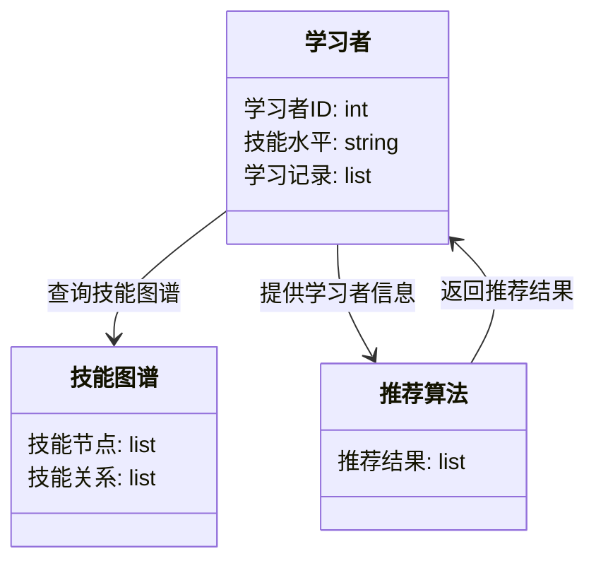
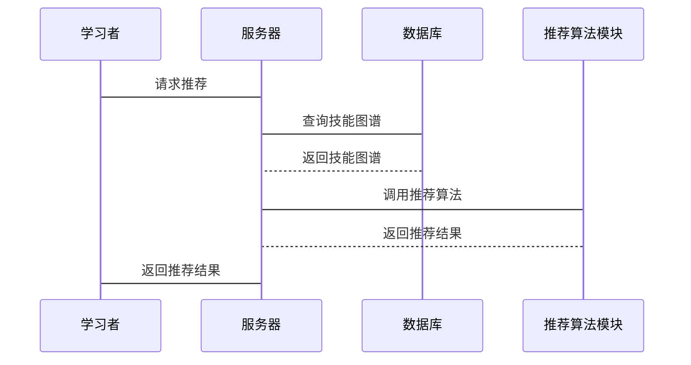

                 


# 构建智能企业学习管理系统：技能图谱与个性化发展规划

> 关键词：智能企业学习管理系统，技能图谱，个性化学习规划，推荐算法，系统架构设计

> 摘要：本文深入探讨了构建智能企业学习管理系统的核心要素，重点介绍了技能图谱的构建与分析，以及个性化学习规划的理论与方法。通过结合实际案例，详细讲解了系统架构设计、算法实现和项目实战，为读者提供了一套完整的解决方案。

---

## 第1章 智能企业学习管理系统概述

### 1.1 企业学习管理系统的背景与重要性

#### 1.1.1 传统企业学习管理的痛点
传统的企业学习管理系统往往存在以下问题：
- **内容孤岛**：各部门的学习资源分散，缺乏统一的管理与共享机制。
- **学习者需求不匹配**：学习计划缺乏个性化，难以满足不同员工的技能提升需求。
- **数据利用率低**：学习数据难以有效挖掘和利用，无法为后续的学习规划提供支持。
- **反馈机制缺失**：缺乏实时的学习效果反馈，难以及时调整学习策略。

#### 1.1.2 智能化学习管理系统的核心价值
智能化企业学习管理系统通过引入人工智能和大数据技术，能够实现以下目标：
- **个性化学习路径推荐**：根据员工的技能水平、职业发展需求和学习偏好，推荐最优的学习路径。
- **动态更新技能图谱**：实时更新技能需求和相关知识，确保学习内容与企业战略目标保持一致。
- **数据驱动决策**：通过分析学习数据，为企业的培训策略提供数据支持。

#### 1.1.3 企业学习管理系统的发展趋势
随着人工智能和大数据技术的快速发展，企业学习管理系统正在向智能化、个性化和数据驱动的方向发展。未来的系统将更加注重用户体验，能够实时适应企业的动态变化，并支持多维度的学习评估。

### 1.2 技能图谱与个性化学习规划的核心概念

#### 1.2.1 技能图谱的定义与特点
**技能图谱**是一种将技能、知识和能力以图谱形式表示的方法。它通过节点（技能点）和边（技能之间的关联关系）来描述技能之间的依赖关系和层次结构。

**特点**：
- **层次化**：技能图谱通常具有层次结构，从基础技能到高级技能层层递进。
- **动态性**：技能图谱可以根据企业需求和行业变化动态更新。
- **关联性**：技能之间的关系清晰，有助于制定个性化学习路径。

#### 1.2.2 个性化学习规划的内涵
个性化学习规划是指根据学习者的特点、目标和需求，制定个性化的学习计划。它包括以下几个方面：
- **学习目标设定**：根据学习者的现状和职业发展目标，设定具体的学习目标。
- **学习路径设计**：根据学习目标，设计最优的学习路径。
- **学习资源推荐**：推荐与学习路径相关的学习资源。

#### 1.2.3 技能图谱与个性化学习规划的关联
技能图谱为个性化学习规划提供了基础数据，而个性化学习规划则通过技能图谱实现学习路径的优化和动态调整。两者相辅相成，共同构建了一个完整的智能化学习管理系统。

### 1.3 本书的目标与结构安排

#### 1.3.1 本书的核心目标
本书旨在通过理论与实践相结合的方式，详细介绍智能企业学习管理系统的构建方法，包括技能图谱的构建、个性化学习规划的算法实现以及系统的实际应用。

#### 1.3.2 目录结构与内容概览
本书分为以下几个部分：
1. 智能企业学习管理系统概述
2. 技能图谱的构建与分析
3. 个性化学习规划的理论与方法
4. 系统架构设计与实现
5. 算法实现与优化
6. 项目实战与案例分析
7. 总结与展望

#### 1.3.3 学习方法与注意事项
为了更好地理解本书内容，建议读者具备一定的编程基础，熟悉Python和机器学习的基本概念。同时，建议读者在阅读过程中结合实际项目进行实践，以加深对理论的理解。

---

## 第2章 技能图谱的构建与分析

### 2.1 技能图谱的构建方法

#### 2.1.1 技能节点的定义与分类
**技能节点**是技能图谱的基本单位，通常包括以下信息：
- **技能名称**：如“Python编程”、“数据分析”等。
- **技能层次**：如初级、中级、高级。
- **技能描述**：对技能的详细说明。

**分类**：
- **技术技能**：与技术相关的技能，如编程语言、工具使用等。
- **软技能**：与人际关系、沟通能力等相关的技能。
- **管理技能**：与项目管理、团队管理等相关的技能。

#### 2.1.2 技能关系的建模与分析
**技能关系**描述了技能之间的依赖关系，通常可以分为以下几种：
- **并列关系**：如“Python编程”和“Java编程”。
- **包含关系**：如“数据分析”包含“数据清洗”和“数据可视化”。
- **前置关系**：如“数据分析”需要先掌握“数据预处理”。

#### 2.1.3 技能图谱的可视化表示
使用Mermaid可以将技能图谱以图表形式表示，例如：


---

### 2.2 技能图谱的分析与应用

#### 2.2.1 技能图谱的层次结构
技能图谱的层次结构通常包括以下几个层次：
- **基础技能**：如编程语言的基础语法。
- **中级技能**：如数据结构与算法。
- **高级技能**：如机器学习、深度学习等。

#### 2.2.2 技能图谱的动态更新机制
技能图谱需要根据企业的最新需求和技术的发展进行动态更新。常见的更新机制包括：
- **定期更新**：如每年更新一次。
- **实时更新**：根据学习者的学习进度实时更新。

#### 2.2.3 技能图谱在学习路径规划中的应用
通过分析技能图谱，可以为学习者制定个性化的学习路径。例如，如果学习者的目标是成为数据科学家，系统可以根据技能图谱推荐相关的学习资源和路径。

---

### 2.3 技能图谱的案例分析

#### 2.3.1 某行业的技能图谱构建案例
以数据科学领域为例，技能图谱可能包括以下几个节点：
- **数据预处理**
- **数据清洗**
- **数据可视化**
- **机器学习**
- **深度学习**

#### 2.3.2 技能图谱在企业培训中的实际应用
某企业通过构建技能图谱，为员工制定个性化的培训计划。例如，对于想要提升数据分析能力的员工，系统会推荐相关课程和学习资源。

---

## 第3章 个性化学习规划的理论与方法

### 3.1 个性化学习规划的基本理论

#### 3.1.1 学习者特征分析
学习者特征分析包括以下几个方面：
- **学习目标**：如成为数据科学家。
- **技能水平**：如Python编程的熟练程度。
- **学习风格**：如喜欢理论学习还是实践操作。

#### 3.1.2 学习目标的设定与分解
学习目标的设定需要具体、可衡量、可实现、相关性强和时间限制。例如，设定“在6个月内掌握Python编程”的目标。

#### 3.1.3 学习路径的设计原则
学习路径设计应遵循以下原则：
- **循序渐进**：从基础到高级。
- **目标导向**：围绕学习目标进行设计。
- **个性化**：根据学习者的特征进行调整。

### 3.2 个性化学习规划的核心算法

#### 3.2.1 基于规则的路径规划
基于规则的路径规划是一种简单的推荐方法，通常根据预设的规则进行推荐。例如，如果学习者的技能水平是初级，推荐初级课程。

#### 3.2.2 基于机器学习的路径推荐
基于机器学习的路径推荐是一种更高级的推荐方法。例如，可以使用协同过滤算法进行推荐：


#### 3.2.3 基于知识图谱的路径优化
基于知识图谱的路径优化可以利用图论算法进行路径优化。例如，使用Dijkstra算法找到最短路径：

$$\text{最短路径} = \argmin_{p \in P} \sum_{e \in p} \text{权重}(e)$$

---

### 3.3 个性化学习规划的实现步骤

#### 3.3.1 数据采集与处理
数据采集包括学习者的基本信息、学习记录、技能测试结果等。例如，可以使用以下Python代码进行数据采集：

```python
import pandas as pd

# 数据采集
data = pd.DataFrame({
    '学习者ID': [1, 2, 3],
    '技能水平': ['初级', '中级', '高级']
})
print(data)
```

#### 3.3.2 模型训练与优化
模型训练包括特征提取、模型选择和参数调优。例如，可以使用scikit-learn库进行模型训练：

```python
from sklearn.tree import DecisionTreeClassifier
from sklearn.model_selection import train_test_split

# 数据分割
X_train, X_test, y_train, y_test = train_test_split(X, y, test_size=0.2)

# 模型训练
model = DecisionTreeClassifier()
model.fit(X_train, y_train)
```

#### 3.3.3 推荐结果展示
推荐结果可以通过可视化的方式展示，例如使用matplotlib绘制推荐路径：

```python
import matplotlib.pyplot as plt

plt.figure(figsize=(10, 6))
plt.plot(range(len(recommended_path)), recommended_path)
plt.title('学习路径推荐')
plt.xlabel('步骤')
plt.ylabel('技能')
plt.show()
```

---

## 第4章 系统架构设计与实现

### 4.1 系统功能设计

#### 4.1.1 领域模型设计
领域模型可以通过Mermaid类图表示，例如：



#### 4.1.2 系统架构设计
系统架构设计可以通过Mermaid架构图表示，例如：


#### 4.1.3 系统接口设计
系统接口设计包括以下几种：
- **获取技能图谱接口**
- **个性化推荐接口**
- **学习记录查询接口**

#### 4.1.4 系统交互设计
系统交互可以通过Mermaid序列图表示，例如：



---

## 第5章 算法实现与优化

### 5.1 推荐算法的实现

#### 5.1.1 基于协同过滤的推荐算法
协同过滤是一种常见的推荐算法，可以通过以下Python代码实现：

```python
from sklearn.metrics.pairwise import cosine_similarity

# 计算相似度
similarity_matrix = cosine_similarity(X)
```

#### 5.1.2 基于内容的推荐算法
基于内容的推荐算法可以通过分析学习者的学习内容进行推荐。例如，使用TF-IDF进行内容表示：

```python
from sklearn.feature_extraction.text import TfidfVectorizer

# 计算TF-IDF
vectorizer = TfidfVectorizer()
tfidf = vectorizer.fit_transform(contents)
```

#### 5.1.3 深度学习模型的推荐算法
深度学习模型（如神经网络）可以通过以下代码实现：

```python
import tensorflow as tf

# 构建模型
model = tf.keras.Sequential([
    tf.keras.layers.Dense(64, activation='relu'),
    tf.keras.layers.Dense(1, activation='sigmoid')
])
```

---

## 第6章 项目实战与案例分析

### 6.1 项目实战

#### 6.1.1 环境安装与配置
需要安装以下工具和库：
- Python
- scikit-learn
- matplotlib
- Mermaid

#### 6.1.2 核心代码实现
以下是推荐算法的Python代码示例：

```python
import numpy as np
import pandas as pd
from sklearn.metrics.pairwise import cosine_similarity

# 数据加载
data = pd.read_csv('learners.csv')

# 计算相似度
similarity_matrix = cosine_similarity(data.values)

# 推荐函数
def recommend(learner_id, similarity_matrix):
    # 获取相似的 learner_ids
    similar_ids = np.argsort(similarity_matrix[learner_id])[::-1]
    return similar_ids[:5]  # 返回前5个相似的学习者
```

#### 6.1.3 代码解读与分析
上述代码通过计算学习者之间的相似度，推荐与当前学习者相似的其他学习者的路径。这种方法可以有效地找到适合学习者的学习资源。

#### 6.1.4 案例分析
以某企业为例，假设我们有以下学习者数据：

| 学习者ID | 技能水平 |
|--------|----------|
| 1      | 初级     |
| 2      | 中级     |
| 3      | 高级     |

通过协同过滤算法，我们可以为学习者1推荐学习者2的路径，帮助其快速提升技能水平。

---

## 第7章 总结与展望

### 7.1 本书总结
本书详细介绍了智能企业学习管理系统的构建方法，包括技能图谱的构建、个性化学习规划的算法实现以及系统的实际应用。通过理论与实践相结合的方式，为读者提供了一套完整的解决方案。

### 7.2 未来展望
随着人工智能和大数据技术的不断发展，智能企业学习管理系统将更加智能化和个性化。未来的系统将更加注重用户体验，能够实时适应企业的动态变化，并支持多维度的学习评估。

### 7.3 最佳实践 tips
- **数据驱动决策**：充分利用学习数据，为企业的培训策略提供支持。
- **动态更新技能图谱**：根据企业需求和技术发展动态更新技能图谱。
- **注重用户体验**：在设计系统时，注重用户体验，确保学习者能够方便地使用系统。

---

## 结语

构建智能企业学习管理系统是一项复杂的工程，需要结合理论与实践。通过技能图谱和个性化学习规划，可以实现学习者与企业需求的精准匹配，帮助学习者快速提升技能，推动企业的持续发展。希望本书能够为读者提供有价值的参考，助力企业学习管理系统的智能化发展。

--- 

如果需要进一步的修改或补充，请随时告知！

