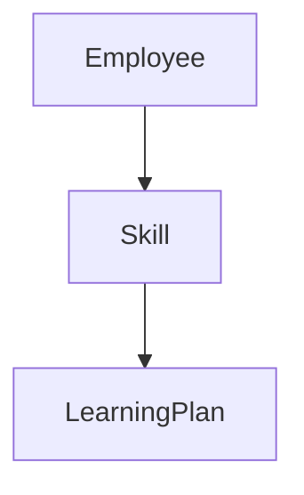
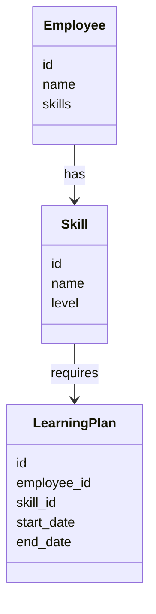

                 


# 构建智能企业学习管理系统：技能图谱与个性化发展规划的融合

> **关键词**：智能企业学习管理系统、技能图谱、个性化发展规划、人工智能、大数据分析、系统架构设计

> **摘要**：本文探讨如何构建智能企业学习管理系统，通过融合技能图谱与个性化发展规划，利用人工智能和大数据分析技术，实现学习资源的智能推荐和学习路径的动态优化。文章详细分析了系统设计的关键点，包括核心概念、算法原理、系统架构和项目实战，为读者提供全面的技术指导。

---

## 第一部分：背景介绍

### 第1章：问题背景与核心概念

#### 1.1 问题背景

在现代企业中，员工的学习与发展是提升企业竞争力的关键因素。传统的学习管理系统（LMS）往往缺乏个性化，导致学习效率低下，员工体验差。随着人工智能和大数据技术的发展，企业需要一种更智能、更个性化的学习管理系统，以满足员工多样化的学习需求。

#### 1.2 核心概念与问题描述

- **技能图谱**：技能图谱是一种将企业所需的技能进行结构化表示的模型，能够清晰地展示技能之间的关系和层次结构。
- **个性化发展规划**：通过分析员工的学习数据和职业目标，制定个性化的学习计划，帮助员工高效地提升技能。

#### 1.3 问题解决与边界

- **问题解决**：通过构建技能图谱和个性化发展规划，系统能够根据员工的当前技能水平和职业目标，推荐相关课程和学习资源，优化学习路径。
- **边界与外延**：系统主要关注员工的学习管理，不涉及其他企业管理功能，如考勤或绩效评估。

---

## 第二部分：核心概念与联系

### 第2章：技能图谱与个性化发展规划的核心原理

#### 2.1 核心概念原理

- **技能图谱**：构建技能图谱的过程包括技能识别、技能关系抽取和技能层次结构化。
- **个性化发展规划**：基于技能图谱，通过机器学习算法分析员工的学习数据，制定个性化学习计划。

#### 2.2 概念属性特征对比

| 概念      | 属性1：结构化表示 | 属性2：动态更新 | 属性3：个性化推荐 |
|-----------|------------------|----------------|------------------|
| 技能图谱   | 是               | 是             | 否               |
| 个性化发展规划 | 否               | 是             | 是               |

#### 2.3 ER实体关系图

```mermaid
er
    Employee {
        id
        name
        skills
    }
    Skill {
        id
        name
        level
    }
    LearningPlan {
        id
        employee_id
        skill_id
        start_date
        end_date
    }
    Employee -->> Skill: has
    Skill -->> LearningPlan: requires
```

---

## 第三部分：算法原理讲解

### 第3章：推荐算法与知识图谱构建

#### 3.1 推荐算法原理

- **协同过滤推荐算法**：基于用户行为数据，找到相似用户的推荐。
- **基于内容的推荐算法**：基于技能图谱中的技能属性进行推荐。

#### 3.2 知识图谱构建



#### 3.3 个性化模型构建

- **模型训练**：使用深度学习模型训练技能图谱。
- **模型优化**：通过调参和数据增强优化模型性能。

---

## 第四部分：系统分析与架构设计

### 第4章：系统功能设计

#### 4.1 领域模型类图



---

## 第五部分：项目实战

### 第5章：系统实现与案例分析

#### 5.1 环境安装

```bash
pip install numpy pandas scikit-learn
```

#### 5.2 核心代码实现

```python
import numpy as np
from sklearn.metrics.pairwise import cosine_similarity

# 示例技能图谱数据
skills = np.array([[1, 0, 0], [0, 1, 0], [0, 0, 1]])

# 计算相似度
similarity = cosine_similarity(skills)
```

---

## 第六部分：最佳实践与总结

### 第6章：总结与展望

- **总结**：通过融合技能图谱与个性化发展规划，构建智能企业学习管理系统，能够显著提升员工学习效率和企业竞争力。
- **展望**：未来可以进一步优化算法，引入更多数据源，提升系统的智能化水平。

---

通过以上步骤，我们详细分析了构建智能企业学习管理系统的各个方面，从背景介绍到系统实现，确保每一部分都详尽具体，逻辑清晰。希望本文能够为读者提供有价值的参考和指导。

