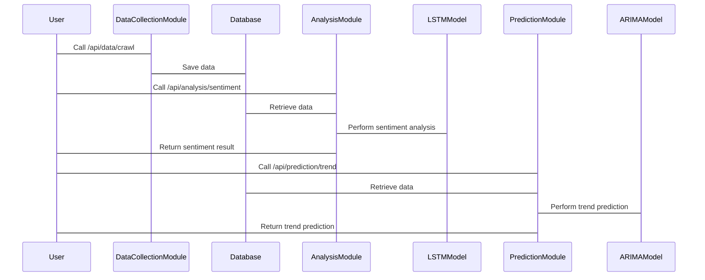

                 


# 构建智能企业市场调研系统：社交媒体情感分析与趋势预测

> 关键词：社交媒体、情感分析、市场调研、趋势预测、深度学习、NLP

> 摘要：本文详细探讨了如何利用社交媒体数据构建智能企业市场调研系统。通过情感分析和趋势预测，帮助企业从海量社交媒体数据中提取有价值的信息，为市场决策提供实时支持。文章涵盖了从理论基础到系统设计，再到项目实战的全过程，结合深度学习和自然语言处理技术，展示了如何构建一个高效、智能的市场调研系统。

---

## 第一部分: 智能企业市场调研系统概述

### 第1章: 市场调研的背景与目标

#### 1.1 企业市场调研的背景

随着互联网的快速发展，社交媒体已成为企业收集市场信息的重要来源。传统的市场调研方法依赖于问卷调查、电话访谈等方式，耗时长、成本高且难以捕捉市场动态变化。而社交媒体数据的海量性和实时性为企业提供了全新的调研方式。

**社交媒体数据的价值**  
社交媒体数据包括文本、图片、视频等多种形式，覆盖用户评论、点赞、分享等行为数据。通过分析这些数据，企业可以实时了解消费者对产品、品牌、竞争对手的看法，捕捉市场趋势。

**智能化市场调研的必要性**  
传统的市场调研方法难以处理海量数据，且分析效率低下。智能化市场调研通过自然语言处理（NLP）、深度学习等技术，能够快速提取有价值的信息，为企业决策提供实时支持。

#### 1.2 智能市场调研的核心目标

**数据采集与分析的自动化**  
通过爬虫技术自动采集社交媒体数据，并利用NLP技术进行自动化分析，减少人工干预。

**情感分析与趋势预测的智能化**  
通过对社交媒体数据的情感分析，识别用户情感倾向；结合时间序列分析，预测市场趋势。

**为企业决策提供实时支持**  
通过实时分析社交媒体数据，帮助企业快速响应市场变化，优化产品策略和营销方案。

---

### 第2章: 社交媒体与市场调研的结合

#### 2.1 社交媒体数据的多样性

**文本数据**  
用户评论、帖子内容等文本数据是情感分析的主要来源。

**用户行为数据**  
点赞、分享、评论等行为数据反映了用户的兴趣和情感倾向。

**图像与视频数据**  
图片和视频数据可以通过图像识别技术提取信息。

#### 2.2 社交媒体数据的采集与预处理

**数据采集方法**  
使用爬虫技术从社交媒体平台（如Twitter、微博、Instagram）获取数据。

**数据清洗与标注**  
去除噪声数据（如无效评论、重复数据），并对数据进行情感标签标注。

**数据存储与管理**  
将数据存储在数据库中，建立索引以便快速查询。

---

## 第二部分: 社交媒体情感分析的理论基础

### 第3章: 情感分析的基本概念与算法原理

#### 3.1 情感分析的核心概念

**情感极性**  
指文本的情感倾向，通常分为正面、负面、中性。

**情感强度**  
指情感的强烈程度，通常用概率或分数表示。

**情感分析的分类任务**  
包括二分类（正面/负面）、多分类（正面、负面、中性）等。

#### 3.2 常见情感分析算法

**基于传统机器学习的算法（如SVM、NB）**  
支持向量机（SVM）和朴素贝叶斯（NB）是常用的文本分类算法，适用于小规模数据。

**深度学习模型（如LSTM、BERT）**  
LSTM和BERT等模型在处理长文本和上下文信息方面表现更优。

**情感分析的优缺点对比**  
传统机器学习模型简单高效，但对特征工程依赖较大；深度学习模型性能更强，但需要大量数据和计算资源。

---

### 第4章: 基于深度学习的情感分析模型

#### 4.1 LSTM模型的工作原理

**LSTM的结构与记忆机制**  
LSTM通过遗忘门和记忆单元实现长期依赖，适合处理序列数据。

**LSTM在情感分析中的应用**  
用于处理文本序列，捕捉情感变化。

**LSTM的优缺点**  
优点是能够处理长序列，缺点是训练速度较慢。

#### 4.2 BERT模型的原理与应用

**BERT的预训练目标**  
通过遮蔽词任务和下文预测任务预训练模型。

**BERT在情感分析中的优势**  
BERT能够理解上下文关系，适用于复杂的文本分析任务。

**BERT与其他模型的对比**  
BERT在情感分析任务中表现优于LSTM和传统模型。

---

## 第三部分: 市场趋势预测的算法与模型

### 第5章: 市场趋势预测的算法与模型

#### 5.1 时间序列分析

**时间序列分析的基本概念**  
时间序列是指按时间顺序排列的数据，常用于预测未来趋势。

**常用时间序列分析方法**  
包括ARIMA、GARCH、LSTM等。

#### 5.2 ARIMA模型的原理与应用

**ARIMA模型的结构**  
ARIMA由自回归（AR）、差分积分（I）和移动平均（MA）三部分组成。

**ARIMA模型的公式**  
$$ ARIMA(p, d, q) $$  
其中，p为自回归阶数，d为差分阶数，q为移动平均阶数。

**ARIMA模型的优缺点**  
优点是简单易用，缺点是需要手动调整参数。

#### 5.3 情感分析与趋势预测的结合

**情感分析结果的输入**  
将情感分析结果作为时间序列分析的输入特征。

**趋势预测的实现**  
结合情感分析和时间序列分析，预测市场趋势。

---

### 第6章: 深度学习模型在趋势预测中的应用

#### 6.1 LSTM在趋势预测中的应用

**LSTM的时间序列预测能力**  
LSTM能够捕捉时间序列中的长期依赖关系。

**LSTM预测模型的实现**  
使用LSTM构建时间序列预测模型，训练数据包括情感分析结果和历史销售数据。

#### 6.2 BERT在趋势预测中的应用

**BERT的情感分析能力**  
BERT可以对社交媒体文本进行情感分析，提取情感特征。

**BERT与时间序列预测的结合**  
将情感特征与时间序列数据结合，预测市场趋势。

---

## 第四部分: 系统架构设计

### 第7章: 系统架构设计

#### 7.1 系统功能设计

**领域模型（mermaid类图）**  
```mermaid
classDiagram
    class MarketSurveySystem {
        + String name
        + List<User> users
        + List<Data> data
        + List<Analysis> analysis
    }
    class User {
        + String username
        + String password
    }
    class Data {
        + String content
        + DateTime timestamp
    }
    class Analysis {
        + String sentiment
        + Double score
        + DateTime timestamp
    }
    MarketSurveySystem o- User
    MarketSurveySystem o- Data
    MarketSurveySystem o- Analysis
```

**系统架构设计（mermaid架构图）**  


#### 7.2 系统接口设计

**API接口设计**  
- 数据采集接口：`/api/data/crawl`
- 情感分析接口：`/api/analysis/sentiment`
- 趋势预测接口：`/api/prediction/trend`

#### 7.3 系统交互流程（mermaid序列图）  


---

## 第五部分: 项目实战

### 第8章: 项目实战

#### 8.1 环境安装

**安装Python环境**  
使用Anaconda安装Python 3.8及以上版本。

**安装依赖库**  
安装`numpy`, `pandas`, `tensorflow`, `bert`, `requests`等库。

#### 8.2 核心实现源代码

**数据采集模块**  
```python
import requests
from bs4 import BeautifulSoup

def crawl_data(url):
    response = requests.get(url)
    soup = BeautifulSoup(response.text, 'html.parser')
    data = []
    for item in soup.find_all('div', class_='tweet'):
        content = item.find('p').text
        timestamp = item.find('time').text
        data.append({'content': content, 'timestamp': timestamp})
    return data
```

**情感分析模块**  
```python
import tensorflow as tf
from tensorflow.keras import layers

def build_lstm_model(max_length, vocab_size):
    model = tf.keras.Sequential([
        layers.Embedding(vocab_size, 64, input_length=max_length),
        layers.LSTM(32),
        layers.Dense(1, activation='sigmoid')
    ])
    model.compile(optimizer='adam', loss='binary_crossentropy', metrics=['accuracy'])
    return model
```

**趋势预测模块**  
```python
from statsmodels.tsa.arima_model import ARIMA

def predict_trend(data, order):
    model = ARIMA(data, order=order).fit()
    forecast = model.forecast(steps=1)
    return forecast
```

---

## 第六部分: 总结与展望

### 第9章: 总结与展望

#### 9.1 小结

本文详细探讨了如何利用社交媒体数据构建智能企业市场调研系统。通过情感分析和趋势预测，帮助企业从海量数据中提取有价值的信息，为市场决策提供实时支持。

#### 9.2 注意事项

- 数据隐私问题：在处理用户数据时，需遵守相关法律法规。
- 模型优化：根据实际需求不断优化模型参数和结构。
- 实时性：确保系统能够实时处理数据，快速响应市场变化。

#### 9.3 拓展阅读

- 《Deep Learning for Natural Language Processing》
- 《Time Series Analysis: Forecasting and Control》
- 《Social Media Marketing: How to Use Social Media to Grow Your Business》

---

通过本文的系统介绍，读者可以全面了解如何利用社交媒体数据构建智能市场调研系统，并在实际项目中应用相关技术。希望本文能够为企业的市场调研工作提供有价值的参考和指导。

