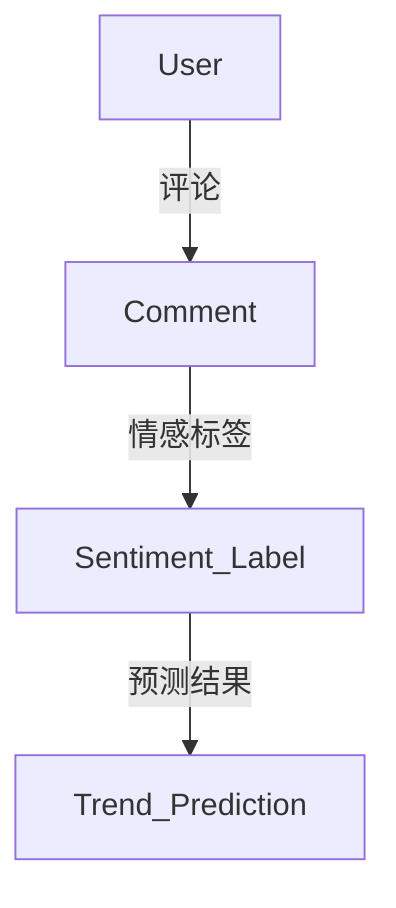
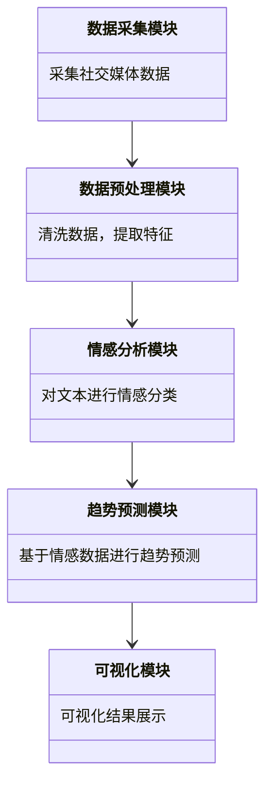
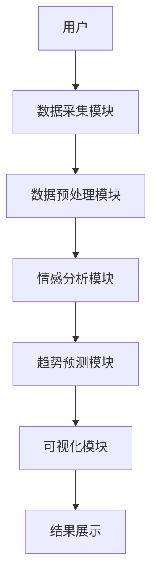
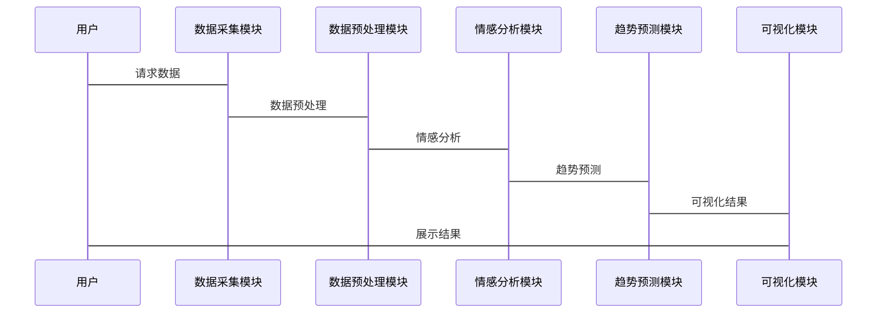

                 


# 构建智能企业市场调研系统：社交媒体情感分析与趋势预测

## 关键词：社交媒体，情感分析，趋势预测，市场调研，智能系统，数据挖掘

## 摘要：本文将详细探讨如何利用社交媒体数据进行情感分析和趋势预测，构建一个智能企业市场调研系统。通过分析用户评论、提取情感特征，并结合时间序列分析，预测市场趋势。文章从问题背景、核心概念、算法原理到系统架构和项目实战，全面解析系统的构建过程。

---

# 第一部分: 背景介绍与核心概念

## 第1章: 问题背景与描述

### 1.1 问题背景

#### 1.1.1 传统市场调研的局限性
传统市场调研依赖问卷调查、访谈等方式，耗时长、成本高，且难以捕捉实时市场动态。社交媒体的兴起为企业提供了海量用户评论数据，这些数据蕴含着用户对产品的态度和市场趋势的潜在信息。

#### 1.1.2 社交媒体数据的价值与挑战
社交媒体数据具有实时性、海量性、多样性的特点，但同时也面临数据清洗、情感分析准确性等问题。如何高效利用这些数据成为企业市场调研的关键。

#### 1.1.3 情感分析与趋势预测的必要性
通过情感分析可以了解用户对产品的评价，而趋势预测则能帮助企业提前洞察市场变化，制定更精准的营销策略。

### 1.2 问题描述

#### 1.2.1 市场调研的核心目标
市场调研的核心目标是帮助企业了解市场动态、用户需求和竞争对手情况，从而制定有效的市场策略。

#### 1.2.2 社交媒体数据的特点与复杂性
社交媒体数据包括文本、图片、视频等多种形式，数据量大且分布不均匀，需要进行清洗和预处理。

#### 1.2.3 情感分析与趋势预测的结合
将情感分析与趋势预测结合，可以更准确地预测市场趋势，帮助企业做出实时决策。

### 1.3 问题解决与边界

#### 1.3.1 智能企业市场调研系统的解决方案
利用自然语言处理（NLP）技术对社交媒体数据进行情感分析，结合时间序列分析进行趋势预测，构建智能市场调研系统。

#### 1.3.2 系统的边界与适用范围
系统适用于需要进行市场调研的企业，尤其是那些希望通过社交媒体数据了解用户情感和市场趋势的企业。

#### 1.3.3 核心要素与组成结构
系统的核心要素包括数据采集、数据预处理、情感分析、趋势预测和结果可视化。

## 第2章: 核心概念与联系

### 2.1 情感分析与趋势预测的原理

#### 2.1.1 情感分析的定义与实现
情感分析是通过文本挖掘技术对用户评论进行情感分类，通常分为正面、负面和中性三类。

#### 2.1.2 趋势预测的核心算法
趋势预测是基于时间序列的数据，使用统计学或机器学习方法预测未来的趋势。

#### 2.1.3 两者的结合与应用
通过情感分析获取用户对产品的评价，结合时间序列分析预测市场趋势，为企业提供实时的市场反馈。

### 2.2 核心概念对比与ER实体关系图

#### 2.2.1 情感分析与趋势预测的属性对比表

| 属性          | 情感分析                     | 趋势预测                     |
|---------------|------------------------------|------------------------------|
| 输入数据       | 文本数据                     | 时间序列数据               |
| 输出结果       | 情感标签（正面、负面、中性） | 预测值或趋势方向             |
| 常用算法       | 朴素贝叶斯、SVM、LSTM       | ARIMA、Prophet、LSTM        |

#### 2.2.2 实体关系图（ER图）



---

# 第二部分: 算法原理与数学模型

## 第3章: 情感分析算法原理

### 3.1 情感分析的流程

#### 3.1.1 数据预处理
- 去除特殊字符、停用词
- 分词处理（中文分词如jieba）

#### 3.1.2 特征提取
- 词袋模型（Bag of Words）
- TF-IDF特征提取

#### 3.1.3 模型训练与预测
- 使用机器学习模型（如SVM、随机森林）进行分类
- 使用深度学习模型（如LSTM、Transformer）进行情感分类

### 3.2 常见算法与实现

#### 3.2.1 基于规则的方法
- 制定情感词典，通过关键词匹配进行情感分类。

#### 3.2.2 机器学习方法
- 支持向量机（SVM）：适用于小规模数据。
- 随机森林：适用于特征较多的情况。

#### 3.2.3 深度学习方法
- LSTM：适用于长文本的情感分析。
- Transformer：在大规模数据上表现优异。

### 3.3 情感分析的数学模型

#### 3.3.1 二分类问题的数学表达
情感分析可以看作是一个二分类问题，使用对数几率回归模型：
$$ P(y=1|x) = \frac{e^{w \cdot x + b}}{1 + e^{w \cdot x + b}} $$
其中，$x$ 是输入特征，$w$ 是权重向量，$b$ 是偏置。

#### 3.3.2 情感强度预测的回归模型
对于情感强度预测，可以使用线性回归模型：
$$ y = \beta_0 + \beta_1x_1 + \beta_2x_2 + \dots + \beta_nx_n $$$
其中，$y$ 是情感强度，$x_i$ 是特征变量。

## 第4章: 趋势预测算法原理

### 4.1 时间序列分析的基础

#### 4.1.1 时间序列的特性
时间序列通常具有趋势性、季节性、周期性等特性。

#### 4.1.2 常见的时间序列模型
- ARIMA模型：适用于线性趋势。
- LSTM模型：适用于非线性趋势。

### 4.2 基于情感分析的预测模型

#### 4.2.1 数据特征提取
将情感分析结果（情感标签）作为特征，结合时间序列数据进行建模。

#### 4.2.2 模型训练与优化
使用ARIMA或LSTM模型进行训练，调整超参数以优化预测效果。

#### 4.2.3 预测结果的评估与调整
使用均方误差（MSE）、平均绝对误差（MAE）等指标评估模型性能，并根据实际情况调整模型。

### 4.3 趋势预测的数学模型

#### 4.3.1 ARIMA模型公式
ARIMA模型用于时间序列预测，其公式为：
$$ ARIMA(p, d, q) $$
其中，$p$ 是自回归阶数，$d$ 是差分阶数，$q$ 是移动平均阶数。

---

# 第三部分: 系统分析与架构设计

## 第5章: 系统分析与架构设计

### 5.1 问题场景介绍

#### 5.1.1 系统目标
构建一个能够实时采集社交媒体数据，进行情感分析和趋势预测的市场调研系统。

#### 5.1.2 问题描述
如何高效采集、处理和分析社交媒体数据，构建一个实时反馈的市场调研系统。

### 5.2 系统功能设计

#### 5.2.1 领域模型类图
展示系统各模块之间的关系。



#### 5.2.2 系统架构图



### 5.3 系统接口设计

#### 5.3.1 API接口设计
- 数据采集接口：`GET /api/social_data`
- 情感分析接口：`POST /api/sentiment_analysis`
- 趋势预测接口：`POST /api/trend_prediction`

### 5.4 系统交互设计



---

# 第四部分: 项目实战

## 第6章: 项目实战与实现

### 6.1 环境安装与配置

#### 6.1.1 安装Python环境
安装Python 3.8及以上版本，安装Jupyter Notebook用于开发。

#### 6.1.2 安装必要的库
安装自然语言处理库（如jieba、spaCy）、机器学习库（如scikit-learn、xgboost）和时间序列分析库（如pmdarima、keras）。

### 6.2 核心代码实现

#### 6.2.1 数据采集模块

```python
import requests
from bs4 import BeautifulSoup

def fetch_social_data(url):
    response = requests.get(url)
    soup = BeautifulSoup(response.text, 'html.parser')
    comments = soup.find_all('div', class_='comment')
    return [comment.text for comment in comments]
```

#### 6.2.2 数据预处理模块

```python
import jieba

def preprocess(text):
    words = jieba.lcut(text)
    return ' '.join(words)
```

#### 6.2.3 情感分析模块

```python
from sklearn.feature_extraction.text import TfidfVectorizer
from sklearn.svm import SVC

def sentiment_analysis(train_texts, train_labels, test_texts):
    vectorizer = TfidfVectorizer()
    X_train = vectorizer.fit_transform(train_texts)
    X_test = vectorizer.transform(test_texts)
    model = SVC()
    model.fit(X_train, train_labels)
    return model.predict(X_test)
```

#### 6.2.4 趋势预测模块

```python
from pmdarima import auto_arima

def trend_prediction(train_data, test_data):
    model = auto_arima(train_data, seasonal=False, stepwise=True)
    forecast = model.predict(n_periods=len(test_data))
    return forecast
```

### 6.3 实际案例分析

#### 6.3.1 数据来源
从社交媒体平台获取某产品的用户评论数据，清洗后进行分析。

#### 6.3.2 情感分析结果
通过SVM模型对评论进行情感分类，输出情感标签。

#### 6.3.3 趋势预测结果
使用ARIMA模型对情感强度进行趋势预测，输出未来一周的趋势预测结果。

### 6.4 项目小结

通过项目实战，验证了系统的可行性和有效性。情感分析和趋势预测的结合能够帮助企业更好地进行市场调研。

---

# 第五部分: 最佳实践

## 第7章: 最佳实践与总结

### 7.1 小结

智能企业市场调研系统通过社交媒体情感分析和趋势预测，为企业提供实时的市场反馈，帮助企业制定更精准的营销策略。

### 7.2 注意事项

- 数据清洗和特征提取是关键，直接影响模型性能。
- 情感分析模型需要不断优化，以适应不同的数据分布。
- 趋势预测模型需要结合业务场景进行调整。

### 7.3 拓展阅读

- 《自然语言处理实战》
- 《时间序列分析与应用》
- 《机器学习实战》

---

通过以上步骤，您可以构建一个基于社交媒体情感分析和趋势预测的智能企业市场调研系统。希望本文能为您提供有价值的参考和启发。

