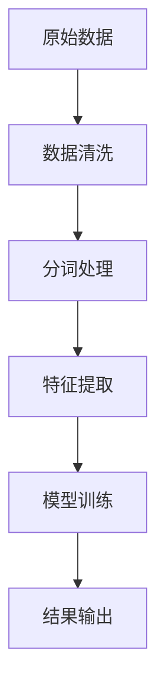
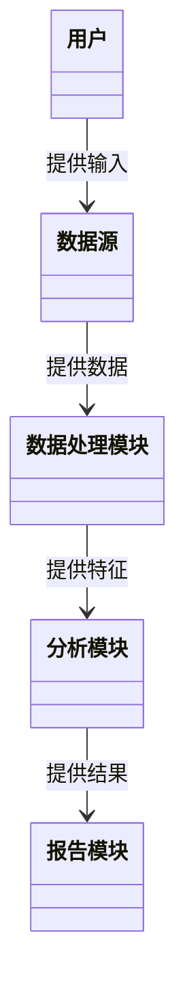
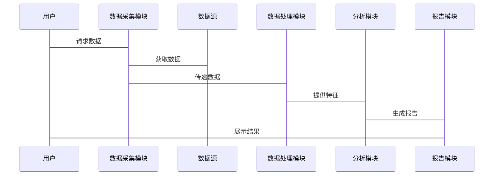

                 


# 构建智能企业市场调研系统：社交媒体聆听与趋势分析

> 关键词：社交媒体聆听，市场调研，趋势分析，自然语言处理，数据挖掘，企业系统架构

> 摘要：本文详细探讨了如何构建一个智能企业市场调研系统，重点分析了社交媒体聆听与趋势分析的核心技术与实现方法。文章从问题背景出发，结合实际应用场景，系统性地介绍了数据处理算法、系统架构设计以及项目实战案例，为读者提供了从理论到实践的全面指导。

---

## 第一部分: 背景与概念基础

### 第1章: 智能企业市场调研系统概述

#### 1.1 问题背景与描述

##### 1.1.1 传统市场调研的局限性
传统市场调研方法依赖于问卷调查、面对面访谈等方式，存在数据收集成本高、样本量有限、数据更新慢等问题。此外，消费者的真实反馈往往难以捕捉，尤其是在数字化时代，消费者行为和偏好变化迅速，传统方法难以满足实时分析的需求。

##### 1.1.2 社会媒体数据的价值与潜力
社交媒体平台（如微博、Twitter、Facebook等）每天产生海量数据，包括用户评论、点赞、分享等行为。这些数据反映了用户的真实情感和态度，能够帮助企业实时了解市场动态、竞争对手情况以及消费者需求。社交媒体数据具有实时性、丰富性和多样性的特点，为企业市场调研提供了新的可能性。

##### 1.1.3 智能化市场调研的必要性
随着人工智能和大数据技术的发展，企业需要更加高效、精准的市场调研方法。智能化市场调研系统能够自动化采集、处理和分析社交媒体数据，提取有价值的信息，帮助企业做出更明智的商业决策。

#### 1.2 问题解决与边界

##### 1.2.1 社会媒体聆听的核心目标
社交媒体聆听的核心目标是通过自动化手段从社交媒体数据中提取有价值的信息，包括用户情感、产品评价、市场趋势等。这些信息能够帮助企业进行竞争对手分析、品牌声誉管理、市场机会识别等。

##### 1.2.2 系统边界与外延
智能企业市场调研系统的边界包括数据采集、数据处理、数据分析和结果展示四个主要环节。系统外延包括数据来源（社交媒体平台API、爬虫数据等）、分析工具（自然语言处理、机器学习算法）以及输出形式（可视化报告、预警系统等）。

##### 1.2.3 核心要素与组成结构
智能企业市场调研系统的核心要素包括：
- 数据采集模块：负责从社交媒体平台获取原始数据。
- 数据处理模块：对数据进行清洗、分词和特征提取。
- 数据分析模块：运用自然语言处理和机器学习算法进行趋势分析。
- 结果展示模块：将分析结果以可视化形式呈现给用户。

### 第2章: 核心概念与联系

#### 2.1 核心概念原理

##### 2.1.1 社会媒体聆听的定义与实现
社交媒体聆听是指通过技术手段从社交媒体平台获取数据，并进行分析的过程。其实现过程包括数据采集、数据清洗、情感分析、主题建模等步骤。

##### 2.1.2 趋势分析的算法原理
趋势分析是通过统计和机器学习方法，识别数据中的模式和趋势。常用算法包括时间序列分析、关联规则挖掘和主题模型（如LDA）。

##### 2.1.3 数据挖掘与自然语言处理的结合
数据挖掘技术用于从社交媒体数据中提取结构化信息，而自然语言处理技术则用于理解文本内容。两者的结合能够实现从非结构化数据到结构化信息的转换。

#### 2.2 核心概念对比分析

##### 2.2.1 不同数据来源的特征对比
| 数据来源       | 特征描述                     |
|----------------|------------------------------|
| 微博           | 数据量大，情感丰富           |
| Twitter        | 全球化，实时性强             |
| Facebook       | 用户行为数据丰富             |
| Instagram      | 图像和视频数据占比高         |

##### 2.2.2 不同分析方法的优劣势对比
| 分析方法       | 优势                       | 劣势                       |
|----------------|----------------------------|---------------------------|
| 情感分析       | 实时性强，情感判断准确       | 对复杂语境的处理能力有限   |
| 主题建模       | 能发现隐含主题             | 计算复杂，需要大量数据     |

##### 2.2.3 核心概念的ER实体关系图

```mermaid
erDiagram
    customer <---| has |--- feedback
    feedback -->| contains | sentiment
    sentiment -->| derived from | feedback
    product <---| has |--- topic
```

---

## 第二部分: 算法原理与数学模型

### 第3章: 社会媒体数据处理算法

#### 3.1 文本挖掘与自然语言处理

##### 3.1.1 基于TF-IDF的关键词提取
TF-IDF（Term Frequency-Inverse Document Frequency）是一种常用的文本特征提取方法。其公式如下：

$$ TF-IDF(t, d) = TF(t, d) \times IDF(t) $$

其中：
$$ TF(t, d) = \frac{\text{词 } t \text{ 在文档 } d \text{ 中出现的次数}}{\text{文档 } d \text{ 的总词数}} $$
$$ IDF(t) = \log\left(\frac{N}{\text{包含词 } t \text{ 的文档数}}\right) $$
$$ N $$ 是总文档数。

##### 3.1.2 基于LDA的主题建模
LDA（Latent Dirichlet Allocation）是一种主题模型，用于发现文本中的主题分布。其核心思想是将文档表示为主题的混合物，每个主题由一组关键词组成。LDA的实现过程包括以下几个步骤：
1. 初始化主题分配。
2. 迭代优化主题分布。
3. 输出主题模型。

##### 3.1.3 情感分析算法
情感分析算法用于判断文本的情感倾向（正面、负面、中性）。常用算法包括基于词典的方法（如Afinn）和机器学习方法（如SVM、随机森林）。以下是一个简单的基于词典的情感分析实现示例：

```python
from afinn import Afinn

af = Afinn()
text = "I love this product!"
score = af.score_sentence(text)
print(score)  # 输出：2.0（表示正面情感）
```

#### 3.2 数据清洗与预处理

##### 3.2.1 去除停用词与标点符号
停用词是指在文本中没有实际意义的词汇，如“的”、“了”等。去除停用词可以减少计算量，提高模型的准确性。

##### 3.2.2 分词与词干提取
分词是指将文本分割成有意义的词汇，词干提取是指将词汇转换为其基本形式（如“running”变为“run”）。常用的工具包括jieba（中文分词）和Snowball（英文分词）。

##### 3.2.3 数据标准化与向量化
数据标准化是指将文本数据转换为统一的格式（如向量形式）。常用的向量化方法包括TF-IDF和Word2Vec。

#### 3.3 算法流程图



---

## 第三部分: 系统架构与设计

### 第4章: 企业级系统架构

#### 4.1 功能模块设计

##### 4.1.1 数据采集模块
数据采集模块负责从社交媒体平台获取原始数据。常用的数据获取方式包括API接口调用和网络爬虫。

##### 4.1.2 数据处理模块
数据处理模块对采集到的原始数据进行清洗、分词和特征提取。这一步是整个系统的核心，决定了后续分析的准确性。

##### 4.1.3 分析与报告模块
分析与报告模块利用机器学习算法对数据进行分析，并生成可视化报告。报告内容包括品牌声誉、市场趋势、竞争对手分析等。

#### 4.2 系统架构设计

##### 4.2.1 系统功能设计
系统功能设计可以采用领域模型的方式进行描述。以下是一个简单的领域模型示例：



##### 4.2.2 系统架构图


##### 4.2.3 系统接口设计
系统接口设计需要考虑模块之间的交互。例如，数据处理模块需要与数据采集模块和分析模块进行接口交互。

##### 4.2.4 系统交互流程
系统交互流程可以用序列图来描述。以下是一个简单的交互流程示例：



---

## 第四部分: 项目实战

### 第5章: 实战案例与实现

#### 5.1 环境安装与配置

##### 5.1.1 Python环境搭建
需要安装Python 3.8及以上版本，并安装必要的库，如：

```bash
pip install jieba
pip install afinn
pip install wordcloud
pip install matplotlib
```

##### 5.1.2 数据源获取
可以通过API或爬虫获取社交媒体数据。以下是一个简单的API调用示例：

```python
import requests

url = "https://api.twitter.com/1.1/statuses/user_timeline.json"
params = {
    "screen_name": "realDonaldTrump",
    "count": 100
}
response = requests.get(url, params=params)
tweets = response.json()
print(tweets)
```

#### 5.2 核心代码实现

##### 5.2.1 数据清洗与分词

```python
import jieba

text = "我 love 这个 product!"
words = jieba.lcut(text)
print(words)  # 输出：['我', 'love', '这个', 'product']
```

##### 5.2.2 情感分析实现

```python
from afinn import Afinn

af = Afinn()
text = "我 hate this product!"
score = af.score_sentence(text)
print(score)  # 输出：-2.0
```

##### 5.2.3 可视化报告生成

```python
from wordcloud import WordCloud
import matplotlib.pyplot as plt

wordcloud = WordCloud().generate(" ".join(words))
plt.imshow(wordcloud)
plt.axis("off")
plt.show()
```

#### 5.3 案例分析与解读

##### 5.3.1 案例背景
假设我们是一家互联网公司，希望通过社交媒体分析用户对产品的评价。

##### 5.3.2 数据收集与处理
从Twitter获取了1000条关于产品的评论，并进行了分词和情感分析。

##### 5.3.3 分析结果
通过情感分析发现，60%的评论是正面的，20%是负面的，20%是中性的。负面评论主要集中在产品质量和服务体验方面。

##### 5.3.4 报告生成
根据分析结果生成可视化报告，包括情感分布图、关键词云图等。

#### 5.4 项目总结与优化

##### 5.4.1 项目总结
通过该项目，我们成功构建了一个智能企业市场调研系统，能够实时监控社交媒体数据，并生成有价值的分析报告。

##### 5.4.2 项目优化
未来可以进一步优化数据处理模块，引入更先进的自然语言处理技术，如BERT模型，以提高分析的准确性。

---

## 第五部分: 总结与展望

### 第6章: 总结与展望

#### 6.1 总结
本文详细探讨了构建智能企业市场调研系统的核心技术与实现方法。通过社交媒体聆听和趋势分析，企业能够更高效地获取市场信息，制定更精准的商业策略。

#### 6.2 展望
随着人工智能和大数据技术的不断发展，社交媒体聆听和趋势分析将变得更加智能化和自动化。未来的研究方向包括引入更先进的自然语言处理技术、优化算法模型以及拓展更多的应用场景。

---

## 第六部分: 最佳实践与小结

### 第7章: 最佳实践

#### 7.1 小结
通过本文的介绍，读者可以了解到如何利用社交媒体数据进行市场调研，并构建一个智能的企业市场调研系统。

#### 7.2 注意事项
在实际应用中，需要注意数据隐私和合规性问题，确保数据的合法性和合规性。

#### 7.3 拓展阅读
以下是一些推荐阅读的书籍和论文：
- 《自然语言处理实战：基于Python的中文分词与情感分析》
- 《数据挖掘导论》
- 《机器学习实战》

---

## 附录

### 附录A: 术语表
- **社交媒体聆听**：通过技术手段从社交媒体平台获取数据并进行分析的过程。
- **趋势分析**：通过统计和机器学习方法，识别数据中的模式和趋势。

### 附录B: 工具与库
- **Python库**：jieba（中文分词）、afinn（情感分析）、wordcloud（词云生成）、matplotlib（数据可视化）。

### 附录C: 参考文献
- Twitter API文档
- Afinn情感分析库文档
- LDA主题建模算法介绍

