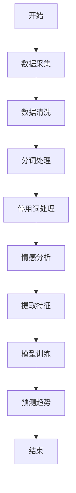
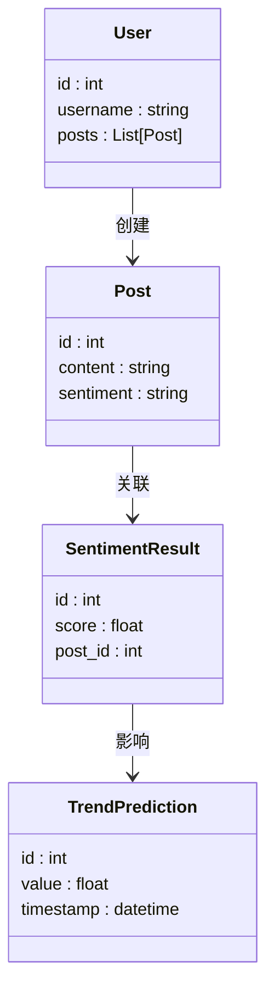

                 


# 构建智能企业市场调研系统：社交媒体聆听与趋势预测的AI驱动

## 关键词：智能企业，市场调研系统，社交媒体聆听，趋势预测，AI驱动，自然语言处理，机器学习

## 摘要：本文详细探讨如何利用人工智能技术构建智能企业市场调研系统，重点分析社交媒体数据的聆听与处理，以及基于机器学习的趋势预测方法。通过系统的模块设计、算法实现和实际案例，本文为读者提供从理论到实践的全面指导，帮助企业在数字化时代高效进行市场调研。

---

# 第1章: 问题背景与目标

## 1.1 问题背景

### 1.1.1 传统市场调研的局限性
- 数据来源单一，难以覆盖全渠道信息。
- 数据处理耗时，人工分析效率低。
- 趋势预测依赖经验，准确性不足。

### 1.1.2 社交媒体数据的价值
- 大量实时数据，反映市场动态。
- 用户生成内容，提供真实反馈。
- 数据多样性，支持多维度分析。

### 1.1.3 企业市场调研的智能化需求
- 提高数据处理效率。
- 实现实时监控和预测。
- 降低人工成本，提升决策精准度。

## 1.2 问题描述

### 1.2.1 数据来源的多样性
- 文本、图像、视频等多种形式的数据。
- 来自不同平台，数据格式差异大。

### 1.2.2 数据处理的复杂性
- 数据清洗、去噪、归一化等预处理步骤。
- 处理大规模数据时的计算资源需求。

### 1.2.3 趋势预测的准确性要求
- 需要准确捕捉市场变化。
- 对模型的鲁棒性和泛化能力要求高。

## 1.3 问题解决思路

### 1.3.1 引入AI技术的核心目标
- 利用AI提高数据处理效率。
- 通过AI实现精准的趋势预测。

### 1.3.2 社交媒体聆听的实现路径
- 数据采集：从社交媒体平台获取数据。
- 数据清洗：去除无效信息，处理噪音。
- 情感分析：识别用户情感倾向。

### 1.3.3 趋势预测的算法选择
- 使用时间序列分析预测市场趋势。
- 基于机器学习的模型捕捉非线性关系。

## 1.4 系统边界与外延

### 1.4.1 系统功能边界
- 数据采集、处理、分析和预测。
- 不包括数据存储之外的业务系统集成。

### 1.4.2 与外部系统的接口定义
- 数据源接口：与社交媒体API对接。
- 数据展示界面：与企业内部系统集成。

### 1.4.3 系统的可扩展性
- 支持新增数据源。
- 支持算法模型的更新和优化。

## 1.5 核心概念结构

### 1.5.1 核心要素组成
- 数据采集模块：负责数据获取。
- 数据处理模块：负责清洗和转换。
- 趋势预测模块：负责建模和预测。

### 1.5.2 系统架构的核心模块
- 数据层：存储原始数据和处理结果。
- 业务逻辑层：处理用户请求和数据操作。
- 表现层：展示分析结果和预测趋势。

### 1.5.3 模块之间的关系
- 数据采集模块向数据处理模块提供数据。
- 数据处理模块为趋势预测模块提供特征数据。
- 趋势预测模块将结果反馈到表现层展示。

---

# 第2章: 核心概念与联系

## 2.1 核心概念原理

### 2.1.1 社交媒体聆听的实现原理
- 数据采集：通过API接口获取社交媒体数据。
- 数据清洗：去除无关信息，如重复数据和无效字符。
- 情感分析：利用NLP技术识别文本的情感倾向。

### 2.1.2 趋势预测的算法原理
- 时间序列分析：基于历史数据预测未来趋势。
- 机器学习模型：使用特征工程提取关键变量，训练分类或回归模型。

### 2.1.3 数据处理的关键步骤
1. 数据清洗：处理缺失值、异常值。
2. 数据转换：文本数据向量化处理。
3. 数据归约：降维处理，减少计算复杂度。

## 2.2 核心概念属性对比

| 属性          | 社交媒体数据                 | 传统调研数据               |
|---------------|------------------------------|-----------------------------|
| 数据来源      | 用户生成内容，社交媒体平台   | 问卷调查，访谈记录         |
| 数据量        | 大规模，实时                | 较小，周期性                |
| 数据格式      | 文本、图片、视频            | 文本为主                   |
| 数据处理难度  | 高，需要NLP和图像处理技术    | 中等，主要依赖人工处理      |

## 2.3 实体关系图

```mermaid
erDiagram
    user {
        id int
        username varchar
        posts varchar
    }
    sentiment_result {
        id int
        sentiment_score float
        post_id int
    }
    trend_prediction {
        id int
        predicted_value float
        timestamp datetime
    }
    user --> posts : 发布
    posts --> sentiment_result : 关联情感分析结果
    sentiment_result --> trend_prediction : 影响预测趋势
```

---

# 第3章: 算法原理讲解

## 3.1 算法原理概述

### 3.1.1 自然语言处理（NLP）的核心算法
- 分词：将文本分割成词语或短语。
- 停用词处理：去除无意义的词汇，如“and”、“the”。
- 情感分析：使用预训练模型（如BERT）进行情感分类。

### 3.1.2 机器学习在趋势预测中的应用
- 特征工程：提取关键特征，如关键词频率、情感倾向。
- 模型选择：使用时间序列模型（如ARIMA）或机器学习模型（如随机森林）。

## 3.2 算法流程图



## 3.3 Python源代码实现

### 情感分析实现示例

```python
import pandas as pd
from sklearn.feature_extraction.text import TfidfVectorizer
from sklearn.svm import SVC

# 数据加载
data = pd.read_csv('tweets.csv')

# 数据预处理
vectorizer = TfidfVectorizer(max_features=5000)
X = vectorizer.fit_transform(data['text'])

# 模型训练
model = SVC()
model.fit(X, data['sentiment'])

# 预测
test_text = "Great product!"
test_X = vectorizer.transform([test_text])
predicted_sentiment = model.predict(test_X)
print(predicted_sentiment)
```

---

# 第4章: 数学模型与公式

## 4.1 数学模型概述

### 情感分析的分类模型
- 使用逻辑回归或支持向量机（SVM）进行二分类。
- 模型输入为文本向量化结果，输出为情感标签。

### 趋势预测的时间序列模型
- 使用ARIMA模型预测未来趋势。
- 模型基于历史数据，考虑趋势、季节性和随机性。

## 4.2 关键公式

### 情感分类的逻辑回归模型
$$ P(y|x) = \frac{e^{w \cdot x + b}}{1 + e^{w \cdot x + b}} $$

### 时间序列预测的ARIMA模型
$$ \phi(B)(1 - B)^d X_t = \theta(B) Z_t $$

## 4.3 公式解释与举例

### 情感分类模型
- 输入文本经过向量化后，通过逻辑回归模型计算概率，输出情感标签（如正面或负面）。

### 时间序列预测
- ARIMA模型通过分解历史数据，预测未来趋势。例如，预测未来三个月的销售量。

---

# 第5章: 系统分析与架构设计

## 5.1 项目背景介绍

### 5.1.1 项目目标
- 实现社交媒体数据的实时聆听。
- 提供市场趋势的精准预测。

### 5.1.2 项目范围
- 支持多平台数据采集。
- 提供情感分析和趋势预测功能。

## 5.2 系统功能设计

### 领域模型类图



## 5.3 系统架构设计

### 系统架构图


## 5.4 系统接口设计

### API接口定义

```http
GET /api/v1/data?query={keyword}
POST /api/v1/sentiment
POST /api/v1/predict
```

## 5.5 系统交互设计

### 系统交互流程

```mermaid
sequenceDiagram
    User -> API Gateway: 发送查询请求
    API Gateway -> Data Collector: 采集数据
    Data Collector -> Data Processor: 数据清洗
    Data Processor -> Model Trainer: 训练模型
    Model Trainer -> Predictor: 进行预测
    Predictor -> Data Collector: 更新数据
    Data Collector -> Storage: 存储结果
    User <-- API Gateway: 返回预测结果
```

---

# 总结与展望

构建智能企业市场调研系统是一个复杂的工程，需要结合社交媒体聆听和趋势预测的AI技术。通过系统的模块设计和算法实现，企业可以高效地进行市场调研，捕捉市场动态。未来，随着AI技术的不断发展，系统将更加智能化和自动化，为企业提供更精准的决策支持。

---

# 最佳实践 tips

- 数据预处理是关键，确保数据质量和完整性。
- 选择合适的算法模型，避免过拟合。
- 定期更新模型，保持预测的准确性。

---

# 小结

本文详细探讨了构建智能企业市场调研系统的方法，通过系统的模块设计和算法实现，为企业提供了从理论到实践的全面指导。希望读者能够通过本文，掌握如何利用AI技术提升市场调研的效率和准确性。

---

# 注意事项

- 数据隐私和合规性问题需高度重视。
- 系统上线前进行充分的测试，确保稳定性。
- 定期监控系统性能，优化资源利用。

---

# 拓展阅读

- 《自然语言处理实战：基于深度学习的中文信息提取》
- 《时间序列分析：方法与应用》
- 《机器学习实战：从算法到代码》

--- 

通过以上步骤的详细分析和实践，我们可以构建一个高效、智能的企业市场调研系统，助力企业在数字化时代中占据竞争优势。

