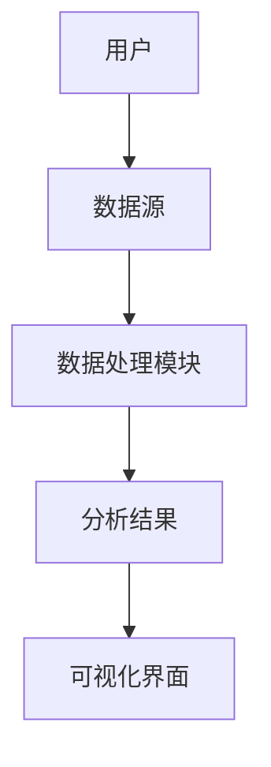
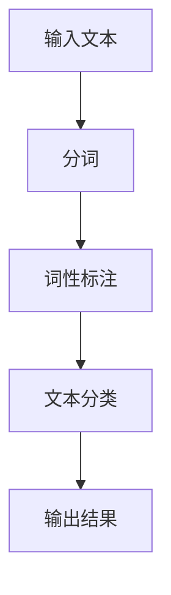
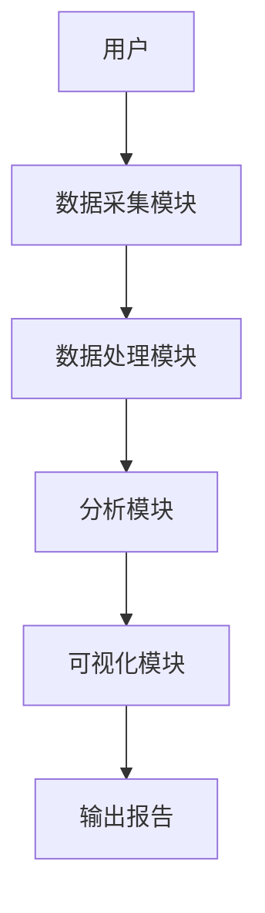

                 


# 构建智能企业市场调研系统：自动化数据收集与分析

---

## 关键词：智能市场调研系统、自动化数据收集、数据分析、人工智能、大数据、系统架构设计

---

## 摘要：  
本文将深入探讨如何构建一个智能企业市场调研系统，通过自动化数据收集与分析技术，帮助企业高效获取市场信息、洞察消费者行为，并基于人工智能和大数据技术实现智能化决策支持。文章从系统背景、核心概念、算法原理、系统架构设计到项目实战，全面解析智能市场调研系统的构建过程，为企业数字化转型提供参考。

---

## 第一部分: 智能企业市场调研系统概述

### 第1章: 智能企业市场调研系统背景

#### 1.1 问题背景与描述
企业市场调研是企业制定战略决策的重要基础，传统市场调研依赖人工数据收集和分析，存在以下痛点：
- 数据来源分散，收集效率低。
- 数据量大，人工分析耗时且易出错。
- 数据洞察滞后，难以快速响应市场变化。

#### 1.2 智能市场调研系统的解决方案
智能企业市场调研系统通过自动化数据收集与分析，解决传统调研的痛点，实现以下目标：
- **自动化数据收集**：整合多数据源，实时抓取市场信息。
- **智能化分析**：利用NLP和机器学习技术，快速提取洞察。
- **系统化管理**：构建统一平台，提升数据处理效率。

#### 1.3 系统边界与外延
智能企业市场调研系统的边界包括：
- 数据源：互联网、企业内部数据库、第三方API等。
- 数据处理模块：清洗、转换、分析。
- 输出结果：可视化报告、预测模型、决策建议。

系统与企业其他系统（如CRM、ERP）通过API接口交互，支持扩展。

---

## 第二部分: 智能企业市场调研系统的核心概念与联系

### 第2章: 核心概念原理

#### 2.1 数据源与数据处理
- **数据源分类**：文本（如社交媒体评论）、图像（如产品图片）、结构化数据（如表格数据）。
- **数据处理流程**：清洗、转换、分析。
- **特征提取**：从数据中提取关键特征，如情感倾向、关键词频率。

#### 2.2 自然语言处理与文本挖掘
- **NLP技术应用**：文本分类、主题挖掘、情感分析。
- **文本分类**：将文本分为不同类别，如正面、负面、中性。
- **主题挖掘**：识别文本中的主要主题，如产品功能、用户体验。

#### 2.3 机器学习与预测模型
- **监督学习**：基于标记数据训练分类模型。
- **无监督学习**：发现数据中的潜在模式，如聚类分析。
- **模型评估**：通过准确率、召回率等指标评估模型性能。

#### 2.4 核心概念属性特征对比表
| 概念     | 属性       | 特征                           |
|----------|------------|--------------------------------|
| 数据源   | 类型       | 文本、图像、结构化数据          |
| 数据处理 | 方法       | 清洗、转换、分析                |
| NLP技术  | 应用       | 分类、主题挖掘、情感分析        |

#### 2.5 ER实体关系图


---

## 第三部分: 智能企业市场调研系统的算法原理

### 第3章: 自然语言处理算法

#### 3.1 NLP核心算法
- **分词算法**：将文本分割成单词或短语，如jieba分词。
- **词性标注**：识别单词的词性，如名词、动词。
- **句法分析**：分析句子的语法结构，如主语、谓语。

#### 3.2 文本分类算法
- **支持向量机（SVM）**：适用于小规模数据，分类准确率高。
- **随机森林（Random Forest）**：适用于大规模数据，抗过拟合能力强。
- **神经网络（Neural Networks）**：适用于复杂任务，如深度学习模型。

#### 3.3 NLP流程图


---

## 第四部分: 智能企业市场调研系统的系统架构设计

### 第4章: 系统架构设计

#### 4.1 功能设计
- **数据采集模块**：实时采集数据，支持多种数据源。
- **数据处理模块**：清洗、转换、分析数据。
- **分析模块**：NLP和机器学习模型生成洞察。
- **可视化模块**：生成图表和报告。

#### 4.2 系统架构图


---

## 第五部分: 项目实战

### 第5章: 项目实战

#### 5.1 环境安装
- 安装Python、Jupyter Notebook、scikit-learn、spaCy等工具。

#### 5.2 核心代码实现
```python
import numpy as np
from sklearn.feature_extraction.text import TfidfVectorizer
from sklearn.svm import SVC

# 数据预处理
texts = [...]  # 文本数据
labels = [...]  # 标签

# 特征提取
vectorizer = TfidfVectorizer()
X = vectorizer.fit_transform(texts)

# 训练模型
model = SVC()
model.fit(X, labels)

# 预测
new_text = "用户反馈：产品功能优秀，但界面设计有待改进"
new_X = vectorizer.transform([new_text])
print(model.predict(new_X))  # 输出预测结果
```

#### 5.3 案例分析
通过实际案例分析，展示系统在市场调研中的应用，如分析社交媒体评论，提取消费者情感倾向和主要反馈。

---

## 第六部分: 总结与建议

### 第6章: 总结与建议

#### 6.1 本章小结
智能企业市场调研系统通过自动化数据收集与分析，显著提升企业的市场调研效率和洞察能力。

#### 6.2 最佳实践
- 数据源选择要多样化，确保数据的全面性。
- 模型选择要根据实际任务需求，合理调整参数。
- 系统设计要注重扩展性和灵活性，便于后续优化。

#### 6.3 注意事项
- 数据隐私和安全问题需要高度重视。
- 模型训练需要足够的数据支持，避免过拟合。
- 系统维护和更新要定期进行，确保性能稳定。

#### 6.4 拓展阅读
- 推荐阅读《机器学习实战》和《自然语言处理入门》等书籍，深入学习相关技术。

---

以上是文章的详细结构和内容，涵盖了从系统背景到项目实战的各个方面，逻辑清晰、结构紧凑，适合技术读者深入理解和实践。

