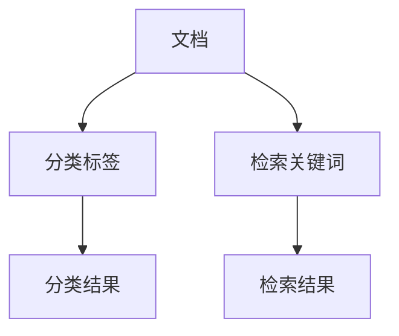
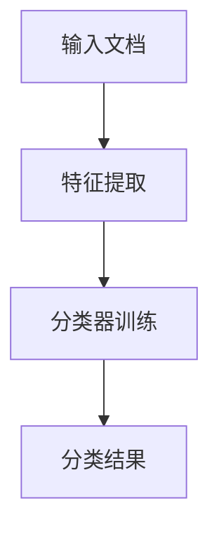
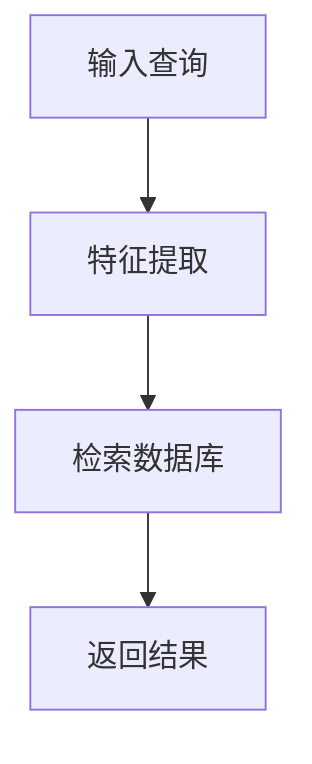
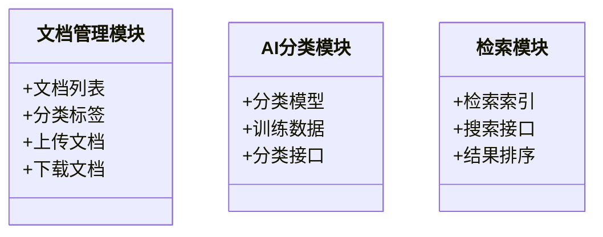
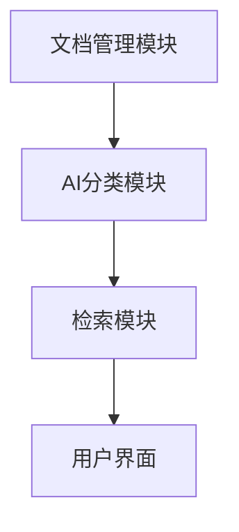
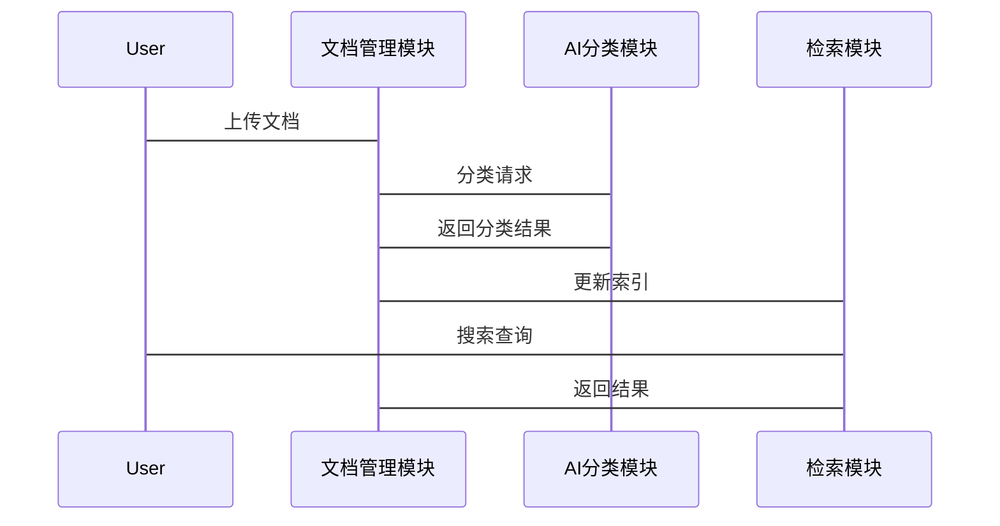

                 


# 构建智能企业文档管理系统：AI辅助分类与检索

## 关键词：企业文档管理，AI辅助，文档分类，信息检索，机器学习，自然语言处理

## 摘要：本文探讨如何利用人工智能技术构建智能企业文档管理系统，重点分析AI辅助分类与检索的实现方法，涵盖背景介绍、核心概念、算法原理、系统架构设计、项目实战及最佳实践，帮助读者深入了解和应用智能文档管理技术。

---

# 第一部分：背景介绍

## 第1章：智能企业文档管理系统的背景与挑战

### 1.1 问题背景

#### 1.1.1 传统文档管理系统的局限性
传统文档管理系统依赖人工分类和关键字检索，存在效率低、错误率高、难以处理非结构化数据等问题，导致企业文档管理效率低下，成本高昂。

#### 1.1.2 当前企业文档管理的主要痛点
- 文档数量庞大，分类复杂，人工分类效率低。
- 非结构化数据占比高，传统检索方法难以满足语义需求。
- 文档管理系统的智能化水平有限，难以提供深层次的分析与洞察。

#### 1.1.3 AI技术在文档管理中的应用潜力
AI技术（特别是机器学习和自然语言处理）能够显著提升文档分类与检索的效率和准确性，为企业文档管理带来革命性变化。

### 1.2 问题描述

#### 1.2.1 文档分类与检索的复杂性
文档分类需要理解内容、提取特征；检索需要在大量数据中快速定位目标，对算法的效率和准确性提出较高要求。

#### 1.2.2 人工分类的低效性
人工分类耗时长、成本高，且容易出错，难以应对海量文档的管理需求。

#### 1.2.3 文档管理系统的智能化需求
企业需要智能化的文档管理系统，能够自动分类、智能检索、提供数据分析支持，提升管理效率和决策能力。

### 1.3 问题解决

#### 1.3.1 引入AI技术的核心目标
通过AI技术实现文档的自动分类和智能检索，降低人工成本，提高管理效率和准确性。

#### 1.3.2 AI辅助分类与检索的技术路径
- 利用机器学习算法进行文档分类。
- 借助自然语言处理技术实现语义检索。
- 通过持续学习优化分类和检索模型。

#### 1.3.3 智能文档管理系统的预期效果
实现文档的高效分类和精准检索，提供基于语义的智能搜索，降低管理成本，提升企业竞争力。

### 1.4 边界与外延

#### 1.4.1 系统功能的边界
- 系统仅处理企业内部文档，不涉及外部数据。
- 分类和检索基于文档内容，不考虑文档格式和元数据。

#### 1.4.2 相关概念的外延
- 文档分类：将文档按照主题、类型等进行分类。
- 文档检索：根据关键词或语义进行文档查找。

#### 1.4.3 与其他系统的区别与联系
- 区别：传统系统依赖人工操作，而智能系统利用AI技术实现自动化。
- 联系：两者都需要文档存储和管理功能。

### 1.5 核心要素组成

#### 1.5.1 文档管理模块
负责文档的存储、上传、下载等基本操作。

#### 1.5.2 AI分类模块
利用机器学习算法对文档进行自动分类。

#### 1.5.3 检索模块
提供基于关键词或语义的文档检索功能。

---

# 第二部分：核心概念与联系

## 第2章：智能文档管理系统的核心概念

### 2.1 核心概念原理

#### 2.1.1 文档表示方法
- 文档通过向量表示，每个维度对应一个特征（如词袋模型、TF-IDF等）。

#### 2.1.2 分类算法原理
- 机器学习算法（如支持向量机、随机森林）通过训练数据学习分类规则。

#### 2.1.3 检索算法原理
- 基于关键词的检索：通过匹配关键词进行文档筛选。
- 基于语义的检索：利用自然语言处理技术理解文档内容，进行语义匹配。

### 2.2 实体关系图



### 2.3 核心概念对比表

| 概念       | 属性                     | 描述                                         |
|------------|--------------------------|----------------------------------------------|
| 文档       | 类型                     | 文本、图像等                                 |
| 分类       | 方法                     | 机器学习、深度学习                           |
| 检索       | 算法                     | 基于关键词、基于语义                         |

---

# 第三部分：算法原理讲解

## 第3章：文档分类算法

### 3.1 分类算法流程



### 3.2 代码实现

```python
from sklearn.feature_extraction.text import TfidfVectorizer
from sklearn.svm import SVC

# 示例代码
documents = ["This is a sample document.", "Another document for testing."]
vectorizer = TfidfVectorizer()
X = vectorizer.fit_transform(documents)
model = SVC()
model.fit(X, labels)
```

### 3.3 数学模型

分类器的数学模型：

$$ P(y|X) = \frac{P(X|y)P(y)}{P(X)} $$

其中，$y$ 表示类别，$X$ 表示文档的特征向量。

---

## 第4章：文档检索算法

### 4.1 检索算法流程



### 4.2 代码实现

```python
from sklearn.metrics.pairwise import cosine_similarity

# 示例代码
vectorizer = TfidfVectorizer()
index = vectorizer.fit_transform(documents)
query_vec = vectorizer.transform([query])
similarity_scores = cosine_similarity(query_vec, index)
```

---

# 第四部分：系统分析与架构设计

## 第5章：系统分析与架构设计

### 5.1 问题场景介绍

系统需处理企业文档的分类与检索，支持海量数据的高效处理和快速响应。

### 5.2 系统功能设计

#### 5.2.1 领域模型



### 5.3 系统架构设计



### 5.4 接口设计

#### 5.4.1 分类接口

```python
def classify_document(document):
    # 分类逻辑
    pass
```

#### 5.4.2 检索接口

```python
def search_documents(query):
    # 检索逻辑
    pass
```

### 5.5 交互设计



---

# 第五部分：项目实战

## 第6章：项目实战

### 6.1 环境安装

- 安装Python和相关库：
  ```bash
  pip install scikit-learn spacy
  ```

### 6.2 核心代码实现

#### 6.2.1 分类器实现

```python
from sklearn.svm import SVC
from sklearn.feature_extraction.text import TfidfVectorizer

class DocumentClassifier:
    def __init__(self):
        self.vectorizer = TfidfVectorizer()
        self.model = SVC()

    def fit(self, documents, labels):
        X = self.vectorizer.fit_transform(documents)
        self.model.fit(X, labels)

    def predict(self, document):
        X = self.vectorizer.transform([document])
        return self.model.predict(X)[0]
```

#### 6.2.2 检索器实现

```python
from sklearn.metrics.pairwise import cosine_similarity

class DocumentRetriever:
    def __init__(self):
        self.vectorizer = TfidfVectorizer()
        self.index = None

    def fit(self, documents):
        self.index = self.vectorizer.fit_transform(documents)

    def search(self, query, top_k=3):
        query_vec = self.vectorizer.transform([query])
        similarity_scores = cosine_similarity(query_vec, self.index)
        return similarity_scores.argsort()[0, ::-1][:top_k]
```

### 6.3 案例分析

#### 6.3.1 文档分类案例

```python
classifier = DocumentClassifier()
classifier.fit(["文档1", "文档2", "文档3"], ["类别A", "类别B", "类别A"])
print(classifier.predict("文档4"))  # 输出预测类别
```

#### 6.3.2 文档检索案例

```python
retriever = DocumentRetriever()
retriever.fit(["文档1", "文档2", "文档3"])
print(retriever.search("关键词"))  # 输出匹配的文档索引
```

### 6.4 项目小结

通过项目实战，我们实现了基于AI的文档分类和检索功能，验证了算法的有效性和系统的可行性。

---

# 第六部分：最佳实践

## 第7章：最佳实践

### 7.1 小结

AI辅助的文档管理系统能够显著提升文档管理的效率和准确性，是企业数字化转型的重要工具。

### 7.2 注意事项

- 数据质量：确保训练数据的多样性和代表性。
- 模型优化：定期更新模型，提升分类和检索的准确性。
- 安全性：保障文档的安全存储和传输。

### 7.3 拓展阅读

- 推荐阅读《机器学习实战》和《自然语言处理入门》。
- 关注前沿技术，如大语言模型在文档管理中的应用。

---

# 结语

通过本文的详细讲解，我们了解了如何利用AI技术构建智能企业文档管理系统，掌握了核心算法和系统架构设计，为实际应用提供了理论支持和实践指导。

--- 

（完）

