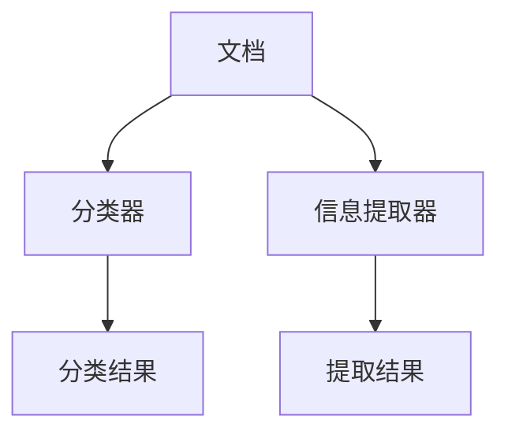
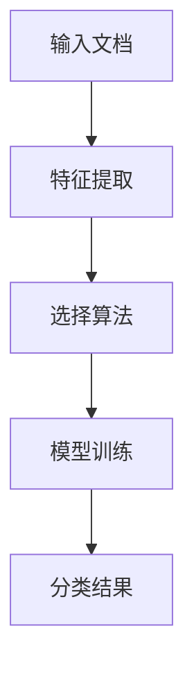
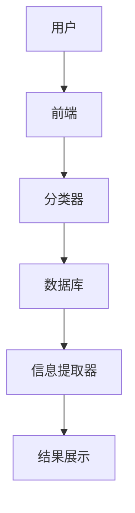
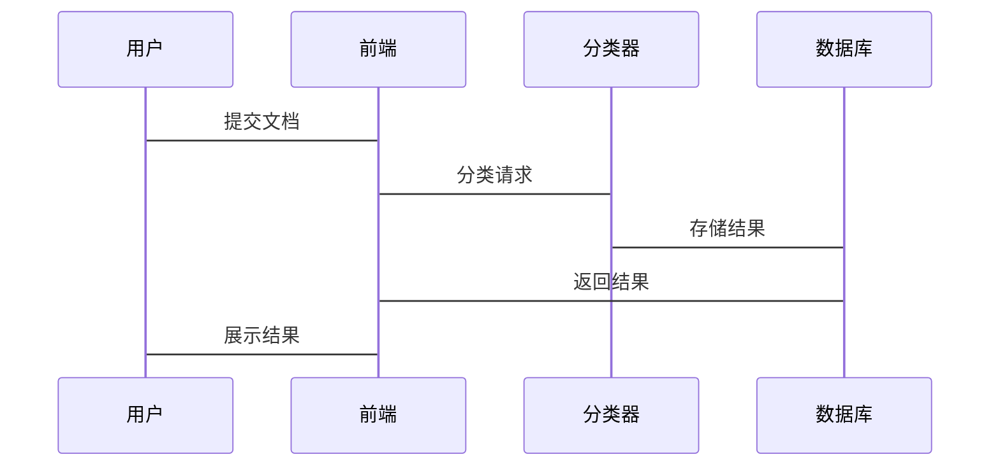

                 


# 构建智能企业文档管理系统：自动分类与信息提取

## 关键词：智能文档管理，自动分类，信息提取，机器学习，文本处理

## 摘要：本文详细探讨了构建智能企业文档管理系统的关键技术和方法，重点分析了自动分类与信息提取的核心算法及其在实际应用中的实现。文章从问题背景出发，系统性地介绍了相关概念、算法原理、系统架构设计以及项目实战，为读者提供了一个全面的技术指导。

---

# 第一部分: 智能企业文档管理系统概述

## 第1章: 智能企业文档管理系统的背景与需求

### 1.1 企业文档管理的现状与挑战
企业文档管理是现代组织中的一项核心任务，涉及大量的文件分类、存储和检索工作。传统的文档管理方式依赖人工操作，存在效率低下、分类错误率高、信息提取不准确等问题。随着企业规模的扩大和文档数量的激增，传统的管理方式已经难以满足需求。

#### 1.1.1 传统文档管理的痛点
- **分类效率低**：人工分类文档耗时长，且容易出错。
- **信息提取困难**：从大量文档中提取关键信息需要大量的人工干预。
- **数据孤岛**：不同部门使用的文档管理系统不统一，导致数据无法有效共享。

#### 1.1.2 智能化文档管理的需求
智能化文档管理通过引入机器学习和自然语言处理技术，能够自动分类文档、提取关键信息，从而提高管理效率和准确性。具体需求包括：
- **自动化分类**：基于文档内容自动归类，减少人工干预。
- **智能信息提取**：从文档中自动提取关键实体和关系，便于后续处理和分析。
- **高效检索**：支持基于内容的快速检索，提升用户体验。

#### 1.1.3 自动分类与信息提取的必要性
自动分类和信息提取是实现智能化文档管理的核心技术。通过这些技术，企业可以更高效地管理文档，提升数据利用效率，为业务决策提供支持。

### 1.2 问题背景与目标
本文的研究目标是设计一个智能企业文档管理系统，实现文档的自动分类和信息提取。通过引入机器学习算法和自然语言处理技术，解决传统文档管理中的效率低下问题。

#### 1.2.1 文档分类与信息提取的定义
- **文档分类**：根据文档内容将其归类到预定义的类别中。
- **信息提取**：从文档中提取关键信息，如人名、日期、地址等实体。

#### 1.2.2 问题解决的核心目标
- 提供一个高效的文档分类方法。
- 实现准确的信息提取功能。
- 提供友好的用户界面和高效的检索功能。

#### 1.2.3 系统的边界与外延
本文研究的系统仅关注文档分类和信息提取部分，不涉及文档的存储和检索功能。后续章节将详细介绍系统的架构和实现方法。

### 1.3 核心概念与系统架构
#### 1.3.1 核心概念的定义与属性对比
通过对比表格和实体关系图，我们明确了文档分类和信息提取的核心概念及其关系。

| 概念 | 定义 | 属性 |
|------|------|------|
| 文档分类 | 根据内容自动归类文档 | 分类器、特征提取、训练数据 |
| 信息提取 | 从文档中提取关键信息 | 实体识别、关系抽取、模式匹配 |

#### 1.3.2 实体关系图


### 1.4 本章小结
本章介绍了智能企业文档管理系统的背景与需求，明确了文档分类和信息提取的核心概念及其重要性。后续章节将详细介绍相关算法和技术。

---

# 第二部分: 文档分类与信息提取的核心算法

## 第2章: 文档分类算法原理

### 2.1 常见分类算法概述
文档分类是智能文档管理中的关键任务，以下是几种常用的分类算法。

#### 2.1.1 TF-IDF特征提取
TF-IDF（Term Frequency-Inverse Document Frequency）是一种常用的文本特征提取方法。

- **TF（词频）**：某词在文档中出现的次数占文档总词数的比例。
- **IDF（逆文档频率）**：衡量某词在文档集合中的重要性，公式为：
  $$ IDF(t) = \log\left(\frac{N}{n_t}\right) $$
  其中，$N$ 是文档总数，$n_t$ 是包含词 $t$ 的文档数。

TF-IDF的计算公式为：
$$ TF-IDF(t, d) = TF(t, d) \times ID(d, t) $$

#### 2.1.2 支持向量机(SVM)
SVM是一种常用的分类算法，适用于高维数据的分类任务。

- **核心思想**：通过构建超平面将数据分为两类。
- **优化目标**：
  $$ \min_{w} \frac{1}{2}||w||^2 $$
  约束条件：
  $$ y_i (w \cdot x_i + b) \geq 1 $$

#### 2.1.3 随机森林与决策树
随机森林是一种基于决策树的集成算法，具有较高的分类精度和鲁棒性。

### 2.2 神经网络分类器
神经网络在文档分类中也有广泛应用，尤其是深度学习模型。

#### 2.2.1 卷积神经网络(CNN)
CNN通过卷积操作提取局部特征，适用于文本序列的特征提取。

#### 2.2.2 循环神经网络(RNN)
RNN适用于处理序列数据，但存在梯度消失问题。

#### 2.2.3 Transformer架构
Transformer通过自注意力机制捕捉全局特征，已成为文本处理的主流模型。

### 2.3 算法流程图


### 2.4 数学模型与公式
#### 2.4.1 TF-IDF计算公式
$$ TF-IDF(t, d) = TF(t, d) \times ID(d, t) $$

#### 2.4.2 SVM优化目标
$$ \min_{w} \frac{1}{2}||w||^2 $$
约束条件：
$$ y_i (w \cdot x_i + b) \geq 1 $$

---

# 第三部分: 系统分析与架构设计

## 第3章: 系统架构设计

### 3.1 问题场景介绍
本文设计的智能文档管理系统主要解决文档分类和信息提取问题。

### 3.2 系统功能设计
系统功能模块包括文档上传、分类、信息提取和检索。

### 3.3 系统架构图


### 3.4 接口设计
系统接口主要包含文档上传接口和分类结果查询接口。

### 3.5 交互图


---

# 第四部分: 项目实战

## 第4章: 项目实战

### 4.1 环境安装
安装Python和相关库：
```bash
pip install numpy scikit-learn spacy
```

### 4.2 核心代码实现
以下是文档分类器的核心代码示例：

```python
from sklearn.feature_extraction.text import TfidfVectorizer
from sklearn.svm import SVC

# 初始化特征提取器
vectorizer = TfidfVectorizer()
# 初始化分类器
classifier = SVC()

# 训练模型
model = classifier.fit(vectorizer.fit_transform(X_train), y_train)
```

### 4.3 代码应用解读
- **特征提取**：使用TF-IDF提取文本特征。
- **模型训练**：使用SVM进行分类。

### 4.4 实际案例分析
通过一个实际案例，详细讲解分类器的训练和应用过程。

### 4.5 本章小结
本章通过实战项目，详细介绍了系统的实现过程，包括环境搭建、代码编写和案例分析。

---

# 第五部分: 最佳实践与总结

## 第5章: 最佳实践

### 5.1 小结
本文详细介绍了智能企业文档管理系统的构建过程，重点分析了自动分类与信息提取的核心算法。

### 5.2 注意事项
- 数据预处理是关键，需注意文本清洗和特征提取。
- 选择合适的算法，根据实际需求调整参数。

### 5.3 拓展阅读
建议读者深入学习自然语言处理和机器学习的相关知识，以提升系统的性能和功能。

---

# 附录

## 附录A: 术语表
列出本文中涉及的专业术语及其定义。

## 附录B: 参考文献
列出本文引用的相关文献和资料。

---

# 结语

通过本文的介绍，读者可以系统性地了解智能企业文档管理系统的构建过程，并掌握自动分类与信息提取的核心技术。希望本文能够为相关领域的研究和实践提供有价值的参考。

