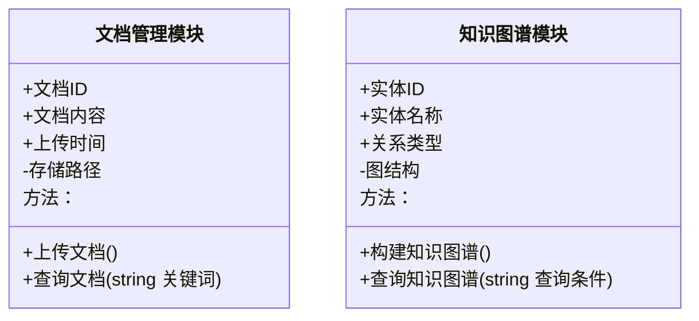
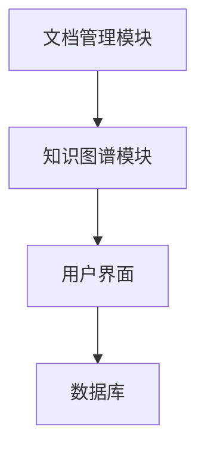
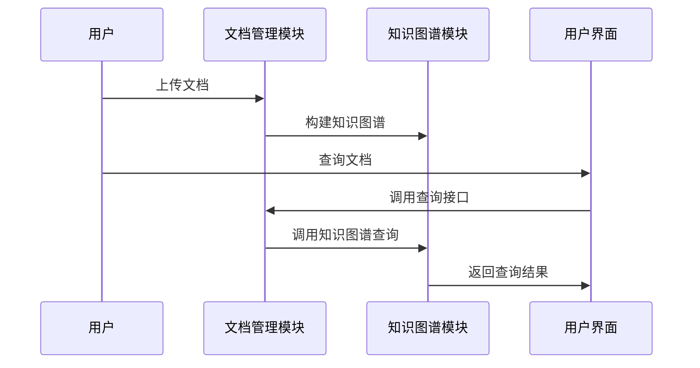

                 


# 构建智能企业文档管理系统：语义检索与知识链接

> 关键词：智能文档管理系统，语义检索，知识链接，向量空间模型，图嵌入，知识图谱

> 摘要：本文详细探讨了构建智能企业文档管理系统的两大核心技术：语义检索与知识链接。通过分析语义检索的算法原理、知识链接的技术实现，结合系统架构设计与项目实战，为读者提供从理论到实践的全面指导。文章最后总结了最佳实践与未来发展方向。

---

# 第一部分: 智能企业文档管理系统概述

## 第1章: 问题背景与核心概念

### 1.1 问题背景
#### 1.1.1 传统文档管理系统的局限性
- 传统文档管理系统依赖关键词匹配，无法理解语义。
- 信息孤岛问题严重，难以实现知识共享。
- 查询效率低下，用户体验差。

#### 1.1.2 智能化文档管理的需求
- 提供基于语义的理解和检索能力。
- 实现文档之间的知识关联与推理。
- 支持多维度的文档分析与展示。

#### 1.1.3 语义检索与知识链接的重要性
- 语义检索能够提升文档查询的准确性和相关性。
- 知识链接能够构建文档之间的语义网络，支持知识推理。

### 1.2 核心概念与技术基础
#### 1.2.1 语义检索的定义与特点
- 定义：基于自然语言处理技术，理解文档内容语义，实现更智能的检索。
- 特点：
  - 理解上下文关系。
  - 支持模糊查询。
  - 提供相关性排序。

#### 1.2.2 知识链接的定义与特点
- 定义：通过构建知识图谱，将文档中的实体、概念和关系进行连接。
- 特点：
  - 支持跨文档的知识关联。
  - 实现知识推理与推荐。
  - 提供语义网络视图。

#### 1.2.3 语义检索与知识链接的关系
- 语义检索是知识链接的基础。
- 知识链接是语义检索的扩展。

#### 1.2.4 核心技术对比表格
| 技术 | 特性 | 描述 |
|------|------|------|
| 语义检索 | 理解能力 | 基于语义理解实现检索 |
| 知识链接 | 关联能力 | 基于知识图谱实现关联 |
| 语义检索 | 查询效率 | 提高查询效率 |
| 知识链接 | 知识推理 | 支持知识推理与推荐 |

#### 1.2.5 ER实体关系图
```mermaid
erd
    title 实体关系图
    知识图谱
        类别: 文档
        类别: 实体
        类别: 关系
    文档
        类别: 文档ID
        类别: 文档内容
    实体
        类别: 实体ID
        类别: 实体名称
    关系
        类别: 关系ID
        类别: 关系类型
```

---

# 第二部分: 语义检索与知识链接的核心原理

## 第2章: 语义检索原理

### 2.1 向量空间模型
#### 2.1.1 向量空间模型的定义
- 将文档表示为向量空间中的点，通过向量运算计算相似度。

#### 2.1.2 文档表示为向量的方法
- 使用词袋模型、TF-IDF等方法将文档转换为向量。

#### 2.1.3 余弦相似度计算公式
$$ \text{相似度} = \frac{\vec{A} \cdot \vec{B}}{|\vec{A}| \cdot |\vec{B}|} $$

#### 2.1.4 BM25算法原理
- 基于概率统计的检索算法，考虑词频和位置因素。

#### 2.1.5 BM25算法实现步骤
1. 计算每个词的IDF值。
2. 计算每个词在文档中的局部概率。
3. 累加得到文档的相似度评分。

### 2.2 基于深度学习的语义检索
#### 2.2.1 BERT模型在语义检索中的应用
- 使用预训练的BERT模型对文档进行编码。
- 通过对比学习或相似度计算实现语义检索。

#### 2.2.2 深度学习模型的优势
- 更强的语义理解能力。
- 能够处理复杂语义关系。

#### 2.2.3 模型训练与优化
- 使用大规模语料库进行微调。
- 采用交叉验证优化模型参数。

## 第3章: 知识链接技术原理

### 3.1 图嵌入技术
#### 3.1.1 图嵌入的定义
- 将图结构中的节点映射到低维向量空间。

#### 3.1.2 Word2Vec在图中的应用
- 使用Word2Vec算法对图中的节点进行向量表示。

#### 3.1.3 Node2Vec算法
- 基于随机游走的图嵌入方法。

#### 3.1.4 图嵌入的训练过程
1. 生成随机游走序列。
2. 使用Skip-Gram模型训练向量。

#### 3.1.5 图嵌入的评估指标
- 查准率（Precision）。
- 查全率（Recall）。

### 3.2 知识图谱构建
#### 3.2.1 知识图谱的定义
- 由实体和关系构成的语义网络。

#### 3.2.2 知识抽取与实体识别
- 使用NLP技术从文档中提取实体。

#### 3.2.3 实体关系抽取
- 使用模式匹配或深度学习方法抽取关系。

#### 3.2.4 知识图谱构建工具
- 使用Neo4j或RDF构建知识图谱。

#### 3.2.5 知识图谱的存储与管理
- 使用图数据库存储实体和关系。

---

# 第三部分: 系统分析与架构设计

## 第4章: 系统分析与架构设计

### 4.1 问题场景介绍
- 企业文档管理系统需要支持智能检索和知识关联。

### 4.2 系统功能设计
#### 4.2.1 系统功能模块
- 文档上传与存储。
- 语义检索功能。
- 知识图谱构建与查询。

#### 4.2.2 领域模型类图


### 4.3 系统架构设计
#### 4.3.1 系统架构图


### 4.4 系统接口设计
- 文档管理模块接口：上传文档、查询文档。
- 知识图谱模块接口：构建知识图谱、查询知识图谱。

### 4.5 系统交互序列图


---

# 第四部分: 项目实战

## 第5章: 项目实战

### 5.1 环境安装
- 安装Python、TensorFlow、Keras、Neo4j等工具。

### 5.2 系统核心实现
#### 5.2.1 语义检索实现
```python
import numpy as np

def compute_cosine_similarity(vector1, vector2):
    dot_product = np.dot(vector1, vector2)
    magnitude1 = np.linalg.norm(vector1)
    magnitude2 = np.linalg.norm(vector2)
    return dot_product / (magnitude1 * magnitude2)
```

#### 5.2.2 知识图谱构建
```python
from neo4j import GraphDatabase

class KnowledgeGraph:
    def __init__(self, uri, user, password):
        self.driver = GraphDatabase.driver(uri, user, password)
    
    def add_entity(self, entity_id, entity_name):
        with self.driver.session() as session:
            session.run("CREATE (:Entity {id: $id, name: $name})", id=entity_id, name=entity_name)
```

### 5.3 案例分析与详细讲解
- 案例：企业内部技术文档管理系统。
- 实现步骤：文档上传、语义检索、知识图谱构建。

### 5.4 项目小结
- 项目实现的关键点：语义检索算法的选择、知识图谱的构建与查询。

---

# 第五部分: 总结与展望

## 第6章: 总结与展望

### 6.1 最佳实践 tips
- 使用预训练模型提升语义检索效果。
- 定期更新知识图谱以保持准确性。

### 6.2 小结
- 本文详细讲解了智能企业文档管理系统的两大核心技术：语义检索与知识链接。
- 通过理论分析与项目实战，展示了如何构建一个高效的文档管理系统。

### 6.3 注意事项
- 数据隐私与安全问题。
- 系统性能优化。

### 6.4 拓展阅读
- 深度学习在NLP中的应用。
- 图神经网络在知识图谱中的应用。

---

通过以上目录结构，文章将从理论到实践，系统地介绍构建智能企业文档管理系统的各个方面，帮助读者全面掌握相关技术。

