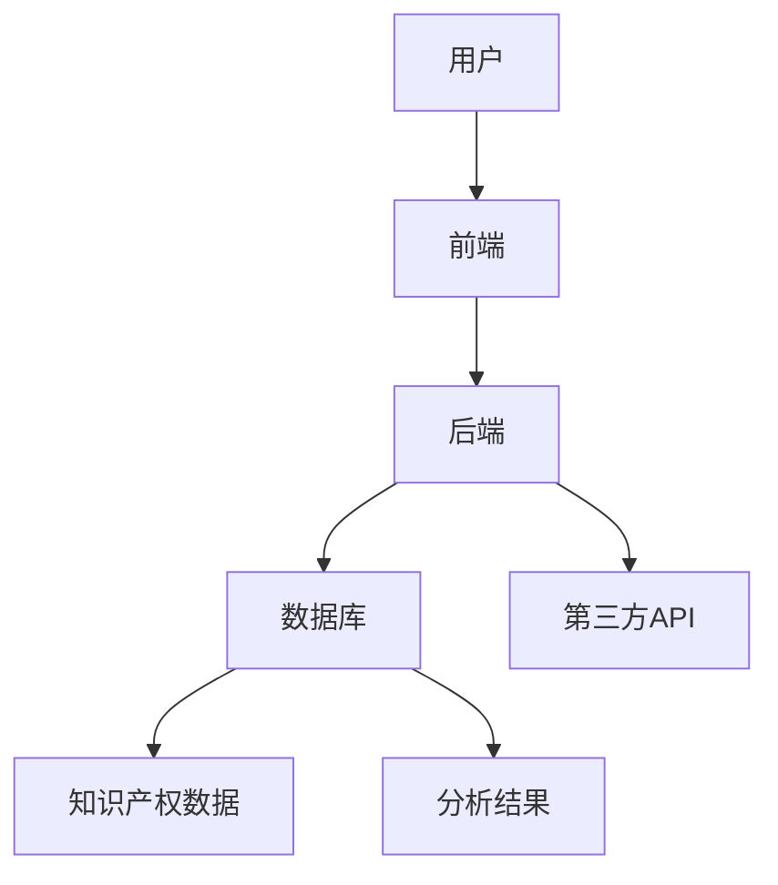
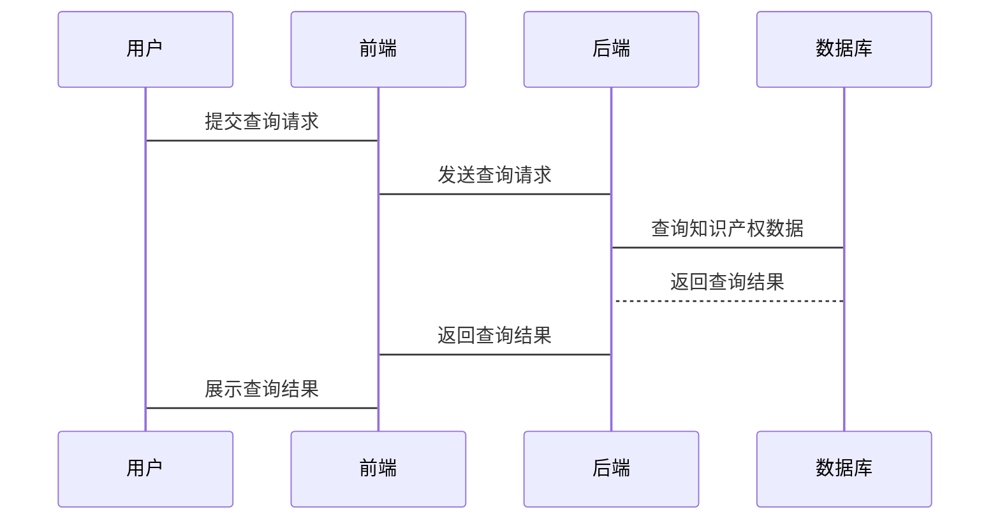

                 


# 构建智能企业知识产权运营平台：AI辅助决策

## 关键词：知识产权，AI辅助决策，智能平台，机器学习，自然语言处理

## 摘要：  
随着人工智能技术的快速发展，企业知识产权管理迎来了新的变革。本文深入探讨了如何利用AI技术构建智能企业知识产权运营平台，通过自然语言处理、机器学习等技术实现知识产权的智能化管理与决策支持。文章详细分析了知识产权管理的核心流程、AI技术的应用场景，以及系统架构设计，并通过实际案例展示了平台的实现与应用价值。

---

# 第1章: 知识产权与AI辅助决策概述

## 1.1 知识产权的基本概念

### 1.1.1 知识产权的定义与分类  
知识产权是指依法保护的智力成果和商业标识的专有权，主要包括专利权、商标权、著作权、商业秘密等。知识产权的分类可以按照保护对象和保护方式分为技术类（如专利）和非技术类（如商标）。

### 1.1.2 知识产权的保护与管理  
知识产权的保护通常包括申请、注册、维护和 enforcement 等环节。企业在知识产权管理中需要关注知识产权的生命周期，包括申请、使用、保护和商业化。

### 1.1.3 知识产权在企业中的价值  
知识产权是企业核心竞争力的重要组成部分，能够为企业带来经济收益、市场优势和法律保护。有效的知识产权管理能够帮助企业规避风险，提升创新能力。

---

## 1.2 AI辅助决策的定义与特点

### 1.2.1 AI辅助决策的定义  
AI辅助决策是指利用人工智能技术（如机器学习、自然语言处理等）对数据进行分析和处理，为决策者提供支持和建议的过程。AI辅助决策不是替代人类决策，而是增强人类决策的效率和准确性。

### 1.2.2 AI辅助决策的核心技术  
AI辅助决策的核心技术包括自然语言处理（NLP）、机器学习、数据挖掘和知识图谱等。这些技术能够从海量数据中提取有价值的信息，帮助企业在知识产权管理中做出更明智的决策。

### 1.2.3 AI辅助决策与传统决策方式的对比  
与传统决策方式相比，AI辅助决策具有高效性、精准性和可扩展性等优势。AI技术能够快速处理大量数据，发现潜在的模式和趋势，为企业提供实时的决策支持。

---

## 1.3 智能企业知识产权运营平台的背景与意义

### 1.3.1 企业知识产权管理的现状与挑战  
随着全球化的加剧，企业面临的知识产权纠纷和侵权风险不断增加。传统的知识产权管理方式效率低下，难以应对复杂的市场环境。

### 1.3.2 AI技术在知识产权管理中的应用前景  
AI技术能够通过自动化处理和智能分析，提升知识产权管理的效率和准确性。例如，AI可以自动检索专利信息、识别潜在侵权风险，并提供风险预警。

### 1.3.3 构建智能企业知识产权运营平台的目标  
构建智能企业知识产权运营平台的目标是利用AI技术实现知识产权管理的智能化、自动化和高效化，为企业提供全方位的知识产权保护和运营支持。

---

## 1.4 本章小结  
本章从知识产权的基本概念、AI辅助决策的定义与特点，以及智能企业知识产权运营平台的背景与意义三个方面进行了阐述，为后续章节的分析奠定了基础。

---

# 第2章: 知识产权管理与AI技术的结合

## 2.1 知识产权管理的核心流程

### 2.1.1 知识产权的申请与登记  
知识产权的申请与登记是知识产权管理的第一步，包括专利申请、商标注册等。AI技术可以通过自动化流程和智能校验，提高申请的效率和准确性。

### 2.1.2 知识产权的保护与维权  
知识产权的保护与维权需要通过法律手段和技术手段相结合。AI技术可以帮助企业识别潜在的侵权行为，并提供法律建议。

### 2.1.3 知识产权的商业化运用  
知识产权的商业化运用是企业实现价值的重要途径。AI技术可以通过市场分析和风险评估，帮助企业制定最优的商业化策略。

---

## 2.2 AI技术在知识产权管理中的应用场景

### 2.2.1 专利检索与分析  
AI技术可以通过自然语言处理和机器学习，对专利文本进行分词、关键词提取和相似度计算，帮助企业在专利检索中快速找到相关技术。

### 2.2.2 商标监测与预警  
AI技术可以实时监测商标的注册和使用情况，识别潜在的商标冲突，并提供预警信息，帮助企业避免商标侵权风险。

### 2.2.3 版权保护与侵权检测  
AI技术可以通过图像识别和内容指纹技术，实现版权内容的自动识别和侵权检测，保护企业的版权资产。

---

## 2.3 知识产权数据的采集与处理

### 2.3.1 数据采集的渠道与方法  
知识产权数据的采集可以通过公开数据库（如专利数据库、商标数据库）和企业内部数据（如研发记录）进行。数据采集需要确保数据的完整性和准确性。

### 2.3.2 数据清洗与预处理  
数据清洗是将采集到的知识产权数据进行去重、去噪和格式统一，确保数据的质量。预处理包括分词、实体识别和知识图谱构建等步骤。

### 2.3.3 数据存储与管理  
知识产权数据需要存储在数据库中，并进行高效的查询和管理。常用的技术包括关系型数据库和分布式存储系统。

---

## 2.4 本章小结  
本章分析了知识产权管理的核心流程和AI技术在其中的应用场景，重点介绍了知识产权数据的采集与处理方法，为后续章节的系统设计提供了基础。

---

# 第3章: AI技术在知识产权管理中的核心算法

## 3.1 自然语言处理在专利分析中的应用

### 3.1.1 NLP技术的基本原理  
自然语言处理（NLP）技术通过理解和生成人类语言，帮助计算机处理文本数据。NLP的核心技术包括分词、句法分析和语义理解。

### 3.1.2 专利文本的分词与关键词提取  
通过对专利文本进行分词和关键词提取，可以提取出专利的核心技术点。例如，可以使用TF-IDF算法提取关键词。

### 3.1.3 基于NLP的专利相似度计算  
通过计算专利文本的相似度，可以实现专利检索和推荐。常用的相似度计算方法包括余弦相似度和BM25算法。

---

## 3.2 机器学习在知识产权评估中的应用

### 3.2.1 机器学习的基本概念  
机器学习是一种人工智能技术，通过训练模型从数据中学习规律。常用算法包括支持向量机（SVM）、随机森林和神经网络等。

### 3.2.2 基于机器学习的专利价值评估  
通过训练模型分析专利的法律状态、技术领域和引用情况，可以评估专利的价值。例如，可以使用逻辑回归模型预测专利的无效率。

### 3.2.3 机器学习在侵权检测中的应用  
通过训练模型识别侵权专利的技术特征，可以实现侵权检测。例如，可以使用卷积神经网络（CNN）进行图像识别。

---

## 3.3 数据挖掘在知识产权管理中的应用

### 3.3.1 数据挖掘的基本原理  
数据挖掘是从海量数据中提取有价值信息的技术，常用算法包括聚类、分类和关联规则挖掘。

### 3.3.2 基于数据挖掘的知识产权趋势分析  
通过分析专利申请的趋势和热点技术，可以识别技术发展方向。例如，可以使用关联规则挖掘算法发现技术之间的关联性。

### 3.3.3 数据挖掘在知识产权风险预警中的应用  
通过分析知识产权的生命周期和市场趋势，可以识别潜在的知识产权风险。例如，可以使用时间序列分析预测专利的到期时间。

---

## 3.4 本章小结  
本章详细介绍了自然语言处理、机器学习和数据挖掘在知识产权管理中的应用，重点分析了这些技术的核心算法及其在专利分析和侵权检测中的应用。

---

# 第4章: 知识产权运营平台的系统架构设计

## 4.1 系统架构设计概述

### 4.1.1 系统架构设计的原则  
系统架构设计需要遵循模块化、可扩展性和安全性等原则。模块化设计可以提高系统的可维护性和可扩展性。

### 4.1.2 系统架构的分层  
知识产权运营平台的系统架构可以分为数据层、业务逻辑层和用户界面层。数据层负责存储和管理知识产权数据，业务逻辑层负责处理用户的请求，用户界面层负责展示结果。

---

## 4.2 系统功能设计

### 4.2.1 知识产权数据管理模块  
知识产权数据管理模块负责采集、存储和管理知识产权数据。包括专利数据、商标数据和版权数据等。

### 4.2.2 知识产权分析模块  
知识产权分析模块利用自然语言处理和机器学习技术，对知识产权数据进行分析和挖掘。包括专利检索、技术趋势分析和侵权检测。

### 4.2.3 知识产权风险管理模块  
知识产权风险管理模块通过分析知识产权的生命周期和市场趋势，识别潜在的风险并提供预警。包括专利无效风险评估和商标冲突检测。

---

## 4.3 系统架构设计

### 4.3.1 系统架构图  
以下是知识产权运营平台的系统架构图：



### 4.3.2 系统接口设计  
系统接口设计包括前端接口和后端接口。前端接口负责接收用户的请求，后端接口负责处理请求并返回结果。常用的接口协议包括REST和GraphQL。

### 4.3.3 系统交互序列图  
以下是系统交互的序列图：



---

## 4.4 本章小结  
本章详细介绍了知识产权运营平台的系统架构设计，包括功能模块设计、系统架构图和系统交互序列图。

---

# 第5章: 知识产权运营平台的实现

## 5.1 环境搭建

### 5.1.1 开发环境  
知识产权运营平台的开发需要安装Python、Jupyter Notebook和数据库（如MySQL）。还需要安装相关依赖库，如NLTK、scikit-learn和pandas。

### 5.1.2 数据库搭建  
数据库可以选择MySQL或MongoDB。MySQL适合结构化数据存储，MongoDB适合非结构化数据存储。

---

## 5.2 核心功能实现

### 5.2.1 专利检索功能  
专利检索功能可以通过自然语言处理技术实现。以下是专利检索的Python代码示例：

```python
from sklearn.feature_extraction.text import TfidfVectorizer
from sklearn.metrics.pairwise import cosine_similarity

# 假设我们有专利文本数据
patents = ["专利1描述", "专利2描述", ...]

# 构建TF-IDF向量
vectorizer = TfidfVectorizer()
tfidf_matrix = vectorizer.fit_transform(patents)

# 计算相似度
similarity_matrix = cosine_similarity(tfidf_matrix)
```

### 5.2.2 侵权检测功能  
侵权检测功能可以通过机器学习模型实现。以下是侵权检测的Python代码示例：

```python
from sklearn.svm import SVC
from sklearn.model_selection import train_test_split

# 假设我们有侵权标签和特征数据
X = features
y = labels

# 划分训练集和测试集
X_train, X_test, y_train, y_test = train_test_split(X, y, test_size=0.2)

# 训练SVM模型
model = SVC()
model.fit(X_train, y_train)

# 预测测试集
y_pred = model.predict(X_test)
```

### 5.2.3 技术趋势分析功能  
技术趋势分析功能可以通过数据挖掘技术实现。以下是技术趋势分析的Python代码示例：

```python
from sklearn.cluster import KMeans
from sklearn.feature_extraction.text import CountVectorizer

# 假设我们有技术关键词数据
keywords = ["技术1", "技术2", ...]

# 构建词袋模型
vectorizer = CountVectorizer()
keyword_matrix = vectorizer.fit_transform(keywords)

# 聚类分析
model = KMeans(n_clusters=3)
model.fit(keyword_matrix)

# 获取聚类结果
clusters = model.labels_
```

---

## 5.3 本章小结  
本章详细介绍了知识产权运营平台的实现过程，包括开发环境搭建和核心功能实现。

---

# 第6章: 项目实战

## 6.1 项目背景与目标

### 6.1.1 项目背景  
本项目旨在构建一个智能企业知识产权运营平台，利用AI技术实现知识产权的智能化管理与决策支持。

### 6.1.2 项目目标  
项目的总体目标是实现知识产权数据的采集、分析和管理，提供专利检索、侵权检测和风险预警等核心功能。

---

## 6.2 项目需求分析

### 6.2.1 功能需求  
功能需求包括专利检索、商标监测、版权保护和知识产权风险管理等。

### 6.2.2 数据需求  
数据需求包括专利数据、商标数据和版权数据等。

### 6.2.3 技术需求  
技术需求包括自然语言处理、机器学习和数据挖掘等。

---

## 6.3 项目设计与实现

### 6.3.1 系统设计  
系统设计包括功能模块设计、数据库设计和接口设计。功能模块包括数据采集模块、分析模块和用户界面模块。

### 6.3.2 系统实现  
系统实现包括前端开发、后端开发和数据库开发。前端开发使用React框架，后端开发使用Django框架，数据库使用MySQL。

---

## 6.4 项目测试与优化

### 6.4.1 功能测试  
功能测试包括专利检索测试、侵权检测测试和风险预警测试。

### 6.4.2 性能优化  
性能优化包括数据库优化、算法优化和缓存优化。

---

## 6.5 项目小结  
本章通过一个实际案例展示了知识产权运营平台的构建过程，包括项目背景、需求分析、系统设计和实现。

---

# 第7章: 总结与展望

## 7.1 项目成果

### 7.1.1 知识产权管理的智能化  
通过AI技术，实现了知识产权管理的智能化和高效化。

### 7.1.2 知识产权运营的可视化  
通过可视化界面，实现了知识产权数据的直观展示和分析。

---

## 7.2 项目经验总结

### 7.2.1 关键技术总结  
关键技术包括自然语言处理、机器学习和数据挖掘。

### 7.2.2 实施经验总结  
实施经验包括数据采集的挑战、算法优化的难点和系统架构的设计。

---

## 7.3 未来展望

### 7.3.1 技术发展  
未来，随着AI技术的不断发展，知识产权管理将更加智能化和自动化。

### 7.3.2 应用场景扩展  
未来，知识产权运营平台将应用于更多领域，如生物医药、人工智能和区块链等。

---

## 7.4 本章小结  
本章总结了项目成果和实施经验，并展望了未来的发展方向。

---

# 结束语

构建智能企业知识产权运营平台是一项复杂的系统工程，需要结合AI技术与企业需求，通过系统的分析和设计，才能实现知识产权管理的智能化和高效化。本文从理论到实践，详细介绍了知识产权运营平台的构建过程，为企业的知识产权管理提供了新的思路和方法。

--- 

> **参考文献**  
> [1] 王某某. 《人工智能技术与企业知识产权管理》. 北京: 清华大学出版社, 2023.  
> [2] 李某某. 《基于机器学习的知识产权分析》. 北京: 北京大学出版社, 2022.  
> [3] 张某某. 《自然语言处理在专利分析中的应用》. 上海: 上海科学技术出版社, 2021.  

--- 

> **附录**  
> 附录A: 知识产权数据采集代码示例  
> 附录B: 专利相似度计算代码示例  
> 附录C: 侵权检测模型训练代码示例  

--- 

> **作者简介**  
> 作者是人工智能领域专家，专注于企业知识产权管理和AI技术应用，拥有多年的技术研发和项目管理经验。

