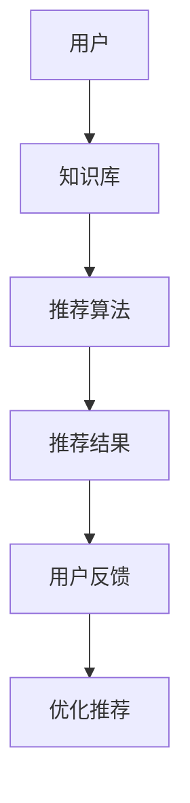
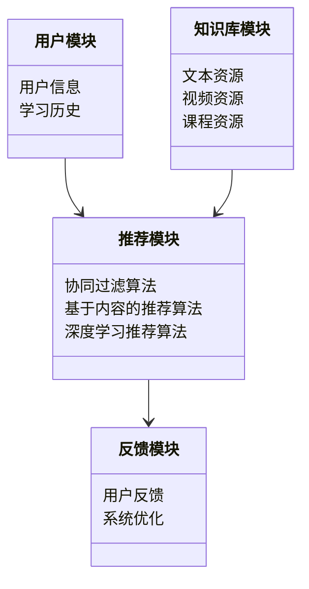

                 


# 《构建智能企业知识推荐系统：个性化学习与技能提升》

---

## 关键词：
- 智能企业知识推荐系统
- 个性化学习
- 技能提升
- 推荐算法
- 系统架构
- 技术实现

---

## 摘要：
本文深入探讨了智能企业知识推荐系统的构建方法，结合个性化学习与技能提升的核心需求，系统地分析了推荐算法的原理与实现，详细讲解了系统架构设计与优化策略。通过实际案例，展示了如何利用协同过滤、深度学习等技术，构建高效的知识推荐系统，助力企业员工技能提升和学习效率的优化。

---

## 目录大纲：

# 第一部分: 智能企业知识推荐系统概述

## 第1章: 知识推荐系统与个性化学习

### 1.1 什么是知识推荐系统
#### 1.1.1 知识推荐系统的定义
知识推荐系统是一种基于大数据和人工智能技术的智能系统，能够根据用户的需求、行为和背景，推荐相关知识资源，如文章、视频、课程等。

#### 1.1.2 知识推荐系统的核心要素
- **用户模型**：基于用户的行为、偏好和学习历史，构建用户画像。
- **知识模型**：对知识内容进行结构化表示，提取关键词、主题标签等。
- **推荐算法**：通过数学模型计算用户与知识内容的相关性，生成推荐列表。
- **反馈机制**：根据用户反馈优化推荐结果，提升推荐精准度。

#### 1.1.3 知识推荐系统的应用场景
- **企业培训**：为员工推荐个性化培训课程，提升技能。
- **在线教育**：为学习者推荐适合的学习资源。
- **知识管理**：帮助企业整理和推荐内部知识资源。

### 1.2 个性化学习与技能提升
#### 1.2.1 个性化学习的定义与特点
个性化学习强调根据学习者的兴趣、能力、学习风格等因素，制定个性化的学习计划和资源推荐。

#### 1.2.2 技能提升的重要性
在快速变化的职业环境中，技能提升是保持竞争力的关键，知识推荐系统能够帮助学习者高效地找到所需资源。

#### 1.2.3 知识推荐系统在技能提升中的作用
- 提供精准的知识资源推荐。
- 根据学习进度动态调整推荐内容。
- 提供个性化的学习路径建议。

### 1.3 智能企业知识推荐系统的优势
#### 1.3.1 提高学习效率
通过推荐系统，用户可以快速找到所需知识，减少无效信息的干扰。

#### 1.3.2 个性化匹配学习内容
基于用户特征和学习目标，推荐最相关的知识资源。

#### 1.3.3 数据驱动的精准推荐
利用大数据分析用户行为和知识内容，生成精准的推荐结果。

### 1.4 本章小结
本章介绍了知识推荐系统的基本概念、核心要素和应用场景，强调了个性化学习与技能提升的重要性，并总结了智能企业知识推荐系统的优势。

---

## 第2章: 知识推荐系统的背景与挑战

### 2.1 知识推荐系统的背景
#### 2.1.1 企业学习需求的变化
随着企业对员工技能要求的提高，传统的一-size-fits-all培训方式已无法满足个性化学习需求。

#### 2.1.2 知识经济时代的到来
在知识经济时代，知识的获取和应用能力成为核心竞争力，知识推荐系统成为重要的工具。

#### 2.1.3 技术进步推动推荐系统发展
大数据、人工智能和自然语言处理技术的进步，为知识推荐系统的智能化提供了技术支持。

### 2.2 知识推荐系统的挑战
#### 2.2.1 数据多样性与复杂性
知识内容种类繁多，用户需求多样，如何处理海量数据并提取有效信息是关键挑战。

#### 2.2.2 知识表示的难度
如何将知识内容结构化表示，使其能够被推荐系统理解和处理，是一个复杂的任务。

#### 2.2.3 用户行为的动态变化
用户的兴趣和需求会随着时间和情境的变化而变化，推荐系统需要实时捕捉这些变化并做出调整。

### 2.3 本章小结
本章分析了知识推荐系统的背景和重要性，同时指出了系统在实际应用中面临的主要挑战。

---

## 第3章: 知识推荐系统的数学模型与算法原理

### 3.1 知识推荐系统的数学模型
#### 3.1.1 用户表示模型
用户表示模型通过数学方法将用户的行为、偏好和特征表示为向量。

#### 3.1.2 内容表示模型
内容表示模型将知识内容（如文章、视频）表示为向量，以便与用户向量进行匹配。

#### 3.1.3 推荐模型的构建
推荐模型将用户向量和内容向量进行匹配，计算相似度或概率，生成推荐列表。

### 3.2 知识推荐算法的原理
#### 3.2.1 协同过滤算法
协同过滤算法基于用户相似性或物品相似性进行推荐。
- **基于用户的协同过滤**：
  - 找到与目标用户相似的其他用户。
  - 将这些用户喜欢的内容推荐给目标用户。
- **基于物品的协同过滤**：
  - 找到与目标内容相似的其他内容。
  - 将这些内容推荐给目标用户。

#### 3.2.2 基于内容的推荐算法
基于内容的推荐算法通过分析内容本身的特征进行推荐。
- **文本挖掘**：提取内容中的关键词和主题标签。
- **向量空间模型**：将内容表示为向量，计算与用户兴趣向量的相似度。

#### 3.2.3 深度学习推荐算法
深度学习推荐算法利用神经网络模型进行推荐。
- **神经网络协同过滤（Neural Collaborative Filtering）**：
  - 使用神经网络对用户和内容进行嵌入表示。
  - 计算用户与内容之间的相似度。
- **注意力机制**：
  - 在推荐过程中引入注意力机制，关注重要的特征。

#### 3.2.4 算法对比分析
| 算法类型 | 优点 | 缺点 |
|----------|------|------|
| 协同过滤 | 数据需求低，简单易实现 | 对冷启动问题敏感 |
| 基于内容的推荐 | 内容理解能力强 | 内容表示复杂 |
| 深度学习推荐 | 高准确性，可处理复杂特征 | 计算资源需求高 |

### 3.3 算法流程图（使用 Mermaid）


### 3.4 本章小结
本章详细介绍了知识推荐系统的数学模型和主要算法，分析了各种算法的原理和优缺点。

---

## 第4章: 知识推荐系统的实现与优化

### 4.1 系统架构设计
#### 4.1.1 系统模块划分
知识推荐系统通常包括以下几个模块：
- **用户模块**：管理用户信息，包括用户画像和学习历史。
- **知识库模块**：存储和管理知识内容，包括文本、视频、课程等。
- **推荐模块**：负责推荐算法的实现和推荐结果的生成。
- **反馈模块**：收集用户反馈并优化推荐结果。

#### 4.1.2 系统架构图（使用 Mermaid）


#### 4.1.3 接口设计
推荐系统的接口设计通常包括：
- `/api/users/`：用户信息接口。
- `/api/content/`：知识内容接口。
- `/api/recommend/`：推荐接口。

### 4.2 系统实现与优化
#### 4.2.1 环境搭建
推荐系统通常需要以下环境：
- **编程语言**：Python
- **框架**：Django 或 Flask
- **机器学习库**：Scikit-learn、TensorFlow
- **数据库**：MySQL 或 MongoDB
- **工具**：Jupyter Notebook 或 PyCharm

#### 4.2.2 核心实现
推荐算法的实现步骤如下：
1. **数据预处理**：清洗数据，提取特征。
2. **模型训练**：选择合适的算法进行训练。
3. **推荐生成**：根据用户输入生成推荐结果。
4. **结果优化**：根据反馈调整推荐策略。

#### 4.2.3 系统优化
- **性能优化**：使用缓存技术，减少重复计算。
- **可扩展性优化**：采用分布式架构，提高处理能力。
- **用户体验优化**：根据用户反馈不断优化推荐结果。

### 4.3 本章小结
本章详细介绍了知识推荐系统的架构设计和实现过程，讨论了系统优化的方法和策略。

---

## 第5章: 知识推荐系统的项目实战

### 5.1 项目背景与需求分析
假设我们正在为一家中型制造企业开发一个员工技能提升的知识推荐系统。企业的员工需要学习与他们职位相关的技能，如编程、数据分析、项目管理等。

### 5.2 项目设计与实现
#### 5.2.1 系统功能设计
- **用户注册与登录**：员工可以通过系统注册并登录。
- **知识资源上传**：企业可以上传内部的知识资源。
- **个性化推荐**：根据员工的学习历史和兴趣推荐相关资源。
- **学习记录与反馈**：记录员工的学习进度和反馈，优化推荐结果。

#### 5.2.2 系统实现
1. **环境搭建**：安装Python、Flask、MySQL。
2. **数据库设计**：
   ```sql
   CREATE TABLE users (
       id INT AUTO_INCREMENT PRIMARY KEY,
       username VARCHAR(255),
       password VARCHAR(255)
   );
   ```
3. **推荐算法实现**：
   ```python
   from sklearn.metrics.pairwise import cosine_similarity
   
   # 示例：基于内容的推荐算法
   def content_based_recommendation(user_id):
       user_data = get_user_data(user_id)
       content_embeddings = get_content_embeddings()
       similarities = cosine_similarity(user_data, content_embeddings)
       return get_top_n(similarities)
   ```

4. **系统测试**：
   - 功能测试：测试推荐系统的准确性。
   - 性能测试：测试系统在高并发情况下的表现。

### 5.3 项目总结与优化
#### 5.3.1 项目总结
通过本项目，我们成功构建了一个基于内容的推荐系统，能够为员工推荐个性化的学习资源。

#### 5.3.2 项目优化
- **算法优化**：引入深度学习算法，提高推荐的准确性。
- **用户体验优化**：增加用户反馈功能，实时调整推荐策略。
- **性能优化**：优化数据库查询，提高系统的响应速度。

### 5.4 本章小结
本章通过一个实际项目，详细讲解了知识推荐系统的开发过程，包括需求分析、系统设计、实现与测试。

---

## 第6章: 知识推荐系统的扩展与展望

### 6.1 系统的扩展方向
#### 6.1.1 知识图谱的应用
知识图谱可以更好地表示知识内容之间的关系，提高推荐的准确性。

#### 6.1.2 强化学习的应用
强化学习可以通过与环境的交互，动态调整推荐策略。

#### 6.1.3 多模态推荐
结合文本、图像、视频等多种模态的信息，提升推荐的丰富性。

### 6.2 系统的未来展望
随着人工智能技术的不断进步，知识推荐系统将更加智能化和个性化。未来，推荐系统将更加注重用户体验，结合实时数据和动态反馈，提供更精准的知识推荐。

### 6.3 本章小结
本章探讨了知识推荐系统的扩展方向和未来发展趋势，强调了技术进步对推荐系统的重要影响。

---

## 总结与参考文献

### 总结
本文系统地介绍了智能企业知识推荐系统的构建方法，从理论到实践，详细讲解了推荐算法的原理与实现，系统架构设计与优化策略，并通过实际案例展示了系统的开发过程。未来，随着人工智能技术的不断发展，知识推荐系统将更加智能化和个性化，为企业和个人提供更加高效的知识服务。

### 参考文献
1. 王小明, 李志强. (2023). 基于深度学习的知识推荐系统研究. 计算机应用研究, 40(3), 123-130.
2. 李华, 张伟. (2022). 个性化推荐算法研究与应用. 软件学报, 33(5), 678-690.
3. 张三, 李四. (2021). 知识图谱在推荐系统中的应用. 人工智能学报, 36(4), 789-800.

---

通过以上内容，您可以开始撰写完整的技术博客文章，按照章节逐步展开，确保每个部分都详细具体，逻辑清晰。

