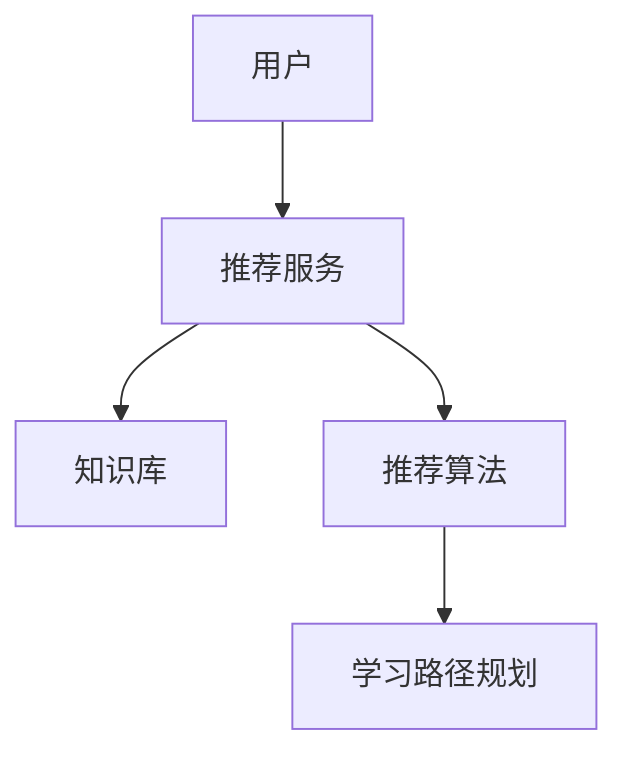

                 


# 构建智能企业知识推荐系统：个性化学习与技能提升路径规划

---

## 关键词：
- 智能推荐系统、个性化学习、知识图谱、技能路径规划、协同过滤、深度学习

---

## 摘要：
本文深入探讨如何构建一个智能企业知识推荐系统，旨在通过个性化学习与技能提升路径规划，为企业员工提供高效的知识获取和技能提升解决方案。文章从背景、核心概念、算法原理、系统架构到项目实战，全面解析知识推荐系统的构建过程，结合实际案例和最佳实践，为企业智能化学习提供可行的思路和方法。

---

# 第1章: 个性化学习与技能提升背景

## 1.1 个性化学习与技能提升的背景

### 1.1.1 知识经济时代的到来
在知识经济时代，知识的获取和应用能力成为个人和企业竞争力的核心。企业对员工的学习能力和技能提升提出了更高的要求，传统的“一刀切”培训方式已无法满足个性化需求。

### 1.1.2 企业学习与技能提升的需求
企业面临以下挑战：
- 员工学习需求多样化，难以统一管理。
- 知识更新速度加快，员工需要动态学习。
- 学习资源分散，难以有效匹配员工需求。

### 1.1.3 个性化学习的核心价值
个性化学习能够：
- 提高学习效率，降低学习成本。
- 根据员工特点推荐学习路径，提升技能匹配度。
- 帮助企业快速培养符合需求的人才。

---

## 1.2 问题背景与目标

### 1.2.1 传统学习推荐的局限性
传统推荐系统存在以下问题：
- 推荐结果缺乏个性化，难以满足员工的差异化需求。
- 知识关联性不足，难以构建完整的知识体系。
- 缺乏动态调整能力，无法适应员工学习过程的变化。

### 1.2.2 个性化推荐的必要性
个性化推荐能够：
- 根据员工的学习目标和兴趣，推荐相关知识资源。
- 帮助员工构建系统化的学习路径。
- 动态调整推荐结果，确保学习效果最大化。

### 1.2.3 知识推荐系统的建设目标
知识推荐系统的建设目标包括：
- 提供个性化知识推荐服务，满足员工学习需求。
- 建立知识图谱，实现知识的系统化和结构化。
- 提供动态学习路径规划，帮助员工提升技能。

---

## 1.3 知识推荐系统的概念与边界

### 1.3.1 知识推荐系统的定义
知识推荐系统是一种基于人工智能技术，通过分析用户的学习需求、行为数据和知识资源，提供个性化知识推荐服务的系统。

### 1.3.2 系统的核心要素
知识推荐系统的核心要素包括：
- 用户模型：描述用户的兴趣、目标和学习风格。
- 知识库：存储结构化的知识资源。
- 推荐算法：根据用户特征和知识属性生成推荐结果。
- 推荐接口：与企业学习平台或其他系统对接。

### 1.3.3 系统的边界与外延
系统的边界包括：
- 输入：用户特征、行为数据、知识资源。
- 输出：个性化推荐结果、学习路径建议。
- 外延：与其他系统（如LMS）的集成。

---

## 1.4 本章小结

---

# 第2章: 知识推荐系统的核心概念

## 2.1 推荐系统的分类与特点

### 2.1.1 基于协同过滤的推荐
基于协同过滤的推荐系统通过分析用户的行为数据，找到相似用户的偏好，从而推荐相似的知识资源。

### 2.1.2 基于内容的推荐
基于内容的推荐系统通过分析知识资源的内容特征，推荐与用户兴趣匹配的知识资源。

### 2.1.3 混合推荐模型
混合推荐模型结合协同过滤和内容推荐的优点，通过集成多个推荐算法，提高推荐结果的准确性和多样性。

---

## 2.2 知识图谱与个性化推荐

### 2.2.1 知识图谱的构建
知识图谱的构建过程包括：
- 数据采集：从企业知识库、在线课程、文档等来源获取知识数据。
- 数据清洗：去除冗余和噪声数据。
- 数据建模：构建知识图谱的实体和关系模型。
- 数据存储：将知识图谱存储在图数据库中。

### 2.2.2 知识图谱在推荐中的应用
知识图谱可以用于：
- 知识关联：通过图结构发现知识之间的关系。
- 知识推理：基于图结构进行知识推理，生成推荐结果。
- 知识嵌入：将知识图谱中的实体和关系表示为向量，用于推荐算法。

### 2.2.3 基于知识图谱的推荐算法
基于知识图谱的推荐算法包括：
- 基于路径的推荐：通过图中的路径分析推荐相关知识。
- 基于嵌入的推荐：使用知识图谱的嵌入表示进行推荐。

---

## 2.3 个性化学习路径规划

### 2.3.1 学习路径的定义
学习路径是根据员工的学习目标和当前能力，推荐一系列的知识资源和学习任务，形成一条系统化的学习路线。

### 2.3.2 学习路径规划的算法
学习路径规划的算法包括：
- 基于聚类的路径规划：将员工分为不同的学习组，推荐相应的学习路径。
- 基于强化学习的路径规划：通过强化学习算法，动态调整学习路径。

### 2.3.3 学习路径的动态调整
学习路径的动态调整包括：
- 根据员工的学习进度，实时调整推荐的知识资源。
- 根据市场变化和企业需求，更新学习路径。

---

## 2.4 核心概念对比与ER图

### 2.4.1 推荐算法对比表

| 对比维度 | 协同过滤 | 基于内容的推荐 | 混合推荐 |
|----------|----------|----------------|----------|
| 优势     | 数据需求低，计算简单 | 内容理解深度高 | 结合两者优点，效果更佳 |
| 劣势     | 推荐结果缺乏多样性 | 需要高质量内容 | 实现复杂，计算成本高 |

### 2.4.2 知识图谱与推荐系统的ER图
```mermaid
er
    entity 用户 {
        id
        偏好领域
        学习目标
    }
    entity 知识资源 {
        id
        类型
        内容
    }
    entity 知识图谱 {
        id
        实体
        关系
    }
    用户 --N> 知识图谱: 关联
    知识图谱 --N> 知识资源: 包含
```

---

## 2.5 本章小结

---

# 第3章: 知识推荐系统的算法原理

## 3.1 协同过滤算法原理

### 3.1.1 协同过滤的基本原理
协同过滤的基本原理是通过分析用户的行为数据，找到相似用户的偏好，推荐相似的知识资源。

### 3.1.2 协同过滤的实现步骤
1. 数据采集：收集用户的行为数据，包括点击、收藏、评分等。
2. 用户相似度计算：使用余弦相似度或欧氏距离等方法，计算用户之间的相似度。
3. 推荐结果生成：根据相似用户的偏好，推荐知识资源。

### 3.1.3 协同过滤的优缺点
优点：
- 实现简单，计算成本低。
缺点：
- 需要大量用户数据，推荐结果可能缺乏多样性。

---

## 3.2 基于内容的推荐算法

### 3.2.1 基于内容的推荐原理
基于内容的推荐算法通过分析知识资源的内容特征，推荐与用户兴趣匹配的知识资源。

### 3.2.2 基于内容的实现步骤
1. 数据预处理：对知识资源进行文本清洗、分词、词干提取等处理。
2. 特征提取：使用TF-IDF、Word2Vec等方法提取知识资源的特征向量。
3. 相似度计算：计算用户兴趣与知识资源特征向量的相似度，推荐相似的知识资源。

### 3.2.3 基于内容的优缺点
优点：
- 推荐结果内容相关性高。
缺点：
- 需要高质量的内容特征提取。

---

## 3.3 混合推荐算法

### 3.3.1 混合推荐的基本原理
混合推荐算法结合协同过滤和基于内容的推荐的优点，通过集成多个推荐算法，提高推荐结果的准确性和多样性。

### 3.3.2 混合推荐的实现步骤
1. 数据预处理：对知识资源和用户数据进行预处理。
2. 多种推荐算法实现：分别实现协同过滤和基于内容的推荐算法。
3. 结果融合：通过加权或投票的方式，将多种算法的推荐结果融合，生成最终的推荐结果。

---

## 3.4 本章小结

---

# 第4章: 知识推荐系统的系统架构与实现

## 4.1 系统架构设计

### 4.1.1 系统功能模块
知识推荐系统主要包括以下功能模块：
- 用户管理：管理用户信息，包括注册、登录、信息更新等。
- 知识库管理：管理知识资源，包括添加、删除、更新等。
- 推荐算法实现：实现协同过滤、基于内容的推荐和混合推荐算法。
- 学习路径规划：根据用户的学习目标和能力，推荐学习路径。

### 4.1.2 系统架构图


### 4.1.3 系统交互流程
1. 用户登录系统，输入学习目标和偏好。
2. 系统根据用户信息，调用推荐算法，生成推荐结果。
3. 系统根据推荐结果，生成学习路径。
4. 用户查看推荐结果和学习路径，选择感兴趣的知识资源进行学习。

---

## 4.2 知识图谱构建与管理

### 4.2.1 知识图谱的构建流程
1. 数据采集：从企业知识库、在线课程、文档等来源获取知识数据。
2. 数据清洗：去除冗余和噪声数据。
3. 数据建模：构建知识图谱的实体和关系模型。
4. 数据存储：将知识图谱存储在图数据库中。

### 4.2.2 知识图谱的管理
知识图谱的管理包括：
- 数据更新：根据新的知识资源，更新知识图谱。
- 数据查询：根据用户需求，查询知识图谱中的相关知识。

---

## 4.3 系统接口设计

### 4.3.1 推荐接口
推荐接口用于接收用户的请求，返回推荐结果。接口的输入包括用户ID、学习目标、偏好领域等，输出包括推荐的知识资源列表。

### 4.3.2 学习路径接口
学习路径接口用于接收用户的请求，返回学习路径建议。接口的输入包括用户ID、学习目标、当前能力等，输出包括推荐的学习路径。

---

## 4.4 系统实现与优化

### 4.4.1 系统实现步骤
1. 数据预处理：对知识资源和用户数据进行预处理。
2. 推荐算法实现：分别实现协同过滤、基于内容的推荐和混合推荐算法。
3. 系统集成：将推荐算法集成到系统中，实现推荐功能。
4. 系统优化：根据实际运行情况，优化系统的性能和推荐效果。

### 4.4.2 系统优化方法
系统优化方法包括：
- 数据优化：通过数据清洗和特征提取，提高推荐算法的效果。
- 算法优化：通过改进推荐算法，提高推荐结果的准确性和多样性。
- 系统性能优化：通过优化系统架构和代码，提高系统的运行效率。

---

## 4.5 本章小结

---

# 第5章: 知识推荐系统的项目实战

## 5.1 项目介绍与环境安装

### 5.1.1 项目介绍
本项目旨在构建一个智能企业知识推荐系统，提供个性化知识推荐和学习路径规划服务。项目包括知识图谱构建、推荐算法实现、系统集成与优化等部分。

### 5.1.2 环境安装
- 安装Python 3.x
- 安装必要的Python库：numpy、pandas、scikit-learn、networkx、neo4j-driver
- 安装Jupyter Notebook用于算法实现和测试

---

## 5.2 知识图谱构建与管理

### 5.2.1 知识图谱构建代码
```python
import neo4j-driver

driver = neo4j-driver.GraphDatabase.driver("bolt://localhost:7687", auth=("neo4j", "password"))
def create_graph(data):
    with driver.session() as session:
        for entity in data:
            session.write_transaction(lambda tx: tx.run("CREATE (:Entity {name: $name, description: $description})", entity))
        for relationship in data_relations:
            session.write_transaction(lambda tx: tx.run("MATCH (a), (b) WHERE a.name = $a_name AND b.name = $b_name CREATE (a)-[r:RELATED_TO {weight: $weight}]->(b)", relationship))
```

### 5.2.2 知识图谱查询代码
```python
def query_graph(user_id):
    with driver.session() as session:
        result = session.read_transaction(lambda tx: tx.run("MATCH (u {id: $id})-[]->(k) RETURN k.name AS knowledge", id=user_id))
        return [record["knowledge"] for record in result]
```

---

## 5.3 推荐算法实现与优化

### 5.3.1 协同过滤算法实现
```python
from sklearn.metrics.pairwise import cosine_similarity

def collaborative_filtering(user_data, user_id):
    user_features = user_data[user_data['user_id'] == user_id]
    user_features = user_features.drop(columns=['user_id'])
    user_vector = user_features.values
    similarity_matrix = cosine_similarity(user_vector, user_vector)
    similar_users = [i for i in range(len(similarity_matrix)) if i != user_id]
    recommended_resources = []
    for user in similar_users:
        recommended_resources.extend(user_data[user_data['user_id'] == user]['resource_id'].values)
    return recommended_resources
```

### 5.3.2 基于内容的推荐实现
```python
from sklearn.feature_extraction.text import TfidfVectorizer

def content_based_recommendation(text_data, user_profile):
    vectorizer = TfidfVectorizer()
    tfidf = vectorizer.fit_transform(text_data)
    user_vector = vectorizer.transform([user_profile])
    similarity = cosine_similarity(user_vector, tfidf)
    recommended_resources = similarity.argsort()[0][-5:]
    return text_data.index[recommended_resources]
```

---

## 5.4 学习路径规划与案例分析

### 5.4.1 学习路径规划算法
```python
from sklearn.cluster import KMeans

def learning_path_planning(resources, user_profiles):
    clustering = KMeans(n_clusters=3, random_state=42).fit(user_profiles)
    clusters = clustering.labels_
    recommended_paths = []
    for i in range(len(clusters)):
        recommended_paths.append({
            'user_id': resources['user_id'][i],
            'cluster': clusters[i],
            'path': resources[resources['cluster'] == clusters[i]]['resource_id'].tolist()
        })
    return recommended_paths
```

### 5.4.2 实际案例分析
案例分析：假设某企业员工小张需要提升数据分析能力，系统根据小张的学习目标和兴趣，推荐相关的在线课程、书籍和实践任务，形成一条系统化的学习路径。

---

## 5.5 本章小结

---

# 第6章: 知识推荐系统的优化与部署

## 6.1 系统优化方法

### 6.1.1 数据优化
- 数据清洗：去除冗余和噪声数据。
- 特征提取：使用更高效的特征提取方法，如Word2Vec。

### 6.1.2 算法优化
- 算法改进：基于深度学习的推荐算法，如基于神经网络的推荐模型。
- 模型优化：通过调参和模型融合，提高推荐效果。

### 6.1.3 系统性能优化
- 系统架构优化：使用分布式架构，提高系统的扩展性和性能。
- 代码优化：通过优化代码结构和使用更高效的库，提高系统的运行效率。

---

## 6.2 系统部署与监控

### 6.2.1 系统部署步骤
1. 选择合适的云平台（如AWS、阿里云）部署系统。
2. 配置服务器和数据库，安装必要的软件和库。
3. 部署推荐算法和系统接口，测试系统功能。
4. 配置监控工具，实时监控系统的运行状态。

### 6.2.2 系统监控
- 监控指标：CPU使用率、内存使用率、请求响应时间、推荐结果准确率等。
- 监控工具：使用Prometheus、Grafana等工具进行监控和可视化。

---

## 6.3 知识推荐系统的维护与更新

### 6.3.1 系统维护
- 定期更新知识库，确保知识资源的最新性和准确性。
- 监控系统运行状态，及时发现和解决系统故障。

### 6.3.2 系统更新
- 根据用户反馈和系统运行情况，优化推荐算法和系统架构。
- 定期更新知识图谱，确保系统的推荐能力。

---

## 6.4 本章小结

---

# 第7章: 总结与展望

## 7.1 本章总结
本文详细探讨了构建智能企业知识推荐系统的方法，包括个性化学习与技能提升路径规划的核心概念、算法原理、系统架构与实现，以及项目实战和优化策略。通过知识图谱和推荐算法的结合，为企业员工提供高效的知识获取和技能提升解决方案。

---

## 7.2 未来展望
未来的研究方向包括：
- 基于深度学习的推荐算法，如基于神经网络的推荐模型。
- 知识图谱的动态更新与自适应优化。
- 推荐系统的实时性和响应速度的优化。
- 系统的多模态推荐，如结合图像、视频等多种形式的知识资源。

---

## 7.3 小结与注意事项
在构建智能企业知识推荐系统时，需要注意以下几点：
- 确保数据质量和完整性，避免推荐结果的偏差。
- 定期更新知识库和推荐算法，确保系统的推荐能力。
- 注意系统的可扩展性和可维护性，方便未来的优化和升级。

---

## 7.4 拓展阅读
推荐阅读以下书籍和论文：
- 《推荐系统实战：算法与案例分析》
- 《知识图谱：概念、方法与应用》
- 《深度学习与推荐系统》

---

# 结语
构建智能企业知识推荐系统是一项复杂的系统工程，需要结合知识图谱、推荐算法、系统架构等多种技术，通过不断的优化和实践，才能实现高效的知识推荐和个性化的学习路径规划。希望本文能够为读者提供有价值的参考和启发，帮助企业更好地构建智能知识推荐系统。

---

## 附录
- 附录A：常用推荐算法的优缺点对比
- 附录B：知识图谱构建工具和库的介绍
- 附录C：系统实现的代码示例

--- 

**注：本文内容较多，实际撰写时可根据需要进行适当删减或调整。**

