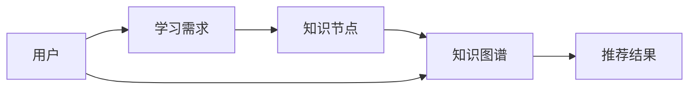
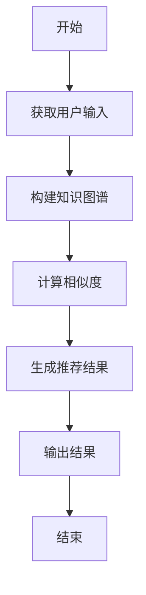
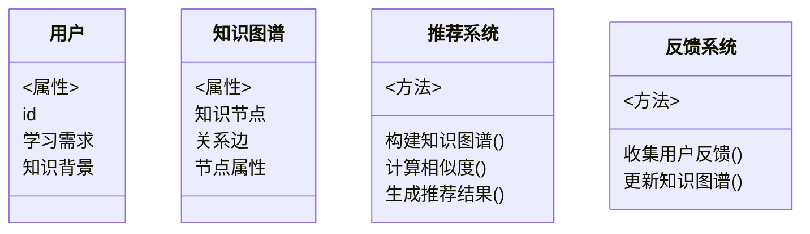
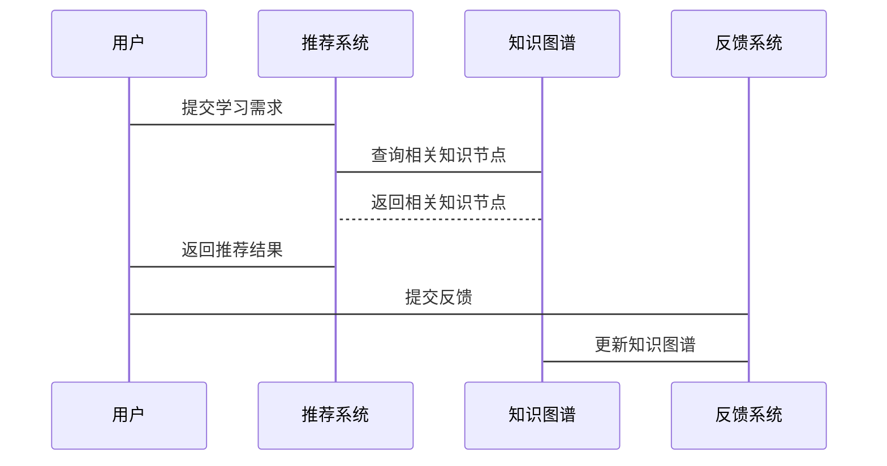

                 


# 构建智能企业知识推荐系统：个性化学习路径与资源推荐

**关键词**：智能推荐系统、知识图谱、个性化学习、协同过滤、知识管理

**摘要**：  
在知识经济时代，企业对员工的知识管理提出了更高的要求。构建一个智能企业知识推荐系统，能够根据员工的学习需求和知识背景，提供个性化的学习路径和资源推荐，从而提高学习效率和知识利用率。本文从问题背景出发，详细探讨了智能推荐系统的原理、算法实现、系统架构设计以及项目实战，为读者提供一套完整的解决方案。

---

## 第一部分: 智能企业知识推荐系统背景与核心概念

### 第1章: 问题背景与问题描述

#### 1.1 问题背景
随着知识经济的快速发展，企业对员工的知识管理提出了更高的要求。员工需要快速掌握新知识和技能以应对变化，但传统的企业知识管理方式存在以下问题：
- 知识分散：企业知识分布在不同的文档、系统和员工的头脑中，难以统一管理和利用。
- 学习路径不清晰：员工难以找到适合自己的学习路径，导致学习效率低下。
- 资源推荐不精准：传统推荐系统难以结合员工的具体需求和背景，推荐结果可能不符合实际需求。

#### 1.2 问题描述
知识推荐系统的目标是通过技术手段，帮助员工找到最适合的学习资源和路径。然而，当前的知识推荐系统存在以下问题：
- **推荐结果不精准**：传统推荐系统基于简单的相似性计算，难以捕捉知识的语义信息。
- **个性化不足**：推荐系统难以根据员工的具体需求和背景进行深度定制。
- **知识关联性弱**：推荐系统难以将不同知识节点之间的关系进行有效关联，导致推荐结果缺乏逻辑性。

#### 1.3 问题解决与边界
为了解决上述问题，我们需要构建一个基于知识图谱的智能推荐系统。该系统的核心目标是：
- 提供个性化的学习路径推荐。
- 实现精准的知识资源推荐。
- 支持大规模的知识管理和语义理解。

系统的边界包括：
- 输入：员工的学习需求、知识背景。
- 输出：个性化学习路径和推荐资源。
- 核心要素：知识图谱、推荐算法、用户画像。

---

### 第2章: 核心概念与联系

#### 2.1 核心概念原理
智能推荐系统的核心概念包括：
- **知识图谱**：通过构建企业的知识图谱，将分散的知识节点进行关联，形成语义网络。
- **协同过滤**：基于用户行为和偏好，推荐相似的知识资源。
- **个性化学习路径**：根据用户的知识水平和学习目标，定制推荐的学习路径。

#### 2.2 核心概念对比表
以下是知识推荐系统与传统推荐系统的对比：

| 对比维度         | 知识推荐系统         | 传统推荐系统         |
|------------------|----------------------|----------------------|
| 推荐依据         | 知识图谱和语义关联   | 用户行为和相似性计算   |
| 个性化程度       | 高                   | 中                   |
| 推荐结果         | 知识节点和路径       | 文章、视频等资源      |

#### 2.3 实体关系图
以下是知识推荐系统的实体关系图：



---

## 第二部分: 算法原理与数学模型

### 第3章: 算法原理讲解

#### 3.1 协同过滤算法
协同过滤是一种经典的推荐算法，分为基于用户的协同过滤和基于物品的协同过滤。

##### 3.1.1 基于用户的协同过滤
- **原理**：通过找到与用户相似的用户群体，推荐这些用户喜欢的知识资源。
- **步骤**：
  1. 计算用户之间的相似度（如余弦相似度）。
  2. 根据相似用户的偏好，推荐当前用户可能感兴趣的知识资源。

##### 3.1.2 基于物品的协同过滤
- **原理**：通过分析知识资源之间的相似性，推荐与当前用户已选择的知识资源相似的资源。
- **步骤**：
  1. 计算知识资源之间的相似度。
  2. 根据用户已选择的资源，推荐相似的知识资源。

##### 3.1.3 混合协同过滤
- **原理**：结合基于用户的协同过滤和基于物品的协同过滤，取长补短。
- **优点**：能够同时考虑用户和知识资源的特征，推荐结果更加精准。

#### 3.2 基于知识图谱的推荐算法
- **知识图谱构建**：通过知识抽取、关联和推理，构建企业的知识图谱。
- **路径推荐**：根据用户的学习需求，在知识图谱中找到最优的学习路径。
- **嵌入模型**：使用深度学习模型（如Word2Vec）对知识节点进行嵌入表示，计算节点之间的相似度。

#### 3.3 算法实现流程图
以下是协同过滤算法的实现流程图：



#### 3.4 协同过滤算法实现代码
以下是基于用户的协同过滤算法实现代码：

```python
def collaborative_filtering(user_id, user_matrix):
    # 计算用户相似度
    similarity = cosine_similarity(user_matrix)
    # 找出最相似的用户
    similar_users = np.argsort(similarity[user_id])[::-1]
    # 推荐资源
   推荐资源 = []
    for user in similar_users:
        if user != user_id:
            推荐资源.extend(user_matrix[user])
    return 推荐资源
```

---

### 第4章: 数学模型与公式

#### 4.1 余弦相似度公式
余弦相似度用于计算用户或知识资源之间的相似性：

$$ \cos\theta = \frac{\sum_{i=1}^{n} x_i y_i}{\sqrt{\sum_{i=1}^{n} x_i^2} \cdot \sqrt{\sum_{i=1}^{n} y_i^2}} $$

#### 4.2 矩阵分解公式
矩阵分解是一种常用的推荐算法，目标是最小化预测值与实际值的误差：

$$ \min_{X,Y} \| XY - R \|_F^2 $$

其中，\( R \) 是评分矩阵，\( X \) 和 \( Y \) 分别是用户和物品的嵌入矩阵。

---

## 第三部分: 系统分析与架构设计

### 第5章: 系统分析与架构设计方案

#### 5.1 问题场景介绍
知识推荐系统需要处理以下场景：
- 用户登录并提交学习需求。
- 系统根据需求生成推荐结果。
- 用户查看推荐结果并进行反馈。

#### 5.2 系统功能设计
以下是系统功能设计的类图：



#### 5.3 系统架构设计
以下是系统架构设计的架构图：


#### 5.4 系统接口设计
以下是系统接口设计的序列图：



---

## 第四部分: 项目实战

### 第6章: 项目实战

#### 6.1 环境安装
- **工具安装**：安装Python、Jupyter Notebook、TensorFlow、Keras。
- **依赖安装**：安装必要的库，如networkx、numpy、pandas。

#### 6.2 核心代码实现
以下是协同过滤算法的实现代码：

```python
import numpy as np

def collaborative_filtering(user_id, user_matrix):
    # 计算余弦相似度
    similarity = np.zeros((user_matrix.shape[0], user_matrix.shape[0]))
    for i in range(user_matrix.shape[0]):
        for j in range(user_matrix.shape[0]):
            similarity[i][j] = np.dot(user_matrix[i], user_matrix[j]) / (np.linalg.norm(user_matrix[i]) * np.linalg.norm(user_matrix[j]))
    # 找出最相似的用户
    similar_users = np.argsort(similarity[user_id])[::-1]
    # 推荐资源
    recommended_resources = []
    for user in similar_users:
        if user != user_id:
            recommended_resources.extend(user_matrix[user])
    return recommended_resources

# 示例数据
user_matrix = np.array([[1, 0, 1], [0, 1, 1], [1, 1, 0]])
user_id = 0

# 调用函数
recommended_resources = collaborative_filtering(user_id, user_matrix)
print("推荐的资源为：", recommended_resources)
```

#### 6.3 代码解读与分析
- **输入**：用户ID和用户矩阵。
- **输出**：推荐的资源列表。
- **步骤**：
  1. 计算用户之间的余弦相似度。
  2. 找出与目标用户最相似的用户。
  3. 根据相似用户的偏好，推荐资源。

#### 6.4 案例分析
假设我们有一个用户矩阵，其中每个用户对知识资源的评分如下：

| 用户ID | 资源1 | 资源2 | 资源3 |
|-------|------|------|------|
| 0     | 1    | 0    | 1    |
| 1     | 0    | 1    | 1    |
| 2     | 1    | 1    | 0    |

对于用户0，推荐资源为资源3。

---

## 第五部分: 总结与展望

### 第7章: 总结与展望

#### 7.1 最佳实践 tips
- **数据质量**：确保知识图谱的数据质量和完整性。
- **算法优化**：结合深度学习技术，进一步提升推荐的精准度。
- **用户体验**：设计友好的用户界面，提升用户的使用体验。

#### 7.2 小结
本文详细探讨了智能企业知识推荐系统的构建过程，从问题背景到算法实现，再到系统设计和项目实战，为读者提供了一套完整的解决方案。

#### 7.3 注意事项
- **数据隐私**：在处理用户数据时，必须遵守相关隐私保护法规。
- **系统性能**：在大规模数据下，优化算法的性能和效率。

#### 7.4 拓展阅读
- 推荐阅读《推荐系统实践》（《Recommender Systems Handbook》）。
- 关注知识图谱领域的最新研究和技术进展。

---

**结语**：通过本文的探讨，我们希望读者能够理解智能企业知识推荐系统的构建过程，并能够在实际项目中应用这些方法和技术，为企业知识管理提供有力支持。

