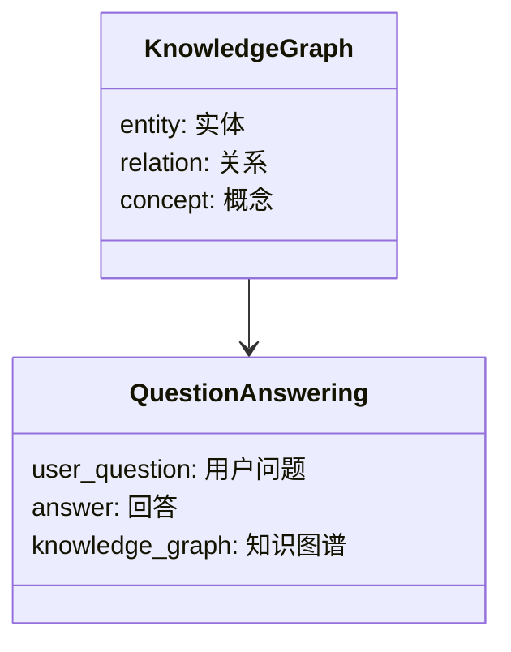
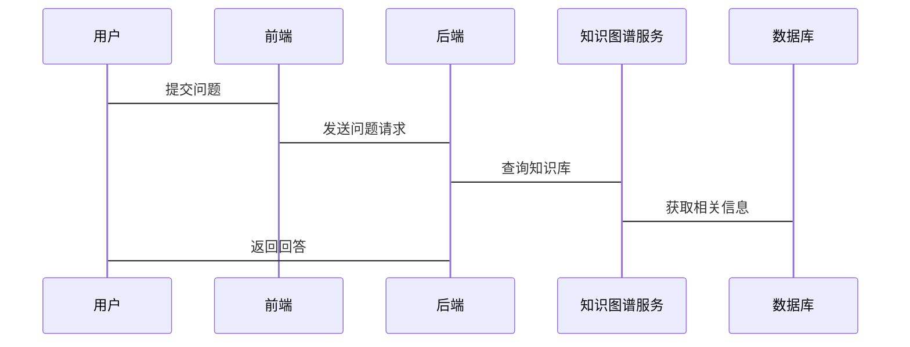

                 


# 构建智能企业知识管理平台：知识图谱与智能问答

> 关键词：知识图谱，智能问答，企业知识管理，自然语言处理，数据挖掘

> 摘要：本文将详细介绍如何构建智能企业知识管理平台，重点探讨知识图谱与智能问答系统的核心技术与应用场景。通过逐步分析，从概念、算法、系统架构到实际项目实现，帮助读者全面理解并掌握构建智能知识管理平台的方法。

---

## 第一部分：智能企业知识管理平台背景与概述

### 第1章：知识管理平台的背景与意义

#### 1.1 企业知识管理的重要性

企业知识管理是将企业内外部的知识进行收集、整理、存储、共享和应用的过程。它不仅是企业高效运作的基础，也是企业竞争力的重要来源。随着企业规模的扩大和信息量的激增，传统的知识管理方式逐渐暴露出效率低下、知识孤岛等问题，亟需智能化解决方案。

#### 1.2 知识图谱与智能问答的定义

知识图谱是一种将知识以图结构形式表示的技术，节点表示实体，边表示实体之间的关系。智能问答系统通过自然语言处理技术，理解用户意图并基于知识库提供准确答案。两者的结合使得企业知识管理更加智能化和高效。

#### 1.3 企业知识管理技术的发展现状

近年来，随着人工智能和大数据技术的发展，知识图谱和智能问答技术逐渐成熟，被广泛应用于企业知识管理中。然而，技术的复杂性和实施成本仍然是企业面临的挑战。

#### 1.4 构建智能企业知识管理平台的意义

构建智能知识管理平台能够提升企业知识利用效率、优化决策过程，并促进知识共享与传承。通过智能问答和知识图谱技术，企业可以更快速、准确地获取所需信息，显著提升工作效率。

### 第2章：知识图谱与智能问答的核心概念

#### 2.1 知识图谱的构建与应用

知识图谱构建需要进行数据采集、实体识别、关系抽取和知识融合。知识图谱的应用包括问答系统、推荐系统和语义搜索，能够帮助企业在复杂场景下快速获取所需信息。

#### 2.2 智能问答系统的原理与实现

智能问答系统基于自然语言处理技术，分为基于规则和基于深度学习两种方法。通过理解用户意图，系统能够准确匹配知识库中的相关信息，生成自然流畅的回答。

#### 2.3 知识图谱与智能问答的结合

知识图谱为智能问答提供了丰富的语义信息，而智能问答则为知识图谱的用户提供了便捷的交互方式。两者结合能够显著提升问答系统的准确性和效率。

### 第3章：知识图谱与智能问答的核心算法原理

#### 3.1 知识图谱构建算法

实体识别和关系抽取是知识图谱构建的关键步骤。常用算法包括基于规则的实体识别和基于深度学习的关系抽取。这些算法能够从文本中提取出实体和关系，构建出结构化的知识图谱。

#### 3.2 智能问答算法

智能问答系统主要采用基于检索和基于生成的两种方法。基于检索的方法通过匹配预存答案生成回答，而基于生成的方法则利用语言模型生成回答。这两种方法各有优缺点，选择取决于具体应用场景。

#### 3.3 算法原理的数学模型与公式

以实体识别为例，使用条件随机场（CRF）模型可以有效识别文本中的实体。模型通过特征函数评估每个位置的标签概率，最终选择概率最大的标签序列。

$$ P(label|text) = \prod_{i=1}^{n} \frac{\exp(S_i)}{Z} $$

其中，$S_i$ 是分数函数，$Z$ 是归一化因子。

## 第二部分：知识图谱与智能问答的系统架构设计

### 第4章：系统分析与架构设计方案

#### 4.1 问题场景介绍

企业知识管理平台需要支持多种场景，包括内部员工提问、客户咨询等。系统需要能够快速响应，提供准确答案，并支持知识库的动态更新。

#### 4.2 项目介绍

本项目旨在构建一个基于知识图谱的智能问答系统，用于企业内部知识管理。系统将整合企业现有的知识资源，构建结构化的知识图谱，并通过智能问答提供高效的交互方式。

#### 4.3 系统功能设计

##### 4.3.1 领域模型设计


##### 4.3.2 系统架构设计


#### 4.4 系统接口设计

系统需要提供RESTful接口，供前端调用。接口包括提交问题、获取回答、更新知识库等功能。

#### 4.5 系统交互设计


### 第5章：项目实战

#### 5.1 环境安装

需要安装Python、TensorFlow、Flask等工具。具体安装命令如下：
```bash
pip install python3 python3-pip
pip install tensorflow numpy flask
```

#### 5.2 系统核心实现

##### 5.2.1 知识图谱构建
```python
import tensorflow as tf
from tensorflow.keras import layers

# 示例代码：构建简单的知识图谱
class KnowledgeGraph:
    def __init__(self):
        self.nodes = {}
        self.edges = {}

    def add_node(self, node_id, label):
        self.nodes[node_id] = label

    def add_edge(self, node1, node2, relation):
        self.edges[(node1, node2)] = relation

graph = KnowledgeGraph()
graph.add_node('1', 'CEO')
graph.add_node('2', 'CFO')
graph.add_edge('1', '2', 'supervises')
```

##### 5.2.2 智能问答实现
```python
from flask import Flask, request, jsonify

app = Flask(__name__)

@app.route('/question', methods=['POST'])
def question():
    data = request.json
    question = data['question']
    # 示例回答逻辑
    answer = f'回答：{question}'
    return jsonify({'answer': answer})

if __name__ == '__main__':
    app.run(debug=True)
```

#### 5.3 案例分析

以企业内部员工提问为例，系统能够快速定位相关知识节点，生成准确回答。例如，员工询问公司政策时，系统能够快速匹配相关知识图谱节点，生成详细回答。

#### 5.4 项目总结

通过本项目，我们成功构建了一个基于知识图谱的智能问答系统，能够有效提升企业知识管理效率。系统具有良好的扩展性和可维护性，未来可以进一步优化问答算法和知识图谱构建方法。

## 第三部分：最佳实践与总结

### 第6章：最佳实践

#### 6.1 技术选型建议

选择适合企业需求的技术栈，注重系统的可扩展性和维护性。建议采用模块化设计，便于后续优化和功能扩展。

#### 6.2 知识图谱的维护与更新

定期更新知识图谱，确保知识库内容准确。可以通过自动化工具和人工审核相结合的方式，保证知识图谱的高质量。

#### 6.3 系统安全与性能优化

注重系统安全，防止数据泄露和攻击。同时，优化系统性能，提升问答响应速度，确保用户体验。

### 第7章：总结与展望

#### 7.1 总结

本文详细介绍了构建智能企业知识管理平台的技术与方法，涵盖了知识图谱和智能问答的核心概念、算法原理、系统架构设计以及项目实战。通过这些内容，读者能够掌握构建智能知识管理平台的必要技能。

#### 7.2 展望

随着人工智能技术的不断发展，知识图谱和智能问答系统将更加智能化和高效化。未来，可以进一步研究多模态知识表示和自适应问答系统，推动企业知识管理的进一步发展。

---

通过以上内容，我们系统地探讨了构建智能企业知识管理平台的关键技术与实践方法。希望对读者在实际应用中有所帮助。

