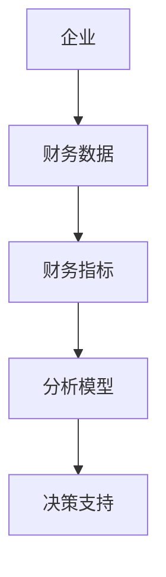
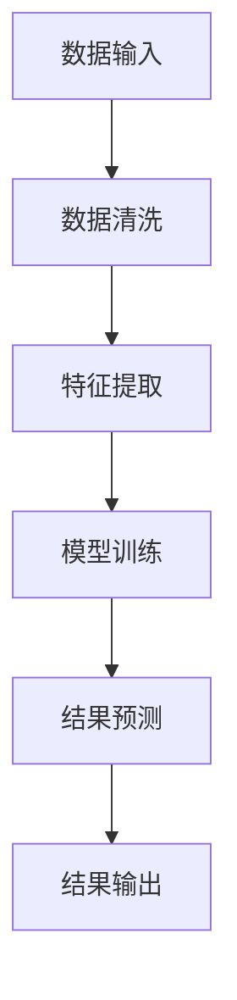
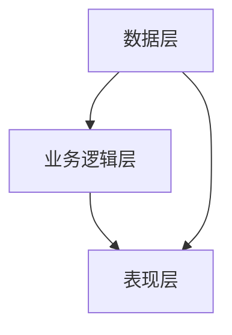
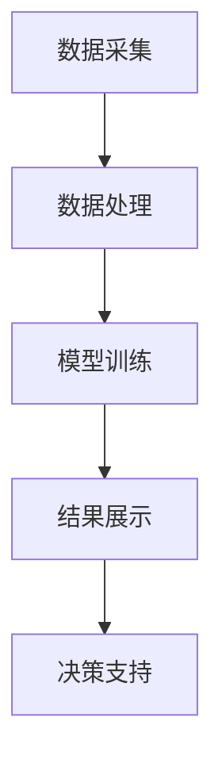

                 

# 构建智能企业财务分析系统：AI辅助决策支持

## 关键词：智能财务分析，人工智能，企业决策，数据处理，算法原理，系统架构

## 摘要：本文系统地探讨了如何利用人工智能技术构建智能企业财务分析系统，通过详细分析AI在财务预测、异常检测、文本分析等环节的应用，结合实际案例，展示了如何利用机器学习和自然语言处理等技术提升企业的决策支持能力。文章从系统架构、算法原理、项目实战等多个维度展开，为读者提供了全面的技术指导和实践参考。

---

# 第1章: 企业财务分析的现状与挑战

## 1.1 传统财务分析的局限性

### 1.1.1 传统财务分析的流程与方法
- **财务报表分析**：包括利润表、资产负债表、现金流量表的分析。
- **比率分析**：如流动比率、速动比率、净利率等。
- **趋势分析**：通过历史数据预测未来趋势。

### 1.1.2 传统财务分析的痛点与不足
- **数据处理效率低**：手动处理大量数据耗时耗力。
- **分析深度有限**：难以从大量数据中提取深层次的洞察。
- **决策滞后**：依赖于定期报告，无法实时分析。

### 1.1.3 传统财务分析与现代企业需求的矛盾
- 现代企业要求快速、精准的决策支持。
- 数据量激增，传统方法难以处理。

## 1.2 AI在财务分析中的应用前景

### 1.2.1 AI技术如何改变财务分析
- **自动化数据处理**：AI能够快速整理和清洗数据。
- **智能预测**：利用机器学习进行财务预测。
- **实时监控**：实时分析财务数据，及时发现异常。

### 1.2.2 AI在财务分析中的优势与潜力
- **提高效率**：自动化处理减少人工错误。
- **深度分析**：挖掘数据中的隐藏信息。
- **实时决策支持**：帮助企业做出及时调整。

### 1.2.3 企业财务分析AI化的趋势
- **智能化**：AI技术的应用越来越广泛。
- **集成化**：与企业管理系统深度结合。
- **个性化**：根据企业需求定制分析模型。

## 1.3 智能企业财务分析系统的定义与目标

### 1.3.1 智能企业财务分析系统的定义
- 利用AI技术，自动化处理财务数据，提供智能分析和决策支持的系统。

### 1.3.2 系统的主要目标与功能
- **数据采集与处理**：自动收集和清洗财务数据。
- **智能分析**：利用机器学习进行预测和诊断。
- **决策支持**：生成分析报告，辅助决策。

### 1.3.3 系统的边界与外延
- **边界**：仅限于财务数据的处理和分析。
- **外延**：与企业管理系统和其他业务系统集成。

---

# 第2章: 智能财务分析系统的核心概念

## 2.1 系统架构与核心模块

### 2.1.1 数据采集模块
- **功能**：从ERP、财务系统等来源获取数据。
- **流程**：数据导入、格式转换、数据清洗。

### 2.1.2 数据处理模块
- **功能**：清洗、转换和预处理数据，使其适合模型训练。
- **流程**：数据清洗、特征提取、数据增强。

### 2.1.3 模型训练模块
- **功能**：训练机器学习模型，进行财务预测和分类。
- **流程**：选择模型、训练、验证、优化。

### 2.1.4 结果展示模块
- **功能**：将分析结果以可视化形式展示，生成报告。
- **流程**：数据可视化、报告生成、结果输出。

## 2.2 数据流与处理流程

### 2.2.1 数据采集流程
1. 数据导入：从财务系统中提取数据。
2. 格式转换：将数据转换为统一格式。
3. 数据清洗：处理缺失值和异常值。

### 2.2.2 数据清洗与预处理
1. 去重：去除重复数据。
2. 填补缺失值：使用均值、中位数等方法填补缺失值。
3. 数据标准化：对数据进行标准化处理。

### 2.2.3 数据分析与建模
1. 特征选择：选择重要的特征变量。
2. 模型训练：训练机器学习模型。
3. 模型验证：验证模型的准确性和可靠性。

### 2.2.4 结果输出与展示
1. 数据可视化：使用图表展示分析结果。
2. 生成报告：输出分析报告，提供决策支持。

## 2.3 核心概念的ER实体关系图

---

# 第3章: AI辅助财务分析的算法原理

## 3.1 机器学习在财务分析中的应用

### 3.1.1 监督学习在财务预测中的应用
- **线性回归**：用于预测销售额、利润等连续变量。
  $$ y = \beta_0 + \beta_1x + \epsilon $$
- **决策树**：用于分类问题，如财务状况分类。
- **随机森林**：集成学习方法，用于分类和回归。

### 3.1.2 无监督学习在异常检测中的应用
- **聚类分析**：发现数据中的自然分组。
- **异常检测**：识别异常交易或财务数据。

### 3.1.3 深度学习在复杂模式识别中的应用
- **神经网络**：用于复杂模式识别，如财务图像识别。
  $$ y = \sigma(Wx + b) $$
  其中，$\sigma$ 是激活函数，$W$ 是权重矩阵，$x$ 是输入，$b$ 是偏置。

## 3.2 自然语言处理在财务文本分析中的应用

### 3.2.1 文本抽取与信息提取
- **信息抽取**：从财务报告中提取关键信息，如收入、支出等。
- **命名实体识别**：识别公司名称、金额等实体。

### 3.2.2 文本分类与情感分析
- **财务报告分类**：将财务报告分类为正面、负面或中性。
- **情感分析**：分析市场情绪对股价的影响。

### 3.2.3 文本生成与报告自动生成
- **自然语言生成**：自动生成财务报告摘要。
- **模板填充**：根据数据填充报告模板。

## 3.3 算法流程图

---

# 第4章: 系统架构与设计方案

## 4.1 系统架构设计

### 4.1.1 分层架构设计

### 4.1.2 系统功能设计
- **数据采集模块**：数据接口、数据清洗。
- **数据处理模块**：数据转换、特征提取。
- **模型训练模块**：模型选择、训练、验证。
- **结果展示模块**：数据可视化、报告生成。

## 4.2 系统架构图

---

通过以上目录大纲，我们可以看到构建智能企业财务分析系统的各个方面，从理论到实践，从算法到系统架构，为读者提供了全面的技术指导和实践参考。

