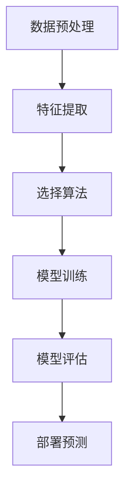
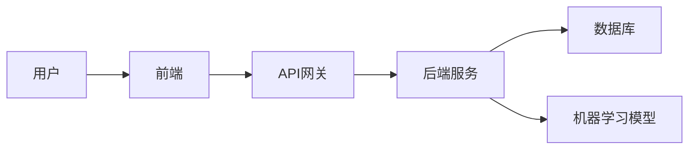
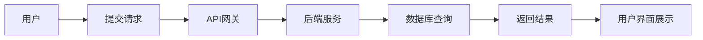

                 


# 构建智能企业资产管理平台：全生命周期优化与预测性维护系统

---

## 关键词：
智能企业资产管理，全生命周期管理，预测性维护，机器学习，系统架构，工业互联网

---

## 摘要：
智能企业资产管理平台是一种通过数字化技术实现企业资产全生命周期管理与预测性维护的系统。本书从背景、理论、算法、系统架构到实际项目落地，全面解析如何构建一个高效、智能的资产管理平台。通过全生命周期优化与预测性维护的结合，帮助企业降低运营成本，提高资产利用率和设备可靠性。本书适合企业IT架构师、资产管理从业者以及对工业智能化感兴趣的读者阅读。

---

# 第一部分：智能企业资产管理平台概述

## 第1章：企业资产管理平台的背景与意义

### 1.1 企业资产管理的基本概念
- **1.1.1 资产管理的定义与范围**
  - 资产管理是对企业所有有形和无形资产的全生命周期管理，包括采购、使用、维护、处置等环节。
  - 资产管理的目标是最大化资产的价值，降低运营成本，提高企业竞争力。

- **1.1.2 智能化资产管理的必要性**
  - 传统资产管理的痛点：数据分散、维护成本高、设备故障率高、缺乏预测能力。
  - 智能化资产管理的核心价值：通过数据采集、分析和预测，实现资产的主动管理，降低故障率，延长设备寿命。

- **1.1.3 企业资产管理的现状与挑战**
  - 当前资产管理的现状：大多数企业仍依赖人工管理，缺乏智能化手段。
  - 主要挑战：数据孤岛、技术复杂性、人员技能不足。

---

## 第2章：全生命周期优化的核心概念

### 2.1 资产全生命周期管理的理论框架
- **2.1.1 资产生命周期的阶段划分**
  | 阶段       | 描述                   |
  |------------|------------------------|
  | 采购       | 根据需求选择设备       |
  | 使用       | 设备的日常运行与维护   |
  | 维护       | 定期检查和修复设备     |
  | 处置       | 设备的报废与资产转移   |

- **2.1.2 全生命周期管理的核心价值**
  - 最大化资产利用率
  - 降低维护成本
  - 提高设备可靠性

- **2.1.3 全生命周期管理的实现方法**
  - 数据采集：通过物联网设备采集资产运行数据。
  - 数据分析：利用大数据技术分析资产状态。
  - 优化决策：基于分析结果优化资产管理和维护策略。

---

## 第3章：预测性维护的原理与优势

### 3.1 预测性维护的基本原理
- 预测性维护是通过分析设备的历史数据和实时数据，预测设备的故障时间，从而提前进行维护。

### 3.2 预测性维护与传统维护的区别
| 方面       | 预测性维护             | 传统维护               |
|------------|-----------------------|------------------------|
| 维护时机   | 基于预测的主动维护     | 基于故障的被动维护     |
| 维护成本   | 降低维护成本           | 维护成本较高           |
| 设备可用性 | 提高设备可用性         | 设备可用性较低         |

### 3.3 预测性维护对企业运营的价值
- 提高设备可靠性
- 降低维护成本
- 提高生产效率

---

# 第二部分：智能企业资产管理的核心技术

## 第4章：预测性维护的算法原理

### 4.1 常用预测算法
- **基于统计的预测方法**：如ARIMA（自回归积分滑动平均模型）。
  $$ ARIMA(p, d, q) $$
  - p：自回归阶数
  - d：差分阶数
  - q：移动平均阶数

- **基于机器学习的预测方法**：如随机森林、XGBoost。
  - 随机森林：通过决策树的集成学习进行预测。
  - XGBoost：基于梯度提升树的方法。

- **基于深度学习的预测方法**：如LSTM（长短期记忆网络）。
  $$ LSTM = \text{ gates} \times \text{cell} $$

### 4.2 算法实现的流程图


### 4.3 算法实现的Python代码示例
```python
import pandas as pd
from sklearn.ensemble import RandomForestRegressor

# 示例数据加载
data = pd.read_csv('equipment_data.csv')

# 特征提取
features = data[['temperature', 'vibration', 'pressure']]
target = data['fault_time']

# 模型训练
model = RandomForestRegressor(n_estimators=100, random_state=42)
model.fit(features, target)

# 模型预测
new_data = pd.read_csv('new_equipment_data.csv')
new_features = new_data[['temperature', 'vibration', 'pressure']]
predictions = model.predict(new_features)
```

---

## 第5章：全生命周期优化的系统架构设计

### 5.1 系统功能设计
- **设备数据采集**：通过物联网设备采集设备的运行数据。
- **数据存储与管理**：将采集到的数据存储到数据库中。
- **数据分析与预测**：利用算法对数据进行分析和预测。
- **决策支持**：基于分析结果提供优化建议。

### 5.2 系统架构设计


### 5.3 系统接口设计
- **数据采集接口**：设备通过传感器将数据发送到后端服务。
- **数据分析接口**：前端调用后端服务的API进行数据分析。
- **预测结果接口**：后端服务返回预测结果到前端。

### 5.4 系统交互流程图


---

# 第三部分：智能企业资产管理平台的实现与优化

## 第6章：预测性维护系统的实现

### 6.1 环境安装
- **安装Python环境**：使用Anaconda或virtualenv。
- **安装依赖库**：如pandas、scikit-learn、tensorflow等。

### 6.2 核心代码实现
```python
import pandas as pd
from sklearn.ensemble import RandomForestRegressor
from sklearn.metrics import mean_squared_error

# 数据加载
data = pd.read_csv('equipment_data.csv')

# 特征和目标分离
X = data[['temperature', 'vibration', 'pressure']]
y = data['fault_time']

# 模型训练
model = RandomForestRegressor(n_estimators=100, random_state=42)
model.fit(X, y)

# 模型评估
new_data = pd.read_csv('new_equipment_data.csv')
new_X = new_data[['temperature', 'vibration', 'pressure']]
new_y = new_data['fault_time']

# 预测结果
predictions = model.predict(new_X)
print(mean_squared_error(new_y, predictions))
```

### 6.3 案例分析
- **案例背景**：某制造企业设备故障率较高，希望通过预测性维护降低故障率。
- **数据准备**：采集设备的运行数据，包括温度、振动、压力等参数。
- **模型训练**：使用随机森林模型进行训练。
- **预测结果**：预测设备的故障时间，并制定维护计划。

---

## 第7章：系统优化与注意事项

### 7.1 系统优化
- **数据优化**：提高数据采集的准确性和实时性。
- **算法优化**：根据实际需求选择合适的算法，如使用更深的神经网络模型。
- **系统性能优化**：优化数据库查询效率，减少响应时间。

### 7.2 注意事项
- **数据隐私**：确保设备数据的安全性和隐私性。
- **模型更新**：定期更新模型，保证预测的准确性。
- **人员培训**：对相关人员进行培训，确保系统能够顺利运行。

---

## 第8章：最佳实践与未来展望

### 8.1 最佳实践
- **数据驱动决策**：利用数据分析结果制定优化策略。
- **持续改进**：根据系统运行情况不断优化系统。
- **团队协作**：跨部门协作，确保系统顺利落地。

### 8.2 未来展望
- **人工智能的进一步应用**：如强化学习在资产管理中的应用。
- **边缘计算**：在设备端进行数据分析和预测，减少数据传输延迟。
- **区块链技术**：用于设备数据的安全性和可信度。

---

## 第9章：小结与总结

### 9.1 本书小结
- 通过本书的学习，读者可以掌握智能企业资产管理平台的核心概念、算法原理和系统架构设计。
- 学会如何利用大数据和人工智能技术实现资产的全生命周期管理与预测性维护。

### 9.2 注意事项
- 系统实施过程中要注意数据的准确性和实时性。
- 确保团队成员具备相关的技能和知识。
- 定期对系统进行维护和优化。

### 9.3 拓展阅读
- 推荐阅读《工业互联网与智能制造》、《大数据与机器学习实战》等书籍。

---

通过本书的学习，读者可以全面掌握构建智能企业资产管理平台的知识和技能，为企业实现智能化资产管理提供有力支持。

