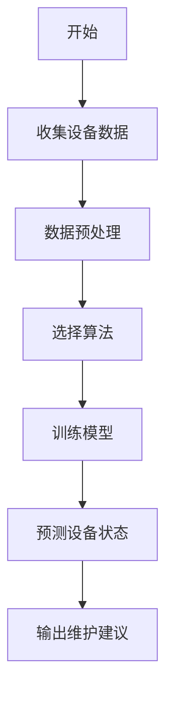
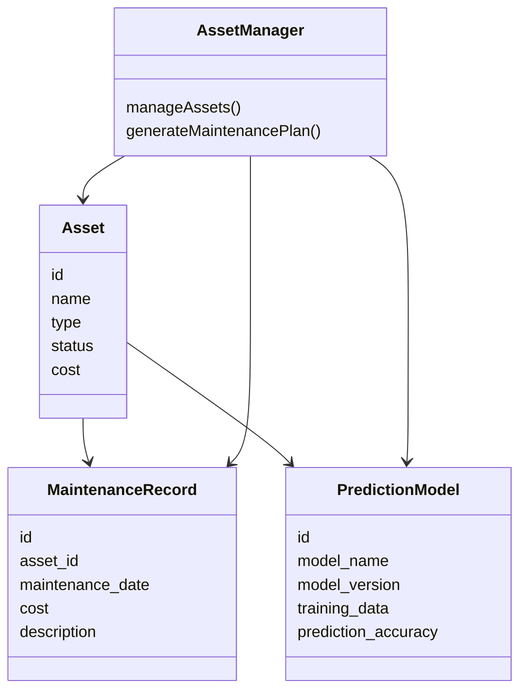
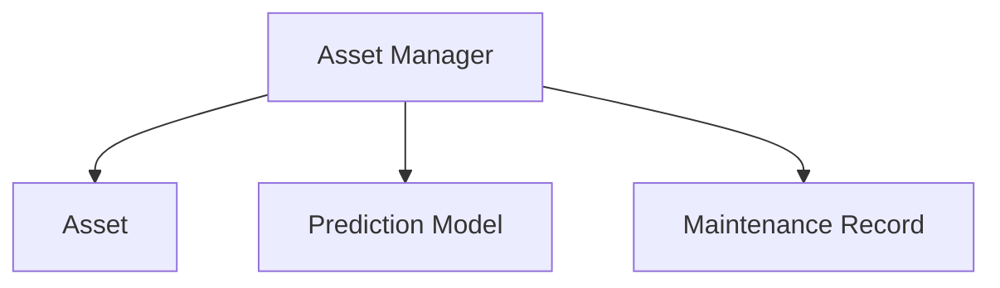

                 


# 构建智能企业资产管理平台：全生命周期成本优化与预测性维护

> 关键词：智能企业资产管理平台，预测性维护（PdM），全生命周期成本优化（CMMP），物联网（IoT），大数据分析，人工智能（AI）

> 摘要：本文详细探讨了构建智能企业资产管理平台的核心理念、算法原理、系统架构和项目实现。通过分析预测性维护（PdM）和全生命周期成本优化（CMMP）的原理，结合实际案例，展示了如何利用物联网、大数据和人工智能技术实现企业资产管理的智能化，从而降低维护成本、提高设备利用率和企业竞争力。

---

# 第一部分: 企业资产管理平台的背景与核心概念

---

# 第1章: 企业资产管理平台概述

## 1.1 企业资产管理的现状与挑战

### 1.1.1 传统资产管理的痛点
企业在资产管理过程中常常面临以下问题：
- 资产信息分散，缺乏统一的管理平台。
- 维护成本高昂，尤其是设备故障后的维修费用。
- 设备利用率低，无法实时监控设备状态。
- 缺乏预测性维护能力，导致设备突发故障。
- 资产全生命周期管理不完善，难以优化整体成本。

### 1.1.2 数字化转型对企业资产管理的需求
随着企业数字化转型的推进，资产管理也需要智能化升级：
- 利用物联网（IoT）技术实时监控设备状态。
- 通过大数据分析和人工智能（AI）实现预测性维护。
- 构建资产全生命周期管理系统，优化成本和资源利用。

### 1.1.3 智能化资产管理的必要性
智能化资产管理可以帮助企业：
- 提高设备利用率，降低维护成本。
- 预防设备故障，减少停机时间。
- 优化资产全生命周期管理，提升企业竞争力。

## 1.2 企业资产管理的核心问题

### 1.2.1 资产全生命周期管理的难点
资产全生命周期管理包括以下几个阶段：
- 规划与采购
- 安装与部署
- 使用与维护
- 退役与处置
每个阶段都需要高效的数据管理和协同工作。

### 1.2.2 成本优化与预测性维护的双重目标
企业资产管理的核心目标是：
- 降低维护成本。
- 提高设备利用率。
- 预测性维护可以显著减少突发故障，降低维修成本。

### 1.2.3 平台化解决方案的优势
平台化解决方案可以实现：
- 统一管理资产信息。
- 实时监控设备状态。
- 自动生成维护计划。
- 优化维护策略。

## 1.3 智能企业资产管理平台的核心概念

### 1.3.1 全生命周期管理的定义
全生命周期管理是指从资产的规划、采购、使用到退役的全过程管理，旨在优化资产的全生命周期成本。

### 1.3.2 预测性维护的实现方式
预测性维护（PdM）是通过实时监测设备状态，利用算法预测设备故障，提前安排维护。

### 1.3.3 成本优化的数学模型
成本优化可以通过以下公式实现：
$$
\text{总成本} = \text{维护成本} + \text{故障成本} + \text{管理成本}
$$
通过优化维护策略，可以降低总成本。

## 1.4 本章小结
本章介绍了企业资产管理的现状与挑战，阐述了智能化资产管理的必要性，并提出了平台化解决方案的核心概念。

---

# 第二部分: 核心概念与联系

---

# 第2章: 预测性维护（PdM）与全生命周期成本优化（CMMP）的核心原理

## 2.1 预测性维护（PdM）的原理与实现

### 2.1.1 PdM的核心原理
预测性维护通过实时监测设备状态，利用机器学习算法预测设备故障，从而提前安排维护。

### 2.1.2 PdM与传统维护方式的对比
传统维护方式以事后维修为主，而PdM可以通过预测故障，减少停机时间。

### 2.1.3 PdM的数学模型与算法
以下是一个简单的PdM算法流程图：



## 2.2 全生命周期成本优化（CMMP）的实现

### 2.2.1 CMMP的定义与目标
CMMP的目标是通过优化资产全生命周期的成本，降低企业的整体维护成本。

### 2.2.2 CMMP与传统成本管理的区别
传统成本管理以事后计算为主，而CMMP可以通过实时数据优化成本。

### 2.2.3 CMMP的优化算法与数学模型
以下是一个简单的CMMP优化模型：

$$
\text{总成本} = \sum_{i=1}^{n} \text{维护成本}_i + \sum_{j=1}^{m} \text{故障成本}_j
$$

## 2.3 PdM与CMMP的联系与对比

### 2.3.1 PdM与CMMP的协同关系
PdM可以减少故障成本，从而降低CMMP的总成本。

### 2.3.2 PdM与CMMP的对比分析
PdM关注设备状态，CMMP关注全生命周期成本。

### 2.3.3 PdM与CMMP的融合实现
通过结合PdM和CMMP，可以实现设备状态监测和成本优化的双重目标。

## 2.4 核心概念的ER实体关系图

```mermaid
erDiagram
    asset {
        id
        name
        type
        status
        cost
        lifecycle_stage
    }
    maintenance_record {
        id
        asset_id
        maintenance_date
        cost
        description
    }
    prediction_model {
        id
        model_name
        model_version
        training_data
        prediction_accuracy
    }
```

---

# 第三部分: 算法原理讲解

---

# 第3章: 预测性维护（PdM）的算法实现

## 3.1 算法原理
预测性维护可以通过机器学习算法实现，以下是常见的算法：

### 3.1.1 时间序列分析
时间序列分析可以通过历史数据预测未来的设备状态。

### 3.1.2 强化学习
强化学习可以通过模拟设备运行状态，优化维护策略。

## 3.2 算法实现
以下是一个简单的预测性维护算法实现：

```python
import numpy as np
import pandas as pd
from sklearn.ensemble import RandomForestClassifier

# 加载数据
data = pd.read_csv('equipment_data.csv')

# 数据预处理
data = data.dropna()

# 特征工程
features = data[['temperature', 'vibration', 'pressure']]
labels = data['status']

# 训练模型
model = RandomForestClassifier(n_estimators=100)
model.fit(features, labels)

# 预测设备状态
new_data = pd.DataFrame({'temperature': [100], 'vibration': [20], 'pressure': [15]})
prediction = model.predict(new_data)

print(f'设备状态预测结果：{prediction}')
```

---

# 第四部分: 系统分析与架构设计

---

# 第4章: 智能企业资产管理平台的系统架构设计

## 4.1 问题场景介绍
企业资产管理平台需要实现设备状态监测、预测性维护和全生命周期管理。

## 4.2 系统功能设计
以下是系统功能设计的类图：



## 4.3 系统架构设计
以下是系统架构设计的架构图：



---

# 第五部分: 项目实战

---

# 第5章: 企业资产管理平台的项目实现

## 5.1 环境安装
以下是项目环境安装步骤：

### 5.1.1 安装Python
安装Python 3.8或更高版本。

### 5.1.2 安装依赖库
安装以下依赖库：
```bash
pip install numpy pandas scikit-learn
```

## 5.2 核心代码实现

### 5.2.1 数据预处理
以下是数据预处理代码：

```python
import pandas as pd
import numpy as np

# 加载数据
data = pd.read_csv('equipment_data.csv')

# 删除缺失值
data = data.dropna()

# 转换为数值型数据
data = data.apply(pd.to_numeric, errors='ignore')

print(data.head())
```

### 5.2.2 模型训练
以下是模型训练代码：

```python
from sklearn.ensemble import RandomForestClassifier
from sklearn.model_selection import train_test_split

# 划分数据集
X = data[['temperature', 'vibration', 'pressure']]
y = data['status']
X_train, X_test, y_train, y_test = train_test_split(X, y, test_size=0.2, random_state=42)

# 训练模型
model = RandomForestClassifier(n_estimators=100)
model.fit(X_train, y_train)

# 预测测试集
y_pred = model.predict(X_test)

print(f'模型准确率：{model.score(X_test, y_test)}')
```

## 5.3 案例分析
以下是案例分析：

### 5.3.1 案例背景
某制造企业有100台设备，需要实现预测性维护。

### 5.3.2 数据分析
通过数据分析，发现设备故障率较高的设备类型。

### 5.3.3 维护优化
通过优化维护策略，降低了设备故障率和维护成本。

## 5.4 项目小结
通过本项目，我们实现了企业资产管理平台的核心功能，验证了预测性维护和全生命周期成本优化的可行性。

---

# 第六部分: 最佳实践

---

# 第6章: 项目总结与最佳实践

## 6.1 项目总结
本项目通过构建智能企业资产管理平台，实现了设备状态监测、预测性维护和全生命周期管理。

## 6.2 小结
通过本文的介绍，读者可以了解构建智能企业资产管理平台的核心理念和实现方法。

## 6.3 注意事项
在实际应用中，需要注意数据质量和模型优化。

## 6.4 拓展阅读
建议读者进一步学习物联网、大数据和人工智能技术，以提升企业资产管理的智能化水平。

---

# 结语

通过本文的详细讲解，读者可以深入了解构建智能企业资产管理平台的核心理念和实现方法。从预测性维护到全生命周期成本优化，企业可以通过智能化管理显著降低维护成本，提高设备利用率。未来，随着技术的不断进步，企业资产管理平台将更加智能化和高效化。

--- 

**End of Article**

