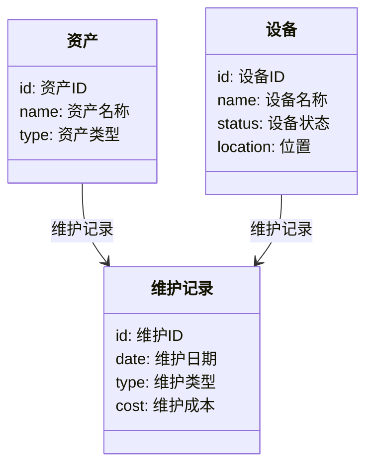

                 


# 《构建智能企业资产管理平台：全生命周期成本优化与预测性维护》

## 关键词：智能企业资产管理、全生命周期成本优化、预测性维护、物联网、机器学习、系统架构设计

## 摘要：  
本文深入探讨了构建智能企业资产管理平台的核心技术与实践，重点分析了全生命周期成本优化与预测性维护的实现方法。通过结合物联网、大数据和机器学习等技术，本文详细阐述了从数据采集到模型构建、系统设计与实现的全过程，为企业资产管理的智能化转型提供了全面的解决方案。

---

# 第一部分: 智能企业资产管理平台的背景与价值

## 第1章: 企业资产管理的现状与挑战

### 1.1 传统资产管理的模式与特点  
传统的企业资产管理主要依赖人工记录和定期检查，这种方式存在效率低、数据不准确、维护成本高等问题。企业的资产管理流程通常包括资产的登记、使用、维护和报废等阶段，但缺乏系统化的数据管理和智能化的决策支持。

### 1.2 当前资产管理中的主要问题  
- **数据孤岛**：各部门之间的数据难以整合，导致信息不一致，影响决策的准确性。  
- **维护不及时**：传统维护方式通常是基于固定的周期性检查，无法实时监测设备状态，导致维护成本增加，甚至引发设备故障。  
- **成本高昂**：由于缺乏数据支持，企业在资产管理中的决策往往不够精准，导致资源浪费和成本上升。  

### 1.3 数字化转型对企业资产管理的影响  
随着物联网、大数据和人工智能技术的快速发展，企业资产管理正在从传统的被动维护向主动维护转变。通过数字化技术的应用，企业可以实现资产的全生命周期管理，优化资源配置，降低运营成本。

---

# 第二部分: 智能企业资产管理的核心概念与技术

## 第2章: 预测性维护的原理与实现  

### 2.1 预测性维护的基本概念  
预测性维护（Predictive Maintenance）是一种基于设备状态数据的分析，预测设备可能出现故障的时间，并提前进行维护的策略。与传统的周期性维护相比，预测性维护可以显著降低维护成本，减少设备停机时间。

#### 预测性维护的分类  
- **基于时间的预测性维护**：根据设备的历史运行数据，预测设备在未来的某个时间点可能出现故障。  
- **基于状态的预测性维护**：通过实时监测设备的运行状态，结合传感器数据进行分析，预测设备的健康状况。  

### 2.2 数据采集与预处理  
#### 数据采集的常见方法  
- **物联网传感器**：通过安装在设备上的传感器，实时采集设备的运行参数，如温度、振动、压力等。  
- **数据接口集成**：通过API接口从企业现有的管理系统中获取设备的历史数据。  

#### 数据清洗与特征提取  
- 数据清洗：去除噪声数据、填补缺失值、处理异常值。  
- 特征提取：从原始数据中提取有用的特征，如设备的运行时间、振动幅度、温度变化率等。  

### 2.3 基于机器学习的预测模型  
#### 常见的预测算法选择  
- **时间序列分析**：如ARIMA、LSTM等算法，适用于预测设备的未来状态。  
- **回归分析**：用于预测设备的剩余寿命或故障概率。  
- **集成学习**：如随机森林、梯度提升树等，适用于特征较多的情况。  

#### 时间序列分析与回归模型  
- **时间序列分析**：以设备的振动数据为例，通过LSTM模型预测设备的健康状态。  
- **回归模型**：以设备的使用时间作为输入，预测设备的剩余寿命。  

---

## 第3章: 全生命周期成本优化  

### 3.1 全生命周期成本优化的核心概念  
全生命周期成本优化（Life Cycle Cost Optimization）是指在整个资产生命周期内，通过优化资源配置和管理流程，降低资产的总成本。  

#### 生命周期各阶段的成本分析  
- **资产采购阶段**：选择性价比高的设备，降低初始成本。  
- **资产使用阶段**：通过预测性维护降低运营成本。  
- **资产报废阶段**：合理安排设备的报废时间，避免过早或过晚报废带来的成本浪费。  

### 3.2 基于机器学习的成本预测模型  
- **特征工程**：提取与成本相关的特征，如设备的使用时间、维护频率、故障次数等。  
- **模型构建**：使用随机森林或梯度提升树模型，预测资产的全生命周期成本。  

---

# 第三部分: 算法原理  

## 第4章: 预测性维护的数学模型  

### 4.1 时间序列分析模型  
#### LSTM（长短期记忆网络）模型  
LSTM是一种特殊的RNN（循环神经网络），适用于时间序列数据的预测。其核心思想是通过记忆单元（Memory Cell）来捕捉长期依赖关系。  

##### LSTM模型的数学公式  
$$ \text{输入: } x_t, h_{t-1}, c_{t-1} $$  
$$ \text{遗忘门: } f_t = \sigma(w_f x_t + u_f h_{t-1} + b_f) $$  
$$ \text{输入门: } i_t = \sigma(w_i x_t + u_i h_{t-1} + b_i) $$  
$$ \text{候选记忆单元: } \tilde{c}_t = \tanh(w_c x_t + u_c h_{t-1} + b_c) $$  
$$ \text{记忆单元: } c_t = f_t c_{t-1} + i_t \tilde{c}_t $$  
$$ \text{输出门: } o_t = \sigma(w_o x_t + u_o h_{t-1} + b_o) $$  
$$ \text{隐藏层输出: } h_t = o_t \tanh(c_t) $$  

### 4.2 回归分析模型  
#### 线性回归模型  
线性回归模型用于预测设备的剩余寿命，假设设备的剩余寿命与使用时间呈线性关系。  

##### 线性回归模型的数学公式  
$$ y = \beta_0 + \beta_1 x + \epsilon $$  
其中，$y$ 是预测目标（剩余寿命），$x$ 是输入特征（使用时间），$\beta_0$ 和 $\beta_1$ 是模型参数，$\epsilon$ 是误差项。  

---

# 第四部分: 系统分析与架构设计  

## 第5章: 系统功能设计  

### 5.1 领域模型类图  
以下是一个简单的领域模型类图，展示了资产、设备、维护等核心实体之间的关系：  



---

## 第6章: 系统架构设计  

### 6.1 微服务架构设计  
以下是一个基于微服务架构的设计图：  

```mermaid
serviceDiagram

    service 资产管理服务 {
        - 资产信息管理
        - 维护记录管理
    }

    service 设备监测服务 {
        - 实时数据采集
        - 数据分析与预测
    }

    service 维护计划服务 {
        - 预测性维护计划
        - 成本优化建议
    }

    资产管理服务 --> 设备监测服务: 数据同步
    设备监测服务 --> 维护计划服务: 预测结果
```

---

# 第五部分: 项目实战  

## 第7章: 项目实战  

### 7.1 环境安装与配置  
#### 安装Python和必要的库  
```bash
pip install numpy pandas scikit-learn tensorflow keras flask
```

### 7.2 核心代码实现  

#### 数据采集与预处理  
```python
import pandas as pd
from sklearn.preprocessing import StandardScaler

# 数据加载
data = pd.read_csv('equipment_data.csv')

# 数据清洗
data.dropna(inplace=True)
data.drop_duplicates(inplace=True)

# 特征提取
features = data[['temperature', 'vibration', 'pressure']]
scaler = StandardScaler()
features_scaled = scaler.fit_transform(features)
```

#### 模型训练与部署  
```python
from tensorflow.keras.models import Sequential
from tensorflow.keras.layers import LSTM, Dense

# 模型构建
model = Sequential()
model.add(LSTM(64, input_shape=(timesteps, features)))
model.add(Dense(1))
model.compile(optimizer='adam', loss='mean_squared_error')

# 模型训练
model.fit(X_train, y_train, epochs=100, batch_size=32)
```

---

## 第8章: 项目总结与优化  

### 8.1 项目总结  
通过本项目，我们成功构建了一个基于机器学习的预测性维护系统，实现了设备的实时监测与预测性维护，显著降低了企业的维护成本和设备停机时间。

### 8.2 优化方向  
- 引入边缘计算技术，进一步降低数据传输延迟。  
- 增加模型的鲁棒性，提高预测的准确性。  

---

# 第六部分: 总结与展望  

## 第9章: 总结与展望  

### 9.1 全书总结  
本文详细探讨了智能企业资产管理平台的构建过程，从理论到实践，系统地介绍了预测性维护和全生命周期成本优化的核心技术与实现方法。

### 9.2 未来发展方向  
随着技术的不断进步，未来的企业资产管理将更加智能化和自动化。通过引入边缘计算、区块链等新技术，将进一步提升系统的实时性和安全性。

---

# 结语  

通过本文的学习，读者可以掌握构建智能企业资产管理平台的核心技术与实践方法，为企业实现智能化转型提供有力支持。

