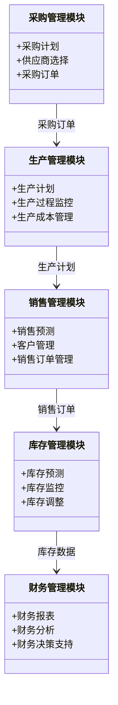
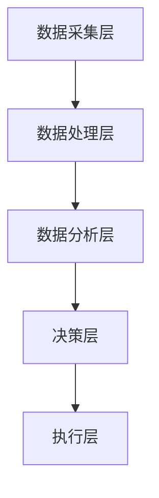
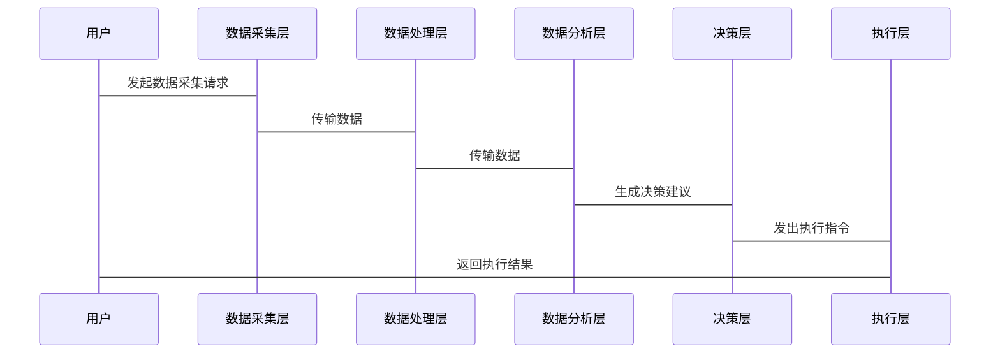

                 


# 构建智能企业资源规划(ERP)系统：AI深度集成与优化

> 关键词：智能ERP系统, AI集成, 深度学习, 系统优化, 企业资源规划

> 摘要：本文将探讨如何将人工智能技术深度集成到企业资源规划(ERP)系统中，通过分析AI技术在ERP系统中的应用场景、核心算法原理、系统架构设计以及项目实战案例，为企业提供一套高效、智能的ERP系统解决方案。本文结合理论与实践，详细阐述了如何利用深度学习算法优化ERP系统的功能模块，并通过实际案例分析展示了AI技术在ERP系统中的巨大潜力和应用价值。

---

# 第一部分: 智能ERP系统背景与概念

## 第1章: 智能ERP系统概述

### 1.1 企业资源规划(ERP)系统的发展历程

#### 1.1.1 ERP系统的定义与特点
企业资源规划(ERP)系统是一种集成化的管理信息系统，旨在将企业的核心业务流程（如采购、生产、销售、库存管理、财务管理等）整合到一个统一的系统中。其特点包括：
- **集成性**：将企业各个部门的数据和流程统一管理。
- **实时性**：能够实时更新和处理数据。
- **灵活性**：支持多种业务模式和扩展需求。

#### 1.1.2 ERP系统的历史发展
ERP系统的演变经历了多个阶段：
1. **单机系统**：早期的ERP系统运行在单台计算机上，适用于小型企业。
2. **客户机/服务器（C/S）架构**：通过将数据和处理逻辑分布在客户机和服务器上，提高了系统的可扩展性。
3. **基于Web的ERP系统**：随着互联网技术的发展，ERP系统开始向Web化方向发展，支持远程访问和多用户协作。
4. **智能化ERP系统**：近年来，随着人工智能技术的成熟，ERP系统开始深度集成AI技术，实现了智能化的业务决策和优化。

#### 1.1.3 智能ERP系统的概念与特点
智能ERP系统是在传统ERP系统的基础上，融入人工智能技术（如深度学习、自然语言处理、强化学习等），使其能够自主学习、优化决策和自适应调整。其特点包括：
- **智能化**：通过AI技术实现业务流程的自动化和智能决策。
- **数据驱动**：基于海量数据进行分析和预测，提供精准的业务洞察。
- **实时优化**：能够实时调整和优化企业资源分配，提高效率。

### 1.2 AI技术在ERP系统中的应用背景

#### 1.2.1 传统ERP系统的局限性
尽管传统ERP系统在企业信息化管理中发挥了重要作用，但仍然存在一些局限性：
- **决策依赖人工经验**：传统ERP系统依赖于人工经验进行决策，难以应对复杂多变的市场环境。
- **数据处理能力有限**：面对海量数据时，传统ERP系统在处理速度和精度上存在瓶颈。
- **缺乏灵活性**：传统ERP系统的功能模块相对固定，难以快速适应企业的动态需求。

#### 1.2.2 AI技术如何解决ERP系统的问题
人工智能技术的引入，为ERP系统解决了以下问题：
- **智能化决策**：通过深度学习和自然语言处理，ERP系统能够基于历史数据和实时数据，自动生成最优决策方案。
- **数据处理能力提升**：AI技术能够快速处理和分析海量数据，提高数据处理效率和准确性。
- **灵活性增强**：通过机器学习，ERP系统能够根据企业的实际需求，动态调整功能模块，实现高度定制化。

#### 1.2.3 智能ERP系统的应用场景
智能ERP系统的应用场景广泛，主要包括：
- **供应链管理**：优化供应链流程，提高库存周转率和供应商协作效率。
- **生产计划优化**：基于实时数据和市场预测，优化生产计划，降低生产成本。
- **销售预测与市场分析**：通过分析历史销售数据和市场趋势，预测未来销售情况，制定精准的市场策略。
- **风险预警与控制**：通过实时监控企业运营数据，识别潜在风险，并提出应对策略。

### 1.3 智能ERP系统的技术趋势

#### 1.3.1 AI与ERP系统结合的技术趋势
随着AI技术的不断发展，智能ERP系统将朝着以下几个方向发展：
- **深度学习技术的应用**：通过深度学习模型，进一步提高数据分析和预测的准确性。
- **自然语言处理技术的融合**：通过自然语言处理技术，实现ERP系统与用户的自然对话，提高用户体验。
- **强化学习的应用**：通过强化学习技术，实现ERP系统的自适应优化，动态调整企业资源分配。

#### 1.3.2 深度学习在ERP系统中的应用
深度学习技术在ERP系统中的应用主要体现在以下几个方面：
- **销售预测**：通过深度学习模型分析历史销售数据和市场趋势，预测未来销售情况。
- **库存管理**：通过深度学习模型优化库存管理策略，降低库存成本。
- **生产计划优化**：通过深度学习模型分析生产数据，优化生产计划，提高生产效率。

#### 1.3.3 智能ERP系统的未来发展方向
智能ERP系统的未来发展方向包括：
- **智能化决策**：通过AI技术实现ERP系统的核心业务模块的智能化决策。
- **数据驱动的优化**：基于海量数据进行深度分析，优化企业的资源配置和业务流程。
- **实时反馈与自适应调整**：通过实时数据反馈，实现ERP系统的自适应优化。

### 1.4 本章小结
本章介绍了智能ERP系统的发展历程、核心概念与特点，分析了传统ERP系统的局限性以及AI技术在ERP系统中的应用背景。通过阐述智能ERP系统的技术趋势和未来发展方向，为后续章节的深入分析奠定了基础。

---

## 第2章: 智能ERP系统的核心概念与联系

### 2.1 智能ERP系统的数据流分析

#### 2.1.1 数据输入与处理
智能ERP系统的数据输入包括以下几种形式：
1. **结构化数据**：如销售订单、库存数据等。
2. **半结构化数据**：如邮件、文档等。
3. **非结构化数据**：如图像、视频等。

数据处理的过程包括数据清洗、数据转换和数据存储。

#### 2.1.2 数据分析与决策
数据分析是智能ERP系统的核心环节，主要包括以下步骤：
1. **数据预处理**：对原始数据进行清洗和转换，确保数据的准确性和一致性。
2. **数据建模**：通过深度学习模型对数据进行建模，提取数据特征。
3. **数据预测**：基于模型对数据进行预测，生成决策建议。

#### 2.1.3 数据输出与反馈
数据输出是智能ERP系统的重要环节，主要包括以下几种形式：
1. **决策报告**：生成业务决策报告，指导企业运营。
2. **实时反馈**：通过实时监控系统，提供即时反馈，调整企业资源分配。
3. **优化建议**：基于数据分析结果，提出优化建议，帮助企业在复杂环境中做出最优决策。

### 2.2 AI算法在ERP系统中的应用

#### 2.2.1 常见AI算法及其特点
常见AI算法在ERP系统中的应用包括：
1. **监督学习**：用于销售预测、客户分类等任务。
2. **无监督学习**：用于异常检测、聚类分析等任务。
3. **强化学习**：用于优化生产计划、库存管理等任务。

#### 2.2.2 算法选择与优化
算法选择的关键因素包括：
1. **数据类型**：根据数据类型选择合适的算法。
2. **任务目标**：根据任务目标选择合适的算法。
3. **计算资源**：根据计算资源选择合适的算法。

算法优化的方法包括：
1. **参数调优**：通过网格搜索、随机搜索等方法优化模型参数。
2. **模型集成**：通过集成学习方法提高模型的准确性和稳定性。
3. **模型压缩**：通过模型压缩技术减少模型的计算量和存储空间。

#### 2.2.3 算法在ERP系统中的具体应用
算法在ERP系统中的具体应用包括：
1. **销售预测**：通过监督学习模型预测未来销售情况。
2. **库存管理**：通过强化学习模型优化库存管理策略。
3. **生产计划优化**：通过无监督学习模型分析生产数据，优化生产计划。

### 2.3 智能ERP系统的系统架构

#### 2.3.1 系统架构的组成
智能ERP系统的系统架构主要包括以下组成部分：
1. **数据采集层**：负责采集企业各个业务模块的数据。
2. **数据处理层**：对采集到的数据进行清洗、转换和存储。
3. **数据分析层**：通过深度学习模型对数据进行分析和预测。
4. **决策层**：根据分析结果生成决策建议。
5. **执行层**：将决策建议转化为具体的操作指令，执行相应的业务流程。

#### 2.3.2 系统架构的优缺点
系统架构的优缺点：
- **优点**：通过分层架构设计，提高了系统的可扩展性和可维护性。
- **缺点**：分层架构设计增加了系统的复杂性，需要更多的开发和维护成本。

#### 2.3.3 系统架构的优化与扩展
系统架构的优化与扩展：
1. **模块化设计**：通过模块化设计，提高系统的可扩展性和可维护性。
2. **分布式架构**：通过分布式架构设计，提高系统的计算能力和处理效率。
3. **云计算技术**：通过云计算技术，实现系统的弹性扩展和资源共享。

### 2.4 本章小结
本章详细阐述了智能ERP系统的数据流分析、AI算法在ERP系统中的应用以及智能ERP系统的系统架构。通过分析系统架构的优缺点，提出了系统的优化与扩展方案，为后续章节的深入分析奠定了基础。

---

## 第3章: 智能ERP系统的算法原理

### 3.1 深度学习模型在ERP系统中的应用

#### 3.1.1 深度学习模型概述
深度学习模型是一种基于人工神经网络的算法，通过多层非线性变换，从数据中自动提取特征。深度学习模型在ERP系统中的应用包括：
1. **销售预测**：通过深度学习模型分析历史销售数据和市场趋势，预测未来销售情况。
2. **客户分类**：通过深度学习模型分析客户数据，进行客户分类和客户画像。
3. **供应链优化**：通过深度学习模型优化供应链流程，提高库存周转率。

#### 3.1.2 深度学习模型的数学基础
深度学习模型的数学基础包括：
1. **神经网络的数学模型**：包括输入层、隐藏层和输出层的数学表达。
2. **激活函数的数学表达**：如Sigmoid函数、ReLU函数等。
3. **损失函数的数学表达**：如均方误差、交叉熵损失等。

#### 3.1.3 深度学习模型的实现
深度学习模型的实现步骤包括：
1. **数据预处理**：对数据进行清洗、归一化等处理。
2. **模型训练**：通过梯度下降算法优化模型参数。
3. **模型评估**：通过验证集评估模型的性能。
4. **模型部署**：将模型部署到生产环境，进行实时预测。

### 3.2 深度学习模型的优化与调优

#### 3.2.1 神经网络的结构优化
神经网络的结构优化包括：
1. **网络深度优化**：通过增加网络层数提高模型的表达能力。
2. **网络宽度优化**：通过增加每层的神经元数量提高模型的表达能力。
3. **网络稀疏化**：通过引入L1/L2正则化，减少网络的冗余参数。

#### 3.2.2 网络参数的优化
网络参数的优化包括：
1. **学习率调整**：通过学习率衰减策略，动态调整学习率。
2. **批量归一化**：通过批量归一化技术，加速模型训练，提高模型的泛化能力。
3. **Dropout技术**：通过Dropout技术，防止模型过拟合，提高模型的鲁棒性。

#### 3.2.3 深度学习模型的训练过程
深度学习模型的训练过程包括：
1. **数据预处理**：对数据进行清洗、归一化等处理。
2. **模型构建**：定义模型的网络结构和损失函数。
3. **模型训练**：通过梯度下降算法优化模型参数。
4. **模型评估**：通过验证集评估模型的性能。
5. **模型优化**：通过网络结构优化和参数调优，进一步提高模型的性能。

### 3.3 深度学习模型的实际应用案例

#### 3.3.1 销售预测案例
销售预测案例：
- **数据集**：某公司过去三年的销售数据，包括销售量、价格、时间等。
- **模型选择**：使用LSTM模型进行时间序列预测。
- **模型训练**：将数据集分为训练集、验证集和测试集，进行模型训练和评估。
- **模型预测**：基于训练好的模型，预测未来三个月的销售量。

#### 3.3.2 库存管理案例
库存管理案例：
- **数据集**：某公司过去两年的库存数据，包括库存量、订单量、销售量等。
- **模型选择**：使用随机森林模型进行库存预测。
- **模型训练**：将数据集分为训练集、验证集和测试集，进行模型训练和评估。
- **模型优化**：通过特征选择和超参数调优，提高模型的预测精度。

### 3.4 本章小结
本章详细阐述了深度学习模型在ERP系统中的应用，包括模型的数学基础、实现步骤以及优化与调优方法。通过实际应用案例，展示了深度学习模型在销售预测和库存管理中的巨大潜力和应用价值。

---

## 第4章: 智能ERP系统的系统分析与架构设计

### 4.1 系统分析

#### 4.1.1 项目背景介绍
项目背景介绍：
- **项目名称**：智能ERP系统开发项目。
- **项目目标**：开发一套基于深度学习技术的智能ERP系统，实现企业资源的智能化管理和优化。
- **项目范围**：涵盖采购、生产、销售、库存、财务等多个业务模块。

#### 4.1.2 系统功能设计
系统功能设计包括以下模块：
1. **采购管理模块**：实现采购计划的制定、供应商选择和采购订单管理。
2. **生产管理模块**：实现生产计划的制定、生产过程监控和生产成本管理。
3. **销售管理模块**：实现销售预测、客户管理和销售订单管理。
4. **库存管理模块**：实现库存预测、库存监控和库存调整。
5. **财务管理模块**：实现财务报表生成、财务分析和财务决策支持。

#### 4.1.3 领域模型设计
领域模型设计：
- **领域模型**：通过领域模型将企业的各个业务模块抽象为统一的模型，实现业务流程的标准化和规范化。
- **类图设计**：通过Mermaid类图展示系统的核心业务模块及其交互关系。



### 4.2 系统架构设计

#### 4.2.1 系统架构设计
系统架构设计：
- **分层架构**：将系统分为数据采集层、数据处理层、数据分析层和决策层。
- **模块化设计**：将系统划分为多个功能模块，实现模块化开发和管理。

#### 4.2.2 系统架构图
系统架构图：



#### 4.2.3 接口设计
接口设计：
- **数据接口**：实现数据采集层与数据处理层之间的数据交互。
- **API接口**：通过RESTful API实现系统各模块之间的通信。

#### 4.2.4 交互流程设计
交互流程设计：
1. **数据采集**：通过数据采集层采集企业各个业务模块的数据。
2. **数据处理**：对采集到的数据进行清洗、转换和存储。
3. **数据分析**：通过深度学习模型对数据进行分析和预测。
4. **决策生成**：根据分析结果生成决策建议。
5. **决策执行**：将决策建议转化为具体的操作指令，执行相应的业务流程。

### 4.3 本章小结
本章详细阐述了智能ERP系统的系统分析与架构设计，包括项目背景介绍、系统功能设计、领域模型设计以及系统架构设计。通过Mermaid图展示了系统的类图和架构图，为后续章节的项目实战奠定了基础。

---

## 第5章: 智能ERP系统的项目实战

### 5.1 项目实战环境配置

#### 5.1.1 开发工具安装
开发工具安装：
- **Python**：安装Python 3.8及以上版本。
- **TensorFlow**：安装TensorFlow库，用于深度学习模型的实现。
- **Keras**：安装Keras库，用于深度学习模型的快速开发。
- **Scikit-learn**：安装Scikit-learn库，用于机器学习算法的实现。
- **Mermaid**：安装Mermaid CLI，用于绘制系统类图和架构图。

#### 5.1.2 数据集准备
数据集准备：
- **数据来源**：可以从公开数据集（如Kaggle）获取相关数据，或根据实际需求自行采集数据。
- **数据格式**：数据应以结构化数据格式存储，如CSV或Excel文件。
- **数据预处理**：对数据进行清洗、归一化等处理，确保数据的准确性和一致性。

### 5.2 系统核心功能实现

#### 5.2.1 数据采集模块实现
数据采集模块实现：
- **数据采集**：通过API接口或数据文件采集企业各个业务模块的数据。
- **数据存储**：将采集到的数据存储到数据库中，如MySQL或MongoDB。

#### 5.2.2 数据分析模块实现
数据分析模块实现：
- **数据预处理**：对数据进行清洗、转换和归一化处理。
- **数据建模**：通过深度学习模型对数据进行建模，提取数据特征。
- **数据预测**：基于模型对数据进行预测，生成决策建议。

#### 5.2.3 决策模块实现
决策模块实现：
- **决策生成**：根据分析结果生成决策建议。
- **决策优化**：通过强化学习技术动态调整决策策略，提高决策的准确性和优化性。

### 5.3 代码实现与解读

#### 5.3.1 数据采集模块代码
数据采集模块代码：

```python
import requests
import json

def collect_data(api_url):
    response = requests.get(api_url)
    data = response.json()
    return data

# 示例API接口调用
api_url = "http://example.com/api/data"
data = collect_data(api_url)
print(data)
```

#### 5.3.2 数据分析模块代码
数据分析模块代码：

```python
import tensorflow as tf
from tensorflow import keras
import numpy as np

# 定义深度学习模型
model = keras.Sequential([
    keras.layers.Dense(64, activation='relu', input_shape=(input_dim,)),
    keras.layers.Dense(32, activation='relu'),
    keras.layers.Dense(1, activation='sigmoid')
])

# 编译模型
model.compile(optimizer='adam', loss='binary_crossentropy', metrics=['accuracy'])

# 训练模型
model.fit(x_train, y_train, epochs=10, batch_size=32, validation_data=(x_test, y_test))
```

#### 5.3.3 决策模块代码
决策模块代码：

```python
import numpy as np

def generate_decision(model, input_data):
    prediction = model.predict(input_data)
    return prediction

# 示例决策生成
decision = generate_decision(model, input_data)
print(decision)
```

### 5.4 实际案例分析与详细解读

#### 5.4.1 案例背景
案例背景：
- **企业名称**：某制造企业。
- **业务需求**：优化生产计划，降低生产成本。

#### 5.4.2 数据分析与预测
数据分析与预测：
- **数据集**：过去三年的生产数据，包括生产量、成本、时间等。
- **模型选择**：使用LSTM模型进行时间序列预测。
- **模型训练**：将数据集分为训练集、验证集和测试集，进行模型训练和评估。
- **模型预测**：基于训练好的模型，预测未来三个月的生产量。

#### 5.4.3 决策优化与实施
决策优化与实施：
- **生产计划优化**：根据预测结果优化生产计划，合理安排生产时间，降低生产成本。
- **资源分配优化**：根据预测结果优化资源分配，提高生产效率。

### 5.5 项目小结
本章详细阐述了智能ERP系统的项目实战，包括项目环境配置、系统核心功能实现、代码实现与解读以及实际案例分析。通过实际案例，展示了智能ERP系统在企业中的具体应用，为读者提供了宝贵的实战经验。

---

## 第6章: 总结与展望

### 6.1 总结
本章对全文进行了总结，回顾了智能ERP系统的核心概念、算法原理、系统架构以及项目实战。通过分析智能ERP系统的背景、概念、算法和系统架构，我们深入了解了AI技术在ERP系统中的巨大潜力和应用价值。

### 6.2 未来展望
未来展望：
- **技术发展**：随着AI技术的不断发展，智能ERP系统将朝着更加智能化、数据化和个性化的方向发展。
- **应用场景扩展**：智能ERP系统将在更多业务领域中得到应用，如智能供应链、智能营销、智能财务等。
- **技术融合**：智能ERP系统将与物联网、区块链等新兴技术深度融合，实现更高效、更安全的企业管理。

### 6.3 最佳实践 tips
最佳实践 tips：
1. **数据质量**：数据是智能ERP系统的核心，确保数据的准确性和完整性。
2. **模型优化**：通过持续优化模型结构和参数，提高模型的预测精度和决策能力。
3. **系统维护**：定期更新模型和系统，确保系统的稳定性和可靠性。

### 6.4 结语
智能ERP系统的开发与应用，不仅提高了企业的管理效率，还为企业带来了巨大的经济效益。随着AI技术的不断进步，智能ERP系统将在未来的商业环境中发挥越来越重要的作用。

---

# 附录

## 附录A: 深度学习模型的数学公式

深度学习模型的数学公式：

$$
y = f(x) = \sigma(w x + b)
$$

其中：
- $x$ 表示输入数据
- $w$ 表示权重
- $b$ 表示偏置
- $\sigma$ 表示激活函数

## 附录B: 系统交互流程图

系统交互流程图：



---

# 结束语

通过本文的详细阐述，我们深入了解了如何将人工智能技术深度集成到企业资源规划(ERP)系统中，通过分析AI技术在ERP系统中的应用场景、核心算法原理、系统架构设计以及项目实战案例，为企业提供了一套高效、智能的ERP系统解决方案。

