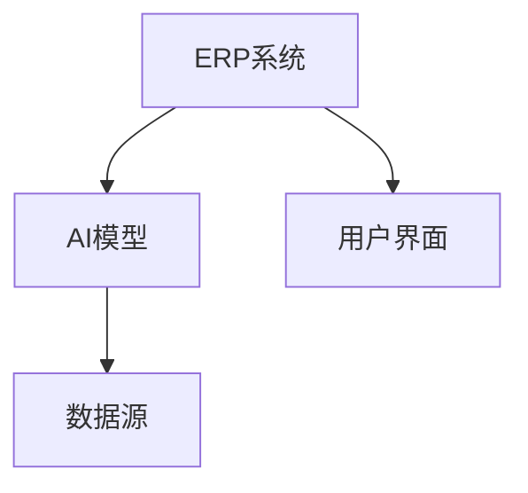
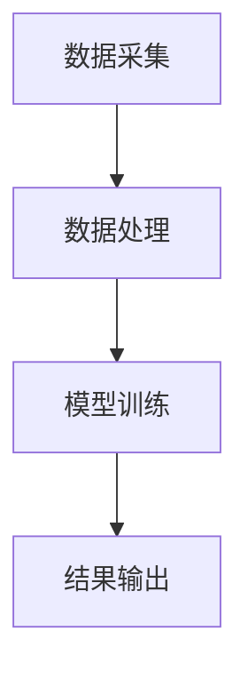
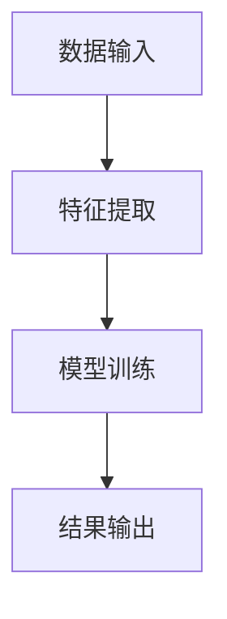
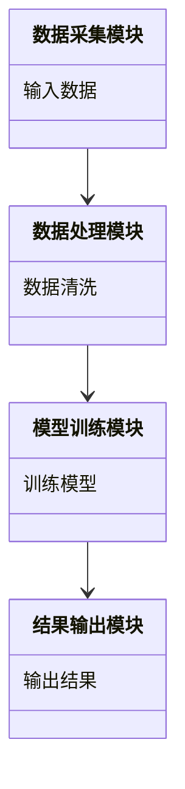
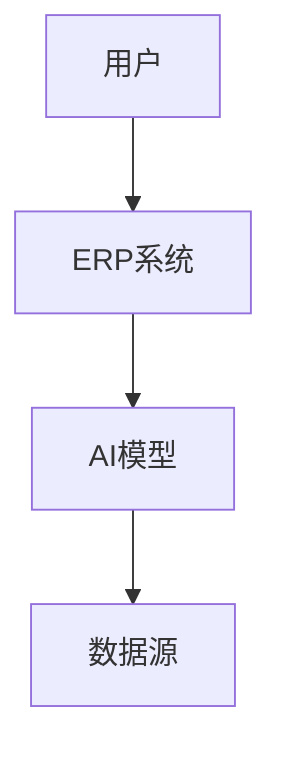
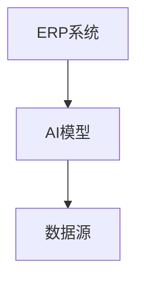
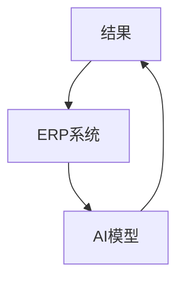

                 


# 构建智能企业资源规划(ERP)系统：AI深度集成与实时优化

## 关键词：ERP系统、人工智能、深度集成、实时优化、系统架构、算法原理

## 摘要：  
随着企业数字化转型的深入推进，传统的ERP系统正面临新的挑战。为了提高企业运营效率和决策能力，人工智能（AI）技术逐渐成为ERP系统优化的关键驱动力。本文将探讨如何通过AI技术实现ERP系统的深度集成与实时优化，从背景、技术原理、系统架构到项目实战，全面解析智能ERP系统的构建过程。

---

## 第1章: 智能ERP系统与AI深度集成概述

### 1.1 ERP系统的概念与演进

#### 1.1.1 传统ERP系统的定义与特点
- **定义**：ERP（Enterprise Resource Planning）系统是一种整合企业资源（如财务、生产、销售、采购、库存等）的信息化管理系统。
- **特点**：
  - 集成性：覆盖企业各个业务模块。
  - 实时性：支持实时数据更新与查询。
  - 灵活性：适应不同行业和企业规模的需求。
  - �易用性：提供用户友好的操作界面。

#### 1.1.2 智能ERP系统的概念
- 智能ERP系统是指通过AI技术的深度集成，使ERP系统具备智能化决策、自动化操作和实时优化的能力。
- 核心目标：利用AI技术提升ERP系统的效率、准确性和用户体验。

#### 1.1.3 ERP系统在企业中的核心作用
- 提高企业运营效率。
- 优化资源配置。
- 支持数据驱动的决策。
- 实现企业内部的协同工作。

---

### 1.2 AI技术与ERP系统的结合背景

#### 1.2.1 AI技术的发展与应用现状
- AI技术（如机器学习、深度学习、自然语言处理）在多个领域的广泛应用。
- AI技术能够处理复杂的数据模式，提供高效的预测和优化能力。

#### 1.2.2 ERP系统面临的挑战与优化需求
- 数据量大：ERP系统涉及大量业务数据，数据处理效率成为瓶颈。
- 业务复杂：不同业务模块之间的协同优化难度大。
- 决策滞后：传统ERP系统依赖人工分析，决策过程较长。

#### 1.2.3 AI深度集成的必要性与潜力
- 必要性：通过AI技术实现ERP系统的实时优化和智能决策。
- 潜力：AI技术能够显著提升ERP系统的效率和准确性。

---

### 1.3 智能ERP系统的应用前景

#### 1.3.1 企业数字化转型的趋势
- 数字化转型已成为企业提升竞争力的关键。
- AI技术是数字化转型的核心驱动力之一。

#### 1.3.2 AI在ERP系统中的潜在应用场景
- 需求预测：基于历史数据预测销售和库存需求。
- 生产优化：优化生产计划和资源分配。
- 风险管理：识别潜在风险并提供应对策略。

#### 1.3.3 智能ERP系统的未来发展方向
- 更高的智能化：实现从数据采集到决策的全自动化。
- 更强的实时性：实时处理数据，快速响应业务变化。
- 更好的用户体验：提供个性化的用户界面和操作体验。

---

## 第2章: AI深度集成的核心概念

### 2.1 AI在ERP系统中的技术原理

#### 2.1.1 数据采集与处理
- 数据采集：从ERP系统中获取结构化数据（如订单、库存、销售数据）和非结构化数据（如文本、图像）。
- 数据处理：清洗、转换和标准化数据，确保数据的准确性和一致性。

#### 2.1.2 AI算法模型的选择与应用
- 算法选择：根据具体业务需求选择合适的AI算法（如线性回归、随机森林、LSTM）。
- 模型训练：利用数据训练AI模型，使其能够识别数据中的模式和趋势。

#### 2.1.3 模型训练与优化
- 超参数优化：通过网格搜索或随机搜索优化模型的参数。
- 模型评估：使用交叉验证评估模型的性能。

---

### 2.2 AI与ERP系统的核心要素对比

#### 2.2.1 数据特征对比
| 特征     | 传统ERP系统 | AI深度集成的ERP系统 |
|----------|-------------|----------------------|
| 数据来源 | 结构化数据   | 结构化+非结构化数据 |
| 数据量   | 较小         | 大规模               |
| 数据处理 | 简单         | 复杂                 |

#### 2.2.2 算法特征对比
| 特征     | 传统算法 | AI算法             |
|----------|----------|--------------------|
| 处理方式 | 规则驱动 | 数据驱动           |
| 灵活性   | 低       | 高                 |

#### 2.2.3 系统性能对比
| 特征     | 传统ERP系统 | AI深度集成的ERP系统 |
|----------|-------------|----------------------|
| 处理效率 | 较低         | 高                  |
| 决策能力 | 人工主导     | 智能主导            |

---

### 2.3 AI深度集成的系统架构

#### 2.3.1 实体关系图


#### 2.3.2 系统功能模块图


---

## 第3章: AI算法在ERP系统中的应用

### 3.1 常见AI算法概述

#### 3.1.1 机器学习算法
- 线性回归：用于预测连续型变量（如销售预测）。
- 支持向量机（SVM）：用于分类问题（如客户分类）。
- 随机森林：用于分类和回归问题。

#### 3.1.2 深度学习算法
- LSTM（长短期记忆网络）：用于时间序列预测（如库存预测）。
- CNN（卷积神经网络）：用于图像识别。

#### 3.1.3 自然语言处理算法
- BERT：用于文本分类和问答系统。

---

### 3.2 算法选择与优化策略

#### 3.2.1 算法选择的依据
- 数据类型：结构化数据选择机器学习算法，非结构化数据选择深度学习算法。
- 业务需求：预测任务选择回归算法，分类任务选择分类算法。

#### 3.2.2 算法优化的数学模型
$$f(x) = w_1x_1 + w_2x_2 + ... + w_nx_n$$
其中，$w_i$是权重，$x_i$是输入特征。

#### 3.2.3 算法调优的步骤与方法
1. 数据预处理：清洗、归一化。
2. 模型训练：选择合适的算法并训练模型。
3. 模型优化：调整超参数，如学习率、批量大小。

---

### 3.3 算法实现的流程图



---

## 第4章: 智能ERP系统的系统分析与架构设计

### 4.1 系统分析与需求分析

#### 4.1.1 问题场景介绍
- 传统ERP系统存在数据处理效率低、决策滞后等问题。
- 通过AI技术实现ERP系统的实时优化和智能决策。

#### 4.1.2 系统功能需求分析
- 数据采集与处理模块。
- AI模型训练与优化模块。
- 结果输出与用户界面模块。

---

### 4.2 系统功能设计

#### 4.2.1 领域模型


---

### 4.3 系统架构设计

#### 4.3.1 系统架构图


---

### 4.4 系统接口设计

#### 4.4.1 系统接口图


---

### 4.5 系统交互设计

#### 4.5.1 系统交互图


---

## 第5章: 项目实战

### 5.1 环境配置

#### 5.1.1 系统环境
- 操作系统：Linux/Windows。
- 开发工具：Python、Jupyter Notebook。
- 数据库：MySQL/PostgreSQL。

#### 5.1.2 依赖安装
```bash
pip install numpy pandas scikit-learn keras tensorflow
```

---

### 5.2 核心代码实现

#### 5.2.1 数据处理代码
```python
import pandas as pd

# 数据加载
data = pd.read_csv('erp_data.csv')

# 数据清洗
data.dropna(inplace=True)
data['date'] = pd.to_datetime(data['date'])
```

#### 5.2.2 模型训练代码
```python
from sklearn.linear_model import LinearRegression

# 模型训练
model = LinearRegression()
model.fit(X_train, y_train)
```

---

### 5.3 案例分析

#### 5.3.1 案例介绍
- 企业A希望通过AI技术优化库存管理。
- 数据来源：过去三年的销售数据、库存数据。

#### 5.3.2 案例实现
```python
# 预测库存需求
y_pred = model.predict(X_test)
```

---

## 第6章: 总结与展望

### 6.1 最佳实践 Tips
- 数据质量是AI模型性能的关键。
- 模型选择应基于具体的业务需求。
- 模型优化需要不断迭代和调整。

### 6.2 本章小结
- AI技术能够显著提升ERP系统的效率和准确性。
- 通过深度集成AI技术，ERP系统能够实现实时优化和智能决策。

### 6.3 展望
- 更多行业将采用智能ERP系统。
- AI技术与ERP系统的结合将更加紧密。
- 智能ERP系统的用户体验将进一步优化。

---

## 附录: 工具与资源

### 附录1: 相关工具
- 数据处理工具：Python（pandas、numpy）。
- 模型训练工具：Scikit-learn、Keras。
- 可视化工具：Matplotlib、Seaborn。

### 附录2: 参考文献
- 书籍：《机器学习实战》。
- 网站：[Towards Data Science](https://towardsdatascience.com/)。

---

通过本文的详细讲解，读者可以全面了解智能ERP系统的核心概念、技术原理和实际应用。结合AI技术的深度集成，ERP系统将为企业带来更高效、更智能的管理方式。

