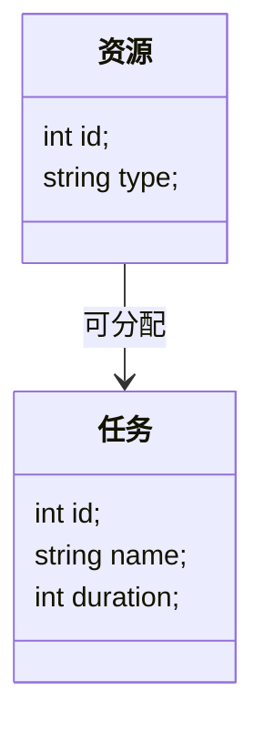

                 


# 《构建智能企业资源调度系统：多目标优化与动态平衡》

## 关键词：智能调度，多目标优化，动态平衡，企业资源，系统架构

## 摘要：  
本文深入探讨了构建智能企业资源调度系统的多目标优化与动态平衡问题，从问题背景、核心概念、算法原理到系统架构和项目实战，全面解析了实现高效资源调度的关键技术与方法。文章结合理论与实践，通过丰富的案例分析和代码实现，为读者提供了一套系统化的解决方案。

---

## 第一部分：引言

## 第1章：问题背景与目标

### 1.1 企业资源调度的重要性

#### 1.1.1 企业资源调度的基本概念  
企业资源调度是指对企业内的各项资源（如人力资源、设备、资金、时间等）进行合理分配和优化配置，以实现企业目标的过程。资源调度的核心在于平衡资源的利用效率和目标的实现效果。

#### 1.1.2 资源调度的核心问题  
资源调度问题通常涉及多个目标（如成本最小化、效率最大化、时间最短化等）和多个约束条件（如资源限制、时间限制、优先级等）。传统的调度方法往往难以在多目标之间找到平衡，而智能调度系统通过引入人工智能和优化算法，能够更好地解决这一问题。

#### 1.1.3 智能化调度的必要性  
随着企业规模的扩大和业务复杂度的增加，传统的手工调度方式已经难以满足需求。智能化调度系统能够实时分析数据、动态调整资源分配，从而提高企业的竞争力。

---

### 1.2 多目标优化与动态平衡

#### 1.2.1 多目标优化的定义  
多目标优化是指在多个目标之间寻找最优解的过程。例如，在资源调度中，可能需要同时优化成本、时间、质量和资源利用率等多个目标。

#### 1.2.2 动态平衡的内涵  
动态平衡是指在系统运行过程中，根据外部环境的变化和内部状态的反馈，动态调整资源分配，使得系统在多个目标之间保持平衡。

#### 1.2.3 问题的复杂性与挑战  
多目标优化问题通常存在多个局部最优解，且解的可行域可能是非凸的。动态平衡的实现需要系统具有实时反馈和快速调整的能力，这对算法的效率和系统的鲁棒性提出了更高的要求。

---

### 1.3 本书的目标与方法

#### 1.3.1 本书的核心目标  
本文的目标是通过理论分析和实践应用，帮助读者理解多目标优化与动态平衡的核心原理，并掌握构建智能企业资源调度系统的方法。

#### 1.3.2 问题解决的思路  
通过引入优化算法（如遗传算法、粒子群优化等）和动态反馈机制，构建一个能够实时调整资源分配的智能调度系统。

#### 1.3.3 方法论与框架  
本文采用“问题分析—算法设计—系统实现”的方法论，从理论到实践，逐步构建智能调度系统。

---

## 第2章：核心概念与联系

### 2.1 多目标优化的数学模型

#### 2.1.1 目标函数的定义  
多目标优化问题可以表示为：  
$$ \text{min/max} \quad f_1(x), f_2(x), \dots, f_n(x) $$  
其中，$x$ 是决策变量，$f_i(x)$ 是目标函数。

#### 2.1.2 约束条件的建立  
约束条件可以分为硬约束和软约束：  
- 硬约束：必须满足的条件，如 $x \geq 0$。  
- 软约束：可以通过调整目标函数权重来实现的条件。

#### 2.1.3 解的可行域与 Pareto 前沿  
Pareto 前沿是指在多目标优化问题中，无法在不恶化一个目标的情况下改善另一个目标的解集合。

---

### 2.2 动态平衡的实现机制

#### 2.2.1 动态平衡的核心原理  
动态平衡通过实时反馈和调整，使得系统在多个目标之间保持平衡。例如，在资源调度中，当某项资源超负荷时，系统会自动调整其他资源的分配。

#### 2.2.2 系统状态的实时反馈  
系统需要实时收集资源的使用情况、任务的完成进度等数据，作为动态调整的依据。

#### 2.2.3 平衡机制的数学表达  
动态平衡可以通过加权函数实现：  
$$ f(x) = \sum_{i=1}^n w_i f_i(x) $$  
其中，$w_i$ 是目标函数的权重。

---

### 2.3 核心概念对比与ER图

#### 2.3.1 多目标优化与动态平衡的对比  
| 属性         | 多目标优化       | 动态平衡       |
|--------------|------------------|---------------|
| 核心目标     | 找到 Pareto 最优解 | 实时调整平衡   |
| 实现方式     | 算法优化         | 反馈机制       |
| 应用场景     | 资源分配         | 系统动态调整   |

#### 2.3.2 实体关系图（ER图）展示  
```mermaid
erDiagram
    actor 用户 {
        string 用户ID
        string 用户名
    }
    actor 系统 {
        string 系统ID
        string 系统名称
    }
    用户 --> 系统 : 使用系统
```

---

## 第3章：算法原理与数学模型

### 3.1 常见优化算法概述

#### 3.1.1 遗传算法  
遗传算法模拟自然选择和遗传的过程，主要包括选择、交叉和变异三个步骤。

#### 3.1.2 粒子群优化算法  
粒子群优化算法通过模拟鸟群的飞行行为，寻找问题的最优解。

#### 3.1.3 模拟退火算法  
模拟退火算法通过模拟金属的退火过程，避免陷入局部最优解。

---

### 3.2 多目标优化算法的数学模型

#### 3.2.1 基本模型  
多目标优化问题可以表示为：  
$$ \text{min} \quad f_1(x), f_2(x), \dots, f_n(x) $$  
$$ \text{subject to} \quad g_1(x) \leq 0, \dots, g_m(x) \leq 0 $$

#### 3.2.2 Pareto 前沿的计算  
Pareto 前沿的计算可以通过逐步逼近的方法实现。

#### 3.2.3 权重分配  
权重分配可以通过线性加权或非线性加权实现。

---

### 3.3 算法实现

#### 3.3.1 遗传算法实现  
```python
def genetic_algorithm(population_size, fitness_function):
    population = initialize_population(population_size)
    while not stopping_condition():
        population = evaluate_population(population, fitness_function)
        population = select_parents(population)
        population = crossover(population)
        population = mutate(population)
    return best_candidate(population)
```

#### 3.3.2 粒子群优化算法实现  
```python
def particle_swarm_optimization(n_particles, fitness_function):
    particles = initialize_particles(n_particles)
    while not stopping_condition():
        evaluate_fitness(particles, fitness_function)
        update_velocity(particles)
        update_position(particles)
    return best_particle(particles)
```

---

## 第4章：系统分析与架构设计

### 4.1 问题场景介绍

#### 4.1.1 企业资源调度的核心问题  
企业资源调度的核心问题包括资源分配、任务调度、时间管理等。

#### 4.1.2 系统需求分析  
系统需要支持多目标优化、动态调整和实时反馈。

---

### 4.2 系统功能设计

#### 4.2.1 领域模型  


#### 4.2.2 系统架构设计  


#### 4.2.3 接口设计  
系统需要提供API接口，用于数据输入和结果输出。

---

## 第5章：项目实战

### 5.1 环境安装

#### 5.1.1 Python 环境配置  
安装Python和必要的库（如numpy、pymoo、matplotlib）。

#### 5.1.2 算法库安装  
使用pip安装pymoo等优化算法库。

---

### 5.2 系统核心实现

#### 5.2.1 遗传算法实现  
```python
import pymoo
from pymoo.algorithms import genetic_algorithm
```

#### 5.2.2 动态平衡实现  
```python
def dynamic_balance(resource, task):
    # 实现动态平衡逻辑
    pass
```

---

### 5.3 案例分析

#### 5.3.1 案例背景  
假设某企业需要调度10台设备完成20个任务。

#### 5.3.2 案例实现  
```python
tasks = [...]  # 任务列表
resources = [...]  # 资源列表
result = genetic_algorithm(len(resources), task_fitness)
```

---

## 第6章：总结与展望

### 6.1 最佳实践 tips

#### 6.1.1 系统设计建议  
- 确保系统的实时反馈机制。
- 选择合适的优化算法。

#### 6.1.2 代码实现建议  
- 使用现有的优化算法库。
- 定期测试和优化系统。

---

### 6.2 小结

本文通过理论分析和实践案例，详细介绍了构建智能企业资源调度系统的方法。通过多目标优化和动态平衡的实现，企业可以更高效地管理资源，提高生产效率。

---

### 6.3 注意事项

- 系统的实时性要求较高，需要选择高效的算法。
- 动态平衡的实现需要考虑系统的稳定性和鲁棒性。

---

### 6.4 拓展阅读

- 阅读相关优化算法的经典论文。
- 研究多目标优化在其他领域的应用。

---

## 结语

构建智能企业资源调度系统是一项复杂的系统工程，需要结合理论与实践。通过本文的分析，读者可以掌握多目标优化与动态平衡的核心技术，并将其应用到实际的企业资源调度中。

